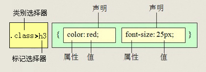

# 4.CSS复合选择器

## 4.1 后代选择器

后代选择器又称为包含选择器

用来选择元素或元素组的**子孙后代**

- 其写法就是把外层标签写在前面，内层标签写在后面，中间用**空格**分隔，先写父亲爷爷，在写儿子孙子。 

~~~html
父级 子级{属性:属性值;属性:属性值;}

.class h3{color:red;font-size:16px;}
~~~


- 当标签发生嵌套时，内层标签就成为外层标签的后代。

## 4.2 子元素选择器

子元素选择器只能选择作为某元素**子元素(亲儿子)**的元素。

- 其写法就是把父级标签写在前面，子级标签写在后面，中间跟一个 `>` 进行连接

~~~
.class>h3{color:red;font-size:14px;}
~~~



## 4.3 交集选择器

交集选择器由两个选择器构成，既有标签一的特点，也有标签二的特点。


## 4.4 并集选择器

如果某些选择器定义的相同样式，就可以利用并集选择器，可以让代码更简洁。

并集选择器（CSS选择器分组）是各个选择器通过`,`连接而成的，通常用于集体声明。


## 4.5  链接伪类选择器

 伪类选择器： 用 2个点 就是 冒号  比如  :link{}    

用于向某些选择器添加特殊的效果。

因为伪类选择器很多，比如链接伪类，结构伪类等等。我们这里先给大家讲解链接伪类选择器。

- a:link      /* 未访问的链接 */

- a:visited   /* 已访问的链接 */

- a:hover     /* 鼠标移动到链接上 */

- a:active    /* 选定的链接 */

  

* 顺序尽量不要颠倒  按照  lvha 的顺序。否则可能错误。  
* 记忆法   
  *    **lv **包包   非常 **ha**o   
* 因为叫链接伪类，所以都是 利用交集选择器  a:link    a:hover  
* 因为a链接浏览器具有默认样式，所以我们实际工作中都需要给链接单独指定样式。

```css
a {   /* a是标签选择器  所有的链接 */
			font-weight: 700;
			font-size: 16px;
			color: gray;
}
a:hover {   /* :hover 是链接伪类选择器 鼠标经过 */
			color: red; /*  鼠标经过的时候，由原来的 灰色 变成了红色 */
}
```

## 4.6 复合选择器总结

| 选择器         | 作用                     | 特征                 | 使用情况 | 隔开符号及用法                          |
| -------------- | ------------------------ | -------------------- | -------- | --------------------------------------- |
| 后代选择器     | 用来选择元素后代         | 是选择所有的子孙后代 | 较多     | 符号是**空格** .nav a                   |
| 子代选择器     | 选择 最近一级元素        | 只选亲儿子           | 较少     | 符号是**>**   .nav>p                    |
| 交集选择器     | 选择两个标签交集的部分   | 既是 又是            | 较少     | **没有符号**  p.one                     |
| 并集选择器     | 选择某些相同样式的选择器 | 可以用于集体声明     | 较多     | 符号是**逗号** .nav, .header            |
| 链接伪类选择器 | 给链接更改状态           |                      | 较多     | 重点记住 a{} 和 a:hover  实际开发的写法 |

