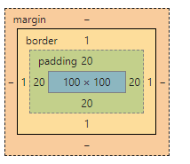
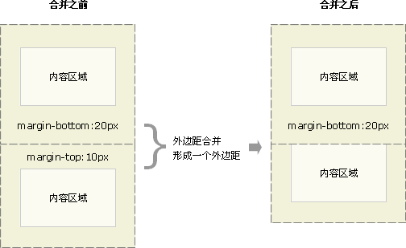

# 8.盒子模型

* 内容+边框（border）+ 内边距（padding）+外边距（margin）


## 8.1 盒子边框（border）

```css
border : border-width || border-style || border-color 

border: 1px solid red;  没有顺序  
```

边框的样式：

- none：没有边框即忽略所有边框的宽度（默认值）
- solid：边框为单实线(最为常用的)
- dashed：边框为虚线  
- dotted：边框为点线

### 1.盒子边框写法总结表

很多情况下，我们不需要指定4个边框，我们是可以单独给4个边框分别指定的。

| 上边框                     | 下边框                        | 左边框                      | 右边框                       |
| :------------------------- | :---------------------------- | :-------------------------- | :--------------------------- |
| border-top-style:样式;     | border-bottom-style:样式;     | border-left-style:样式;     | border-right-style:样式;     |
| border-top-width:宽度;     | border- bottom-width:宽度;    | border-left-width:宽度;     | border-right-width:宽度;     |
| border-top-color:颜色;     | border- bottom-color:颜色;    | border-left-color:颜色;     | border-right-color:颜色;     |
| border-top:宽度 样式 颜色; | border-bottom:宽度 样式 颜色; | border-left:宽度 样式 颜色; | border-right:宽度 样式 颜色; |

### 2.表格的细线边框

- 通过表格的`cellspacing="0"`,将单元格与单元格之间的距离设置为0，

- 但是两个单元格之间的边框会出现重叠，从而使边框变粗

- 通过css属性：

  ~~~
  table{ border-collapse:collapse; }  
  ~~~

  - collapse 单词是合并的意思
  - border-collapse:collapse; 表示相邻边框合并在一起。

~~~css
<style>
	table {
		width: 500px;
		height: 300px;
		border: 1px solid red;
	}
	td {
		border: 1px solid red;
		text-align: center;
	}
	table, td {
		border-collapse: collapse;  /*合并相邻边框*/
	}
</style>
~~~

## 8.2内边距（padding）

边框与内容之间的距离

### 1.设置

| 属性           | 作用     |
| -------------- | :------- |
| padding-left   | 左内边距 |
| padding-right  | 右内边距 |
| padding-top    | 上内边距 |
| padding-bottom | 下内边距 |

当我们给盒子指定padding值之后， 发生了2件事情：

1. 内容和边框 有了距离，添加了内边距。
2. 盒子会变大了。

| 值的个数 | 表达意思                                        |
| -------- | ----------------------------------------------- |
| 1个值    | padding：上下左右内边距;                        |
| 2个值    | padding: 上下内边距    左右内边距 ；            |
| 3个值    | padding：上内边距   左右内边距   下内边距；     |
| 4个值    | padding: 上内边距 右内边距 下内边距 左内边距 ； |

### 2 内盒尺寸计算（元素实际大小)



- 宽度

  Element Height = content height + padding + border （Height为内容高度）

- 高度

  Element Width = content width + padding + border （Width为内容宽度）

- 盒子的实际的大小 =   内容的宽度和高度 +  内边距   +  边框  

### 3 内边距产生的问题

会撑大原来的盒子

通过给设置了宽高的盒子，减去相应的内边距的值，维持盒子原有的大小

> padding不影响盒子大小情况
>
> 如果没有给一个盒子指定宽度， 此时，如果给这个盒子指定padding， 则不会撑开盒子。

## 8.3 外边距（margin）

### 1. 外边距设置

​	margin属性用于设置外边距。  margin就是控制**盒子和盒子之间的距离**

| 属性          | 作用     |
| ------------- | :------- |
| margin-left   | 左外边距 |
| margin-right  | 右外边距 |
| margin-top    | 上外边距 |
| margin-bottom | 下外边距 |

margin值的简写 （复合写法）代表意思  跟 padding 完全相同。

### 2 .块级盒子水平居中

- 盒子必须指定了宽度（width）
- 然后就给**左右的外边距都设置为auto**，

~~~css
.header{ width:960px; margin:0 auto;}
~~~

以下下三种都可以。

* margin-left: auto;   margin-right: auto;
* margin: auto;
* margin: 0 auto;

### 3 .文字居中和盒子居中区别(重点)

1.  盒子内的文字水平居中是  text-align: center,  而且还可以让 行内元素和行内块居中对齐
2.  块级盒子水平居中  左右margin 改为 auto 

~~~css
text-align: center; /*  文字 行内元素 行内块元素水平居中 */
margin: 10px auto;  /* 块级盒子水平居中  左右margin 改为 auto 就阔以了 上下margin都可以 */
~~~

### 4 .插入图片和背景图片区别

1. 插入图片  移动位置只能靠盒模型 padding margin
2. 背景图片 只能通过  background-position

~~~css
插入图片
img {  
		width: 200px;/* 插入图片更改大小 width 和 height */
		height: 210px;
		margin-top: 30px;  /* 插入图片更改位置 可以用margin 或padding  盒模型 */
		margin-left: 50px; /* 插入当图片也是一个盒子 */
	}

背景图片
 div {
		width: 400px;
		height: 400px;
		border: 1px solid purple;
		background: #fff url(images/sun.jpg) no-repeat;
		background-position: 30px 50px; /* 背景图片更改位置 我用 background-position */
	}
~~~

### 5. 清除元素的默认内外边距

~~~css
* {
   padding:0;         /* 清除内边距 */
   margin:0;          /* 清除外边距 */
}
~~~

### 6. 外边距合并

使用margin定义块元素的**垂直外边距**时，可能会出现外边距的合并。

#### 1) 相邻块元素垂直外边距的合并

- 当上下相邻的两个块元素相遇时，如果上面的元素有下外边距margin-bottom
- 下面的元素有上外边距margin-top，则他们之间的垂直间距不是margin-bottom与margin-top之和
- **取两个值中的较大者**这种现象被称为相邻块元素垂直外边距的合并（也称外边距塌陷）。



#### 2) 嵌套块元素垂直外边距的合并（塌陷）

- 对于两个嵌套关系的块元素，如果父元素没有上内边距及边框
- 父元素的上外边距会与子元素的上外边距发生合并
- 合并后的外边距为两者中的较大者


**解决方案：**

1. 可以为父元素定义上边框。
2. 可以为父元素定义上内边距
3. 可以为父元素添加overflow:hidden。

## 8.4 盒子模型布局稳定性

按照 优先使用  宽度 （width）  其次 使用内边距（padding）    再次  外边距（margin）。   

```
  width >  padding  >   margin   
```

- 原因：
  - margin 会有外边距合并 还有 ie6下面margin 加倍的bug（讨厌）所以最后使用。
  - padding  会影响盒子大小， 需要进行加减计算（麻烦） 其次使用。
  - width   没有问题（嗨皮）我们经常使用宽度剩余法 高度剩余法来做。

## 拓展@

### 1.圆角边框(CSS3)

```css
border-radius:length;  
```

- 其中每一个值可以为 数值或百分比的形式。 

-  让一个正方形  变成圆圈 `border-radius: 50%;`

### 2.盒子阴影(CSS3)

```css
box-shadow:水平阴影 垂直阴影 模糊距离（虚实）  阴影尺寸（影子大小）  阴影颜色  内/外阴影；
```


- 前两个属性是必须写的。其余的可以省略。
- 外阴影 (outset) 是默认的 但是不能写           想要内阴影可以写  inset 

```css
div {
			width: 200px;
			height: 200px;
			border: 10px solid red;
			/* box-shadow: 5px 5px 3px 4px rgba(0, 0, 0, .4);  */
			/* box-shadow:水平位置 垂直位置 模糊距离 阴影尺寸（影子大小） 阴影颜色  内/外阴影； */
			box-shadow: 0 15px 30px  rgba(0, 0, 0, .4);
			
}
```

