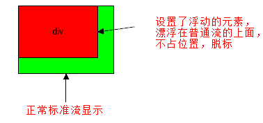

# 9.浮动

## 9.1 CSS 布局的三种机制

> 网页布局的核心——就是用 CSS 来摆放盒子。

CSS 提供了 **3 种机制**来设置盒子的摆放位置，分别是**普通流**（标准流）、**浮动**和**定位**，其中： 

1. **普通流**（标准流）
   - **块级元素**会独占一行，**从上向下**顺序排列；
     - 常用元素：div、hr、p、h1~h6、ul、ol、dl、form、table
   - **行内元素**会按照顺序，**从左到右**顺序排列，碰到父元素边缘则自动换行；
     - 常用元素：span、a、i、em等
2. **浮动**
   - 让盒子从普通流中**浮**起来,主要作用让多个块级盒子一行显示。
3. **定位**
   - 将盒子**定**在浏览器的某一个**位**置——CSS 离不开定位，特别是后面的 js 特效。

## 9.2 什么是浮动(float)

元素的浮动是指**设置了浮动属性的元素**会

1. 脱离标准普通流的控制
2. 移动到指定位置。

```css
选择器 { float: 属性值; }
```

| 属性值    | 描述                     |
| --------- | ------------------------ |
| **none**  | 元素不浮动（**默认值**） |
| **left**  | 元素向**左**浮动         |
| **right** | 元素向**右**浮动         |

 `float`   -----  浮 漏 特

### 1.浮动口诀之 浮

浮动——浮~浮~浮~~~漂浮在普通流的上面。  脱离标准流。 俗称 “脱标”

```css
.box1 {
    width: 200px;
    height: 200px;
    background-color: rgba(255, 0, 0, 0.5);
    float: left;
}
.box2 {
    width: 150px;
    height: 300px;
    background-color: skyblue;
}
```



`float` 属性会让盒子漂浮在标准流的上面，所以第二个标准流的盒子跑到浮动盒子的底下了。

### 2. 浮动口诀之 漏

浮动——漏~漏~漏~  浮动的盒子，把自己原来的位置漏给下面标准流的盒子，就是不占有原来位置，是脱离标准流的，我们俗称 “脱标”。

~~~css
.box1 {
    width: 200px;
    height: 200px;
    background-color: rgba(255, 0, 0, 0.5);
    /* 让第 1 个盒子漂浮起来，不占位置 */
    float: left;
}
.box2 {
    width: 150px;
    height: 300px;
    background-color: skyblue;
}
~~~

 所以，box2下面的其实就是跑到box1盒子下面了， 被box1给压住了，遮挡起来了

### 3.浮动口诀之 特

浮动——特性  float属性会改变元素display属性。

任何元素都可以浮动。浮动元素会生成一个块级框，而不论它本身是何种元素。 生成的块级框和我们前面的行内块极其相似。

 


**浮动的元素互相贴靠一起的，但是如果父级宽度装不下这些浮动的盒子， 多出的盒子会另起一行对齐**

### 4. 浮动(float)小结

> 我们使用浮动的核心目的——让多个块级盒子在同一行显示。 因为这是我们最常见的一种布局方式

**float** —— **浮漏特**

| 特点 | 说明                                                         |
| ---- | ------------------------------------------------------------ |
| 浮   | 加了浮动的盒子**是浮起来**的，漂浮在其他标准流盒子的上面。   |
| 漏   | 加了浮动的盒子**是不占位置的**，它原来的位置**漏给了标准流的盒子**。 |
| 特   | **特别注意**：浮动元素会改变display属性， 类似转换为了行内块，但是元素之间没有空白缝隙 |

## 9.3  浮动(float)的扩展

### 1 浮动元素与父盒子的关系

- 子盒子的浮动参照父盒子对齐
- 不会与父盒子的边框重叠，也不会超过父盒子的内边距


### 2. 浮动元素与兄弟盒子的关系

在一个父级盒子中，如果**前一个兄弟盒子**是：

- **浮动**的，那么**当前盒子**会与前一个盒子的顶部对齐；
- **普通流**的，那么**当前盒子**会显示在前一个兄弟盒子的下方。 

> 浮动只会影响当前的或者是后面的标准流盒子，不会影响前面的标准流。

## 9.4 清除浮动

### 1.为什么要清除浮动

因为父级盒子很多情况下，不方便给高度，但是子盒子浮动就不占有位置，最后父级盒子高度为0，就影响了下面的标准流盒子


- 由于浮动元素不再占用原文档流的位置，所以它会对后面的元素排版产生影响
- 准确地说，并不是清除浮动，而是**清除浮动后造成的影响**

### 2.清除浮动本质

**清除浮动主要为了解决父级元素因为子级浮动引起内部高度为0 的问题。清除浮动之后， 父级就会根据浮动的子盒子自动检测高度。父级有了高度，就不会影响下面的标准流了**

###  3.清除浮动的方法（重点）

```
选择器{clear:属性值;}   clear 清除  
```

| 属性值 | 描述                                       |
| ------ | ------------------------------------------ |
| left   | 不允许左侧有浮动元素（清除左侧浮动的影响） |
| right  | 不允许右侧有浮动元素（清除右侧浮动的影响） |
| both   | 同时清除左右两侧浮动的影响                 |

#### 1).额外标签法(隔墙法)

```html
在浮动元素末尾添加一个空的标签例如
<div style=”clear:both”></div>，或则其他标签br等亦可。
```

#### 2).父级添加overflow属性方法

```css
可以给父级添加： overflow为 hidden| auto| scroll  都可以实现。
```

#### 3).使用after伪元素清除浮动

**:after 方式为空元素额外标签法的升级版，好处是不用单独加标签了** 

```css
.clear { zoom:1; }
.clear:after { 
  content:" "; 
  clear:both;
  display:block;
  height:0;
  overflow:hidden;
  visibility:hidden;
}

```

#### 4).使用双伪元素清除浮动

```css
.clearfix:before,.clearfix:after { 
  content:"";
  display:table; 
}
.clearfix:after {
 clear:both;
}
.clearfix {
  *zoom:1;
}
```

### 4 清除浮动总结

| 清除浮动的方式       | 优点               | 缺点                               |
| -------------------- | :----------------- | :--------------------------------- |
| 额外标签法（隔墙法） | 通俗易懂，书写方便 | 添加许多无意义的标签，结构化较差。 |
| 父级overflow:hidden; | 书写简单           | 溢出隐藏                           |
| 父级after伪元素      | 结构语义化正确     | 由于IE6-7不支持:after，兼容性问题  |
| 父级双伪元素         | 结构语义化正确     | 由于IE6-7不支持:after，兼容性问题  |

