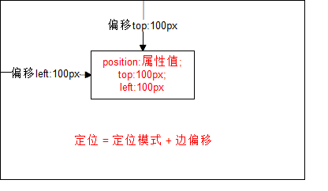
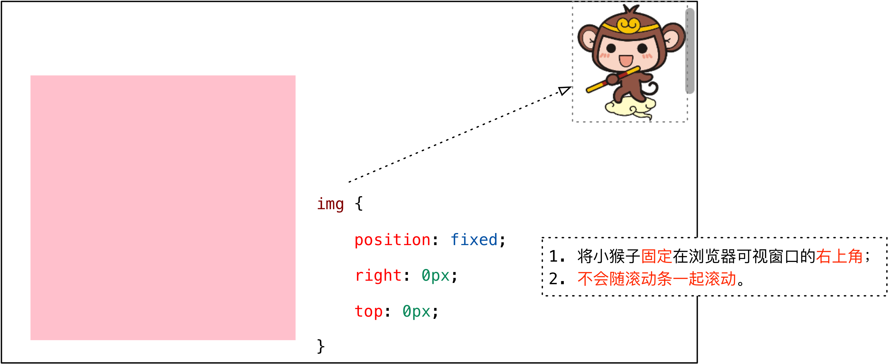

# 10.定位

定位也是用来布局的，它有两部分组成：

> `定位 = 定位模式 + 边偏移`

## 10.1 边偏移

简单说， 我们定位的盒子，是通过边偏移来移动位置的。

在 CSS 中，通过 `top`、`bottom`、`left` 和 `right` 属性定义元素的**边偏移**：（方位名词）

| 边偏移属性 | 示例           | 描述                                                     |
| ---------- | :------------- | -------------------------------------------------------- |
| `top`      | `top: 80px`    | **顶端**偏移量，定义元素相对于其父元素**上边线的距离**。 |
| `bottom`   | `bottom: 80px` | **底部**偏移量，定义元素相对于其父元素**下边线的距离**。 |
| `left`     | `left: 80px`   | **左侧**偏移量，定义元素相对于其父元素**左边线的距离**。 |
| `right`    | `right: 80px`  | **右侧**偏移量，定义元素相对于其父元素**右边线的距离**   |

定位的盒子有了边偏移才有价值。 一般情况下，凡是有定位地方必定有边偏移。

## 10.2  定位模式 (position)

在 CSS 中，通过 `position` 属性定义元素的**定位模式**，语法如下：

```css
选择器 { position: 属性值; }
```

定位模式是有不同分类的，在不同情况下，我们用到不同的定位模式。

| 值         |     语义     |
| ---------- | :----------: |
| `static`   | **静态**定位 |
| `relative` | **相对**定位 |
| `absolute` | **绝对**定位 |
| `fixed`    | **固定**定位 |



### 1 静态定位(static) 

- **静态定位**是元素的默认定位方式，无定位的意思。它相当于 border 里面的none， 不要定位的时候用。
- 静态定位 按照标准流特性摆放位置，它没有边偏移。不用

### 2.相对定位(relative)

**相对定位**是元素**相对**于它  原来在标准流中的位置 来说的。


- 相对于 自己原来在标准流中位置来移动的
- 原来**在标准流的区域继续占有**，后面的盒子仍然以标准流的方式对待它。

### 3.绝对定位(absolute)  

**绝对定位**是元素以带有定位的父级元素来移动位置 （拼爹型）

#### a.完全脱标 —— 完全不占位置；  

#### b.父元素没有定位，则以浏览器为准定位（Document 文档）。


#### c.父元素要有定位

* 将元素依据最近的已经定位（绝对、固定或相对定位）的父元素（祖先）进行定位。
* 

绝对定位的特点：（务必记住）

- 绝对是以带有定位的父级元素来移动位置 （拼爹型） 如果父级都没有定位，则以浏览器文档为准移动位置
- 不保留原来的位置，完全是脱标的。

因为绝对定位的盒子是拼爹的，所以要和父级搭配一起来使用。

##### 定位口诀 —— 子绝父相

刚才咱们说过，绝对定位，要和带有定位的父级搭配使用，那么父级要用什么定位呢？

**子绝父相** —— **子级**是**绝对**定位，**父级**要用**相对**定位。

> **子绝父相**是使用绝对定位的口诀，要牢牢记住！

### 4 固定定位(fixed)

**固定定位**是**绝对定位**的一种特殊形式： （认死理型）   如果说绝对定位是一个矩形 那么 固定定位就类似于正方形

1. **完全脱标** —— 完全不占位置；
2. 只认**浏览器的可视窗口** —— `浏览器可视窗口 + 边偏移属性` 来设置元素的位置；
   * 跟父元素没有任何关系；单独使用的
   * 不随滚动条滚动。

## 10.3定位(position)的扩展

### 1 .绝对定位的盒子居中

> **注意**：**绝对定位/固定定位的盒子**不能通过设置 `margin: auto` 设置**水平居中**。

在使用**绝对定位**时要想实现水平居中

1. `left: 50%;`：让**盒子的左侧**移动到**父级元素的水平中心位置**；
2. `margin-left: -100px;`：让盒子**向左**移动**自身宽度的一半**。

#### 盒子居中定位示意图


### 2 堆叠顺序（z-index）

在使用**定位**布局时，可能会**出现盒子重叠的情况**。

加了定位的盒子，默认**后来者居上**， 后面的盒子会压住前面的盒子。

应用 `z-index` 层叠等级属性可以**调整盒子的堆叠顺序**。如下图所示：


`z-index` 的特性如下：

1. **属性值**：**正整数**、**负整数**或 **0**，默认值是 0，数值越大，盒子越靠上；
2. 如果**属性值相同**，则按照书写顺序，**后来居上**；
3. **数字后面不能加单位**。

**注意**：`z-index` 只能应用于**相对定位**、**绝对定位**和**固定定位**的元素，其他**标准流**、**浮动**和**静态定位**无效。

### 3 定位改变display属性

 可以改变显示模式有以下方式:

* 可以用inline-block  转换为行内块
* 可以用浮动 float 默认转换为行内块（类似，并不完全一样，因为浮动是脱标的）
* 绝对定位和固定定位也和浮动类似， 默认转换的特性 转换为行内块。

所以说， 一个行内的盒子，如果加了**浮动**、**固定定位**和**绝对定位**，不用转换，就可以给这个盒子直接设置宽度和高度等。

**同时注意：**

浮动元素、绝对定位(固定定位）元素的都不会触发外边距合并的问题。 （我们以前是用padding border overflow解决的）

也就是说，我们给盒子改为了浮动或者定位，就不会有垂直外边距合并的问题了。

## 10.4 定位小结

| 定位模式         | 是否脱标占有位置     | 移动位置基准           | 模式转换（行内块） | 使用情况                 |
| ---------------- | -------------------- | :--------------------- | ------------------ | ------------------------ |
| 静态static       | 不脱标，正常模式     | 正常模式               | 不能               | 几乎不用                 |
| 相对定位relative | 不脱标，占有位置     | 相对自身位置移动       | 不能               | 基本单独使用             |
| 绝对定位absolute | 完全脱标，不占有位置 | 相对于定位父级移动位置 | 能                 | 要和定位父级元素搭配使用 |
| 固定定位fixed    | 完全脱标，不占有位置 | 相对于浏览器移动位置   | 能                 | 单独使用，不需要父级     |

**注意**：

1. **边偏移**需要和**定位模式**联合使用，**单独使用无效**；
2. `top` 和 `bottom` 不要同时使用；
3. `left` 和 `right` 不要同时使用。

