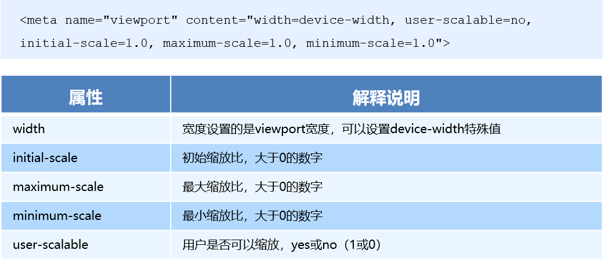

# 移动端基础

## 1.视口

#### 1.1布局视口 layout viewport

iOS, Android基本都将这个视口分辨率设置为 980px，所以PC上的网页大多都能在手机上呈现，只不过元素看上去很小，一般默认可以通过手动缩放网页。

#### 1.2视觉视口 visual viewport

字面意思，它是用户正在看到的网站的区域。注意：是网站的区域。

我们可以通过缩放去操作视觉视口，但不会影响布局视口，布局视口仍保持原来的宽度。

#### 1.3理想视口 ideal viewport

为了使网站在移动端有最理想的浏览和阅读宽度而设定

理想视口，对设备来讲，是最理想的视口尺寸

需要手动添写meta视口标签通知浏览器操作

meta视口标签的主要目的：布局视口的宽度应该与理想视口的宽度一致，简单理解就是设备有多宽，我们布局的视口就多宽

总结：我们开发最终会用理想视口，而理想视口就是将布局视口宽度修改为视觉视口

#### 1.4meta标签



最标准的viewport设置

+ 视口宽度和设备保持一致
+ 视口的默认缩放比例1.0
+ 不允许用户自行缩放
+ 最大允许的缩放比例1.0
+ 最小允许的缩放比例1.0

## 2.二倍图

### 1物理像素&物理像素比

物理像素点指的是屏幕显示的最小颗粒，是物理真实存在的。

开发时候的1px 不是一定等于1个物理像素的

一个px的能显示的物理像素点的个数，称为物理像素比或屏幕像素比

准的viewport设置中，使用倍图来提高图片质量，解决在高清设备中的模糊问题

### 2.背景缩放background-size

background-size 属性规定背景图像的尺寸

```
background-size: 背景图片宽度 背景图片高度;
```

单位： 长度|百分比|cover|contain;

cover把背景图像扩展至足够大，以使背景图像完全覆盖背景区域。

contain把图像图像扩展至最大尺寸，以使其宽度和高度完全适应内容区域

## 3.移动开发选择和技术解决方案

### 3.1移动端主流方案

1.单独制作移动端页面（主流）

通常情况下，网址域名前面加 m(mobile)
可以打开移动端。通过判断设备，如果是移动设备打开，则跳到移动端页面。  

PC端和移动端为两套网站，pc端是pc断的样式，移动端在写一套，专门针对移动端适配的一套网站

2.响应式页面兼容移动端

### 3.2 移动端技术解决方案

1.移动端浏览器兼容问题

移动端浏览器基本以 webkit 内核为主，因此我们就考虑webkit兼容性问题。

我们可以放心使用 H5 标签和 CSS3 样式。

同时我们浏览器的私有前缀我们只需要考虑添加 webkit 即可

2.移动端公共样式

移动端 CSS 初始化推荐使用 normalize.css/

Normalize.css：保护了有价值的默认值

Normalize.css：修复了浏览器的bug

Normalize.css：是模块化的

Normalize.css：拥有详细的文档

官网地址： <http://necolas.github.io/normalize.css/>

### 3.3 移动端大量使用 CSS3盒子模型box-sizin

传统模式宽度计算：盒子的宽度 = CSS中设置的width + border + padding 

CSS3盒子模型：     盒子的宽度=  CSS中设置的宽度width 里面包含了 border 和 padding 

也就是说，我们的CSS3中的盒子模型， padding 和 border 不会撑大盒子了

```
/*CSS3盒子模型*/
box-sizing: border-box;
/*传统盒子模型*/
box-sizing: content-box;

```

移动端可以全部CSS3 盒子模型

PC端如果完全需要兼容，我们就用传统模式，如果不考虑兼容性，我们就选择 CSS3 盒子模型

### 3.4移动端特殊样式

```
    /*CSS3盒子模型*/
    box-sizing: border-box;
    -webkit-box-sizing: border-box;
    /*点击高亮我们需要清除清除  设置为transparent 完成透明*/
    -webkit-tap-highlight-color: transparent;
    /*在移动端浏览器默认的外观在iOS上加上这个属性才能给按钮和输入框自定义样式*/
    -webkit-appearance: none;
    /*禁用长按页面时的弹出菜单*/
    img,a { -webkit-touch-callout: none; }

```

## 4.0移动端常见布局

移动端单独制作

+ 流式布局（百分比布局）
+ flex 弹性布局（强烈推荐）
+ less+rem+媒体查询布局
+ 混合布局

响应式

+ 媒体查询
+ bootstarp

流式布局：

流式布局，就是百分比布局，也称非固定像素布局。

通过盒子的宽度设置成百分比来根据屏幕的宽度来进行伸缩，不受固定像素的限制，内容向两侧填充。

流式布局方式是移动web开发使用的比较常见的布局方式。