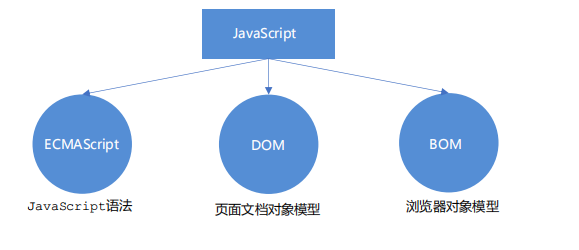
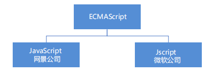

# 1.初识JavaScript

## 1.1JavaScript

一种运行在客户端的**脚本语言**

脚本语言：不需要编译，运行过程中由 js 解释器( js 引擎）逐行来进行解释并执行

 现在也可以基于 Node.js 技术进行服务器端编程

## 1.2 JavaScript的作用

-  表单动态校验（密码强度检测）  （ JS 产生最初的目的 ）
-  网页特效
-  服务端开发(Node.js)
-  桌面程序(Electron)
-  App(Cordova) 
-  控制硬件-物联网(Ruff)
-  游戏开发(cocos2d-js)

## 1.3浏览器执行 JS 简介

渲染引擎和 JS 引擎 

 **渲染引擎**：用来解析HTML与CSS，俗称内核，比如 chrome 浏览器的 blink ，老版本的 webkit 

**JS 引擎**：也称为 JS 解释器。 用来读取网页中的JavaScript代码，对其处理后运行，比如 chrome 浏览器的 V8 

浏览器本身并不会执行JS代码，而是通过内置 JavaScript 引擎(解释器) 来执行 JS 代码 。JS 引擎执行代码时逐行解释 

## 1.4JS 的组成



### 1.ECMAScript



> ECMAScript：ECMAScript 规定了JS的编程语法和基础核心知识，是所有浏览器厂商共同遵守的一套JS语法工业标准。

### 2.DOM —文档对象模型

文档对象模型（Document Object Model,DOM），是W3C组织推荐的处理可扩展标记语言的**标准编程接口。**
通过 DOM 提供的接口可以对**页面上的各种元素进行操作**（大小、位置、颜色等）。

### 3.BOM —浏览器对象模型

BOM (Browser Object Model，BOM) 是指**浏览器对象模型**，它提供了独立于内容的、可以与浏览器窗口进行互动的对象结构。
通过BOM可以**操作浏览器窗口**，比如弹出框、控制浏览器跳转、获取分辨率等。

## 1.5 JS 初体验

### 1. 行内式 JS

```js
<input type="button" value="点我试试" onclick="alert('Hello World')" />
```

### 2. 内嵌 JS
```js
<script>
alert('Hello World~!');
</script>
```

### 3. 外部 JS文件

```js
<script src="my.js"></script>
```

## 1.6JavaScript 输入输出语句

| 方法             | 说明                           | 归属   |
| ---------------- | ------------------------------ | ------ |
| alert(msg)       | 浏览器弹出警示框               | 浏览器 |
| console.log(msg) | 浏览器控制台打印输出信息       | 浏览器 |
| prompt(info)     | 浏览器弹出输入框，用户可以输入 | 浏览器 |

- 注意：alert() 主要用来显示消息给用户，console.log() 用来给程序员自己看运行时的消息。

