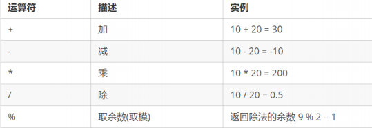
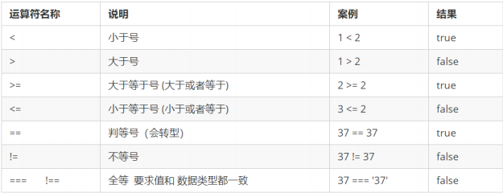
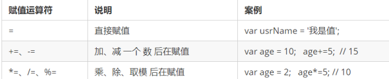
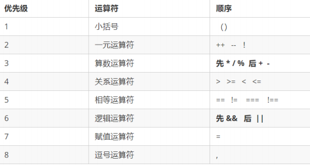

# 4. 运算符
是用于实现赋值、比较和执行算数运算等功能的符号。
## 2. 算数运算符 

算术运算使用的符号，用于执行两个变量或值的算术运算



## 3. 递增和递减运算符

放在变量前面时，我们可以称为前置递增（递减）运算符，放在变量后面时，我们可以称为后置递增（递减）运算符。

#### 1. 前置递增运算符
++num 前置递增，就是自加1，类似于 num = num + 1，但是 ++num 写起来更简单。
使用口诀：先自加，后返回值

```js
var num = 10;
alert(++num + 10); // 21
```
#### 2. 后置递增运算符
num++ 后置递增，就是自加1，类似于 num = num + 1 ，但是 num++ 写起来更简单。
使用口诀：先返回原值，后自加
```js
var num = 10;
alert(10 + num++); // 20
```
## 4. 比较运算符

比较运算符（关系运算符）是两个数据进行比较时所使用的运算符，比较运算后，会返回一个布尔值
（true / false）作为比较运算的结果



**小结**


## 5. 逻辑运算符

逻辑运算符是用来进行布尔值运算的运算符，其返回值也是布尔值。


- 逻辑与&&

  两边都是 true才返回 true，否则返回 false

- 逻辑或 ||

  两边都是 true才返回 true，否则返回 false
  
- 逻辑非 ！

  逻辑非（!）也叫作取反符，用来取一个布尔值相反的值，如 true 的相反值是 false

  ```js
  var isOk = !true;
  console.log(isOk);  // false
  ```

- 短路运算（逻辑中断）

   短路运算的原理：当有多个表达式（值）时,左边的表达式值可以确定结果时,就不再继续运算右边的表达式的值;

  - 逻辑与

      语法： 表达式1 && 表达式2

          - 如果第一个表达式的值为真，则返回表达式2
          
          - 如果第一个表达式的值为假，则返回表达式1

      ```js
      console.log( 123 && 456 );        // 456
      console.log( 0 && 456 );          // 0
      console.log( 123 && 456&& 789 );  // 789
      ```

  - 逻辑或

     语法： 表达式1 || 表达式2

         - 如果第一个表达式的值为真，则返回表达式1
         
         - 如果第一个表达式的值为假，则返回表达式2

      ```js
      console.log( 123 || 456 );         //  123
      console.log( 0 ||  456 );          //  456
      console.log( 123 || 456 || 789 );  //  123
      ```

## 6. 赋值运算符



## 7. 运算符优先级



