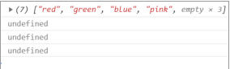

# 7.数组

## 1. 数组的概念

数组是一种将一组数据存储在单个变量名下的优雅方式
```js
// 普通变量一次只能存储一个值
var num = 10;
// 数组一次可以存储多个值
var arr = [1,2,3,4,5];
```
## 2. 创建数组
### 2.1 利用 new 创建数组

```js
var 数组名 = new Array() ；
var arr = new Array(); // 创建一个新的空数组
```
### 2.2 利用数组字面量创建数组
```js
//1. 使用数组字面量方式创建空的数组
var 数组名 = []；
//2. 使用数组字面量方式创建带初始值的数组
var 数组名 = ['小白','小黑','大黄','瑞奇'];
```

### 2.3 数组元素的类型

数组中可以存放任意类型的数据，例如字符串，数字，布尔值等。
```js
var arrStus = ['小白',12,true,28.9];
```

## 3. 获取数组中的元素

```js
// 定义数组
var arrStus = [1,2,3];
// 获取数组中的第2个元素
alert(arrStus[1]);
```
## 4. 遍历数组
```js
var arr = ['red','green', 'blue'];
for(var i = 0; i < arr.length; i++){
console.log(arrStus[i]);
}
```
###  4.1 数组的长度

使用“数组名.length”可以访问数组元素的数量（数组长度）。

```js
var arrStus = [1,2,3];
alert(arrStus.length); // 3
```

## 5. 数组中新增元素

### 5.1 通过修改 length 长度新增数组元素
```js
var arr = ['red', 'green', 'blue', 'pink'];
arr.length = 7;
console.log(arr);
console.log(arr[4]);
console.log(arr[5]);
console.log(arr[6]);
```



### 5.2 通过修改数组索引新增数组元素

```js
var arr = ['red', 'green', 'blue', 'pink'];
arr[4] = 'hotpink';
console.log(arr);
```

