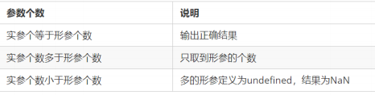

# 9.函数

## 1. 函数的概念

封装了一段可被重复调用执行的代码块
## 2. 函数的使用

### 2.1 声明函数
```js
// 声明函数
function 函数名() {
//函数体代码
}
```
### 2.2 调用函数
```js
// 调用函数
函数名(); // 通过调用函数名来执行函数体代码
```
### 2.3 函数的封装

函数的封装是把一个或者多个功能通过函数的方式封装起来，对外只提供一个简单的函数接口

## 3. 函数的参数

### 3.1 形参和实参

```js
// 带参数的函数声明
function 函数名(形参1, 形参2 , 形参3...) { // 可以定义任意多的参数，用逗号分隔
// 函数体
}
// 带参数的函数调用
函数名(实参1, 实参2, 实参3...);
```
### 3.2 函数参数的传递过程
```js
// 声明函数
function getSum(num1, num2) {
console.log(num1 + num2);
}
// 调用函数
getSum(1, 3); // 4
getSum(6, 5); // 11
```
### 3.3 函数形参和实参个数不匹配问题



```js
function sum(num1, num2) {
console.log(num1 + num2);
}
sum(100, 200); // 形参和实参个数相等，输出正确结果
sum(100, 400, 500, 700); // 实参个数多于形参，只取到形参的个数
sum(200); // 实参个数少于形参，多的形参定义为undefined，结果为NaN
```
## 4. 函数的返回值

### 4.1 return 语句
```js
function getMax(num1, num2) {
return num1 > num2 ? num1 : num2;
}
console.log(getMax(1, 2));
console.log(getMax(11, 2));
```

### 4.2 return 的返回值

return 只能返回一个值。如果用逗号隔开多个值，以最后一个为准。
```js
function add(num1，num2){
//函数体
return num1，num2;
}
var resNum = add(21,6); // 调用函数，传入两个实参，并通过 resNum 接收函数返回值
alert(resNum); // 6
```

### 4.3 函数没有 return 返回 undefined
函数都是有返回值的
1. 如果有return 则返回 return 后面的值
2. 如果没有return 则返回 undefined


### 4.4 break ,continue ,return 的区别

 break ：结束当前的循环体（如 for、while）
continue ：跳出本次循环，继续执行下次循环（如 for、while）
return ：不仅可以退出循环，还能够返回 return 语句中的值，同时还可以结束当前的函数体内的代码

## 5. arguments的使用

>不确定有多少个参数传递的时候，可以用 arguments 来获取。
>在 JavaScript 中，arguments 实际上它是当前函数的一个**内置对象**.
>所有函数都内置了一个 arguments 对象，arguments 对象中**存储了传递的所有实参**。


arguments展示形式是一个伪数组，因此可以进行遍历。伪数组具有以下特点：
* 具有 length 属性
* 按索引方式储存数据
* 不具有数组的 push , pop 等方法

```js
function maxValue() {
var max = arguments[0];
for (var i = 0; i < arguments.length; i++) {
if (max < arguments[i]) {
max = arguments[i];
}
}
return max;
}
console.log(maxValue(2, 4, 5, 9));
console.log(maxValue(12, 4, 9));
```

## 6. 函数的两种声明方式

### 1. 自定义函数方式(命名函数)
```js
// 声明定义方式
function fn() {...}
// 调用 
fn();
```
### 2. 函数表达式方式(匿名函数）
```js
// 这是函数表达式写法，匿名函数后面跟分号结束
var fn = function(){...}；
// 调用的方式，函数调用必须写到函数体下面
fn();
```