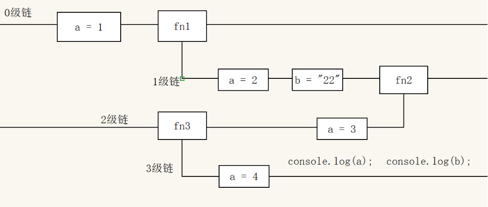
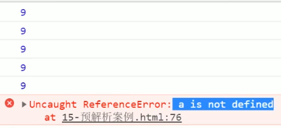

# 10.作用域预解析

## 1  作用域

### 1.1 作用域概述

>限定这个名字的可用性的代码范围就是这个名字的作用域。作用域的使用提高了程序逻辑的局部性，增强了程序的可靠性，减少了名字冲突。

JavaScript（es6前）中的作用域有两种：

- 全局作用域
- 局部作用域（函数作用域）	

### 1.2 全局作用域

>作用于所有代码执行的环境(整个 script 标签内部)或者一个独立的 js 文件。

### 1.3 局部作用域

>作用于函数内的代码环境，就是局部作用域。 因为跟函数有关系，所以也称为**函数作用域**。

### 1.4 JS没有块级作用域

- 块作用域由 { } 包括。

  ```js
  if(true){
    var num = 123;
    console.log(123); //123
  }
  console.log(123);   //123
  ```

## 2  变量的作用域

### 2.1 全局变量

`在全局作用域下声明的变量叫做全局变量（在函数外部定义的变量）。`

- 全局变量在代码的任何位置都可以使用
- 在全局作用域下 var 声明的变量 是全局变量
- 特殊情况下，在函数内不使用 var 声明的变量也是全局变量（不建议使用）

### 2.2 局部变量

`在局部作用域下声明的变量叫做局部变量（在函数内部定义的变量）`

- 局部变量只能在该函数内部使用
- 在函数内部 var 声明的变量是局部变量
- 函数的形参实际上就是局部变量

### 2.3 全局变量和局部变量的区别

- **全局变量**：在任何一个地方都可以使用，只有在**浏览器关闭时才会被销毁**，因此比较占内存
- **局部变量**：只在函数内部使用，当其所在的代码块被执行时，会被初始化；**当代码块运行结束后，就会被销毁，因此更节省内存空间**

## 3  作用域链

>只要是代码都一个作用域中，写在函数内部的局部作用域，未写在任何函数内部即在全局作用域中；如果函数中还有函数，那么在这个作用域中就又可以诞生一个作用域；根据在**内部函数可以访问外部函数变量**的这种机制，用链式查找决定哪些数据能被内部函数访问，就称作作用域链

```js
function f1() {
    var num = 123;
    function f2() {
        console.log( num );
    }
    f2();
}
var num = 456;
f1();
```
`作用域链：采取就近原则的方式来查找变量最终的值。`

```js
var a = 1;
function fn1() {
    var a = 2;
    var b = '22';
    fn2();
    function fn2() {
        var a = 3;
        fn3();
        function fn3() {
            var a = 4;
            console.log(a); //a的值 ?
            console.log(b); //b的值 ?
        }
    }
}
fn1();
```





## 4  预解析

### 4.1 预解析的相关概念

JavaScript 代码是由浏览器中的 JavaScript 解析器来执行的。分为两步：**预解析和代码执行**。

- 预解析：在当前作用域下, JS 代码执行之前，浏览器会默认把带**有 var 和 function 声明的变量在内存中进行提前声明或者定义。**

- 代码执行： 从上到下执行JS语句。

  **预解析会把变量和函数的声明在代码执行之前执行完成。**

### 4.2 变量预解析

>预解析也叫做变量、**函数提升**。
>变量提升（变量预解析）： 变量的声明会被提升到当前作用域的最上面，变量的赋值不会提升。

```js
console.log(num);  // 结果是多少？
var num = 10;      // ？
```

结果：undefined
注意：**变量提升只提升声明，不提升赋值**

### 4.3 函数预解析

函数提升： 函数的声明会被提升到当前作用域的最上面，但是不会调用函数。

```js
fn();
function fn() {
    console.log('打印');
}
```

	结果：控制台打印字符串 --- ”打印“ 

注意：函数声明代表函数整体，所以函数提升后，函数名代表整个函数，但是函数并没有被调用！	

### 4.4 函数表达式声明函数问题

>函数表达式创建函数，会执行变量提升，此时接收函数的变量名无法正确的调用：

```js
fn();
var  fn = function() {
    console.log('想不到吧');
}
```

>结果：报错提示 ”fn is not a function"	
>解释：该段代码执行之前，会做变量声明提升，fn在提升之后的值是undefined；而fn调用是在fn被赋值为函数体之前，此时fn的值是undefined，所以无法正确调用
```js
         f1();
        console.log(c);
        console.log(b);
        console.log(a);

        function f1() {
            var a = b = c = 9;
            console.log(a);
            console.log(b);
            console.log(c);
        }
        // 以下代码
        // function f1() {
        //     var a;
        //     a = b = c = 9;
        //     // 相当于 var  a  = 9; b = 9; c = 9; b 和 c 直接赋值 没有var 声明 当 全局变量看
        //     // 集体声明  var a = 9, b = 9, c = 9;
        //     console.log(a);
        //     console.log(b);
        //     console.log(c);
        // }
        // f1();
        // console.log(c);
        // console.log(b);
        // console.log(a);
```


