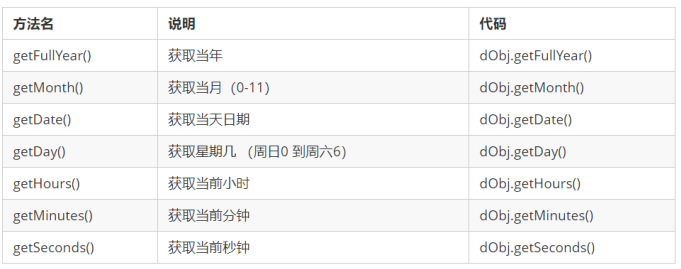
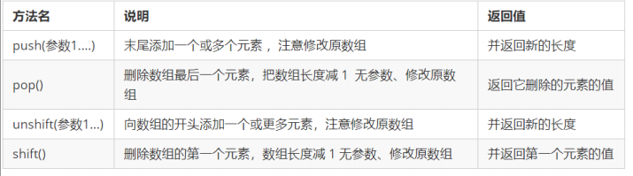
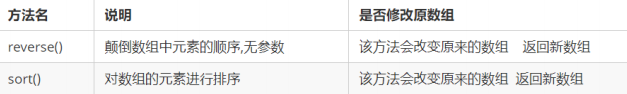
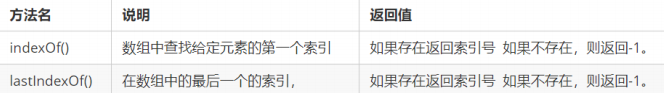
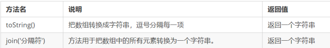
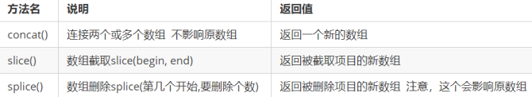
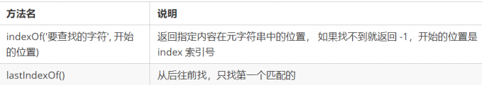
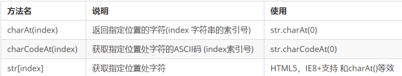
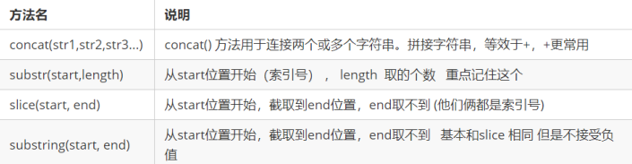

# 12  内置对象

## 1  内置对象

JavaScript 中的对象分为3种：**自定义对象 、内置对象、 浏览器对象**
前面两种对象是JS 基础 内容，属于 ECMAScript；  第三个浏览器对象属于 JS 独有的。
JS API 讲解内置对象就是指 JS 语言自带的一些对象，提供了一些常用的或是**最基本而必要的功能**（属性和方法），帮助我们快速开发。

JavaScript 提供了多个内置对象：Math、 Date 、Array、String等	

## 2. Math对象
| 属性、方法名          | 功能                                         |
| --------------------- | -------------------------------------------- |
| Math.PI               | 圆周率                                       |
| Math.floor()          | 向下取整                                     |
| Math.ceil()           | 向上取整                                     |
| Math.round()          | 四舍五入版 就近取整   注意 -3.5   结果是  -3 |
| Math.abs()            | 绝对值                                       |
| Math.max()/Math.min() | 求最大和最小值                               |
| Math.random()         | 获取范围在[0,1)内的随机值                    |

	**获取指定范围内的随机整数**：

```js
function getRandom(min, max) {
  return Math.floor(Math.random() * (max - min + 1)) + min; 
}
```

## 3. 日期对象
### 3.1 Date 概述
Date 对象和 Math 对象不一样，Date是一个构造函数，所以使用时需要实例化后才能使用其中具体方法和属性。Date 实例用来处理日期和时间。

### 3.2 Date()方法的使用

#### 1. 获取当前时间必须实例化
```js
var now = new Date();
console.log(now);
```
#### 2. Date() 构造函数的参数

 如果Date()不写参数，就返回当前时间
如果Date()里面写参数，就返回括号里面输入的时间

### 3.3 日期格式化


### 3.4 获取日期的总的毫秒形式
```js
// 实例化Date对象
var now = new Date();
// 1. 用于获取对象的原始值
console.log(date.valueOf())
console.log(date.getTime())
// 2. 简单写可以这么做
var now = + new Date();
// 3. HTML5中提供的方法，有兼容性问题
var now = Date.now();
```

## 4. 数组对象
### 4.1 数组对象的创建
创建数组对象的两种方式
*  字面量方式
*  new Array()

### 4.2 检测是否为数组

instanceof 运算符，可以判断一个对象是否属于某种类型
Array.isArray()用于判断一个对象是否为数组，isArray() 是 HTML5 中提供的方法
```js
var arr = [1, 23];
var obj = {};
console.log(arr instanceof Array); // true
console.log(obj instanceof Array); // false
console.log(Array.isArray(arr)); // true
console.log(Array.isArray(obj)); // false
```
### 4.3 添加删除数组元素的方法



### 4.4 数组排序


```js
var arr = [1, 64, 9, 6];
arr.sort(function(a, b) {
return b - a; // 降a序
// return a - b; // 升序
});
console.log(arr);

```

### 4.5 数组索引方法


### 4.6 数组转换为字符串


### 4.7数组其他操作



## 5. 字符串对象

### 5.1基本包装类型

为了方便操作基本数据类型，JavaScript 还提供了三个特殊的引用类型：String、Number和 Boolean。

基本包装类型就是把简单数据类型包装成为复杂数据类型，这样基本数据类型就有了属性和方法。

```js
// 下面代码有什么问题？
var str = 'andy';
console.log(str.length);
```
```js
// 1. 生成临时变量，把简单类型包装为复杂数据类型
var temp = new String('andy');
// 2. 赋值给我们声明的字符变量
str = temp;
// 3. 销毁临时变量
temp = null;
```

### 5.2字符串的不可变

指的是里面的值不可变，虽然看上去可以改变内容，但其实是地址变了，内存中新开辟了一个内存空间。
```js
var str = 'abc';
str = 'hello';
// 当重新给 str 赋值的时候，常量'abc'不会被修改，依然在内存中
// 重新给字符串赋值，会重新在内存中开辟空间，这个特点就是字符串的不可变
// 由于字符串的不可变，在大量拼接字符串的时候会有效率问题
var str = '';
for (var i = 0; i < 100000; i++) {
str += i;
}
console.log(str); // 这个结果需要花费大量时间来显示，因为需要不断的开辟新的空间
```


### 5.3根据字符返回位置

字符串通过基本包装类型可以调用部分方法来操作字符串，以下是返回指定字符的位置的方法：



### 5.4 根据位置返回字符

字符串通过基本包装类型可以调用部分方法来操作字符串，以下是根据位置返回指定位置上的字符：


### 5.5 字符串操作方法



### 5.6replace()方法

		replace() 方法用于在字符串中用一些字符替换另一些字符，其使用格式如下：  

`字符串.replace(被替换的字符串， 要替换为的字符串)；`

### 5.7split()方法
split()方法用于切分字符串，它可以将字符串切分为数组。在切分完毕之后，返回的是一个新数组。
```js
var str = 'a,b,c,d';
console.log(str.split(',')); // 返回的是一个数组 [a, b, c, d]
```

