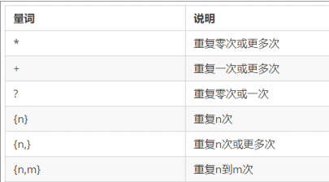
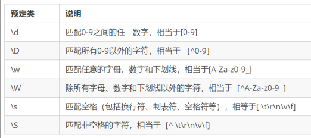

# 4.正则表达式

## 1. 正则表达式概述

### 1.1 什么是正则表达式

正则表达式（ Regular Expression ）是用于**匹配字符串中字符组合的模式**。

正则表达式也是对象

>用户名表单只能输入英文字母、数字或者下划线， 昵称输入框中可以输入中文(匹配)。
>正则表达式还常用于过滤掉页面内容中的一些敏感词(替换)
>从字符串中获取我们想要的特定部分(提取)等 。

### 1.2 正则表达式的特点

1. 灵活性、逻辑性和功能性非常的强。
2. 可以迅速地用极简单的方式达到字符串的复杂控制。
3. 对于刚接触的人来说，比较晦涩难懂。比如： ^\w+([-+.]\w+)*@\w+([-.]\w+)*\.\w+([-.]\w+)*$
4. 实际开发,一般都是直接复制写好的正则表达式. 但是要求会使用正则表达式并且根据实际情况修改正则表达
式. 比如用户名: /^[a-z0-9_-]{3,16}$/

## 2. 正则表达式在 JavaScript 中的使用

### 2.1 创建正则表达式

#### 1. 通过调用 RegExp 对象的构造函数创建
`var 变量名 = new RegExp(/表达式/);`
#### 2. 通过字面量创建
`var 变量名 = /表达式/;`


### 2.2 测试正则表达式 test
`regexObj.test(str)`

```html
  <script>
        // 正则表达式在js中的使用

        // 1. 利用 RegExp对象来创建 正则表达式
        var regexp = new RegExp(/123/);
        console.log(regexp);

        // 2. 利用字面量创建 正则表达式
        var rg = /123/;
        // 3.test 方法用来检测字符串是否符合正则表达式要求的规范
        console.log(rg.test(123));
        console.log(rg.test('abc'));
    </script>
```
## 3. 正则表达式中的特殊字符

### 3.1 正则表达式的组成

一个正则表达式可以由简单的字符构成，比如 /abc/，也可以是简单和特殊字符的组合，比如 /ab*c/ 。
特殊字符也被称为元字符，在正则表达式中是具有特殊意义的专用符号，如 ^ 、$ 、+ 等。

MDN：https://developer.mozilla.org/zh-CN/docs/Web/JavaScript/Guide/Regular_Expressions
jQuery 手册：正则表达式部分
正则测试工具: http://tool.oschina.net/regex

### 3.2 边界符

提示字符所处的位置


```html
<script>
        // 边界符 ^ $ 
        var rg = /abc/; // 正则表达式里面不需要加引号 不管是数字型还是字符串型
        // /abc/ 只要包含有abc这个字符串返回的都是true
        console.log(rg.test('abc'));
        console.log(rg.test('abcd'));
        console.log(rg.test('aabcd'));
        console.log('---------------------------');
        var reg = /^abc/;
        console.log(reg.test('abc')); // true
        console.log(reg.test('abcd')); // true
        console.log(reg.test('aabcd')); // false
        console.log('---------------------------');
        var reg1 = /^abc$/; // 精确匹配 要求必须是 abc字符串才符合规范
        console.log(reg1.test('abc')); // true
        console.log(reg1.test('abcd')); // false
        console.log(reg1.test('aabcd')); // false
        console.log(reg1.test('abcabc')); // false
    </script>
```
### 3.3 字符类


字符类表示有一系列字符可供选择，只要匹配其中一个就可以了。所有可供选择的字符都放在方括号内。

#### 1. [] 方括号

`/[abc]/.test('andy') // true`

#### 2. [-] 方括号内部 范围符-

`/^[a-z]$/.test(c') // true`

#### 3. [^] 方括号内部 取反符^

`/[^abc]/.test('andy') // false`

#### 4. 字符组合

`/[a-z1-9]/.test('andy') // true`

```html
<script>
        //var rg = /abc/;  只要包含abc就可以 
        // 字符类: [] 表示有一系列字符可供选择，只要匹配其中一个就可以了
        var rg = /[abc]/; // 只要包含有a 或者 包含有b 或者包含有c 都返回为true
        console.log(rg.test('andy'));
        console.log(rg.test('baby'));
        console.log(rg.test('color'));
        console.log(rg.test('red'));
        var rg1 = /^[abc]$/; // 三选一 只有是a 或者是 b  或者是c 这三个字母才返回 true
        console.log(rg1.test('aa'));
        console.log(rg1.test('a'));
        console.log(rg1.test('b'));
        console.log(rg1.test('c'));
        console.log(rg1.test('abc'));
        console.log('------------------');

        var reg = /^[a-z]$/; // 26个英文字母任何一个字母返回 true  - 表示的是a 到z 的范围  
        console.log(reg.test('a'));
        console.log(reg.test('z'));
        console.log(reg.test(1));
        console.log(reg.test('A'));
        // 字符组合
        var reg1 = /^[a-zA-Z0-9_-]$/; // 26个英文字母(大写和小写都可以)任何一个字母返回 true  
        console.log(reg1.test('a'));
        console.log(reg1.test('B'));
        console.log(reg1.test(8));
        console.log(reg1.test('-'));
        console.log(reg1.test('_'));
        console.log(reg1.test('!'));
        console.log('----------------');
        // 如果中括号里面有^ 表示取反的意思 千万和 我们边界符 ^ 别混淆
        var reg2 = /^[^a-zA-Z0-9_-]$/;
        console.log(reg2.test('a'));
        console.log(reg2.test('B'));
        console.log(reg2.test(8));
        console.log(reg2.test('-'));
        console.log(reg2.test('_'));
        console.log(reg2.test('!'));
    </script>
```
### 3.4 量词符

量词符用**来设定某个模式出现的次数**



```html
<script>
        // 量词符: 用来设定某个模式出现的次数
        // var reg = /^a$/;
        // console.log(reg.test('a'));
        // console.log(reg.test('aa'));


        // 1. * 相当于 >= 0 可以出现0次或者很多次 
        // var reg = /^a*$/;
        // console.log(reg.test(''));
        // console.log(reg.test('a'));
        // console.log(reg.test('aa'));
        // console.log(reg.test('aaaaaa'));

        // 2. + 相当于 >= 1 可以出现1次或者很多次
        // var reg = /^a+$/;
        // console.log(reg.test(''));
        // console.log(reg.test('a'));
        // console.log(reg.test('aa'));
        // console.log(reg.test('aaaaaa'));
        // 3. ?  相当于 1 || 0
        // var reg = /^a?$/;
        // console.log(reg.test(''));
        // console.log(reg.test('a'));
        // console.log(reg.test('aa'));
        // console.log(reg.test('aaaaaa'));
        // 4. {3 } 就是重复3次
        // var reg = /^a{3}$/;
        // console.log(reg.test(''));
        // console.log(reg.test('a'));
        // console.log(reg.test('aa'));
        // console.log(reg.test('aaaaaa'));
        // console.log(reg.test('aaa'));
        // 5. {3, }  大于等于3
        var reg = /^a{3,}$/;
        console.log(reg.test(''));
        console.log(reg.test('a'));
        console.log(reg.test('aa'));
        console.log(reg.test('aaaaaa'));
        console.log(reg.test('aaa'));
        // 6. {3, 16}  大于等于3 并且 小于等于16

        var reg = /^a{3,16}$/;
        console.log(reg.test(''));
        console.log(reg.test('a'));
        console.log(reg.test('aa'));
        console.log(reg.test('aaaaaa'));
        console.log(reg.test('aaa'));
        console.log(reg.test('aaaaaaaaaaaaaaaaaaaaa'));
    </script>
```


### 3.5 括号总结

1.大括号 量词符. 里面表示重复次数
2.中括号 字符集合。匹配方括号中的任意字符.
3.小括号 表示优先级
可以在线测试: [https://c.runoob.com/](https://c.runoob.com/)
```html
 <script>
        // 中括号 字符集合.匹配方括号中的任意字符. 
        // var reg = /^[abc]$/;
        // a 也可以 b 也可以 c 可以  a ||b || c
        // 大括号  量词符. 里面表示重复次数
        // var reg = /^abc{3}$/; // 它只是让c重复三次   abccc
        // console.log(reg.test('abc'));
        // console.log(reg.test('abcabcabc'));
        // console.log(reg.test('abccc'));

        // 小括号 表示优先级
        var reg = /^(abc){3}$/; // 它是让abcc重复三次
        console.log(reg.test('abc'));
        console.log(reg.test('abcabcabc'));
        console.log(reg.test('abccc'));
    </script>
```
### 3.6 预定义类

预定义类指的是某些常见模式的简写方式。



## 4. 正则表达式中的替换


### 4.1 replace 替换


replace() 方法可以实现替换字符串操作，用来替换的参数可以是一个字符串或是一个正则表达式

`stringObject.replace(regexp/substr,replacement)`

### 4.2 正则表达式参数

`/表达式/[switch]`

switch(也称为修饰符) 按照什么样的模式来匹配. 有三种值：
g：全局匹配
i：忽略大小写
gi：全局匹配 + 忽略大小写
```html
 <textarea name="" id="message"></textarea> <button>提交</button>
    <div></div>
    <script>
        // 替换 replace
        // var str = 'andy和red';
        // // var newStr = str.replace('andy', 'baby');
        // var newStr = str.replace(/andy/, 'baby');
        // console.log(newStr);
        var text = document.querySelector('textarea');
        var btn = document.querySelector('button');
        var div = document.querySelector('div');
        btn.onclick = function() {
            div.innerHTML = text.value.replace(/激情|gay/g, '**');
        }
    </script>
```

