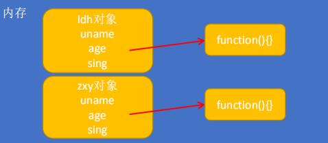
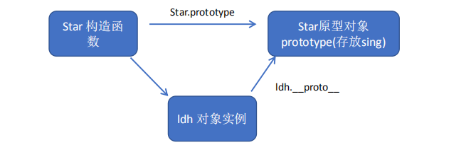
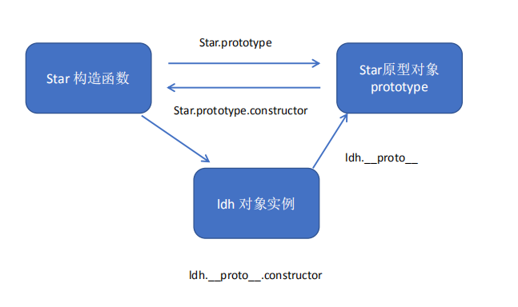
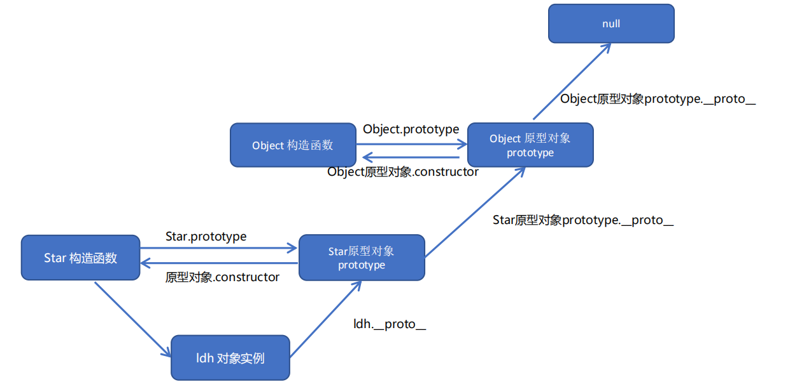

# 2.构造函数和原型

## 1. 构造函数和原型

### 1.1 概述

类就是对象的模板，对象就是类的实例

创建对象可以通过以下三种方式：
1. 对象字面量
2. new Object()
3. 自定义构造函数
```html
<script>
        // 1. 利用 new Object() 创建对象
        var obj1 = new Object();
        // 2. 利用 对象字面量创建对象
        var obj2 = {};
        // 3. 利用构造函数创建对象
        function Star(uname, age) {
            this.uname = uname;
            this.age = age;
            this.sing = function() {
                console.log('我会唱歌');
            }
        }
        var ldh = new Star('刘德华', 18);
        var zxy = new Star('张学友', 19);
        console.log(ldh);
        ldh.sing();
        zxy.sing();
    </script>
```
### 1.2 构造函数
构造函数是一种特殊的函数，主要用来**初始化对象**，即为对象成员变量赋初始值，它总与 new 一起使用。

1. 构造函数用于创建某一类对象，其**首字母要大写**
2. 构造函数要**和 new 一起使用**才有意义

**new 在执行时**
① 在内存中创建一个新的空对象。
② 让 this 指向这个新的对象。
③ 执行构造函数里面的代码，给这个新对象添加属性和方法。
④ 返回这个新对象（所以构造函数里面不需要 return ）。

JavaScript 的构造函数中可以添加一些成员，可以在构造函数本身上添加，也可以在构造函数内部的 this 上添
加。通过这两种方式添加的成员，就分别称为静态成员和实例成员。
* **静态成员**：在构造函数本上添加的成员称为静态成员，只能由构造函数本身来访问
* **实例成员**：在构造函数内部创建的对象成员称为实例成员，只能由**实例化的对象来访问**
```html
   <script>
        // 构造函数中的属性和方法我们称为成员, 成员可以添加
        function Star(uname, age) {
            this.uname = uname;
            this.age = age;
            this.sing = function() {
                console.log('我会唱歌');

            }
        }
        var ldh = new Star('刘德华', 18);
        // 1.实例成员就是构造函数内部通过this添加的成员 uname age sing 就是实例成员
        // 实例成员只能通过实例化的对象来访问
        console.log(ldh.uname);
        ldh.sing();
        // console.log(Star.uname); // 不可以通过构造函数来访问实例成员
        // 2. 静态成员 在构造函数本身上添加的成员  sex 就是静态成员
        Star.sex = '男';
        // 静态成员只能通过构造函数来访问
        console.log(Star.sex);
        console.log(ldh.sex); // 不能通过对象来访问
    </script>
```
### 1.3 构造函数的问题

存在浪费内存的问题。




### 1.4 构造函数原型 prototype

**构造函数通过原型分配的函数是所有对象所共享的。**
JavaScript 规定，每一个构造函数都有一个 prototype 属性，指向另一个对象。
注意这个 prototype 就是一个对象，这个对象的所有属性和方法，都会被构造函数所拥有。
我们可以把那些不变的方法，直接定义在 prototype 对象上，这样所有对象的实例就可以**共享这些方法**。

```html
 <script>
        // 1. 构造函数的问题. 
        function Star(uname, age) {
            this.uname = uname;
            this.age = age;
            // this.sing = function() {
            //     console.log('我会唱歌');

            // }
        }
        Star.prototype.sing = function() {
            console.log('我会唱歌');
        }
        var ldh = new Star('刘德华', 18);
        var zxy = new Star('张学友', 19);
        console.log(ldh.sing === zxy.sing);
        // console.dir(Star);
        ldh.sing();
        zxy.sing();
        // 2. 一般情况下,我们的公共属性定义到构造函数里面, 公共的方法我们放到原型对象身上
    </script>
```
### 1.5 对象原型 __ proto__ 

**对象都会有一个属性  __ proto__  指向构造函数的 prototype 原型对象**，之所以我们对象可以使用构造函数
prototype 原型对象的属性和方法，就是因为对象有 _ _proto__  原型的存在。
 __proto__对象原型和原型对象 prototype 是等价的
 __proto__对象原型的意义就在于为对象的查找机制提供一个方向，或者说一条路线，但是它是一个非标准属性，
因此实际开发中，不可以使用这个属性，它只是内部指向原型对象 prototype



```html
<script>
        function Star(uname, age) {
            this.uname = uname;
            this.age = age;
        }
        Star.prototype.sing = function() {
            console.log('我会唱歌');
        }
        var ldh = new Star('刘德华', 18);
        var zxy = new Star('张学友', 19);
        ldh.sing();
        console.log(ldh); // 对象身上系统自己添加一个 __proto__ 指向我们构造函数的原型对象 prototype
        console.log(ldh.__proto__ === Star.prototype);
        // 方法的查找规则: 首先先看ldh 对象身上是否有 sing 方法,如果有就执行这个对象上的sing
        // 如果么有sing 这个方法,因为有__proto__ 的存在,就去构造函数原型对象prototype身上去查找sing这个方法
    </script>
```
### 1.6 constructor 构造函数

**对象原型（ __proto __ ）和构造函数（prototype）原型对象**里面都有一个属性 **constructor 属性** ，constructor 我们称为构造函数，因为它指回构造函数本身。
constructor 主要用于记录该对象引用于哪个构造函数，它可以让**原型对象重新指向原来的构造函数。**
一般情况下，对象的方法都在构造函数的原型对象中设置。如果有多个对象的方法，我们可以给原型对象采取对象形式赋值，但是这样就会覆盖构造函数原型对象原来的内容，这样修改后的原型对象 constructor 就不再指向当前构造函数了。
此时，我们可以在**修改后的原型对象中，添加一个 constructor 指向原来的构造函数。**

```html
<script>
        function Star(uname, age) {
            this.uname = uname;
            this.age = age;
        }
        // 很多情况下,我们需要手动的利用constructor 这个属性指回 原来的构造函数
        // Star.prototype.sing = function() {
        //     console.log('我会唱歌');
        // };
        // Star.prototype.movie = function() {
        //     console.log('我会演电影');
        // }
        Star.prototype = {
            // 如果我们修改了原来的原型对象,给原型对象赋值的是一个对象,则必须手动的利用constructor指回原来的构造函数
            constructor: Star,
            sing: function() {
                console.log('我会唱歌');
            },
            movie: function() {
                console.log('我会演电影');
            }
        }
        var ldh = new Star('刘德华', 18);
        var zxy = new Star('张学友', 19);
        console.log(Star.prototype);
        console.log(ldh.__proto__);
        console.log(Star.prototype.constructor);
        console.log(ldh.__proto__.constructor);
    </script>
```
### 1.7 构造函数、实例、原型对象三者之间的关系



### 1.8 原型链




```html
 <script>
        function Star(uname, age) {
            this.uname = uname;
            this.age = age;
        }
        Star.prototype.sing = function() {
            console.log('我会唱歌');
        }
        var ldh = new Star('刘德华', 18);
        // 1. 只要是对象就有__proto__ 原型, 指向原型对象
        console.log(Star.prototype);
        console.log(Star.prototype.__proto__ === Object.prototype);
        // 2.我们Star原型对象里面的__proto__原型指向的是 Object.prototype
        console.log(Object.prototype.__proto__);
        // 3. 我们Object.prototype原型对象里面的__proto__原型  指向为 null
    </script>
```
### 1.9 JavaScript 的成员查找机制(规则)
>① 当访问一个对象的属性（包括方法）时，首先查找这个对象自身有没有该属性。
>② 如果没有就查找它的原型（也就是 __proto__指向的 prototype 原型对象）。
>③ 如果还没有就查找原型对象的原型（Object的原型对象）。
>④ 依此类推一直找到 Object 为止（null）。
>⑤ __proto__对象原型的意义就在于为对象成员查找机制提供一个方向，或者说一条路线


### 1.10 原型对象this指向

**构造函数中的this 指向我们实例对象.**
**原型对象**里面放的是方法, 这个方法里面的this 指向的是 这个方法的调用者, 也就是这个**实例对象**

### 1.11 扩展内置对象

可以通过原型对象，对原来的内置对象进行**扩展自定义**的方法。比如给数组增加自定义求偶数和的功能。
注意：数组和字符串内置对象**不能给原型对象覆盖操作** Array.prototype = {} ，只能是 Array.prototype.xxx = function(){} 的方式。
```html
<script>
        // 原型对象的应用 扩展内置对象方法
        Array.prototype.sum = function() {
            var sum = 0;
            for (var i = 0; i < this.length; i++) {
                sum += this[i];
            }
            return sum;
        };
        // Array.prototype = {
        //     sum: function() {
        //         var sum = 0;
        //         for (var i = 0; i < this.length; i++) {
        //             sum += this[i];
        //         }
        //         return sum;
        //     }      //不行报错
        // }
        var arr = [1, 2, 3];
        console.log(arr.sum());
        console.log(Array.prototype);
        var arr1 = new Array(11, 22, 33);
        console.log(arr1.sum());
    </script>
```
## 2. 继承

ES6之前并没有给我们提供 extends 继承。我们可以通过构造函数+原型对象模拟实现继承，被称为组合继承。
### 2.1 call()
调用这个函数, 并且修改函数运行时的 this 指向
`fun.call(thisArg, arg1, arg2, ...)`

```html
   <script>
        // call 方法
        function fn(x, y) {
            console.log('我想喝手磨咖啡');
            console.log(this);
            console.log(x + y);
        }
        var o = {
            name: 'andy'
        };
        // fn();
        // 1. call() 可以调用函数
        fn.call();
        // 2. call() 可以改变这个函数的this指向 此时这个函数的this 就指向了o这个对象
        fn.call(o, 1, 2);
    </script>
```
### 2.2 借用构造函数继承父类型属性

通过 call() 把父类型的 this 指向子类型的 this ，这样就可以实现子类型继承父类型的属性。
```html
<script>
        // 借用父构造函数继承属性
        // 1. 父构造函数
        function Father(uname, age) {
            // this 指向父构造函数的对象实例
            this.uname = uname;
            this.age = age;
        }
        // 2 .子构造函数 
        function Son(uname, age, score) {
            // this 指向子构造函数的对象实例
            Father.call(this, uname, age);
            this.score = score;
        }
        var son = new Son('刘德华', 18, 100);
        console.log(son);
    </script>
```
### 2.3 借用原型对象继承父类型方法

对象的方法都在构造函数的原型对象中设置，通过构造函数无法继承父类方法。
核心原理：
① 将子类所共享的方法提取出来，让子类的 prototype 原型对象 = new 父类()
② 本质：子类原型对象等于是实例化父类，因为父类实例化之后另外开辟空间，就不会影响原来父类原型对象
③ 将子类的 constructor 从新指向子类的构造函数
```html
 <script>
        // 借用父构造函数继承属性
        // 1. 父构造函数
        function Father(uname, age) {
            // this 指向父构造函数的对象实例
            this.uname = uname;
            this.age = age;
        }
        Father.prototype.money = function() {
            console.log(100000);

        };
        // 2 .子构造函数 
        function Son(uname, age, score) {
            // this 指向子构造函数的对象实例
            Father.call(this, uname, age);
            this.score = score;
        }
        // Son.prototype = Father.prototype;  这样直接赋值会有问题,如果修改了子原型对象,父原型对象也会跟着一起变化
        Son.prototype = new Father();
        // 如果利用对象的形式修改了原型对象,别忘了利用constructor 指回原来的构造函数
        Son.prototype.constructor = Son;
        // 这个是子构造函数专门的方法
        Son.prototype.exam = function() {
            console.log('孩子要考试');

        }
        var son = new Son('刘德华', 18, 100);
        console.log(son);
        console.log(Father.prototype);
        console.log(Son.prototype.constructor);
    </script>
```
## 3. ES5 中的新增方法

### 3.1 数组方法

#### 迭代(遍历)方法：forEach()、map()、filter()、some()、every()；
`array.forEach(function(currentValue, index, arr))`

`array.filter(function(currentValue, index, arr))`

`array.some(function(currentValue, index, arr))`

```html
   <script>
<script>
        var arr = ['red', 'green', 'blue', 'pink'];
        // 1. forEach迭代 遍历
        // arr.forEach(function(value) {
        //     if (value == 'green') {
        //         console.log('找到了该元素');
        //         return true; // 在forEach 里面 return 不会终止迭代
        //     }
        //     console.log(11);

        // })
        // 如果查询数组中唯一的元素, 用some方法更合适,
        arr.some(function(value) {
            if (value == 'green') {
                console.log('找到了该元素');
                return true; //  在some 里面 遇到 return true 就是终止遍历 迭代效率更高
            }
            console.log(11);

        });
        // arr.filter(function(value) {
        //     if (value == 'green') {
        //         console.log('找到了该元素');
        //         return true; //  // filter 里面 return 不会终止迭代
        //     }
        //     console.log(11);

        // });
    </script>
    </script>
```

### 3.2 字符串方法
trim() 方法会从一个字符串的两端删除空白字符。
`str.trim()`
trim() 方法并不影响原字符串本身，它返回的是一个新的字符串

```html
 <input type="text"> <button>点击</button>
    <div></div>
    <script>
        // trim 方法去除字符串两侧空格
        var str = '   an  dy   ';
        console.log(str);
        var str1 = str.trim();
        console.log(str1);
        var input = document.querySelector('input');
        var btn = document.querySelector('button');
        var div = document.querySelector('div');
        btn.onclick = function() {
            var str = input.value.trim();
            if (str === '') {
                alert('请输入内容');
            } else {
                console.log(str);
                console.log(str.length);
                div.innerHTML = str;
            }
        }
    </script>
```

### 3.3 对象方法

#### 1. Object.keys() 
返回一个所有元素为字符串的数组。
`Object.keys(obj)`

```html
 <script>
        // 用于获取对象自身所有的属性
        var obj = {
            id: 1,
            pname: '小米',
            price: 1999,
            num: 2000
        };
        var arr = Object.keys(obj);
        console.log(arr);
        arr.forEach(function(value) {
            console.log(value);
        })
    </script>
```
#### 2. Object.defineProperty() 
定义新属性或修改原有的属性。
`Object.defineProperty(obj, prop, descriptor)`

```html
 <script>
        // Object.defineProperty() 定义新属性或修改原有的属性
        var obj = {
            id: 1,
            pname: '小米',
            price: 1999
        };
        // 1. 以前的对象添加和修改属性的方式
        // obj.num = 1000;
        // obj.price = 99;
        // console.log(obj);
        // 2. Object.defineProperty() 定义新属性或修改原有的属性
        Object.defineProperty(obj, 'num', {
            value: 1000,
            enumerable: true
        });
        console.log(obj);
        Object.defineProperty(obj, 'price', {
            value: 9.9
        });
        console.log(obj);
        Object.defineProperty(obj, 'id', {
            // 如果值为false 不允许修改这个属性值 默认值也是false
            writable: false,
        });
        obj.id = 2;
        console.log(obj);
        Object.defineProperty(obj, 'address', {
            value: '中国山东蓝翔技校xx单元',
            // 如果只为false 不允许修改这个属性值 默认值也是false
            writable: false,
            // enumerable 如果值为false 则不允许遍历, 默认的值是 false
            enumerable: false,
            // configurable 如果为false 则不允许删除这个属性 不允许在修改第三个参数里面的特性 默认为false
            configurable: false
        });
        console.log(obj);
        console.log(Object.keys(obj));
        delete obj.address;
        console.log(obj);
        delete obj.pname;
        console.log(obj);
        Object.defineProperty(obj, 'address', {
            value: '中国山东蓝翔技校xx单元',
            // 如果只为false 不允许修改这个属性值 默认值也是false
            writable: true,
            // enumerable 如果值为false 则不允许遍历, 默认的值是 false
            enumerable: true,
            // configurable 如果为false 则不允许删除这个属性 默认为false
            configurable: true
        });
        console.log(obj.address);
    </script>
```