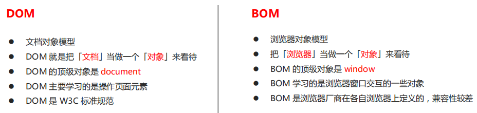
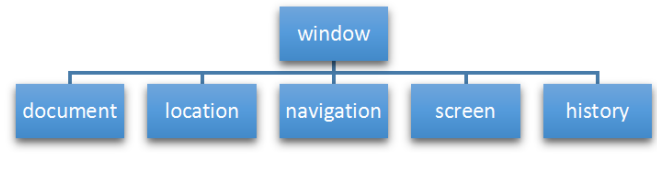
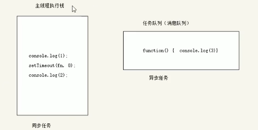
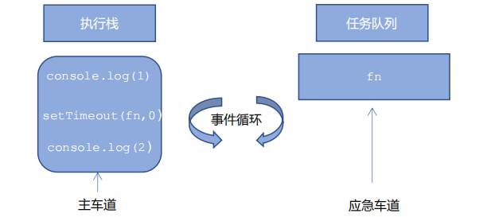
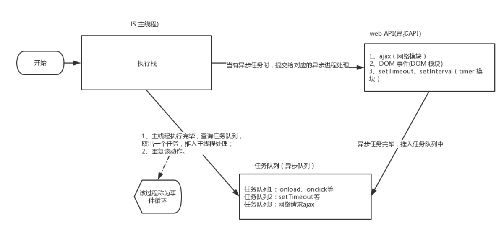
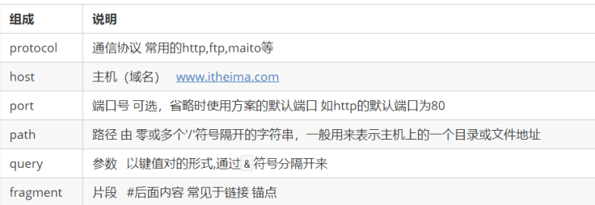
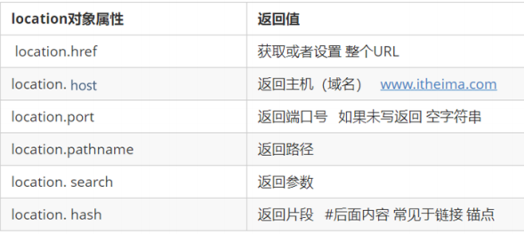
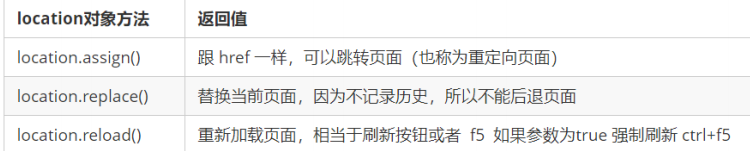

# BOM 

## 1. BOM 概述

### 1.1 什么是 BOM

BOM（Browser Object Model）即**浏览器对象模型**，它提供了独立于内容而与浏览器窗口进行交互的对象，其核心对象是 window。


### 1.2 BOM 的构成

BOM 比 DOM 更大，它包含 DOM。



window 对象是浏览器的顶级对象，它具有双重角色。
1. 它是 JS 访问浏览器窗口的一个接口。
2. 它是一个全局对象。定义在全局作用域中的变量、函数都会变成 window 对象的属性和方法。
在调用的时候可以省略 window，前面学习的对话框都属于 window 对象方法，如 alert()、prompt() 等。
注意：window下的一个特殊属性 window.name

## 2. window 对象的常见事件

### 2.1 窗口加载事件
**法一：**
`window.onload = function(){}`
`window.addEventListener("load",function(){});`
window.onload 是窗口 (页面）加载事件,当文档内容完全加载完成会触发该事件(包括图像、脚本文件、CSS
文件等), 就调用的处理函数。
注意：

1. 有了 window.onload 就可以把 JS 代码写到页面元素的上方，因为 onload 是等页面内容全部加载完毕，
再去执行处理函数。
2. window.onload 传统注册事件方式 只能写一次，如果有多个，会以最后一个 window.onload 为准。
3. 如果使用 addEventListener 则没有限制

**法二：**
`document.addEventListener('DOMContentLoaded',function(){})`


DOMContentLoaded 事件触发时，仅当DOM加载完成，不包括样式表，图片，flash等等。

```html
    <script>
        window.addEventListener('load', function() {
            var btn = document.querySelector('button');
            btn.addEventListener('click', function() {
                alert('点击我');
            })
        })
        window.addEventListener('load', function() {
            alert(22);
        })
        document.addEventListener('DOMContentLoaded', function() {
            alert(33);
        })
    </script>
```
### 2.2 调整窗口大小事件

`window.onresize = function(){}`
`window.addEventListener("resize",function(){});`

window.onresize 是调整窗口大小加载事件, 当触发时就调用的处理函数。
注意：
1. 只要窗口大小发生像素变化，就会触发这个事件。
2. 我们经常利用这个事件完成响应式布局。 window.innerWidth 当前屏幕的宽度


## 3. 定时器

### 3.1 setTimeout() 定时器

`window.setTimeout(调用函数, [延迟的毫秒数]);`


```js
        // 回调函数是一个匿名函数
         setTimeout(function() {
             console.log('时间到了');

         }, 2000);
        function callback() {
            console.log('爆炸了');
        }
		// 回调函数是一个有名函数
        var timer1 = setTimeout(callback, 3000);
        var timer2 = setTimeout(callback, 5000);
```

setTimeout() 这个调用函数我们也称为回调函数 callback

而这个函数，需要等待时间，时间到了才去调用这个函数，因此称为回调函数。

### 3.2 停止 setTimeout() 定时器
`window.clearTimeout(timeoutID)`

```html
    <button>点击停止定时器</button>
    <script>
        var btn = document.querySelector('button');
		// 开启定时器
        var timer = setTimeout(function() {
            console.log('爆炸了');
        }, 5000);
		// 给按钮注册单击事件
        btn.addEventListener('click', function() {
            // 停止定时器
            clearTimeout(timer);
        })
    </script>
```
### 3.3 setInterval() 定时器

`window.setInterval(回调函数, [间隔的毫秒数]);`

```js
        setInterval(function() {
            console.log('继续输出');
        }, 1000);
        // 2. setTimeout  延时时间到了，就去调用这个回调函数，只调用一次 就结束了这个定时器
        // 3. setInterval  每隔这个延时时间，就去调用这个回调函数，会调用很多次，重复调用这个函数
```

### 3.4 停止 setInterval() 定时器

`window.clearInterval(intervalID);`

```html
    <div class="begin">开始定时器</div>
    <div class="end">停止定时器</div>
    <script>
        var begin = document.querySelector('.begin');
        var end = document.querySelector('.end');
        var timer = null;
        begin.addEventListener('click', function() {
            timer = setInterval(function() {
                console.log('你好');
            }, 1000);
        });
        end.addEventListener('click', function() {
            clearInterval(timer);
        });
```

### 3.5 this

this的指向在函数定义的时候是确定不了的，只有函数执行的时候才能确定this到底指向谁，一般情况下this的最终指向的是那个调用它的对象

1. 全局作用域或者普通函数中this指向全局对象window（注意定时器里面的this指向window）
2. 方法调用中谁调用this指向谁
3. 构造函数中this指向构造函数的实例

```html
    <button>点击</button>
    <script>
        // this 指向问题 一般情况下this的最终指向的是那个调用它的对象
        // 1. 全局作用域或者普通函数中this指向全局对象window（ 注意定时器里面的this指向window）
        console.log(this);
        function fn() {
            console.log(this);
        }
        window.fn();
        window.setTimeout(function() {
            console.log(this);
        }, 1000);
        // 2. 方法调用中谁调用this指向谁
        var o = {
            sayHi: function() {
                console.log(this); // this指向的是 o 这个对象
            }
        }
        o.sayHi();
        var btn = document.querySelector('button');
        btn.addEventListener('click', function() {
                console.log(this); // 事件处理函数中的this指向的是btn这个按钮对象
            })
        // 3. 构造函数中this指向构造函数的实例
        function Fun() {
            console.log(this); // this 指向的是fun 实例对象
        }
        var fun = new Fun();
    </script>
```

## 4. JS 执行机制
### 4.1 JS 是单线程

JavaScript 语言的一大特点就是单线程，同一个时间只能做一件事

### 4.2 同步和异步

**同步任务**

同步任务都在主线程上执行，形成一个执行栈。

**异步任务**

JS 的异步是通过回调函数实现的。
一般而言，异步任务有以下三种类型:
1、普通事件，如 click、resize 等
2、资源加载，如 load、error 等
3、定时器，包括 setInterval、setTimeout 等
异步任务相关回调函数添加到任务队列中（任务队列也称为消息队列）。



### 4.3 JS 执行机制

1. 先执行执行栈中的同步任务。

2. 异步任务（回调函数）放入任务队列中。

3. 一旦执行栈中的所有同步任务执行完毕，系统就会按次序读取任务队列中的异步任务，于是被读取的异步任务结束等待状态，进入执行栈，开始执行。



4. 

5. 由于主线程不断的重复获得任务、执行任务、再获取任务、再执行，所以这种机制被称为**事件循环**（ event loop）。

## 5. location 对象
### 5.1 什么是 location 对象

window 对象给我们提供了一个 **location 属性用于获取或设置窗体的 URL，并且可以用于解析 URL**。
因为这个属性返回的是一个对象，所以我们将这个属性也称为 location 对象。

### 5.2 URL

统一资源定位符 (Uniform Resource Locator, URL) 是互联网上标准资源的地址。互联网上的每个文件都有
一个唯一的 URL，它包含的信息指出文件的位置以及浏览器应该怎么处理它。

`protocol://host[:port]/path/[?query]#fragment`
`http://www.itcast.cn/index.html?name=andy&age=18#link`


### 5.3 location 对象的属性

```html
   <button>点击</button>
    <script>
        var btn = document.querySelector('button');
        btn.addEventListener('click', function() {
            //console.log(location.href);
            location.href = 'http://www.baidu.com';
        })
    </script>
```


### 5.4 location 对象的方法

```html
    <button>点击</button>
    <script>
        var btn = document.querySelector('button');
        btn.addEventListener('click', function() {
            // 记录浏览历史，所以可以实现后退功能
            // location.assign('http://www.itcast.cn');
            // 不记录浏览历史，所以不可以实现后退功能
            // location.replace('http://www.itcast.cn');
            location.reload(true);
        })
    </script>
```

## 6. navigator 对象

navigator 对象包含有关浏览器的信息，它有很多属性，我们最常用的是 userAgent，该属性可以返回由客户机发送服务器的 user-agent 头部的值。

下面前端代码可以判断用户那个终端打开页面，实现跳转

```js
if((navigator.userAgent.match(/(phone|pad|pod|iPhone|iPod|ios|iPad|Android|Mobile|BlackBerry|IEMobile|MQQBrowser|JUC|Fennec|wOSBrowser|BrowserNG|WebOS|Symbian|Windows Phone)/i))) {
    window.location.href = "";     //手机
 } else {
    window.location.href = "";     //电脑
 }
```

## 7. history 对象

window 对象给我们提供了一个 history 对象，与浏览器历史记录进行交互。该对象包含用户（在浏览器窗口中）访问过的 URL。

| history对象方法 | 作用                          |
| --------------- | ----------------------------- |
| back()          | 后退                          |
| forward()       | 前进                          |
| go(参数)        | 前进后退功能。1前进1，-1后退1 |

