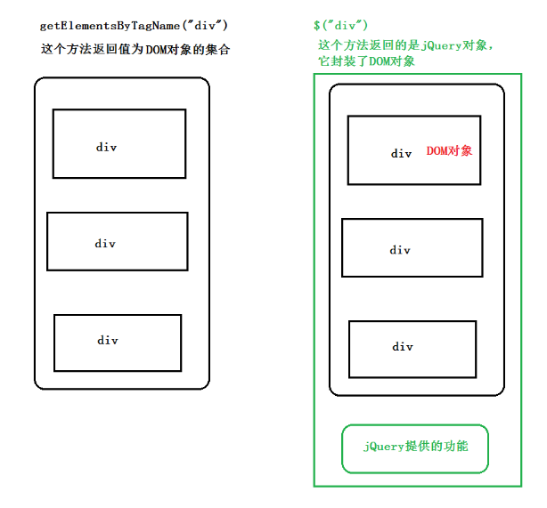

# jQuery 入门

## 1. jQuery 概述

### 1.1 JavaScript 库
仓库： 可以把很多东西放到这个仓库里面。找东西只需要到仓库里面查找到就可以了。
JavaScript库：即 library，是一个封装好的特定的集合（方法和函数）。从封装一大堆函数的角度理解库，就是在这个库中，封装了很多预先定义好的函数在里面，

常见的JavaScript 库
 jQuery
Prototype
YUI
Dojo
Ext JS
移动端的zepto
这些库都是对原生 JavaScript 的封装，内部都是用 JavaScript 实现的，我们主要学习的是 jQuery

### 1.2 jQuery 的概念
jQuery 是一个快速、简洁的 JavaScript 库，其设计的宗旨是“write Less，Do More”，即倡导写更少的代码，
做更多的事情。
j 就是 JavaScript； Query 查询； 意思就是查询js，把js中的DOM操作做了封装，我们可以快速的查询使用里
面的功能。
jQuery 封装了 JavaScript 常用的功能代码，优化了 DOM 操作、事件处理、动画设计和 Ajax 交互。
学习jQuery本质： 就是学习调用这些函数（方法）。
jQuery 出现的目的是加快前端人员的开发速度，我们可以非常方便的调用和使用它，从而提高开发效率


jQuery 是一个快速、简洁的 JavaScript 库，其设计的宗旨是“write Less，Do More”，即倡导写更少的代码，
做更多的事情。

## 2. jQuery 的基本使用
### 2.1 jQuery 的下载
官网地址： https://jquery.com/
各个版本的下载：https://code.jquery.com/

### 2.2 jQuery 的使用步骤
1. 引入 jQuery 文件
2. 使用即可

### 2.3 jQuery 的入口函数

```js
$(function () {
... // 此处是页面 DOM 加载完成的入口
}) ;
$(document).ready(function(){
... // 此处是页面DOM加载完成的入口
});
```
1. 等着 DOM 结构渲染完毕即可执行内部代码，不必等到所有外部资源加载完成，jQuery 帮我们完成了封装。
2. 相当于原生 js 中的 DOMContentLoaded。
3. 不同于原生 js 中的 load 事件是等页面文档、外部的 js 文件、css文件、图片加载完毕才执行内部代码。
4. 更推荐使用第一种方式。

### 2.4 jQuery 的顶级对象 $

1.$ 是 jQuery 的**别称**，在代码中可以使用 jQuery 代替 $，但一般为了方便，通常都直接使用 $ 。

2.$ 是jQuery 的**顶级对象**， 相当于原生JavaScript中的 window。把元素利用$包装成jQuery对象，就可以调用
jQuery 的方法

### 2.5 jQuery 对象和 DOM 对象

1. 用原生 JS 获取来的对象就是 DOM 对象
2. jQuery 方法获取的元素就是 jQuery 对象。
3. jQuery 对象本质是： 利用$对DOM 对象包装后产生的对象（伪数组形式存储）。


```html
    <div></div>
    <span></span>
    <script>
        // 1. DOM 对象：  用原生js获取过来的对象就是DOM对象
        var myDiv = document.querySelector('div'); // myDiv 是DOM对象
        var mySpan = document.querySelector('span'); // mySpan 是DOM对象
        console.dir(myDiv);
        // 2. jQuery对象： 用jquery方式获取过来的对象是jQuery对象。 本质：通过$把DOM元素进行了包装
        $('div'); // $('div')是一个jQuery 对象
        $('span'); // $('span')是一个jQuery 对象
        console.dir($('div'));
        // 3. jQuery 对象只能使用 jQuery 方法，DOM 对象则使用原生的 JavaScirpt 属性和方法
        // myDiv.style.display = 'none';
        // myDiv.hide(); myDiv是一个dom对象不能使用 jquery里面的hide方法
        // $('div').style.display = 'none'; 这个$('div')是一个jQuery对象不能使用原生js 的属性和方法
    </script>
```
>注意：
>只有 jQuery 对象才能使用 jQuery 方法，DOM 对象则使用原生的 JavaScirpt 方法。



### 2.6 jQuery 对象和 DOM 对象转换
DOM 对象与 jQuery 对象可以相互转换的。
因为原生js 比 jQuery 更大，原生的一些属性和方法 jQuery没有给我们封装. 要想使用这些属性和方法需要把
jQuery对象转换为DOM对象才能使用。

1. DOM 对象转换为 jQuery 对象： $(DOM对象)
```js
$('div')
```
2. jQuery 对象转换为 DOM 对象（两种方式）

```js
$('div') [index] index 是索引号
$('div') .get(index) index 是索引号
```
```js
// 1.DOM对象转换成jQuery对象，方法只有一种
var box = document.getElementById('box');  // 获取DOM对象
var jQueryObject = $(box);  // 把DOM对象转换为 jQuery 对象

// 2.jQuery 对象转换为 DOM 对象有两种方法：
//   2.1 jQuery对象[索引值]
var domObject1 = $('div')[0]

//   2.2 jQuery对象.get(索引值)
var domObject2 = $('div').get(0)
 
```