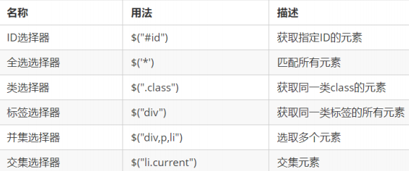
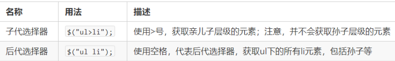
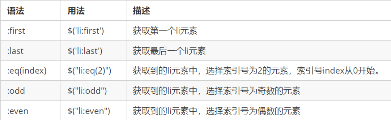
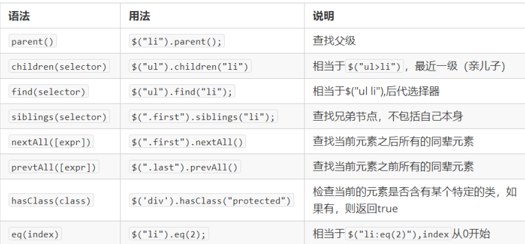
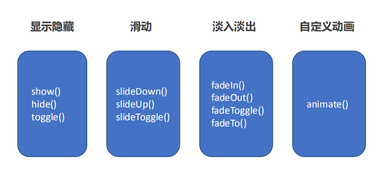
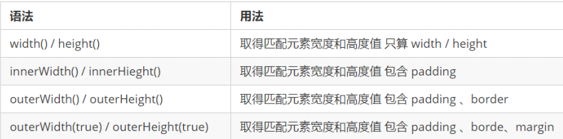

# jQuery 常用API

## 1. jQuery 选择器

### 1.1 jQuery 基础选择器
`$("选择器")   //  里面选择器直接写 CSS 选择器即可，但是要加引号`


### 1.2 jQuery 层级选择器


**jQuery 设置样式**
`$('div').css('属性', '值')`

### 1.3 隐式迭代（重要）

**遍历内部 DOM 元素**（伪数组形式存储）的过程就叫做**隐式迭代**。

```html
    <script>
        // 1. 获取四个div元素 
        console.log($("div"));
        // 2. 给四个div设置背景颜色为粉色 jquery对象不能使用style
        $("div").css("background", "pink");
        // 3. 隐式迭代就是把匹配的所有元素内部进行遍历循环，给每一个元素添加css这个方法
        $("ul li").css("color", "red");
    </script>
```
给匹配到的所有元素进行循环遍历，执行相应的方法，而不用我们再进行循环

### 1.4 jQuery 筛选选择器

```html
<script>
        $(function() {
            $("ul li:first").css("color", "red");
            $("ul li:eq(2)").css("color", "blue");
            $("ol li:odd").css("color", "skyblue");
            $("ol li:even").css("color", "pink");
        })
    </script>
```
### 1.5 jQuery 筛选方法（重点）


重点记住： parent() children() find() siblings() eq()

### 1.6 jQuery 里面的排他思想

想要多选一的效果，排他思想：当前元素设置样式，其余的兄弟元素清除样式。
```js
$(this).css(“color”,”red”);
$(this).siblings(). css(“color”,””);
```

### 1.5 链式编程

链式编程是为了节省代码量，看起来更优雅。
`$(this).css('color', 'red').sibling().css('color', '');`

## 2. jQuery 样式操作


### 2.1 操作 css 方法

1. 参数只写属性名，则是返回属性值
`$(this).css(''color'');`
2. 参数是属性名，属性值，逗号分隔，是设置一组样式，属性必须加引号，值如果是数字可以不用跟单位和引号
`$(this).css(''color'', ''red'');`
3. 参数可以是对象形式，方便设置多组样式。属性名和属性值用冒号隔开， 属性可以不用加引号，
`$(this).css({ "color":"white","font-size":"20px"})`

```html
<div></div>
    <script>
        // 操作样式之css方法
        $(function() {
            console.log($("div").css("width"));
            // $("div").css("width", "300px");
            // $("div").css("width", 300);
            // $("div").css(height, "300px"); 属性名一定要加引号
            $("div").css({
                width: 400,
                height: 400,
                backgroundColor: "red"
                    // 如果是复合属性则必须采取驼峰命名法，如果值不是数字，则需要加引号
            })
        })
    </script>
```
### 2.2 设置类样式方法
```html
   <div class="current"></div>
   <script>
    $(function() {
       // 1. 添加类 addClass()
        $("div").click(function() {
            $(this).addClass("current");
        });
       // 2. 删除类 removeClass()
        $("div").click(function() {
            $(this).removeClass("current");
        });
        // 3. 切换类 toggleClass()
        $("div").click(function() {
            $(this).toggleClass("current");
        });
    })
</script>
```
### 2.3 类操作与className区别

原生 JS 中 className 会覆盖元素原先里面的类名。
jQuery 里面类操作只是对指定类进行操作，不影响原先的类名。

## 3. jQuery 效果


### 3.1 显示隐藏效果

#### 1. 显示
`show([speed,[easing],[fn]])`

#### 2. 隐藏
`hide([speed,[easing],[fn]])`
#### 3. 切换
`toggle([speed,[easing],[fn]])`

```html
  <button>显示</button>
    <button>隐藏</button>
    <button>切换</button>
    <div></div>
    <script>
        $(function() {
            $("button").eq(0).click(function() {
                $("div").show(1000, function() {
                    alert(1);
                });
            })
            $("button").eq(1).click(function() {
                $("div").hide(1000, function() {
                    alert(1);
                });
            })
            $("button").eq(2).click(function() {
                    $("div").toggle(1000);
                })
                // 一般情况下，我们都不加参数直接显示隐藏就可以了
        });
    </script>
```


### 3.2 滑动效果
#### 1. 下滑效果
`slideDown([speed,[easing],[fn]])`


#### 2.上滑效果
`slideUp([speed,[easing],[fn]])`


#### 3. 滑动切换
`slideToggle([speed,[easing],[fn]])`
```html
 <button>下拉滑动</button>
    <button>上拉滑动</button>
    <button>切换滑动</button>
    <div></div>
    <script>
        $(function() {
            $("button").eq(0).click(function() {
                // 下滑动 slideDown()
                $("div").slideDown();
            })
            $("button").eq(1).click(function() {
                // 上滑动 slideUp()
                $("div").slideUp(500);
            })
            $("button").eq(2).click(function() {
                // 滑动切换 slideToggle()
                $("div").slideToggle(500);
            });
        });
    </script>
```

### 3.3 事件切换
`hover([over,]out)`
```html
  <script>
        $(function() {
            $(".nav>li").hover(function() {
                $(this).children("ul").slideToggle();
            });
        })
    </script>
```
### 3.4 动画队列及其停止排队方法
`stop()`
(1）stop() 方法用于停止动画或效果。
(2) 注意： stop() 写到动画或者效果的前面， 相当于停止结束上一次的动画
```html
<script>
            // 2. 事件切换 hover  如果只写一个函数，那么鼠标经过和鼠标离开都会触发这个函数
            $(".nav>li").hover(function() {
                // stop 方法必须写到动画的前面
                $(this).children("ul").stop().slideToggle();
            });
        })
    </script>
```
### 3.5 淡入淡出效果
#### 1. 淡入
`fadeIn([speed,[easing],[fn]])`
#### 2. 淡出
`fadeOut([speed,[easing],[fn]])`
#### 3. 淡入淡出切换
`fadeToggle([speed,[easing],[fn]])`
```html
<button>淡入效果</button>
    <button>淡出效果</button>
    <button>淡入淡出切换</button>
    <button>修改透明度</button>
    <div></div>
    <script>
        $(function() {
            $("button").eq(0).click(function() {
                // 淡入 fadeIn()
                $("div").fadeIn(1000);
            })
            $("button").eq(1).click(function() {
                // 淡出 fadeOut()
                $("div").fadeOut(1000);

            })
            $("button").eq(2).click(function() {
                // 淡入淡出切换 fadeToggle()
                $("div").fadeToggle(1000);

            });
            $("button").eq(3).click(function() {
                //  修改透明度 fadeTo() 这个速度和透明度要必须写
                $("div").fadeTo(1000, 0.5);
            });
        });
    </script>
```
#### 4. 渐进方式调整到指定的不透明度
`fadeTo([[speed],opacity,[easing],[fn]])`

### 3.6 自定义动画 animate

`animate(params,[speed],[easing],[fn])`

```html
  <button>动起来</button>
    <div></div>
    <script>
        $(function() {
            $("button").click(function() {
                $("div").animate({
                    left: 500,
                    top: 300,
                    opacity: .4,
                    width: 500
                }, 500);
            })
        })
    </script>
```

## 4. jQuery 属性操作

### 4.1 设置或获取元素固有属性值 prop()

 <a> 元素里面的 href ，<input> 元素里面的 type。
#### 1. 获取属性语法
`prop(''属性'')`

#### 2. 设置属性语法
`prop(''属性'', ''属性值'')`

### 4.2 设置或获取元素自定义属性值 attr()

用户自己给元素添加的属性，我们称为自定义属性。 div 添加 index =“1”。
#### 1. 获取属性语法
`attr(''属性'') // 类似原生 getAttribute()`

#### 2. 设置属性语法
`attr(''属性'', ''属性值'') // 类似原生 setAttribute()`

### 4.3 数据缓存 data()

data() 方法可以在指定的元素上存取数据，并不会修改 DOM 元素结构。一旦页面刷新，之前存放的数据都将被移除。
#### 1. 附加数据语法
`data(''name'',''value'') // 向被选元素附加数据`

#### 2. 获取数据语法
`date(''name'') // 向被选元素获取数据`

```html
    <a href="http://www.itcast.cn" title="都挺好">都挺好</a>
    <input type="checkbox" name="" id="" checked>
    <div index="1" data-index="2">我是div</div>
    <span>123</span>
    <script>
        $(function() {
            //1. element.prop("属性名") 获取元素固有的属性值
            console.log($("a").prop("href"));
            $("a").prop("title", "我们都挺好");
            $("input").change(function() {
                console.log($(this).prop("checked"));

            });
            // console.log($("div").prop("index"));
            // 2. 元素的自定义属性 我们通过 attr()
            console.log($("div").attr("index"));
            $("div").attr("index", 4);
            console.log($("div").attr("data-index"));
            // 3. 数据缓存 data() 这个里面的数据是存放在元素的内存里面
            $("span").data("uname", "andy");
            console.log($("span").data("uname"));
            // 这个方法获取data-index h5自定义属性 第一个 不用写data-  而且返回的是数字型
            console.log($("div").data("index"));
        })
    </script>
```
## 5. jQuery 文本属性值

主要针对元素的内容还有表单的值操作。
#### 1. 普通元素内容 html()（ 相当于原生inner HTML)
`html() // 获取元素的内容`
`html(''内容'') // 设置元素的内容`
#### 2. 普通元素文本内容 text() (相当与原生 innerText)
`text() // 获取元素的文本内容`
`text(''文本内容'') // 设置元素的文本内容`

#### 3. 表单的值 val()（ 相当于原生value)
`val() // 获取表单的值`
`val(''内容'') // 设置表单的值`

```html
 <div>
        <span>我是内容</span>
    </div>
    <input type="text" value="请输入内容">
    <script>
        // 1. 获取设置元素内容 html()
        console.log($("div").html());
        // $("div").html("123");
        // 2. 获取设置元素文本内容 text()
        console.log($("div").text());
        $("div").text("123");
        // 3. 获取设置表单值 val()
        console.log($("input").val());
        $("input").val("123");
    </script>
```
## 6. jQuery 元素操作
### 6.1 遍历元素
jQuery 隐式迭代是对同一类元素做了同样的操作。
如果想要给同一类元素做不同操作，就需要用到遍历。
语法1：
`$("div").each(function (index, domEle) { xxx; }）`

1.each() 方法**遍历匹配的每一个元素**。主要用**DOM处理**。
2.each 每一个里面的回调函数有2个参数： index 是每个元素的索引号; demEle 是每个DOM元素对象，不是jquery对象

3. 所以要想使用jquery方法，需要给这个dom元素转换为jquery对象 $(domEle)

语法2：
`$.each(object，function (index, element) { xxx; }）`
1. $.each()方法可用于遍历任何对象。**主要用于数据处理**，比如**数组，对象**
2. 里面的函数有2个参数： index 是每个元素的索引号; element 遍历内容
```html
   <div>1</div>
    <div>2</div>
    <div>3</div>
    <script>
        $(function() {
            // 如果针对于同一类元素做不同操作，需要用到遍历元素（类似for，但是比for强大）
            var sum = 0;
            // 1. each() 方法遍历元素 
            var arr = ["red", "green", "blue"];
            $("div").each(function(i, domEle) {
                // 回调函数第一个参数一定是索引号  可以自己指定索引号号名称
                console.log(index);
                console.log(i);
                // 回调函数第二个参数一定是 dom元素对象 也是自己命名
                console.log(domEle);
                domEle.css("color"); dom对象没有css方法
                $(domEle).css("color", arr[i]);
                sum += parseInt($(domEle).text());
            })
            console.log(sum);
            // 2. $.each() 方法遍历元素 主要用于遍历数据，处理数据
            $.each($("div"), function(i, ele) {
                console.log(i);
                console.log(ele);
            });
            $.each(arr, function(i, ele) {
                console.log(i);
                console.log(ele);
            })
            $.each({
                name: "andy",
                age: 18
            }, function(i, ele) {
                console.log(i); // 输出的是 name age 属性名
                console.log(ele); // 输出的是 andy  18 属性值
            })
        })
    </script>
```
### 6.2 创建元素
`$(''<li></li>'');`

### 6.3 添加元素
#### 1. 内部添加
`element.append(''内容'')`
把内容放入匹配元素内部最后面，类似原生 appendChild。
`element.prepend(''内容'')`
把内容放入匹配元素内部最前面

#### 2. 外部添加
`element.after(''内容'') // 把内容放入目标元素后面`
`element.before(''内容'') // 把内容放入目标元素前面`
① 内部添加元素，生成之后，它们是父子关系。
② 外部添加元素，生成之后，他们是兄弟关系。

### 6.4 删除元素

`element.remove() // 删除匹配的元素（本身）`
`element.empty() // 删除匹配的元素集合中所有的子节点`
`element.html('''') // 清空匹配的元素内容`
① remove 删除元素本身。
② empt() 和 html('''') 作用等价，都可以删除元素里面的内容，只不过 html 还可以设置内容。

```html
<ul>
        <li>原先的li</li>
    </ul>
    <div class="test">我是原先的div</div>
    <script>
        $(function() {
            // 1. 创建元素
            var li = $("<li>我是后来创建的li</li>");
            // 2. 添加元素

            // (1) 内部添加
            $("ul").append(li); // 内部添加并且放到内容的最后面 
            $("ul").prepend(li); // 内部添加并且放到内容的最前面

            // (2) 外部添加
            var div = $("<div>我是后妈生的</div>");
            /$(".test").after(div);
            $(".test").before(div);
            // 3. 删除元素
            $("ul").remove(); //可以删除匹配的元素 自杀
            $("ul").empty(); // 可以删除匹配的元素里面的子节点 孩子
            $("ul").html(""); // 可以删除匹配的元素里面的子节点 孩子
        })
    </script>
```
## 7. jQuery 尺寸、位置操作

### 7.1 jQuery 尺寸



```html
<div></div>
    <script>
        $(function() {
            // 1. width() / height() 获取设置元素 width和height大小 
            console.log($("div").width());
            // $("div").width(300);

            // 2. innerWidth() / innerHeight()  获取设置元素 width和height + padding 大小 
            console.log($("div").innerWidth());

            // 3. outerWidth()  / outerHeight()  获取设置元素 width和height + padding + border 大小 
            console.log($("div").outerWidth());

            // 4. outerWidth(true) / outerHeight(true) 获取设置 width和height + padding + border + margin
            console.log($("div").outerWidth(true));
        })
    </script>
```
### 7.2 jQuery 位置

#### 1. offset() 设置或获取元素偏移
① offset() 方法设置或返回被选元素相对于文档的偏移坐标，跟父级没有关系。
② 该方法有2个属性 left、top 。offset().top 用于获取距离文档顶部的距离，offset().left 用于获取距离文档左侧的距离。
③ 可以设置元素的偏移：offset({ top: 10, left: 30 });

#### 2. position() 获取元素偏移
① position() 方法用于返回被选元素相对于带有定位的父级偏移坐标，如果父级都没有定位，则以文档为准。
② 该方法有2个属性 left、top。position().top 用于获取距离定位父级顶部的距离，position().left 用于获取距离定
位父级左侧的距离。
③ 该方法只能获取
```html
<div class="father">
        <div class="son"></div>
    </div>
    <script>
        $(function() {
            // 1. 获取设置距离文档的位置（偏移） offset
            console.log($(".son").offset());
            console.log($(".son").offset().top);
            // $(".son").offset({
            //     top: 200,
            //     left: 200
            // });
            // 2. 获取距离带有定位父级位置（偏移） position   如果没有带有定位的父级，则以文档为准
            // 这个方法只能获取不能设置偏移
            console.log($(".son").position());
            // $(".son").position({
            //     top: 200,
            //     left: 200
            // });
        })
    </script>
```
#### 3. scrollTop()/scrollLeft() 设置或获取元素被卷去的头部和左侧
① scrollTop() 方法设置或返回被选元素被卷去的头部。
② 不跟参数是获取，参数为不带单位的数字则是设置被卷去的头部。
```html
<div class="back">返回顶部</div>
    <div class="container">
    </div>
    <script>
        $(function() {
            $(document).scrollTop(100);
            // 被卷去的头部 scrollTop()  / 被卷去的左侧 scrollLeft()
            // 页面滚动事件
            var boxTop = $(".container").offset().top;
            $(window).scroll(function() {
                // console.log(11);
                console.log($(document).scrollTop());
                if ($(document).scrollTop() >= boxTop) {
                    $(".back").fadeIn();
                } else {
                    $(".back").fadeOut();
                }
            });
            // 返回顶部
            $(".back").click(function() {
                // $(document).scrollTop(0);
                $("body, html").stop().animate({
                    scrollTop: 0
                });
                // $(document).stop().animate({
                //     scrollTop: 0
                // }); 不能是文档而是 html和body元素做动画
            })
        })
    </script>
```