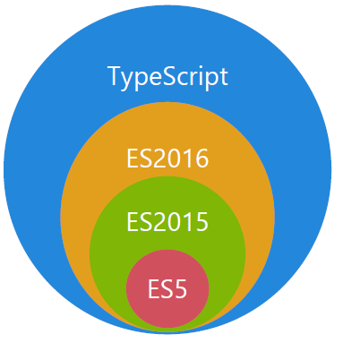
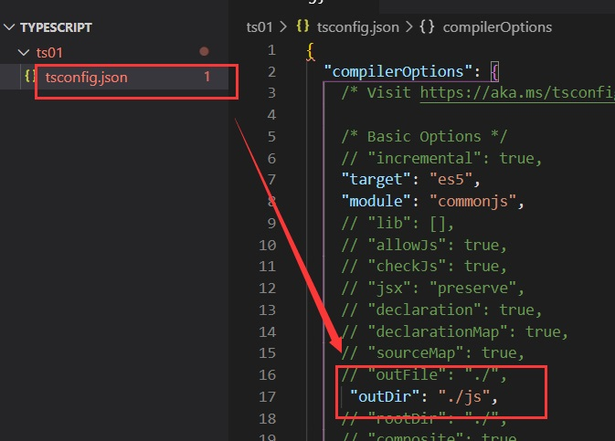
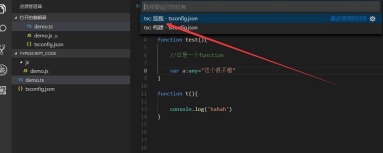

## 一、Typescript介绍 

## 1.Typescript介绍

1. TypeScript 是由微软开发的一款开源的编程语言。 

2. TypeScript 是 Javascript 的超集，遵循最新的 ES6、Es5 规范。TypeScript 扩展了 JavaScript 的语法。
3. TypeScript 更像后端 java、C#这样的面向对象语言，可以让 js 开发大型企业项目。 
4. 最新的 Vue 、React 也可以集成 TypeScript。 
5. Nodejs 框架 Nestjs、midway 中用的就是 TypeScript 语法



### TypeScript 与 JavaScript 的区别

|                   TypeScript                   |                 JavaScript                 |
| :--------------------------------------------: | :----------------------------------------: |
| JavaScript 的超集用于解决大型项目的代码复杂性  |      一种脚本语言，用于创建动态网页。      |
|          可以在编译期间发现并纠正错误          |  作为一种解释型语言，只能在运行时发现错误  |
|           强类型，支持静态和动态类型           |          弱类型，没有静态类型选项          |
| 最终被编译成 JavaScript 代码，使浏览器可以理解 |           可以直接在浏览器中使用           |
|              支持模块、泛型和接口              |           不支持模块，泛型或接口           |
|          支持 ES3，ES4，ES5 和 ES6 等          |  不支持编译其他 ES3，ES4，ES5 或 ES6 功能  |
|       社区的支持仍在增长，而且还不是很大       | 大量的社区支持以及大量文档和解决问题的支持 |

## 2.Typescript安装

在使用 npm 命令之前电脑必须得安装 nodejs 

**安装**

```
npm install -g typescript 

或者
cnpm install -g typescript 

或者
yarn global add typescript 
```

**运行：** 

```
tsc -v
```

**注意**：如果电脑上面没有安装过 cnpm，请先安装 cnpm 

```
npm install -g cnpm --registry=https://registry.npm.taobao.org 
```

**注意**：如果电脑上面没有安装过 yarn 请先安装 yarn: 

```
npm install -g yarn 

或者
cnpm install -g yarn 
```

## 3.Typescript开发工具，Vscode自动编译ts文件

线上测试[ TypeScript Playground](www.typescriptlang.org/play/)

1. 创建 tsconfig.json 文件 tsc --init 生成配置文件

```
tsc --init
```



2. 终端->运行任务->typescript->tsc:监视-tsconfig.json 然后就 

   可以自动生成代码了



## 二、TypeScript基础类型

## 1.布尔类型（boolean）

```ts
let isDone: boolean = false;

// ES5：
var isDone = false;
```

## 2. 数字类型（number）

```ts
let count: number = 10;

// ES5：
var count = 10;
```

## 3.字符串类型(string)

```ts
let name: string = "Semliker";

// ES5：
var name = 'lisa';
```

## 4.数组类型（array） 

```ts
// 1.第一种定义数组的方式
let list: number[] = [1, 2, 3];
// ES5：
var list = [1,2,3];

//2.第二种定义数组的方式 Array<number>泛型语法
let list: Array<number> = [1, 2, 3]; /
// ES5：
var list = [1,2,3];
```

## 5.元组类型（tuple）  属于数组的一种

```ts
//元祖类型
let arr:[number,string]=[123,'this is ts'];

//ES5
let arr = [123, 'this is ts'];
```

## 6.枚举类型（enum）

```
  enum 枚举名{ 
                标识符[=整型常数], 
                标识符[=整型常数], 
                ... 
                标识符[=整型常数], 
            } ;     
```

### 数字枚举

```ts
enum Direction {
  NORTH,
  SOUTH,
  EAST,
  WEST,
}

let dir: Direction = Direction.NORTH;

//ES5
var Direction;
(function (Direction) {
  Direction[(Direction["NORTH"] = 0)] = "NORTH";
  Direction[(Direction["SOUTH"] = 1)] = "SOUTH";
  Direction[(Direction["EAST"] = 2)] = "EAST";
  Direction[(Direction["WEST"] = 3)] = "WEST";
})(Direction || (Direction = {}));
var dir = Direction.NORTH;
```

默认情况下，NORTH 的初始值为 0，其余的成员会从 1 开始自动增长。换句话说，Direction.SOUTH 的值为 1，Direction.EAST 的值为 2，Direction.WEST 的值为 3。

当然我们也可以设置 NORTH 的初始值，比如：

```ts
enum Direction {
  NORTH = 3,
  SOUTH,
  EAST,
  WEST,
}
```

### 字符串枚举

在一个字符串枚举里，每个成员都必须用字符串字面量，或另外一个字符串枚举成员进行初始化。

```ts
enum Direction {
  NORTH = "NORTH",
  SOUTH = "SOUTH",
  EAST = "EAST",
  WEST = "WEST",
}
//ES5
var Direction;
(function (Direction) {
    Direction["NORTH"] = "NORTH";
    Direction["SOUTH"] = "SOUTH";
    Direction["EAST"] = "EAST";
    Direction["WEST"] = "WEST";
})(Direction || (Direction = {}));
```

### 异构枚举

异构枚举的成员值是数字和字符串的混合：

```ts
enum Enum {
  A,
  B,
  C = "C",
  D = "D",
  E = 8,
  F,
}

//Es5
var Enum;
(function (Enum) {
    Enum[Enum["A"] = 0] = "A";
    Enum[Enum["B"] = 1] = "B";
    Enum["C"] = "C";
    Enum["D"] = "D";
    Enum[Enum["E"] = 8] = "E";
    Enum[Enum["F"] = 9] = "F";
})(Enum || (Enum = {}));
```

通过观察上述生成的 ES5 代码，我们可以发现数字枚举相对字符串枚举多了 “反向映射”：

```ts
console.log(Enum.A) //输出：0
console.log(Enum[0]) // 输出：A
```

## 7.任意类型（any）

 任何类型都可以被归为 any 类型。这让 any 类型成为了类型系统的顶级类型（也被称作全局超级类型）。 

```ts
let notSure: any = 666;
notSure = "lisa";
notSure = false;

//ES5
let notSure = 666;
notSure = "lisa";
notSure = false;
```

```ts
//任意类型的用处
var oBox:any = document.getElementById('box');
oBox.style.color='red';
//ES5
var oBox = document.getElementById('box');
oBox.style.color = 'red';
```

## 8.Void 类型

void 类型像是与 any 类型相反，它表示没有任何类型。当一个函数没有返回值时，你通常会见到其返回值类型是 void：

```ts
// 声明函数返回值为void
function warnUser(): void {
  console.log("This is my warning message");
}

//ES5
function warnUser() {
  console.log("This is my warning message");
}
```

需要注意的是，声明一个 void 类型的变量没有什么作用，因为它的值只能为 `undefined` 或 `null`：

```tsx
let unusable: void = undefined;
```

## 9.Null 和 Undefined 类型

TypeScript 里，`undefined` 和 `null` 两者有各自的类型分别为 `undefined` 和 `null`。

```tsx
let u: undefined = undefined;
let n: null = null;
```

默认情况下 `null` 和 `undefined` 是所有类型的子类型。 就是说你可以把 `null` 和 `undefined` 赋值给 `number` 类型的变量。**然而，如果你指定了`--strictNullChecks` 标记，`null` 和 `undefined` 只能赋值给 `void` 和它们各自的类型。**

##  10.Never 类型

 `never` 类型表示的是那些永不存在的值的类型。 

```tsx
// 返回never的函数必须存在无法达到的终点
function error(message: string): never {
  throw new Error(message);
}

function infiniteLoop(): never {
  while (true) {}
}

"use strict";
// 返回never的函数必须存在无法达到的终点
function error(message) {
    throw new Error(message);
}
function infiniteLoop() {
    while (true) { }
}

```

可以利用 never 类型的特性来实现全面性检查，具体示例如下：

```tsx
type Foo = string | number;

function controlFlowAnalysisWithNever(foo: Foo) {
  if (typeof foo === "string") {
    // 这里 foo 被收窄为 string 类型
  } else if (typeof foo === "number") {
    // 这里 foo 被收窄为 number 类型
  } else {
    // foo 在这里是 never
    const check: never = foo;
  }
}

```

注意在 else 分支里面，我们把收窄为 never 的 foo 赋值给一个显示声明的 never 变量。如果一切逻辑正确，那么这里应该能够编译通过。但是假如后来有一天你的同事修改了 Foo 的类型：

```tsx
type Foo = string | number | boolean;
```

然而他忘记同时修改 `controlFlowAnalysisWithNever` 方法中的控制流程，这时候 else 分支的 foo 类型会被收窄为 `boolean` 类型，导致无法赋值给 never 类型，这时就会产生一个编译错误。通过这个方式，我们可以确保

`controlFlowAnalysisWithNever` 方法总是穷尽了 Foo 的所有可能类型。 通过这个示例，我们可以得出一个结论：**使用 never 避免出现新增了联合类型没有对应的实现，目的就是写出类型绝对安全的代码。**


## 参考链接

[ [深入理解 TypeScript](https://jkchao.github.io/typescript-book-chinese/) ](https://jkchao.github.io/typescript-book-chinese/#why)

 [semlinker/awesome-typescript 1.6K](https://github.com/semlinker/awesome-typescript) 

[1.2W字 | 了不起的 TypeScript 入门教程](https://juejin.im/post/5edd8ad8f265da76fc45362c#heading-67)

[TypeScript Handbook](https://zhongsp.gitbooks.io/typescript-handbook/content/)