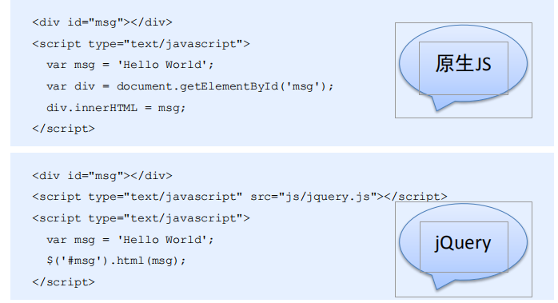
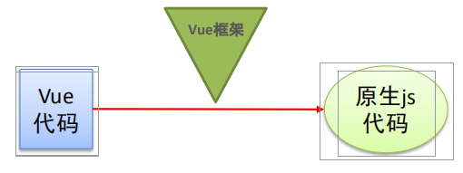
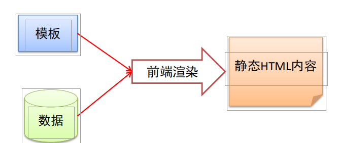
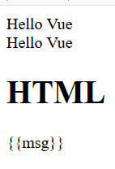
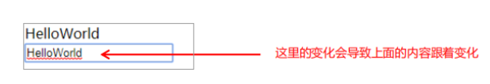
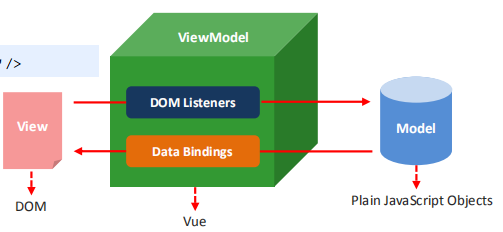
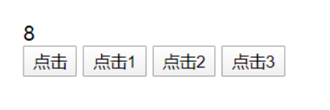

# 1.Vue基础

## 1. Vue概述

声明式渲染→组件系统→客户端路由→集中式状态管理→项目构建

## 2. Vue基本使用

### 2.1 传统开发模式对比



### 2.2 Vue.js之HelloWorld基本步骤
```html
 <div id="app">
        <div>{{msg}}</div>
        <div>{{1 + 2}}</div>
        <div>{{msg + '----' + 123}}</div>
    </div>
    <script type="text/javascript" src="js/vue.js"></script>
    <script type="text/javascript">
        /*
              Vue的基本使用步骤
              1、需要提供标签用于填充数据
              2、引入vue.js库文件
              3、可以使用vue的语法做功能了
              4、把vue提供的数据填充到标签里面
            */
        var vm = new Vue({
            el: '#app',
            data: {
                msg: 'Hello Vue'
            }
        });
    </script>

```
### 2.3 Vue.js之HelloWorld细节分析
#### 1. 实例参数分析
**el**： 元素的**挂载位置**（值可以是CSS选择器或者DOM元素）
**data**：模型数据（值是一个对象）
#### 2. 插值表达式用法
将数据填充到HTML标签中
插值表达式支持基本的计算操作

#### 3. Vue代码运行原理分析
概述编译过程的概念（Vue语法→原生语法）


## 3. Vue模板语法

### 3.1 模板语法概述

#### 1. 如何理解前端渲染？

把数据填充到HTML标签中


##### 2. 前端渲染方式
原生js拼接字符串
使用前端模板引擎
使用vue特有的模板语法

#### 3. 原生js拼接字符串
```js
var d = data.weather;
var info = document.getElementById('info');
info.innerHTML = '';
for(var i=0;i<d.length;i++){
var date = d[i].date;
var day = d[i].info.day;
var night = d[i].info.night;
var tag = '';
tag += '<span>日期：'+date+'</sapn><ul>';
tag += '<li>白天天气：'+day[1]+'</li>'
tag += '<li>白天温度：'+day[2]+'</li>'
tag += '<li>白天风向：'+day[3]+'</li>'
tag += '<li>白天风速：'+day[4]+'</li>'
tag += '</ul>';
var div = document.createElement('div');
div.innerHTML = tag;
info.appendChild(div);
}
```

#### 4. 使用前端模板引擎

```html
<script id="abc" type="text/html">
{{if isAdmin}}
<h1>{{title}}</h1>
<ul>
{{each list as value i}}
<li>索引 {{i + 1}} ：{{value}}</li>
{{/each}}
</ul>
{{/if}}
</script>
```
### 3.2 指令

#### 1. 什么是指令？

什么是自定义属性
指令的本质就是自定义属性
指令的格式：以v-开始（比如：v-cloak）
#### 2. v-cloak指令用法

插值表达式存在的问题：“闪动”
```html
 <div id="app">
    <div v-cloak>{{msg}}</div>
  </div>
  <script type="text/javascript" src="js/vue.js"></script>
  <script type="text/javascript">
    /*
      v-cloak指令的用法
      1、提供样式
        [v-cloak]{
          display: none;
        }
      2、在插值表达式所在的标签中添加v-cloak指令

      背后的原理：先通过样式隐藏内容，然后在内存中进行值的替换，替换好之后再显示最终的结果
    */
    var vm = new Vue({
      el: '#app',
      data: {
        msg: 'Hello Vue'
      }
    });
```

#### 3. 数据绑定指令

**v-text 填充纯文本**
相比插值表达式更加简洁
**v-html 填充HTML片段**
存在安全问题
本网站内部数据可以使用，来自第三方的数据不可以用
**v-pre 填充原始信息**
显示原始信息，跳过编译过程（分析编译过程）
```html
  <div id="app">
    <div>{{msg}}</div>
    <div v-text='msg'></div>
    <div v-html='msg1'></div>
    <div v-pre>{{msg}}</div>
  </div>
  <script type="text/javascript" src="js/vue.js"></script>
  <script type="text/javascript">
    /*
      1、v-text指令用于将数据填充到标签中，作用于插值表达式类似，但是没有闪动问题
      2、v-html指令用于将HTML片段填充到标签中，但是可能有安全问题
      3、v-pre用于显示原始信息
    */
    var vm = new Vue({
      el: '#app',
      data: {
        msg: 'Hello Vue',
        msg1: '<h1>HTML</h1>'
      }
    });
  </script>
```


#### 4. 数据响应式

html5中的响应式（屏幕尺寸的变化导致样式的变化）
数据的响应式（数据的变化导致页面内容的变化）
什么是数据绑定
数据绑定：将数据填充到标签中
**v-once 只编译一次**
显示内容之后不再具有响应式功能
```html
  <div id="app">
    <div>{{msg}}</div>
    <div v-once>{{info}}</div>
  </div>
  <script type="text/javascript" src="js/vue.js"></script>
  <script type="text/javascript">
    /*
      v-once的应用场景：如果显示的信息后续不需要再修改，你们可以使用v-once，这样可以提高性能。
    */
    var vm = new Vue({
      el: '#app',
      data: {
        msg: 'Hello Vue',
        info: 'nihao'
      }
    });
  </script>
```

### 3.3 双向数据绑定指令

#### 1. 什么是双向数据绑定？

#### 2. 双向数据绑定分析

**v-model指令用法**

`<input type='text' v-model='uname'/>`
```html
 <div id="app">
      <div>{{msg}}</div>
      <div>
        <input type="text" v-model='msg'>
      </div>
    </div>
    <script type="text/javascript" src="js/vue.js"></script>
    <script type="text/javascript">
      /*
        双向数据绑定
        1、从页面到数据
        2、从数据到页面
      */
      var vm = new Vue({
        el: '#app',
        data: {
          msg: 'Hello Vue'
        }
      });
    </script>
```


#### 3. MVVM设计思想

①M(model)
②V(view)
③VM(View-Model)


### 3.4 事件绑定

#### 1. Vue如何处理事件？
**v-on指令用法**
`<input type=‘button' v-on:click='num++'/>`
**v-on简写形式**
`<input type=‘button' @click='num++'/>`

#### 2. 事件函数的调用方式
**直接绑定函数名称**
`<button v-on:click='say'>Hello</button>`
**调用函数**
`<button v-on:click='say()'>Say hi</button>`
```html
<div id="app">
        <div>{{num}}</div>
        <div>
            <button v-on:click='num++'>点击</button>
            <button @click='num++'>点击1</button>
            <button @click='handle'>点击2</button>
            <button @click='handle()'>点击3</button>
        </div>
    </div>
    <script type="text/javascript" src="js/vue.js"></script>
    <script type="text/javascript">
        var vm = new Vue({
            el: '#app',
            data: {
                num: 0
            }, // 注意点： 这里不要忘记加逗号 
            // methods  中 主要是定义一些函数
            methods: {
                handle: function() {
                    // 这里的this是Vue的实例对象+
                    console.log(this === vm)
                        //   在函数中 想要使用data里面的数据 一定要加this 
                    this.num++;
                }
            }
        });
    </script>
```


#### 3. 事件函数参数传递
**普通参数和事件对象**
`<button v-on:click='say("hi",$event)'>Say hi</button>`

```html
   <div id="app">
        <div>{{num}}</div>
        <div>
            <!-- 如果事件直接绑定函数名称，那么默认会传递事件对象作为事件函数的第一个参数 -->
            <button v-on:click='handle1'>点击1</button>
            <!-- 2、如果事件绑定函数调用，那么事件对象必须作为最后一个参数显示传递，
                 并且事件对象的名称必须是$event 
            -->
            <button v-on:click='handle2(123, 456, $event)'>点击2</button>
        </div>
    </div>
    <script type="text/javascript" src="js/vue.js"></script>
    <script type="text/javascript">
        var vm = new Vue({
            el: '#app',
            data: {
                num: 0
            },
            methods: {
                handle1: function(event) {
                    console.log(event.target.innerHTML)
                },
                handle2: function(p, p1, event) {
                    console.log(p, p1)
                    console.log(event.target.innerHTML)
                    this.num++;
                }
            }
        });
    </script>
```
#### 4. 事件修饰符
**.stop 阻止冒泡**
`<a v-on:click.stop="handle">跳转</a>`
**.prevent 阻止默认行为**
`<a v-on:click.prevent="handle">跳转</a>`
```html
<div id="app">
    <div>{{num}}</div>
    <div v-on:click='handle0'>
      <button v-on:click.stop='handle1'>点击1</button>
    </div>
    <div>
      <a href="http://www.baidu.com" v-on:click.prevent='handle2'>百度</a>
    </div>
  </div>
  <script type="text/javascript" src="js/vue.js"></script>
  <script type="text/javascript">
    /*
      事件绑定-事件修饰符
    */
    var vm = new Vue({
      el: '#app',
      data: {
        num: 0
      },
      methods: {
        handle0: function(){
          this.num++;
        },
        handle1: function(event){
          // 阻止冒泡
          // event.stopPropagation();
        },
        handle2: function(event){
          // 阻止默认行为
          // event.preventDefault();
        }
      }
    });
  </script>
```
#### 5. 按键修饰符
**.enter 回车键**
`<input v-on:keyup.enter='submit'>`
**.esc 退出键**
`<input v-on:keyup.delete='handle'>`
```html
  <div id="app">
    <form action="">
      <div>
        用户名：
        <input type="text" v-on:keyup.delete='clearContent' v-model='uname'>
      </div>
      <div>
        密码：
        <input type="text" v-on:keyup.f1='handleSubmit' v-model='pwd'>
      </div>
      <div>
        <input type="button" v-on:click='handleSubmit' value="提交">
      </div>
    </form>
  </div>
  <script type="text/javascript" src="js/vue.js"></script>
  <script type="text/javascript">
    /*
      事件绑定-按键修饰符
    */
    Vue.config.keyCodes.f1 = 113
    var vm = new Vue({
      el: '#app',
      data: {
        uname: '',
        pwd: '',
        age: 0
      },
      methods: {
        clearContent:function(){
          // 按delete键的时候，清空用户名
          this.uname = '';
        },
        handleSubmit: function(){
          console.log(this.uname,this.pwd)
        }
      }
    });
  </script>
```

#### 6. 自定义按键修饰符
**全局 config.keyCodes 对象**
`Vue.config.keyCodes.f1 = 112`
```html
<div id="app">
    <input type="text" v-on:keyup.aaa='handle' v-model='info'>
  </div>
  <script type="text/javascript" src="js/vue.js"></script>
  <script type="text/javascript">
    /*
      事件绑定-自定义按键修饰符
      规则：自定义按键修饰符名字是自定义的，但是对应的值必须是按键对应event.keyCode值
    */
    Vue.config.keyCodes.aaa = 65
    var vm = new Vue({
      el: '#app',
      data: {
        info: ''
      },
      methods: {
        handle: function(event){
          console.log(event.keyCode)
        }
      }
    });
  </script>
```
### 3.5 属性绑定

#### 1. Vue如何动态处理属性？
**v-bind指令用法**
`<a v-bind:href='url'>跳转</a>`
**缩写形式**
`<a :href='url'>跳转</a>`
```html
  <div id="app">
    <a v-bind:href="url">百度</a>
    <a :href="url">百度1</a>
    <button v-on:click='handle'>切换</button>
  </div>
  <script type="text/javascript" src="js/vue.js"></script>
  <script type="text/javascript">
    /*
      属性绑定
    */
    var vm = new Vue({
      el: '#app',
      data: {
        url: 'http://www.baidu.com'
      },
      methods: {
        handle: function(){
          // 修改URL地址
          this.url = 'http://itcast.cn';
        }
      }
    });
  </script>
```
#### 2. v-model的低层实现原理分析
`<input v-bind:value="msg" v-on:input="msg=$event.target.value">`
```html
<div id="app">
    <div>{{msg}}</div>
    <input type="text" v-bind:value="msg" v-on:input='handle'>
    <input type="text" v-bind:value="msg" v-on:input='msg=$event.target.value'>
    <input type="text" v-model='msg'>
  </div>
  <script type="text/javascript" src="js/vue.js"></script>
  <script type="text/javascript">
    /*
      v-model指令的本质

    */
    var vm = new Vue({
      el: '#app',
      data: {
        msg: 'hello'
      },
      methods: {
        handle: function(event){
          // 使用输入域中的最新的数据覆盖原来的数据
          this.msg = event.target.value;
        }
      }
    });
  </script>
```
### 3.6 样式绑定

#### 1. class样式处理
**对象语法**
`<div v-bind:class="{ active: isActive }"></div>`

```html
<div id="app">
    <div v-bind:class="{active: isActive,error: isError}">
      测试样式
    </div>
    <button v-on:click='handle'>切换</button>
  </div>
  <script type="text/javascript" src="js/vue.js"></script>
  <script type="text/javascript">
    /*
      样式绑定

    */
    var vm = new Vue({
      el: '#app',
      data: {
        isActive: true,
        isError: true
      },
      methods: {
        handle: function(){
          // 控制isActive的值在true和false之间进行切换
          this.isActive = !this.isActive;
          this.isError = !this.isError;
        }
      }
    });
  </script>
```

**数组语法**
`<div v-bind:class="[activeClass, errorClass]"></div>`

```html
<div id="app">
    <div v-bind:class='[activeClass, errorClass]'>测试样式</div>
    <button v-on:click='handle'>切换</button>
  </div>
  <script type="text/javascript" src="js/vue.js"></script>
  <script type="text/javascript">
    /*
      样式绑定

    */
    var vm = new Vue({
      el: '#app',
      data: {
        activeClass: 'active',
        errorClass: 'error'
      },
      methods: {
        handle: function(){
          this.activeClass = '';
          this.errorClass = '';
        }
      }
    });
  </script>
```
**class绑定3个细节用法**
```html
 <div id="app">
    <div v-bind:class='[activeClass, errorClass, {test: isTest}]'>测试样式</div>
    <div v-bind:class='arrClasses'></div>
    <div v-bind:class='objClasses'></div>
    <div class="base" v-bind:class='objClasses'></div>

    <button v-on:click='handle'>切换</button>
  </div>
  <script type="text/javascript" src="js/vue.js"></script>
  <script type="text/javascript">
    /*
      样式绑定相关语法细节：
      1、对象绑定和数组绑定可以结合使用
      2、class绑定的值可以简化操作
      3、默认的class如何处理？默认的class会保留
      
    */
    var vm = new Vue({
      el: '#app',
      data: {
        activeClass: 'active',
        errorClass: 'error',
        isTest: true,
        arrClasses: ['active','error'],
        objClasses: {
          active: true,
          error: true
        }
      },
      methods: {
        handle: function(){
          // this.isTest = false;
          this.objClasses.error = false;
        }
      }
    });
  </script>
```
#### 2. style样式处理
**对象语法**
`<div v-bind:style="{ color: activeColor, fontSize: fontSize }"></div>`
**数组语法**
`<div v-bind:style="[baseStyles, overridingStyles]"></div>`

```html
 <div id="app">
    <div v-bind:style='{border: borderStyle, width: widthStyle, height: heightStyle}'></div>
    <div v-bind:style='objStyles'></div>
    <div v-bind:style='[objStyles, overrideStyles]'></div>
    <button v-on:click='handle'>切换</button>
  </div>
  <script type="text/javascript" src="js/vue.js"></script>
  <script type="text/javascript">
    /*
      样式绑定之内联样式Style：
      
    */
    var vm = new Vue({
      el: '#app',
      data: {
        borderStyle: '1px solid blue',
        widthStyle: '100px',
        heightStyle: '200px',
        objStyles: {
          border: '1px solid green',
          width: '200px',
          height: '100px'
        },
        overrideStyles: {
          border: '5px solid orange',
          backgroundColor: 'blue'
        }
      },
      methods: {
        handle: function(){
          this.heightStyle = '100px';
          this.objStyles.width = '100px';
        }
      }
    });
  </script>
```

### 3.7 分支循环结构


#### 1. 分支结构
`v-if
v-else
v-else-if
v-show`

```html
  <div id="app">
    <div v-if='score>=90'>优秀</div>
    <div v-else-if='score<90&&score>=80'>良好</div>
    <div v-else-if='score<80&&score>60'>一般</div>
    <div v-else>比较差</div>
    <div v-show='flag'>测试v-show</div>
    <button v-on:click='handle'>点击</button>
  </div>
  <script type="text/javascript" src="js/vue.js"></script>
  <script type="text/javascript">
    /*
      分支结构

      v-show的原理：控制元素样式是否显示 display:none
    */
    var vm = new Vue({
      el: '#app',
      data: {
        score: 10,
        flag: false
      },
      methods: {
        handle: function(){
          this.flag = !this.flag;
        }
      }
    });
  </script>
```
#### 2. v-if与v-show的区别
v-if控制元素是否渲染到页面
v-show控制元素是否显示（已经渲染到了页面）

#### 3. 循环结构
**v-for遍历数组**

`<li v-for='item in list'>{{item}}</li>`
`<li v-for='(item,index) in list'>{{item}} + '---' +{{index}}</li>`
key的作用：**帮助Vue区分不同的元素，从而提高性能**
`<li :key='item.id' v-for='(item,index) in list'>{{item}} + '---' {{index}}</li>`

```html
<div id="app">
    <div>水果列表</div>
    <ul>
      <li v-for='item in fruits'>{{item}}</li>
      <li v-for='(item, index) in fruits'>{{item + '---' + index}}</li>
      <li :key='item.id' v-for='(item, index) in myFruits'>
        <span>{{item.ename}}</span>
        <span>-----</span>
        <span>{{item.cname}}</span>
      </li>

    </ul>
  </div>
  <script type="text/javascript" src="js/vue.js"></script>
  <script type="text/javascript">
    /*
      循环结构-遍历数组
    */
    var vm = new Vue({
      el: '#app',
      data: {
        fruits: ['apple', 'orange', 'banana'],
        myFruits: [{
          id: 1,
          ename: 'apple',
          cname: '苹果'
        },{
          id: 2,
          ename: 'orange',
          cname: '橘子'
        },{
          id: 3,
          ename: 'banana',
          cname: '香蕉'
        }]
      }
    });
  </script>

```
#### 4. 循环结构
**v-for遍历对象**
`<div v-for='(value, key, index) in object'></div>`
**v-if和v-for结合使用**
`<div v-if='value==12' v-for='(value, key, index) in object'></div>`


```html
<div id="app">
    <div v-if='v==13' v-for='(v,k,i) in obj'>{{v + '---' + k + '---' + i}}</div>
  </div>
  <script type="text/javascript" src="js/vue.js"></script>
  <script type="text/javascript">
    // 使用原生js遍历对象
    var obj = {
      uname: 'lisi',
      age: 12,
      gender: 'male'
    }
    for(var key in obj) {
      console.log(key, obj[key])
    }
    /*
      循环结构
    */
    var vm = new Vue({
      el: '#app',
      data: {
        obj: {
          uname: 'zhangsan',
          age: 13,
          gender: 'female'
        }
      }
    });
  </script>
```