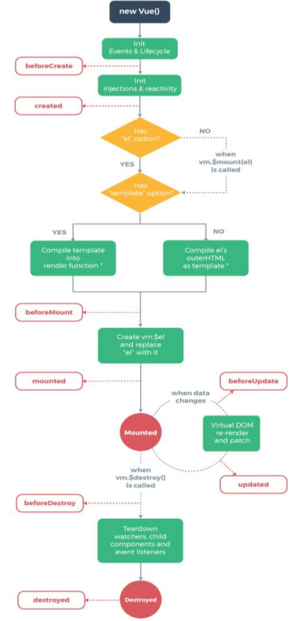

# 2.Vue常用特性

## 1.表单操作

### 1.1基于Vue的表单操作

- Input 单行文本
- textarea 多行文本
- select 下拉多选
- radio 单选框
- checkbox 多选框

```html
<style type="text/css">
  
  form div {
    height: 40px;
    line-height: 40px;
  }
  form div:nth-child(4) {
    height: auto;
  }
  form div span:first-child {
    display: inline-block;
    width: 100px;
  }
  </style>
<div id="app">
    <form action="http://itcast.cn">
      <div>
        <span>姓名：</span>
        <span>
          <input type="text" v-model='uname'>
        </span>
      </div>
      <div>
        <span>性别：</span>
        <span>
          <input type="radio" id="male" value="1" v-model='gender'>
          <label for="male">男</label>
          <input type="radio" id="female" value="2" v-model='gender'>
          <label for="female">女</label>
        </span>
      </div>
      <div>
        <span>爱好：</span>
        <input type="checkbox" id="ball" value="1" v-model='hobby'>
        <label for="ball">篮球</label>
        <input type="checkbox" id="sing" value="2" v-model='hobby'>
        <label for="sing">唱歌</label>
        <input type="checkbox" id="code" value="3" v-model='hobby'>
        <label for="code">写代码</label>
      </div>
      <div>
        <span>职业：</span>
        <select v-model='occupation' multiple>
          <option value="0">请选择职业...</option>
          <option value="1">教师</option>
          <option value="2">软件工程师</option>
          <option value="3">律师</option>
        </select>
      </div>
      <div>
        <span>个人简介：</span>
        <textarea v-model='desc'></textarea>
      </div>
      <div>
        <input type="submit" value="提交" @click.prevent='handle'>
      </div>
    </form>
  </div>
  <script type="text/javascript" src="js/vue.js"></script>
  <script type="text/javascript">
    /*
      表单基本操作
    */
    var vm = new Vue({
      el: '#app',
      data: {
        uname: 'lisi',
        gender: 2,
        hobby: ['2','3'],
        // occupation: 3
        occupation: ['2','3'],
        desc: 'nihao'
      },
      methods: {
        handle: function(){
          // console.log(this.uname)
          // console.log(this.gender)
          // console.log(this.hobby.toString())
          // console.log(this.occupation)
          console.log(this.desc)

        }
      }
    });
  </script>
```

### 1.2 表单域修饰符

number：转化为数值
trim：去掉开始和结尾的空格
lazy : 将input事件切换为change事件

```html
   <input type="text" v-model.number='age'>
    <input type="text" v-model.trim='info'>
    <input type="text" v-model.lazy='msg'>
```

## 2.自定义指令

### 2.1 自定义指令的语法规则（获取元素焦点）

```html
  <div id="app">
    <input type="text" v-focus>
  </div>

  <script>
    /*
      自定义指令
    */
    Vue.directive('focus', {
      inserted: function(el){
        // el表示指令所绑定的元素
        el.focus();
      }
    });
  </script>
```

### 2.2带参数的自定义指令（改变元素背景色）

```js
<div id="app">
    <input type="text" v-color='msg'>
  </div>

  <script >
    /*
      自定义指令-带参数
    */
    Vue.directive('color', {
      bind: function(el, binding){
        // 根据指令的参数设置背景色
        el.style.backgroundColor = binding.value.color;
      }
    });

  </script>
```

###  2.3局部指令

```js
<div id="app">
    <input type="text" v-color='msg'>
  </div>

  <script >
    /*
      自定义指令-局部指令
    */
    var vm = new Vue({
      el: '#app',
      data: {
        msg: {
          color: 'red'
        }
      },
      directives: {
        color: {
          bind: function(el, binding){
            el.style.backgroundColor = binding.value.color;
          }
        },
        focus: {
          inserted: function(el) {
            el.focus();
          }
        }
      }
    });
  </script>
```

## 3.计算属性

### 3.1计算属性的用法

```html
<div id="app">
    <div>{{msg}}</div>
    <div>{{reverseString}}</div>
  </div>

  <script >
    var vm = new Vue({
      el: '#app',
      data: {
        msg: 'Nihao'
      },
      //计算属性
      computed: {
        reverseString: function(){
          return this.msg.split('').reverse().join('');
        }
      }
    });
  </script>
```

###  3.2计算属性与方法的区别

```html
<div id="app">
    <div>{{reverseString}}</div>
    <div>{{reverseString}}</div>
    <div>{{reverseMessage()}}</div>
    <div>{{reverseMessage()}}</div>
  </div>

  <script>
    /*
      计算属性与方法的区别:计算属性是基于依赖进行缓存的，而方法不缓存
      
1.计算属性是基于它们的依赖进行缓存的
2.方法不存在缓存

    */
    var vm = new Vue({
      el: '#app',
      data: {
        msg: 'Nihao',
        num: 100
      },
      methods: {
        reverseMessage: function(){
          console.log('methods')
          return this.msg.split('').reverse().join('');
        }
      },
      //计算属性
      computed: {
        reverseString: function(){
          console.log('computed')
          // return this.msg.split('').reverse().join('');
          var total = 0;
          for(var i=0;i<=this.num;i++){
            total += i;
          }
          return total;
        }
      }
    });
  </script>
```

## 4.侦听器

数据变化时执行异步或开销较大的操作

```js
 <div id="app">
    <div>
      <span>名：</span>
      <span>
        <input type="text" v-model='firstName'>
      </span>
    </div>
    <div>
      <span>姓：</span>
      <span>
        <input type="text" v-model='lastName'>
      </span>
    </div>
    <div>{{fullName}}</div>
  </div>

  <script type="text/javascript">

    var vm = new Vue({
      el: '#app',
      data: {
        firstName: 'Jim',
        lastName: 'Green',
        // fullName: 'Jim Green'
      },
      //计算属性方式也可实现
      computed: {
        fullName: function(){
          return this.firstName + ' ' + this.lastName;
        }
      },
      //侦听器
      watch: {
        firstName: function(val) {
           this.fullName = val + ' ' + this.lastName;
        },
         lastName: function(val) {
          this.fullName = this.firstName + ' ' + val;
         }
      }
    });
  </script>
```

## 5.过滤器

### 1.过滤器的作用是什么？

格式化数据，比如将字符串格式化为首字母大写，将日期格式化为指定的格式等

### 2.自定义过滤器

```js
Vue.filter(‘过滤器名称’, function(value){
// 过滤器业务逻辑
})
```

### 3.过滤器的使用

```js
<div>{{msg | upper}}</div>
<div>{{msg | upper | lower}}</div>
<div v-bind:id=“id | formatId"></div>
```

### 4.局部过滤器

```html
<div id="app">
    <input type="text" v-model='msg'>
    <div>{{msg | upper}}</div>
    <div>{{msg | upper | lower}}</div>
    <div :abc='msg | upper'>测试数据</div>
  </div>

  <script>
    // Vue.filter('upper', function(val) {
    //   return val.charAt(0).toUpperCase() + val.slice(1);
    // });
    Vue.filter('lower', function(val) {
      return val.charAt(0).toLowerCase() + val.slice(1);
    });
    var vm = new Vue({
      el: '#app',
      data: {
        msg: ''
      },
      //过滤器
      filters: {
        upper: function(val) {
          return val.charAt(0).toUpperCase() + val.slice(1);
        }
      }
    });
  </script>
```

### 5.带参数的过滤器

### 6.过滤器的使用

```html
<div id="app">
        <div>{{date | format('yyyy-MM-dd hh:mm:ss')}}</div>
    </div>
    <script src="js/vue.js"></script>
    <script>
        Vue.filter('format', function(value, arg) {
            if (arg == 'yyyy-MM-dd') {
                var ret = '';
                ret += value.getFullYear() + '-' + (value.getMonth() + 1) + '-' + value.getDate();
                return ret;
            }
            return value;
        })
        var vm = new Vue({
            el: '#app',
            data: {
                date: new Date()
            }
        })
    </script>
```

## 6.生命周期

### 1.主要阶段

##### 挂载（初始化相关属性）

beforeCreate
created
beforeMount
mounted

##### 更新（元素或组件的变更操作）

beforeUpdate
updated

##### 销毁（销毁相关属性）

beforeDestroy
destroyed



### 2.Vue实例的产生过程

1. beforeCreate 在实例初始化之后，数据观测和事件配置之前被调用。
2. created 在实例创建完成后被立即调用。
3. beforeMount 在挂载开始之前被调用。
4. mounted el被新创建的vm.$el替换，并挂载到实例上去之后调用该钩子。
5. beforeUpdate 数据更新时调用，发生在虚拟DOM打补丁之前。
6. updated 由于数据更改导致的虚拟DOM重新渲染和打补丁，在这之后会调用该钩子。
7. beforeDestroy 实例销毁之前调用。
8. destroyed 实例销毁后调用。

1.**变异方法**(修改原有数据)
push()
pop()
shift()
unshift()
splice()
sort()
reverse()

2.**替换数组**(生成新的数组)
filter()
concat()
slice()

3.**修改响应式数据**

Vue.set(vm.items, indexOfItem, newValue)
vm.$set(vm.items, indexOfItem, newValue)
参数一表示要处理的数组名称
参数二表示要处理的数组的索引
参数三表示要处理的数组的值