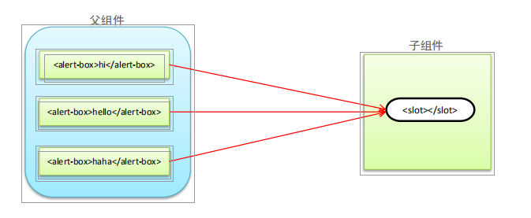

# 3.组件化开发

## 1. 组件化开发规范
Web Components 通过创建封装好功能的定制元素解决上述问题

官网：[https://developer.mozilla.org/zh-CN/docs/Web/Web_Components](https://developer.mozilla.org/zh-CN/docs/Web/Web_Components)

- 组件 (Component) 是 Vue.js 最强大的功能之一
- 组件可以扩展 HTML 元素，封装可重用的代码

## 2. 组件注册

### 2.1 全局组件注册

- Vue.component('组件名称', { })     第1个参数是标签名称，第2个参数是一个选项对象

- **全局组件**注册后，任何**vue实例**都可以用
#### 组件基础

```html
<div id="example">
  <!-- 2、 组件使用 组件名称 是以HTML标签的形式使用  -->  
  <my-component></my-component>
</div>
<script>
    //   注册组件 
    // 1、 my-component 就是组件中自定义的标签名
	Vue.component('my-component', {
      template: '<div>A custom component!</div>'
    })

    // 创建根实例
    new Vue({
      el: '#example'
    })

</script>
```

#### 组件注意事项

- 组件参数的data值必须是函数同时这个函数要求返回一个对象 
- 组件模板必须是单个根元素
- 组件模板的内容可以是模板字符串

```html
  <div id="app">
     <!-- 
		4、  组件可以重复使用多次 
	      因为data中返回的是一个对象所以每个组件中的数据是私有的
		  即每个实例可以维护一份被返回对象的独立的拷贝   
	--> 
    <button-counter></button-counter>
    <button-counter></button-counter>
    <button-counter></button-counter>
      <!-- 8、必须使用短横线的方式使用组件 -->
     <hello-world></hello-world>
  </div>

<script type="text/javascript">
	//5  如果使用驼峰式命名组件，那么在使用组件的时候，只能在字符串模板中用驼峰的方式使用组件，
    // 7、但是在普通的标签模板中，必须使用短横线的方式使用组件
     Vue.component('HelloWorld', {
      data: function(){
        return {
          msg: 'HelloWorld'
        }
      },
      template: '<div>{{msg}}</div>'
    });
     
    Vue.component('button-counter', {
      // 1、组件参数的data值必须是函数 
      // 同时这个函数要求返回一个对象  
      data: function(){
        return {
          count: 0
        }
      },
      //  2、组件模板必须是单个根元素
      //  3、组件模板的内容可以是模板字符串  
      template: `
        <div>
          <button @click="handle">点击了{{count}}次</button>
          <button>测试123</button>
			#  6 在字符串模板中可以使用驼峰的方式使用组件	
		   <HelloWorld></HelloWorld>
        </div>
      `,
      methods: {
        handle: function(){
          this.count += 2;
        }
      }
    })
    var vm = new Vue({
      el: '#app',
      data: {
        
      }
    });
  </script>
```

### 2.2 局部组件注册

只能在当前注册它的vue实例中使用

```html
  <div id="app">
      <my-component></my-component>
  </div>
<script>
    // 定义组件的模板
    var Child = {
      template: '<div>A custom component!</div>'
    }
    new Vue({
      //局部注册组件  
      components: {
        // <my-component> 将只在父模板可用  一定要在实例上注册了才能在html文件中使用
        'my-component': Child
      }
    })
 </script>
```

## 3. Vue调试工具用法

### 3.1 调试工具安装

1. 克隆仓库
2. 安装依赖包
3. 构建
4. 打开Chrome扩展页面
5. 选中开发者模式
6. 加载已解压的扩展，选择shells/chrome

## 4.  Vue组件之间传值

### 4.1 父组件向子组件传值

- 父组件发送的形式是以属性的形式绑定值到子组件身上。
- 然后子组件用属性props接收
- 在props中使用驼峰形式，模板中需要使用短横线的形式字符串形式的模板中没有这个限制

```html
  <div id="app">
    <div>{{pmsg}}</div>
     <!--1、menu-item  在 APP中嵌套着 故 menu-item   为  子组件      -->
     <!-- 给子组件传入一个静态的值 -->
    <menu-item title='来自父组件的值'></menu-item>
    <!-- 2、 需要动态的数据的时候 需要属性绑定的形式设置 此时 ptitle  来自父组件data 中的数据 . 
		  传的值可以是数字、对象、数组等等
	-->
    <menu-item :title='ptitle' content='hello'></menu-item>
  </div>

  <script type="text/javascript">
    Vue.component('menu-item', {
      // 3、 子组件用属性props接收父组件传递过来的数据  
      props: ['title', 'content'],
      data: function() {
        return {
          msg: '子组件本身的数据'
        }
      },
      template: '<div>{{msg + "----" + title + "-----" + content}}</div>'
    });
    var vm = new Vue({
      el: '#app',
      data: {
        pmsg: '父组件中内容',
        ptitle: '动态绑定属性'
      }
    });
  </script>
```

### 4.2 子组件向父组件传值

- 子组件用`$emit()`触发事件
- `$emit()`  第一个参数为 自定义的事件名称     第二个参数为需要传递的数据
- 父组件用v-on 监听子组件的事件

```html
 <div id="app">
    <div :style='{fontSize: fontSize + "px"}'>{{pmsg}}</div>
     <!-- 2 父组件用v-on 监听子组件的事件
		这里 enlarge-text  是从 $emit 中的第一个参数对应   handle 为对应的事件处理函数	
	-->	
    <menu-item :parr='parr' @enlarge-text='handle($event)'></menu-item>
  </div>
  <script type="text/javascript" src="js/vue.js"></script>
  <script type="text/javascript">
    /*
      子组件向父组件传值-携带参数
    */
    
    Vue.component('menu-item', {
      props: ['parr'],
      template: `
        <div>
          <ul>
            <li :key='index' v-for='(item,index) in parr'>{{item}}</li>
          </ul>
			###  1、子组件用$emit()触发事件
			### 第一个参数为 自定义的事件名称   第二个参数为需要传递的数据  
          <button @click='$emit("enlarge-text", 5)'>扩大父组件中字体大小</button>
          <button @click='$emit("enlarge-text", 10)'>扩大父组件中字体大小</button>
        </div>
      `
    });
    var vm = new Vue({
      el: '#app',
      data: {
        pmsg: '父组件中内容',
        parr: ['apple','orange','banana'],
        fontSize: 10
      },
      methods: {
        handle: function(val){
          // 扩大字体大小
          this.fontSize += val;
        }
      }
    });
  </script>

```

### 4.3 兄弟之间的传递

- 兄弟之间传递数据需要借助于事件中心，通过事件中心传递数据   
  - 提供事件中心    var hub = new Vue()
- 传递数据方，通过一个事件触发hub.$emit(方法名，传递的数据)
- 接收数据方，通过mounted(){} 钩子中  触发hub.$on()方法名
- 销毁事件 通过hub.$off()方法名销毁之后无法进行传递数据

```html
 <div id="app">
    <div>父组件</div>
    <div>
      <button @click='handle'>销毁事件</button>
    </div>
    <test-tom></test-tom>
    <test-jerry></test-jerry>
  </div>
  <script type="text/javascript" src="js/vue.js"></script>
  <script type="text/javascript">
    /*
      兄弟组件之间数据传递
    */
    //1、 提供事件中心
    var hub = new Vue();

    Vue.component('test-tom', {
      data: function(){
        return {
          num: 0
        }
      },
      template: `
        <div>
          <div>TOM:{{num}}</div>
          <div>
            <button @click='handle'>点击</button>
          </div>
        </div>
      `,
      methods: {
        handle: function(){
          //2、传递数据方，通过一个事件触发hub.$emit(方法名，传递的数据)   触发兄弟组件的事件
          hub.$emit('jerry-event', 2);
        }
      },
      mounted: function() {
       // 3、接收数据方，通过mounted(){} 钩子中  触发hub.$on(方法名
        hub.$on('tom-event', (val) => {
          this.num += val;
        });
      }
    });
    Vue.component('test-jerry', {
      data: function(){
        return {
          num: 0
        }
      },
      template: `
        <div>
          <div>JERRY:{{num}}</div>
          <div>
            <button @click='handle'>点击</button>
          </div>
        </div>
      `,
      methods: {
        handle: function(){
          //2、传递数据方，通过一个事件触发hub.$emit(方法名，传递的数据)   触发兄弟组件的事件
          hub.$emit('tom-event', 1);
        }
      },
      mounted: function() {
        // 3、接收数据方，通过mounted(){} 钩子中  触发hub.$on()方法名
        hub.$on('jerry-event', (val) => {
          this.num += val;
        });
      }
    });
    var vm = new Vue({
      el: '#app',
      data: {
        
      },
      methods: {
        handle: function(){
          //4、销毁事件 通过hub.$off()方法名销毁之后无法进行传递数据  
          hub.$off('tom-event');
          hub.$off('jerry-event');
        }
      }
    });
  </script>

```

## 5.  组件插槽

### 5.1 组件插槽的作用

组件的最大特性就是复用性，而用好插槽能大大提高组件的可复用能力

**父组件向子组件传递内容**


### 5.2 匿名插槽
```html

  <div id="app">
    <!-- 这里的所有组件标签中嵌套的内容会替换掉slot  如果不传值 则使用 slot 中的默认值  -->  
    <alert-box>有bug发生</alert-box>
    <alert-box>有一个警告</alert-box>
    <alert-box></alert-box>
  </div>

  <script type="text/javascript">
    /*
      组件插槽：父组件向子组件传递内容
    */
    Vue.component('alert-box', {
      template: `
        <div>
          <strong>ERROR:</strong>
		# 当组件渲染的时候，这个 <slot> 元素将会被替换为“组件标签中嵌套的内容”。
		# 插槽内可以包含任何模板代码，包括 HTML
          <slot>默认内容</slot>
        </div>
      `
    });
    var vm = new Vue({
      el: '#app',
      data: {
        
      }
    });
  </script>
</body>
</html>
```
### 5.3 具名插槽

- 具有名字的插槽 
- 使用 <slot> 中的 "name" 属性绑定元素

```html
 <div id="app">
        <!-- 方法一 -->
        <base-layout>
            <p slot="header">标题信息</p>
            <p>主要内容1</p>
            <p>主要内容2</p>
            <p slot="footer">底部信息</p>
        </base-layout>
        <!-- 方法二  tempalte不渲染到页面-->
        <base-layout>
            <template slot='header'>
                <p>标题信息1</p>
                <p>标题信息2</p>
            </template>
            <p>主要内容1</p>
            <p>主要内容2</p>
            <template slot='footer'>
                <p>底部信息信息1</p>
                <p>底部信息信息2</p>
            </template>
        </base-layout>
    </div>
    <script src="js/vue.js"></script>
    <script>
        //具名插槽
        
        Vue.component('base-layout', {
            template: `
            <div>
                <header>
                    <slot name='header'></slot>
                </header>
                <main>
                    <slot></slot>
                </main>
                <footer>
                    <slot name='footer'></slot>
                </footer>
            </div>
            `
        })
        var vm = new Vue({
            el: '#app',
        })
    </script>


```
### 5.4 作用域插槽

1. 插槽定义


```html
<ul>
<li v-for= "item in list" v-bind:key= "item.id" >
<slot v-bind:item="item">
{{item.name}}
</slot>
</li>
</ul>
```


2. 插槽内容

```html
<fruit-list v-bind:list= "list">
<template slot-scope="slotProps">
<strong v-if="slotProps.item.current">
{{ slotProps.item.text }}
</strong>
</template>
</fruit-list>
```


```html
 <div id="app">
        <fruit-list :list='list'>
            <!-- 插槽内容 -->
            <template slot-scope='slotProps'>
        <strong v-if='slotProps.info.id==3' class="current">{{slotProps.info.name}}</strong>
        <span v-else>{{slotProps.info.name}}</span>
      </template>
        </fruit-list>
    </div>
    <script type="text/javascript" src="js/vue.js"></script>
    <script type="text/javascript">
        //作用域插槽 定义
        Vue.component('fruit-list', {
            props: ['list'],
            template: `
        <div>
          <li :key='item.id' v-for='item in list'>
            <slot :info='item'>{{item.name}}</slot>
          </li>
        </div>
      `
        });
        var vm = new Vue({
            el: '#app',
            data: {
                list: [{
                    id: 1,
                    name: 'apple'
                }, {
                    id: 2,
                    name: 'orange'
                }, {
                    id: 3,
                    name: 'banana'
                }]
            }
        });
    </script>

```