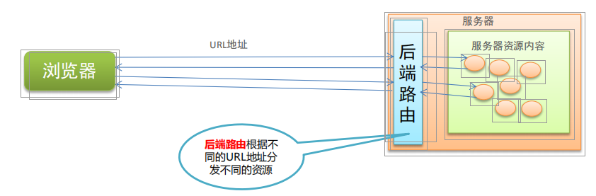
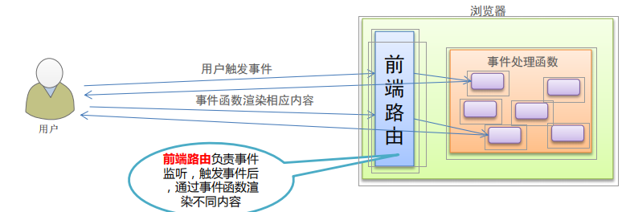
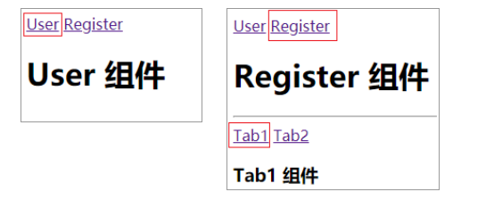

# 5.vue路由

## 1.  路由的基本概念与原理

### 1.1 路由

路由的本质就是**对应关系**

在开发中，路由分为：

#### 1. 后端路由
概念：根据不同的**用户 URL 请求**，返回不同的内容
本质：**URL 请求地址**与**服务器资源**之间的对应关系



#### 2. SPA（Single Page Application）
* 后端渲染（存在性能问题）
* Ajax前端渲染（前端渲染提高性能，但是不支持浏览器的前进后退操作）
* SPA（Single Page Application）单页面应用程序：整个网站只有一个页面，内
 容的变化通过Ajax局部更新实现、同时支持浏览器地址栏的前进和后退操作
* SPA实现原理之一：**基于URL地址的hash**（hash的变化会导致浏览器记录访问历
 史的变化、但是hash的变化不会触发新的URL请求）
* 在实现SPA过程中，最核心的技术点就是前端路由

#### 3. 前端路由

概念：根据不同的**用户事件**，显示不同的页面内容
本质：**用户事件**与**事件处理函数**之间的对应关系


#### 4. 实现简易前端路由

基于URL中的hash实现（点击菜单的时候改变URL的hash，根据hash的变化控制组件的切换）

```js
// 监听 window 的 onhashchange 事件，根据获取到的最新的 hash 值，切换要显示的组件的名称
window.onhashchange = function() {
// 通过 location.hash 获取到最新的 hash 值
}
```

### 1.2 Vue Router

Vue Router（官网：https://router.vuejs.org/zh/）是 Vue.js 官方的路由管理器。
它和 Vue.js 的核心深度集成，可以非常方便的用于SPA应用程序的开发。

- 支持HTML5 历史模式或 hash 模式
- 支持嵌套路由
- 支持路由参数
- 支持编程式路由
- 支持命名路由

## 2. vue-router的基本使用

### 2.1 基本使用步骤
#### 1. 引入相关的库文件
```html
<!-- 导入 vue 文件，为全局 window 对象挂载 Vue 构造函数 -->
<script src="./lib/vue_2.5.22.js"></script>
<!-- 导入 vue-router 文件，为全局 window 对象挂载 VueRouter 构造函数 -->
<script src="./lib/vue-router_3.0.2.js"></script>
```

#### 2. 添加路由链接

```html
<!-- router-link 是 vue 中提供的标签，默认会被渲染为 a 标签 -->
<!-- to 属性默认会被渲染为 href 属性 -->
<!-- to 属性的值默认会被渲染为 # 开头的 hash 地址 -->
<router-link to="/user">User</router-link>
<router-link to="/register">Register</router-link>
```

#### 3. 添加路由填充位

```html
<!-- 路由填充位（也叫做路由占位符） -->
<!-- 将来通过路由规则匹配到的组件，将会被渲染到 router-view 所在的位置 -->
<router-view></router-view>
```

#### 4. 定义路由组件

```js
var User = {
template: '<div>User</div>'
}
var Register = {
template: '<div>Register</div>'
}
```

#### 5. 配置路由规则并创建路由实例
```js
// 创建路由实例对象
var router = new VueRouter({
// routes 是路由规则数组
routes: [
// 每个路由规则都是一个配置对象，其中至少包含 path 和 component 两个属性：
// path 表示当前路由规则匹配的 hash 地址
// component 表示当前路由规则对应要展示的组件
{path:'/user',component: User},
{path:'/register',component: Register}
]
})

```
#### 6. 把路由挂载到 Vue 根实例中
```js
new Vue({
el: '#app',
// 为了能够让路由规则生效，必须把路由对象挂载到 vue 实例对象上
router
});
```


### 2.2 路由重定向

路由重定向指的是：用户在访问地址 A 的时候，强制用户跳转到地址 C ，从而展示特定的组件页面；
通过路由规则的 redirect 属性，指定一个新的路由地址，可以很方便地设置路由的重定向：
```js
var router = new VueRouter({
routes: [
// 其中，path 表示需要被重定向的原地址，redirect 表示将要被重定向到的新地址
{path:'/', redirect: '/user'},
{path:'/user',component: User},
{path:'/register',component: Register}
]
})
```

## 3. vue-router嵌套路由

### 3.1. 嵌套路由功能分析
点击父级路由链接显示模板内容
模板内容中又有子级路由链接
点击子级路由链接显示子级模板内容




### 3.2 父路由组件模板

```html
<p>
<router-link to="/user">User</router-link>
<router-link to="/register">Register</router-link>
</p>
<div>
<!-- 控制组件的显示位置 -->
<router-view></router-view>
</div>
```

### 3.3 子级路由模板

```html
const Register = {
template: `<div>
<h1>Register 组件</h1>
<hr/>
<router-link to="/register/tab1">Tab1</router-link>
<router-link to="/register/tab2">Tab2</router-link>
<!-- 子路由填充位置 -->
<router-view/>
</div>`
}

```

### 3.4  嵌套路由配置

 父级路由通过children属性配置子级路由
```js
const router = new VueRouter({
routes: [
{ path: '/user', component: User },
{
path: '/register',
component: Register,
// 通过 children 属性，为 /register 添加子路由规则
children: [
{ path: '/register/tab1', component: Tab1 },
{ path: '/register/tab2', component: Tab2 }
]
}
]
})
```
## 4. vue-router动态路由匹配

### 4.1 动态匹配路由的基本用法

**通过动态路由参数的模式进行路由匹配**

```js
var router = new VueRouter({
routes: [
// 动态路径参数 以冒号开头
{ path: '/user/:id', component: User }
]
})

const User = {
// 路由组件中通过$route.params获取路由参数
template: '<div>User {{ $route.params.id }}</div>'
}

```

### 4.2 路由组件传递参数

`$route`与对应路由形成高度耦合，不够灵活，所以可以使用props将组件和路由解耦

#### 1. props的值为布尔类型

```js
const router = new VueRouter({
routes: [
// 如果 props 被设置为 true，route.params 将会被设置为组件属性
{ path: '/user/:id', component: User, props: true }
]
})
const User = {
props: ['id'], // 使用 props 接收路由参数
template: '<div>用户ID：{{ id }}</div>' // 使用路由参数
}
```

#### 2. props的值为对象类型
```js
const router = new VueRouter({
routes: [
// 如果 props 是一个对象，它会被按原样设置为组件属性
{ path: '/user/:id', component: User, props: { uname: 'lisi', age: 12 }}
]
})
const User = {
props: ['uname', 'age'],
template: ‘<div>用户信息：{{ uname + '---' + age}}</div>'
}
```


#### 3. props的值为函数类型
```js
const router = new VueRouter({
routes: [
// 如果 props 是一个函数，则这个函数接收 route 对象为自己的形参
{ path: '/user/:id',
component: User,
props: route => ({ uname: 'zs', age: 20, id: route.params.id })}
]
})
const User = {
props: ['uname', 'age', 'id'],
template: ‘<div>用户信息：{{ uname + '---' + age + '---' + id}}</div>'
}

```
## 5. vue-router命名路由

路由规则起一个别名，即为“命名路由”。

```js
const router = new VueRouter({
routes: [
{
path: '/user/:id',
name: 'user',
component: User
}
]
})
```

```html
<router-link :to="{ name: 'user', params: { id: 123 }}">User</router-link>
router.push({ name: 'user', params: { id: 123 }})
```

## 6. vue-router编程式导航

### 6.1 页面导航的两种方式

- 声明式导航：通过点击链接实现导航的方式，叫做声明式导航
  例如：普通网页中的` <a></a>` 链接 或 vue 中的 `<router-link></router-link>`

- 编程式导航：通过**调用JavaScript形式**的API实现导航的方式，叫做编程式导航
  例如：普通网页中的 location.href

###  6.2编程式导航基本用法

 `this.$router.push('hash地址')`
`this.$router.go(n)`

```js
const User = {
template: '<div><button @click="goRegister">跳转到注册页面</button></div>',
methods: {
goRegister: function(){
// 用编程的方式控制路由跳转
this.$router.push('/register');
}
}
}
```
### 6.3 编程式导航参数规则
`router.push() 方法的参数规则`

```js
// 字符串(路径名称)
router.push('/home')
// 对象
router.push({ path: '/home' })
// 命名的路由(传递参数)
router.push({ name: '/user', params: { userId: 123 }})
// 带查询参数，变成 /register?uname=lisi
router.push({ path: '/register', query: { uname: 'lisi' }})
```