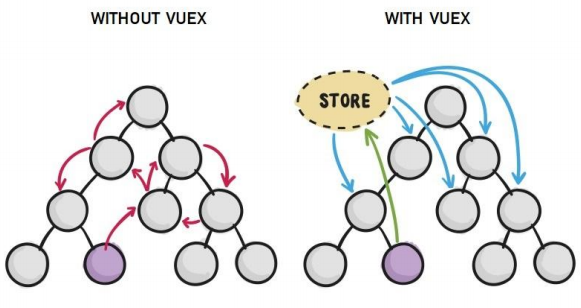

##  7.Vuex 

## 1.Vuex概述 

### 1.1 组件之间共享数据的方式

父向子传值：v-bind 属性绑定 

子向父传值：v-on 事件绑定 

兄弟组件之间共享数据： EventBus 

 $on 接收数据的那个组件 

 $emit 发送数据的那个组件

### 1.2 Vuex 是什么

Vuex 是实现组件全局状态（数据）管理的一种机制，可以方便的实现组件之间数据的共享。



### 1.3 使用 Vuex 统一管理状态的好处

① 能够在 vuex 中集中管理共享的数据，易于开发和后期维护 

② 能够高效地实现组件之间的数据共享，提高开发效率 

③ 存储在 vuex 中的数据都是响应式的，能够实时保持数据与页面的同步

只有组件之间共享的数据，才有必要存储到 vuex 中；对于组件中的私有数据，依旧存储在组件 自身的 data 中即可。

## 2.Vuex 的基本使用 

#### 1.安装 vuex 依赖包

```
npm install vuex --save
```

#### 2.导入 vuex 包

```
import Vuex from 'vuex' 
Vue.use(Vuex) 
```

#### 3. 创建 store 对象

```js
const store = new Vuex.Store({ 
 // state 中存放的就是全局共享的数据 
 state: { count: 0 } 
})
```

#### 4. 将 store 对象挂载到 vue 实例中

```js
new Vue({ 
 el: '#app', 
 render: h => h(app), 
 router, 
 // 将创建的共享数据对象，挂载到 Vue 实例中 
 // 所有的组件，就可以直接从 store 中获取全局的数据了 
 store 
})
```

## 3.Vuex 的核心概念 

###  3.1 State

#### 1.State 提供唯一的==公共数据源==

所有共享的数据都要统一放到 Store 的 State 中进行存储。 

```vue
 // 创建store数据源，提供唯一公共数据 
 const store = new Vuex.Store({ 
 state: { count: 0 } 
 }) 
```

#### 2.组件访问 State 中数据的第一种方式： 

```
this.$store.state.全局数据名称
```

#### 3.组件访问 State 中数据的第二种方式： 

```vue
// 1. 从 vuex 中按需导入 mapState 函数 
import { mapState } from 'vuex' 
通过刚才导入的 mapState 函数，将当前组件需要的全局数据，映射为当前组件的 computed 计算属性： 
// 2. 将全局数据，映射为当前组件的计算属性 
computed: { 
 ...mapState(['count']) 
}
```

### 3.3 Mutation

#### 1.Mutation 用于==变更 Store中 的数据==。 

① 只能通过 mutation 变更 Store 数据，不可以直接操作 Store 中的数据。 

② 通过这种方式虽然操作起来稍微繁琐一些，但是可以**集中监控**所有数据的变化。

```
// 定义 Mutation 
 const store = new Vuex.Store({ 
 state: { 
 count: 0 
 }, 
 mutations: { 
 add(state) { 
 // 变更状态 
 state.count++ 
 } 
 } 
 }) 

 // 触发mutation 
 methods: { 
 handle1() { 
 // 触发 mutations 的第一种方式 
 this.$store.commit('add') 
 } 
 }
```

####  2.可以在触发 mutations 时传递参数：

```js
 // 定义Mutation 
 const store = new Vuex.Store({ 
 state: { 
 count: 0 
 }, 
 mutations: { 
 addN(state, step) { 
 // 变更状态 
 state.count += step 
 } 
 } 
 }) 
  
 // 触发mutation 
 methods: { 
 handle2() { 
 // 在调用 commit 函数， 
 // 触发 mutations 时携带参数 
 this.$store.commit('addN', 3) 
 } 
 } 
```

#### 3.触发 mutations 的第二种方式： 

```js
// 1. 从 vuex 中按需导入 mapMutations 函数 
import { mapMutations } from 'vuex' 

//通过刚才导入的 mapMutations 函数，将需要的 mutations 函数，映射为当前组件的 methods 方法： 

// 2. 将指定的 mutations 函数，映射为当前组件的 methods 函数 
methods: { 
 ...mapMutations(['add', 'addN']) 
}
```

### 3.4 Action

#### 1.Action 用于==处理异步任务。== 

如果通过异步操作变更数据，必须通过 Action，而不能使用 Mutation，但是在 Action 中还是要通过触发 

Mutation 的方式间接变更数据。

```js
 // 定义 Action 
 const store = new Vuex.Store({ 
 // ...省略其他代码 
 mutations: { 
 add(state) {
 state.count++ 
 } 
 }, 
 actions: { 
 addAsync(context) { 
 setTimeout(() => { 
 context.commit('add') 
 }, 1000) 
 }  
 } 
 })  

 // 触发 Action 
 methods: { 
 handle() { 
 // 触发 actions 的第一种方式 
 this.$store.dispatch('addAsync') 
 }
 }  
```

#### 2.触发 actions 异步任务时携带参数：

```
// 定义 Action 
 const store = new Vuex.Store({ 
 // ...省略其他代码 
 mutations: { 
 addN(state, step) { 
 state.count += step 
 } 
 }, 
 actions: { 
 addNAsync(context, step) { 
 setTimeout(() => { 
 context.commit('addN', step) 
 }, 1000) 
 } } })  

 // 触发 Action 
 methods: { 
 handle() { 
 // 在调用 dispatch 函数， 
 // 触发 actions 时携带参数 
 this.$store.dispatch('addNAsync', 5) 
 }  } 
```

#### 3.触发 actions 的第二种方式： 

```
// 1. 从 vuex 中按需导入 mapActions 函数 
import { mapActions } from 'vuex' 

//通过刚才导入的 mapActions 函数，将需要的 actions 函数，映射为当前组件的 methods 方法： 
// 2. 将指定的 actions 函数，映射为当前组件的 methods 函数 

methods: { 
 ...mapActions(['addASync', 'addNASync']) 
}
```

### 3.5 Getter

#### 1.Getter 用于对 Store 中的数据进行==加工处理形成新的数据==。 

① Getter 可以对 Store 中已有的数据加工处理之后形成新的数据，类似 Vue 的计算属性。 

② Store 中数据发生变化，Getter 的数据也会跟着变化。 

```js
 // 定义 Getter 
 const store = new Vuex.Store({ 
 state: { 
 count: 0 
 }, 
 getters: { 
 showNum: state => { 
 return '当前最新的数量是【'+ state.count +'】' 
 } 
 } })
```

#### 2.使用 getters 的第一种方式： 

```
this.$store.getters.名称 
```

#### 3.使用 getters 的第二种方式： 

```js
import { mapGetters } from 'vuex' 
computed: { 
 ...mapGetters(['showNum']) 
}
```

