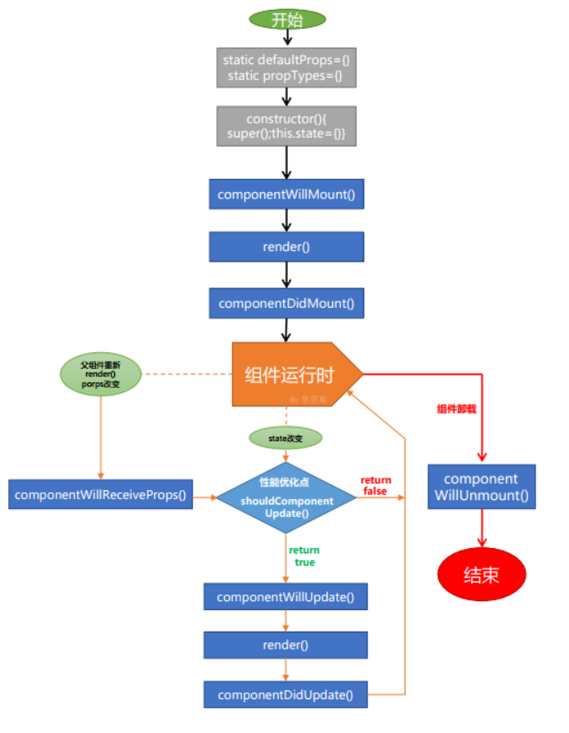

---

title: React入门
date: 2020-06-11 14:25:34
permalink: /pages/21177d
categories: 
  - 前端
  - React
tags: 
  - 
---

## 一、React入门

## 1.React的基本认识

- Facebook开源的一个js库，一个用来动态构建用户界面的js库
- React的特点
  - Declarative(声明式编码)
  - Component-Based(组件化编码)
  - Learn Once, Write Anywhere(支持客户端与服务器渲染)
  - 高效
  - 单向数据流
- React高效的原因
  - 虚拟(virtual)DOM, 不总是直接操作DOM(批量更新, 减少更新的次数)
  - 高效的DOM Diff算法, 最小化页面重绘(减小页面更新的区域)


## 2.React的基本使用

### 相关 js库

- react.js: React 的核心库 
- react-dom.js: 提供操作 DOM 的 react 扩展库 
- babel.min.js: 解析 JSX 语法代码转为纯 JS 语法代码的库

### 在页面中导入 js

```html
<script type="text/javascript" src="../js/react.development.js"></script>
<script type="text/javascript" src="../js/react-dom.development.js"></script>
<script type="text/javascript" src="../js/babel.min.js"></script>
```

### 编码

```js
<script type="text/babel"> //必须声明 babel 
    // 1.创建虚拟 DOM 元素 
    const vDom = <h1>Hello React</h1> // 千万不要加引号 
    // 2.渲染虚拟 DOM 到页面真实 DOM 容器中
	ReactDOM.render(vDom, document.getElementById('test')) 
</script>
```

## 3.JSX的理解和使用

-  理解

  - 全称: JavaScript XML
  - react定义的一种类似于XML的JS扩展语法: XML+JS
  - 作用: 用来创建react虚拟DOM(元素)对象

- 编码相关

  - js中直接可以套标签, 但标签要套js需要放在{}中

  - 在解析显示js数组时, 会自动遍历显示

  - 把数据的数组转换为标签的数组: 

    ```js
    	var liArr = dataArr.map(function(item, index){
    			return <li key={index}>{item}</li>
    		})
    ```

- 注意:

  - 标签必须有结束
  - 标签的class属性必须改为className属性
  
    

## 4.几个重要概念理解

### 模块与组件

1. 模块:
    	理解: 向外提供特定功能的js程序, 一般就是一个**js文件**
        	为什么: js代码更多更复杂
        	作用: 复用js, 简化js的编写, 提高js运行效率
2. 组件: 
	理解: 用来实现特定功能效果的代码集合(**html/css/js**)
    	为什么: 一个界面的功能太复杂了
    	作用: 复用编码, 简化项目界面编码, 提高运行效率

### 模块化与组件化

1. 模块化:
	当应用的js都以模块来编写的, 这个应用就是一个模块化的应用
2. 组件化:
	当应用是以多组件的方式实现功能, 这上应用就是一个组件化的应用

## 二、react组件化开发

## 1.基本理解和使用

```js
// 1. 定义组件
    /*方式1: 工厂函数组件(简单组件：没有状态组件)*/
    function MyComponent () {
      return <h2>工厂函数组件(简单组件)</h2>
    }
    /*方式2: ES6类组件(复杂组件)*/
    class MyComponent2 extends React.Component {
      render () {
        console.log(this) // MyComponent2的实例对象
        return <h2>ES6类组件(复杂组件)</h2>
      }
    }
// 2. 渲染组件标签
    ReactDOM.render(<MyComponent />, document.getElementById('example1'))
    ReactDOM.render(<MyComponent2 />, document.getElementById('example2'))
```

**注意：**

1) 组件名必须首字母大写 

1) 组件名必须首字母大写 

2) 虚拟 DOM 元素只能有一个根元素 

3) 虚拟 DOM 元素必须有结束标签

 **render()渲染组件标签的基本流程**

1) React 内部会创建组件实例对象 

2) 得到包含的虚拟 DOM 并解析为真实 DOM 

3) 插入到指定的页面元素内部

## 2.组件的3大属性

###  state

组件被称为"状态机", 页面的显示是根据**组件的state属性的数据**来显示

```js
//1.初始化指定:
constructor() {
  super()
  this.state = {
    stateName1 : stateValue1,
    stateName2 : stateValue2
  }
}

//2.读取显示: 
this.state.stateName

//3.更新状态-->更新界面 : 
this.setState({stateName1 : newValue})
```

```js
 class Like extends React.Component {
    constructor (props) {
      super(props)
      // 1.初始化状态
      this.state = {
        isLikeMe: true
      }
      // 绑定this为组件对象
      this.change = this.change.bind(this)
    }
      //新增函数this-> undefined ↑ 
    change () {
      // 3.更新状态: this.setState(({ stateProp1 : value1 })
      this.setState({
        isLikeMe: !this.state.isLikeMe
      })
    }
    render () {
        //2.读取状态值  this.state.statePropertyName
      const text = this.state.isLikeMe ? '你喜欢我' : '我喜欢你'
      return <h2 onClick={this.change}>{text}</h2>
    }
  }
  ReactDOM.render(<Like />, document.getElementById('example'))
```


### props

**所有组件标签的属性的集合对象**

-  每个组件对象都会有 props(properties 的简写)属性 

-  组件标签的所有属性都保存在 props 中

- 通过标签属性**从组件外向组件内传递变化的数据** 

-  注意: 组件内部不要修改 props 数据


```js
// 1) 内部读取某个属性值 
this.props.propertyName
// 2) 对 props 中的属性值进行类型限制和必要性限制 
Person.propTypes = { 
    name: React.PropTypes.string.isRequired, 
    age: React.PropTypes.number.isRequired 
} 
//3) 扩展属性: 将对象的所有属性通过 props 传递
<Person {...person}/> 
//4) 默认属性值
Person.defaultProps = { name: 'Mary' }
//5) 组件类的构造函数 
constructor (props) { 
    super(props) console.log(props) // 查看所有属性
}
```

```jsx
  //1. 定义组件类
  class Person extends React.Component {
    render() {
      console.log(this)
      return (
        <ul>
          <li>姓名: {this.props.name}</li>
          <li>性别: {this.props.sex}</li>
          <li>年龄: {this.props.age}</li>
        </ul>
      )
    }
  }
  // 对标签属性进行限制
  Person.propTypes = {
    name: PropTypes.string.isRequired,
    sex: PropTypes.string,
    age: PropTypes.number
  }
  // 指定属性的默认值
  Person.defaultProps = {
    sex: '男',
    age: 18
  }

  //2. 渲染组件标签
  const person = {
    name: 'Tom',
    sex: '女',
    age: 18
  }
  ReactDOM.render(<Person {...person}/ >,document.getElementById('example1'))
  const person2 = {
    myName: 'JACK',
    age: 17
  }
  ReactDOM.render(<Person name={person2.myName} age={person2.age}/>,
    document.getElementById('example2'))
```
**组件的 props 和 state 属性区别**

1) state: 组件**自身内部**可变化的数据 

*2)* props: 从**组件外部向组件内部传递数据**, 组件内部只读不修改

### refs

1. 组件内的标签都可以定义 **ref 属性来标识自己** 

```js
 <input type="text" ref={input => this.msgInput = input}/> 
     回调函数在组件初始化渲染完或卸载时自动调用 
```

2. 在组件中可以通过 this.msgInput 来得到对应的真实 DOM 元素 

3. 作用: 通过 **ref 获取组件内容特定标签对象, 进行读取其相关数据**

```js
 //1.定义组件
    class MyComponent extends React.Component {
      constructor(props) {
        super(props) 
        // 将自定义的函数强制绑定为组件对象
        this.handleClick = this.handleClick.bind(this) 
      }
        
      // 自定义的方法中的this默认为null
      handleClick () {
        // alert(this) //this默认是null, 而不是组件对象
        // 得到绑定在当前组件对象上的input的值
        alert(this.msgInput.value)
      }
        
      handleBlur (event) {
        alert(event.target.value)
      }
        
      render () {
        return (
          <div>
            <input type="text" ref={input => this.msgInput = input}/>{' '}
            <button onClick={this.handleClick}>提示输入数据</button>{' '}
            <input type="text" placeholder="失去焦点提示数据" onBlur={this.handleBlur}/>
          </div>
        )
      }
    }
    // 2.渲染组件标签
    ReactDOM.render(<MyComponent />, document.getElementById('example'))
```
## 3.组件的组合使用

```js
  /*
    1)拆分组件: 拆分界面,抽取组件
    2)实现静态组件: 使用组件实现静态页面效果
    3)实现动态组件
        ① 动态显示初始化数据
        ② 交互功能(从绑定事件监听开始)
     */
// 1.应用组件 父组件（共同数据）
    class App extends React.Component {
      constructor (props) {
        super(props)
        // 初始化状态
        this.state = {
          todos: ['吃饭', '睡觉', '打豆豆']
        }
        this.add = this.add.bind(this)
      }
        
      add (todo) {
        const {todos} = this.state
        todos.unshift(todo)
        //更新状态
        this.setState({todos})
      }
        
      render () {
        const {todos} = this.state
        return (
          <div>
            <TodoAdd add={this.add} count={todos.length} />
            <TodoList todos={todos} />
          </div>
        )
      }
    }

// 2.添加todo组件（子组件）
    class TodoAdd extends React.Component {
      constructor (props) {
        super(props)
        this.addTodo = this.addTodo.bind(this)
      }
        
      addTodo () {
        // 读取输入数据
        const text = this.input.value.trim()
        // 检查
        if(!text) {
          return
        }
        // 保存到todos
        this.props.add(text)
        // 清除输入
        this.input.value = ''
      }
      render () {
        return (
          <div>
            <h2>Simple TODO List</h2>
            <input type="text" ref={input => this.input=input}/>
            <button onClick={this.addTodo}>Add #{this.props.count}</button>
          </div>
        )
      }
    }
    TodoAdd.propTypes = {
      add: PropTypes.func.isRequired,
      count: PropTypes.number.isRequired
    }

//3. todo列表组件 （子组件）
    class TodoList extends React.Component {
      render () {
        const {todos} = this.props
        return (
          <ul>
            {
              todos.map((todo, index) => <li key={index}>{todo}</li>)
            }
          </ul>
        )
      }
    }
    TodoList.propTypes = {
      todos: PropTypes.array.isRequired
    }
js
//4. 渲染应用组件标签
ReactDOM.render(<App />, document.getElementById('example'))

```

## 4.组件收集表单数据

问题: 在react应用中, 如何**收集表单输入数据**

受控组件：表单项输入数据能自动收集成状态

非受控组件 ：需要时才手动读取表单输入框中的数据

```js

//1.组件 
class LoginForm extends React.Component {
    constructor(props) {
      super(props)
        //初始化
      this.state = {
        pwd: ''
      }
      this.handleSubmit = this.handleSubmit.bind(this)
      this.handleChange = this.handleChange.bind(this)
    }
    handleSubmit(event) {
      const name = this.nameInput.value
      const {pwd} = this.state
      alert(`准备提交的用户名为: ${name}, 密码:${pwd}`)
      // 阻止事件的默认行为: 提交表单
      event.preventDefault()
    }

    handleChange(event) {
      const pwd = event.target.value
      this.setState({pwd})
    }

 
    render () {
      return (
        <form onSubmit={this.handleSubmit} action="/test">
      //非受控组件 ：需要时才手动读取表单输入框中的数据
       用户名:<input type="text" ref={input => this.nameInput = input} /> 
      //受控组件：表单项输入数据能自动收集成状态
        密码: <input type="password" this.state.pwd onChange={this.handleChange} />
       <input type="submit" value="登陆" />
        </form>
      )
    }
  }
  
  ReactDOM.render(<LoginForm />, document.getElementById('example'))
```

## 5.组件的生命周期



### 初始化阶段

##### 设置组件的默认属性

```js
static defaultProps = {
    name: 'sls',
    age:23
};
//or
Counter.defaltProps={name:'sls'}
```

##### 设置组件的初始化状态

```js
constructor() {
    super();
    this.state = {number: 0}
}
```

##### componentWillMount()

> 组件即将被渲染到页面之前触发，此时可以进行开启定时器、向服务器发送请求等操作

##### render()

> 组件渲染

##### componentDidMount()

> 组件已经被渲染到页面中后触发：此时页面中有了真正的DOM的元素，可以进行DOM相关的操作

### 运行中阶段

##### componentWillReceiveProps()

> 组件接收到属性时触发

##### shouldComponentUpdate()

> 当组件接收到新属性，或者组件的状态发生改变时触发。组件首次渲染时并不会触发

```js
shouldComponentUpdate(newProps, newState) {
    if (newProps.number < 5) return true;
    return false
}
//该钩子函数可以接收到两个参数，新的属性和状态，返回true/false来控制组件是否需要更新。

```

> 一般我们通过该函数来优化性能：

> 一个React项目需要更新一个小组件时，很可能需要父组件更新自己的状态。而一个父组件的重新更新会造成它旗下所有的子组件重新执行render()方法，形成新的虚拟DOM，再用diff算法对新旧虚拟DOM进行结构和属性的比较，决定组件是否需要重新渲染

> 无疑这样的操作会造成很多的性能浪费，所以我们开发者可以根据项目的业务逻辑，在`shouldComponentUpdate()`中加入条件判断，从而优化性能

> 例如React中的就提供了一个`PureComponent`的类，当我们的组件继承于它时，组件更新时就会默认先比较新旧属性和状态，从而决定组件是否更新。值得注意的是，`PureComponent`进行的是浅比较，所以组件状态或属性改变时，都需要返回一个新的对象或数组

##### componentWillUpdate()

> 组件即将被更新时触发

##### componentDidUpdate()

> 组件被更新完成后触发。页面中产生了新的DOM的元素，可以进行DOM操作

### 销毁阶段

##### componentWillUnmount()

> 组件被销毁时触发。这里我们可以进行一些清理操作，例如清理定时器，取消Redux的订阅事件等等。


```js
import React from 'react'
import ReactDOM from 'react-dom';

class SubCounter extends React.Component {
    componentWillReceiveProps() {
        console.log('9、子组件将要接收到新属性');
    }

    shouldComponentUpdate(newProps, newState) {
        console.log('10、子组件是否需要更新');
        if (newProps.number < 5) return true;
        return false
    }

    componentWillUpdate() {
        console.log('11、子组件将要更新');
    }

    componentDidUpdate() {
        console.log('13、子组件更新完成');
    }

    componentWillUnmount() {
        console.log('14、子组件将卸载');
    }

    render() {
        console.log('12、子组件挂载中');
        return (
                <p>{this.props.number}</p>
        )
    }
}

class Counter extends React.Component {
    static defaultProps = {
        //1、加载默认属性
        name: 'sls',
        age:23
    };

    constructor() {
        super();
        //2、加载默认状态
        this.state = {number: 0}
    }

    componentWillMount() {
        console.log('3、父组件挂载之前');
    }

    componentDidMount() {
        console.log('5、父组件挂载完成');
    }

    shouldComponentUpdate(newProps, newState) {
        console.log('6、父组件是否需要更新');
        if (newState.number<15) return true;
        return false
    }

    componentWillUpdate() {
        console.log('7、父组件将要更新');
    }

    componentDidUpdate() {
        console.log('8、父组件更新完成');
    }

    handleClick = () => {
        this.setState({
            number: this.state.number + 1
        })
    };

    render() {
        console.log('4、render(父组件挂载)');
        return (
            <div>
                <p>{this.state.number}</p>
                <button onClick={this.handleClick}>+</button>
                {this.state.number<10?<SubCounter number={this.state.number}/>:null}
            </div>
        )
    }
}
ReactDOM.render(<Counter/>, document.getElementById('root'));
```

### 

