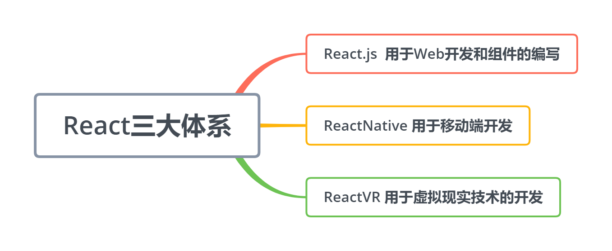

#  React16 

 **React三大体系** 



 `ReactJS`是由Facebook在2013年5月推出的一款JS前端**开源**框架,推出式主打特点式**函数式编程**风格 

 ReactJS的官方网站为:https://reactjs.org 

## 1.React开发环境搭建

### 脚手架安装

```
npm install -g create-react-app
```

### 创建第一个react项目

```
D:  //进入D盘
mkdir ReactDemo  //创建ReactDemo文件夹
create-react-app demo01   //用脚手架创建React项目
cd demo01   //等创建完成后，进入项目目录
npm start   //预览项目，如果能正常打开，说明项目创建成功
```

src文件夹介绍

这个目录里边放的是我们开放的源代码，我们平时操作做最多的目录。

- **index.js** : 这个就是项目的入口文件，视频中我们会简单的看一下这个文件。
- **index.css** ：这个是`index.js`里的CSS文件。
- **app.js** : 这个文件相当于一个方法模块，也是一个简单的模块化编程。
- **serviceWorker.js**: 这个是用于写移动端开发的，PWA必须用到这个文件，有了这个文件，就相当于有了离线浏览的功能。

## 2.HelloWorld和组件

### 入口文件的编写

写一个项目的时候一般要从入口文件进行编写的，在`src目录`下，新建一个文件`index.js`，然后打开这个文件。

```js
import React from 'react'
import ReactDOM from 'react-dom'
import App from './App'
ReactDOM.render(<App />,document.getElementById('root'))
```

上面的代码，我们先引入了React两个必要的文件，然后引入了一个APP组件，目前这个组件还是没有的，需要一会建立。然后用React的语法把APP模块渲染到了`root` ID上面.这个rootID是在`public\index.html`文件中的。

这样入口文件就写好了，这时候我们就需要写APP组件了。

### app组件的编写

现在写一下App组件，这里我们采用最简单的写法，就输出一个`Hello JSPang`,就可以了。

```javascript
import React, {Component} from 'react'

class App extends Component{
    render(){
        return (
            <div>
                Hello Lisa
            </div>
        )
    }
}
export default App;
```

 在终端使用`npm start`命令 

## 3.React中JSX语法简介

### JSX简介

> JSX就是Javascript和XML结合的一种格式。React发明了JSX，可以方便的利用HTML语法来创建虚拟DOM，当遇到`<`，JSX就当作HTML解析，遇到`{`就当JavaScript解析.

比如我们写一段JSX语法

```html
<ul className="my-list">
    <li>JSPang.com</li>
    <li>I love React</li>
</ul>
```

比如我们以前写一段代码JS代码：

```js
var child1 = React.createElement('li', null, 'JSPang.com');
var child2 = React.createElement('li', null, 'I love React');
var root = React.createElement('ul', { className: 'my-list' }, child1, child2);
```

### 组件和普通JSX语法区别

这个说起来也只有简单的一句话，就是你**自定义的组件必须首写字母要进行大写**，而JSX是小写字母开头的。

### JSX中使用三元运算符

在JSX中也是可以使用js语法的

```javascript
import React from 'react'
const Component = React.Component

class App extends Component{
    render(){
        return (
            <ul className="my-list">
                <li>{false?'lisa.com':'lisa'}</li>
                <li>I love React</li>
            </ul>
        )
    }
}

export default App;
```