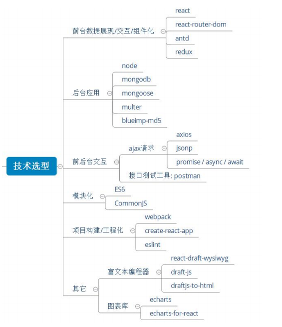
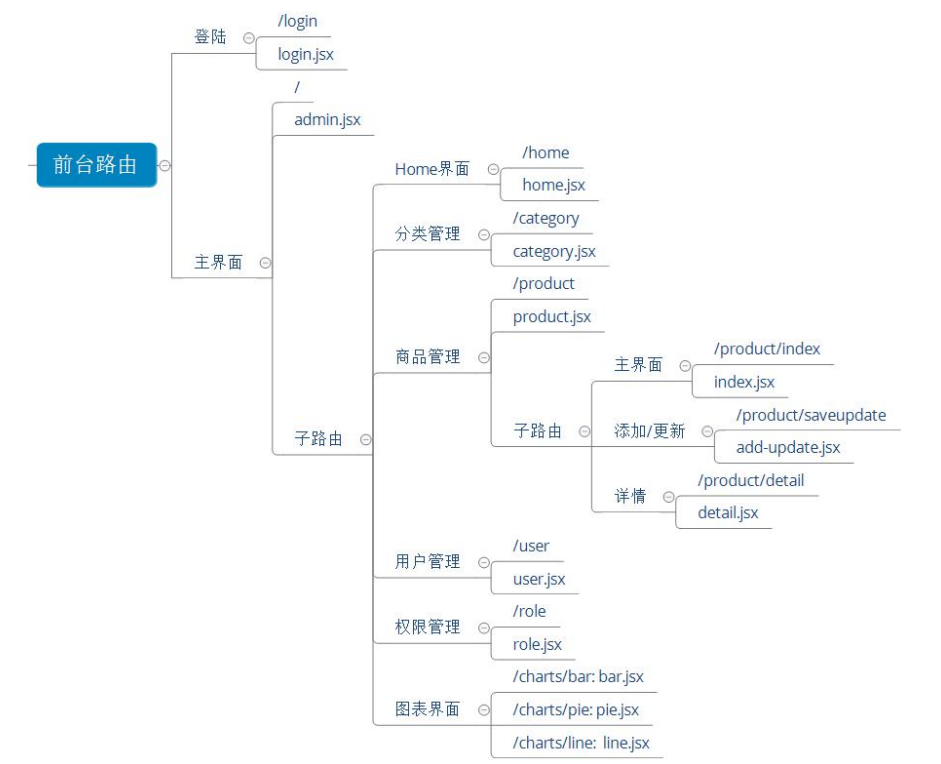
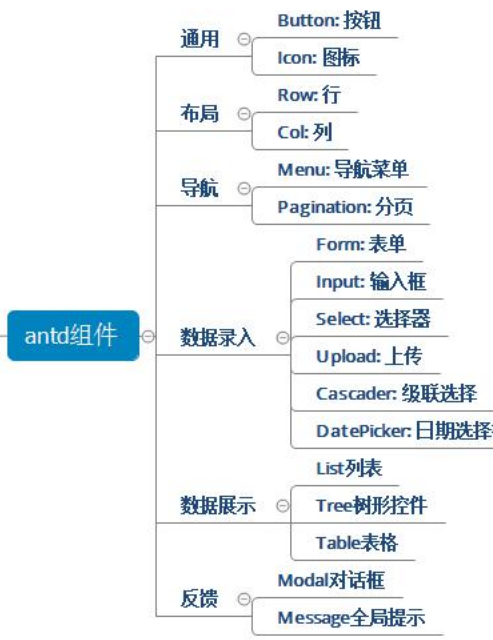

# React项目描述

## 一、准备

### 项目描述

1) 此项目为一个前后台分离的后台管理的 SPA, 包括前端 PC 应用和后端应用 

2) 包括用户管理 / 商品分类管理 / 商品管理 / 权限管理等功能模块 

3) 前端: 使用 React 全家桶 + Antd + Axios + ES6 + Webpack 等技术 

4) 后端: 使用 Node + Express + Mongodb 等技术 

5) 采用**模块化、组件化、工程化**的模式开发 

### 技术选型


### 前端路由

### 

### React插件或第三方库

1) 掌握使用 **react-router-dom** 开发单页应用 

2) 学会使用 **redux+react-redux+redux-thunk** 管理应用组件状态 

3) 掌握使用 **axios/jsonp** 与后端进行数据交互 

4) 掌握使用 **antd** 组件库构建界面 

5) 学会使用 **echarts/bizcharts** 实现数据可视化展现 

6) 学会使用 **react-draft-wysiwyg** 实现富文本编辑器

### npm/yarn 常用命令

yarn 命令文档: https://yarnpkg.com/zh-Hans/docs/cli/ 

npm 命令文档: https://docs.npmjs.com/cli-documentation/

```js
## 设置淘宝镜像
npm config set registry https://registry.npm.taobao.org
yarn config set registry https://registry.npm.taobao.org

## 初始化项目: 
yarn init -y npm init -y 

## 下载项目的所有声明的依赖: 
yarn npm install

## 下载指定的运行时依赖包: 
yarn add webpack@3.2.1 npm install webpack@3.2.1 -S 

## 下载指定的开发时依赖: 
yarn add webpack@3.2.1 -D npm install webpack@3.2.1 -D

## 全局下载指定包: 
yarn global add webpack npm install webpack -g

## 删除依赖包:
yarn remove webpack npm remove webpack -S 
yarn global remove webpack 
npm remove webpack -g 

## 运行项目中配置的 script: 
yarn run xxx 
npm run xxx

## 查看某个包的信息:
yarn info xxx 
npm info xxx
```

### git常用基本命令

Git 在线参考手册: http://gitref.justjavac.com/

```js
git config --global user.name "username" //配置用户名 
git config --global user.email "xx@gmail.com" //配置邮箱 
git init //初始化生成一个本地仓库 
git add . //添加到暂存区 
git commit –m "message" //提交到本地仓库 
git remote add origin url //关联到远程仓库 
git push origin master //推送本地 master 分支到远程 master 分支 
git checkout -b dev //创建一个开发分支并切换到新分支 
git push ogigin dev //推送本地 dev 分支到远程 dev 分支 
git pull origin dev //从远程 dev 分支拉取到本地 dev 分支 
git clone url //将远程仓库克隆下载到本地
git checkout -b dev origin/dev // 克隆仓库后切换到 dev 分支
```

## 二、开启项目开发

### 使用create-react-app(脚手架)搭建项目

1) create-react-app 是 react 官方提供的用于搭建基于 react+webpack+es6 项目的脚手架 

2) 操作: 

```js
npm install -g create-react-app // 全局下载工具 

create-react-app react-admin_client //下载模板项目 

cd react-admin_client

//编码测试
npm start 
//访问: localhost:3000 
//编码, 自动编译打包刷新(live-reload)

//打包发布
npm run build 
npm install -g serve
serve build
//访问: http://localhost:5000
```

### 项目源码基本目录设计

 App.js

```js
import React, { Component } from "react";
export default class App extends Component {
  render() {
    return <div>App</div>;
  }
}

```
index.js
```js
import React from 'react';
import ReactDOM from 'react-dom'
import App from './App'
//将App组件标签渲染到
ReactDOM.render(<App />,document.getElementById('root'))
```

## 三、引入 antd

参考文档: 

https://ant.design/docs/react/use-with-create-react-app-cn

### 下载组件库包

```
yarn add antd
```

### 实现组件的按需打包

1) 下载依赖模块

```
yarn add react-app-rewired customize-cra babel-plugin-import
```

2) 定义加载配置的 js 模块: config-overrides.js

```js
const {override, fixBabelImports} = require('customize-cra');
module.exports = override(
    fixBabelImports('import', { 
        libraryName: 'antd', 
        libraryDirectory: 'es',
        style: 'css',
    }), 
);
```

修改配置: package.json

### 自定义 antd主题

使 antd 的默认基本颜色从 Blue 变为 Green

下载工具包: 

```
yarn add less less-loader
```

修改 config-overrides.js

```js
const { override, fixBabelImports, addLessLoader } = require("customize-cra");
module.exports = override(
  fixBabelImports("import", {
    libraryName: "antd",
    libraryDirectory: "es",
    style: true,
  }),
  addLessLoader({
    javascriptEnabled: true,
    modifyVars: { "@primary-color": "#1DA57A" },
  })
);

```

### 项目中用到的antd组件



## 四、引入路由

### 下载路由包: react-router-dom

```
yarn add react-router-dom
```

### 路由组件: pages/login/login.jsx


### 后台管理主路由组件: pages/admin/admin.jsx

### 映射路由: App.js


##  五、Login 组件(不与后台交互)