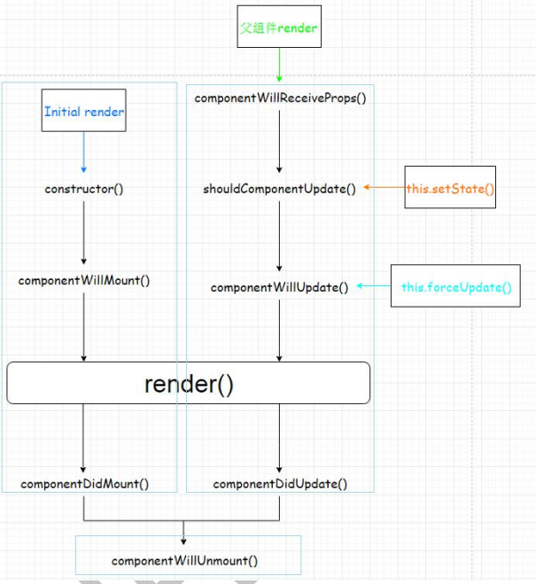

# 2.react组件化开发

## 1.基本理解和使用

1). 自定义的标签: 组件类(函数)/标签
2). 创建组件类

```jsx
	//方式1: 无状态函数(简单组件, 推荐使用)
	function MyComponent1(props) {
		return <h1>自定义组件标题11111</h1>
	}
	//方式2: ES6类语法(复杂组件, 推荐使用)
	class MyComponent3 extends React.Component {
		render () {
		  return <h1>自定义组件标题33333</h1>
		}
	}
```

3). 渲染组件标签

```jsx
	ReactDOM.render(<MyComp />,  cotainerEle)
```

4). ReactDOM.render()渲染组件标签的基本流程
	React内部会创建组件实例对象/调用组件函数, 得到虚拟DOM对象
	将虚拟DOM并解析为真实DOM
	插入到指定的页面元素内部

## 2.组件的3大属性

### 1.state

1. 组件被称为"状态机", 页面的显示是根据组件的state属性的数据来显示

2. 初始化指定:
    
    ```jsx
    constructor() {
      super()
      this.state = {
        stateName1 : stateValue1,
        stateName2 : stateValue2
      }
    }
    ```
    
3. 读取显示: 
    
    ```jsx
    this.state.stateName1
    ```
    
4. 更新状态-->更新界面 : 
    
    ```jsx
    this.setState({stateName1 : newValue})
    ```

### 2.props

所有组件标签的属性的集合对象
给标签指定属性, 保存外部数据(可能是一个function)
在组件内部读取属性: `this.props.propertyName`

作用: 从**目标组件外部向组件内部传递数据**
对props中的属性值进行类型限制和必要性限制

```jsx
	Person.propTypes = {
		name: React.PropTypes.string.isRequired,
		age: React.PropTypes.number.isRequired
	}
```

扩展属性: 将对象的所有属性通过props传递
    `<Person {...person}/>`

### 3.refs

组件内包含ref属性的标签元素的集合对象
给操作目标标签指定ref属性, 打一个标识
在组件内部获得标签对象: `this.refs.refName`(只是得到了标签元素对象)
作用: 找到组件内部的真实dom元素对象, 进而操作它

## 3.组件中的事件处理

1. 给标签添加属性: `onXxx={this.eventHandler}`

2. 在组件中添加事件处理方法
    
    ```jsx
    eventHandler(event) {
                
    }
    ```
    
3. 使自定义方法中的this为组件对象
    	在constructor()中bind(this)
    	使用箭头函数定义方法(ES6模块化编码时才能使用)
  
4. 事件监听
	绑定事件监听
		事件名
		回调函数
	触发事件
		用户对对应的界面做对应的操作
		编码

## 4.组件的组合使用

1)拆分组件: 拆分界面,抽取组件
2)实现静态组件: 使用组件实现静态页面效果
3)实现动态组件
	①　动态显示初始化数据
	②　交互功能(从绑定事件监听开始)

## 5.组件收集表单数据

受控组件
非受控组件

## 6.组件的生命周期

### 1.组件的三个生命周期状态:

Mount：插入真实 DOM
Update：被重新渲染
Unmount：被移出真实 DOM

### 2.生命周期流程:

* 第一次初始化显示: ReactDOM.render(<Xxx/>, containDom)
	constructor()
	componentWillMount() : 将要插入回调
	render() : 用于插入虚拟DOM回调
	componentDidMount() : 已经插入回调
* 每次更新state: this.setState({})
    componentWillReceiveProps(): 接收父组件新的属性
    componentWillUpdate() : 将要更新回调
    render() : 更新(重新渲染)
    componentDidUpdate() : 已经更新回调
* 删除组件: ReactDOM.unmountComponentAtNode(div): 移除组件
	componentWillUnmount() : 组件将要被移除回调

### 3.常用的方法

render(): 必须重写, 返回一个自定义的虚拟DOM
  constructor(): 初始化状态, 绑定this(可以箭头函数代替)
  componentDidMount() : 只执行一次, 已经在dom树中, 适合启动/设置一些监听



