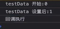

# 小程序云开发

## 一、云开发介绍以及从0构建项目

本章会详细介绍小程序云开发与Serverless，并介绍如何开通小程序云开发及控制台的功能，并且初始化项目代码，讲解airbnb/javascript代码规范。

### 小程序传统开发模式


### 云开发模式


### 什么是Serverless


### 云开发优势

- 快速上线
- 专注核心业务
- 独立开发一个完整的微信小程序不需要学习新的语言，只需要掌握JavaScript
- 无需运维，节约成本
- 弹性伸缩
- 数据安全

### 云开发基础能力

- 云函数：在云端运行的代码，微信私有协议天然鉴权
- 云数据库：一个既可以在小程序端操作又可以在云函数中操作的JSON数据库
- 云存储：在云端存储文件，可以在云端控制台可视化管理
- 云调用：基于云函数免鉴权使用小程序开放接口的能力
- HTTP API：使用HTTP API开发者可在已有服务器上访问云资源，实现与云开发的互通

### 云开发开通及控制台功能


### 代码结构初始化

####  1.在app.js中填入云开发的id 


traceUser: true 访问过我们小程序的用户都会记录下来

#### 2.配置app.json文件

 在app.json中配置navigationBar  、tabBar

```json
{
  "pages": [
    "pages/playlist/playlist",
    "pages/blog/blog",
    "pages/profile/profile"
  ],
  "window": {
    "backgroundColor": "#F6F6F6",
    "backgroundTextStyle": "light",
    "navigationBarBackgroundColor": "#d43c33",
    "navigationBarTitleText": "音乐",
    "navigationBarTextStyle": "white"
  },
  "tabBar": {
    "color": "#474747",
    "selectedColor": "#d43c43",
    "list":[{
      "pagePath": "pages/playlist/playlist",
      "text": "音乐",
      "iconPath": "images/music.png",
      "selectedIconPath": "images/music-actived.png"
    },{
      "pagePath": "pages/blog/blog",
      "text": "发现",
      "iconPath": "images/blog.png",
      "selectedIconPath": "images/blog-actived.png"
    },{
      "pagePath": "pages/profile/profile",
      "text": "我的",
      "iconPath": "images/profile.png",
      "selectedIconPath": "images/profile-actived.png"
    }]
  },

  "sitemapLocation": "sitemap.json",
  "style": "v2"
}
```


## 二、播放列表功能实现

本章完成歌单列表与歌曲列表功能，通过云函数定时触发的方式通过云音乐API接口获取歌单数据并把歌单信息存储到云数据库，讲解如何突破云函数获取数据条数的限制，并详细介绍组件化开发思想，并且使用tcb-router对云函数进行路由优化
### 轮播图组件swiper

`<block>`标签并不会出现在页面中

注：swiper中的图片宽度显示不完整


```js
<!--pages/playlist/playlist.wxml-->
<swiper indicator-dots="true" autoplay="{{true}}" interval="2000" duration="1000">
    <block wx:for="{{swiperImgUrls}}">
        <swiper-item>
            <image src="{{item.url}}" mode="widthFix" style="width:100%" ></image>
        </swiper-item>
    </block>
</swiper>
```

### 组件化开发

组件：在用户界面开发领域，组件是一种面向用户的、独立的、可复用的交互元素的封装


组件化开发的意义：

- 组件化是对实现的分层，是更有效地代码组合方式
- 组件化是对资源的重组和优化，从而使项目资源管理更合理
- 组件化有利于单元测试
- 组件化对重构较友好


设计原则：
- 高内聚
- 低耦合
- 单一职责
- 避免过多参数

### 歌单组件components/playlist


####  1.在components文件中新建playlist 


####  2.使用：在该组件的json文件中注册 和使用


#### 3.code

```js
<!--components\playlist\playlist.wxml-->
<view class="playlist-container">
    <image class="playlist-img" src="{{playlist.picUrl}}"></image>
    <text class="playlist-playcount">{{playlsit.playCount}}</text>
    <view class="playlist-playcount">{{playlist.name}}</view>
</view>
```

```css
/* components\playlist\playlist.wxss*/
.playlist-container {
    width: 220rpx;
    position: relative;
    padding-bottom: 20rpx;
  }
  
  .playlist-img {
    width: 100%;
    height: 220rpx;
    border-radius: 6rpx;
  }
  
  .playlist-playcount {
    font-size: 24rpx;
    color: #fff;
    text-shadow: 1px 0 0 rgba(0, 0, 0, 0.15);
    position: absolute;
    right: 10rpx;
    top: 4rpx;
    padding-left: 26rpx;
    background: url(data:image/svg+xml;base64,PHN2ZyB4bWxucz0iaHR0cDovL3d3dy53My5vcmcvMjAwMC9zdmciIHZpZXdCb3g9IjAgMCAyMiAyMCI+PGcgb3BhY2l0eT0iLjE1Ij48cGF0aCBmaWxsLXJ1bGU9ImV2ZW5vZGQiIGZpbGw9IiMwNDAwMDAiIGQ9Im0yMiAxNi43NzdjMCAxLjIzMy0xLjEyMSAyLjIzMy0yLjUwNiAyLjIzMy0xLjM4NCAwLTIuNTA2LTEtMi41MDYtMi4yMzN2LTIuNTUzYzAtMS4yMzQgMS4xMjItMi4yMzMgMi41MDYtMi4yMzMuMTc0IDAgLjM0My4wMTcuNTA2LjA0NnYtMS4zN2gtLjAzM2MuMDE3LS4yMi4wMzMtLjQ0MS4wMzMtLjY2NiAwLTQuNDE4LTMuNTgyLTgtOC04LTQuNDE4IDAtOCAzLjU4Mi04IDggMCAuMjI1LjAxNi40NDYuMDM0LjY2NmgtLjAzNHYxLjM3Yy4xNjMtLjAyOS4zMzMtLjA0Ni41MDUtLjA0NiAxLjM4NCAwIDIuNTA2Ljk5OSAyLjUwNiAyLjIzM3YyLjU1M2MwIDEuMjMzLTEuMTIyIDIuMjMzLTIuNTA2IDIuMjMzcy0yLjUwNS0uOTk5LTIuNTA1LTIuMjMzdi0yLjU1M2MwLS4yNTguMDU5LS41MDEuMTQ4LS43My0uMDg1LS4xNDgtLjE0OC0uMzEtLjE0OC0uNDkzdi0yLjY2N2MwLS4wMjMuMDEyLS4wNDMuMDEzLS4wNjctLjAwNC0uMDg4LS4wMTMtLjE3Ni0uMDEzLS4yNjYgMC01LjUyMyA0LjQ3Ny0xMCAxMC0xMCA1LjUyMyAwIDEwIDQuNDc3IDEwIDEwIDAgLjA5LS4wMDkuMTc4LS4wMTQuMjY2LjAwMi4wMjQuMDE0LjA0NC4wMTQuMDY3djJjMCAuMzA2LS4xNDUuNTY5LS4zNi43NTMuMjI0LjMzNC4zNi43Mi4zNiAxLjEzOHYyLjU1MiIvPjwvZz48cGF0aCBmaWxsLXJ1bGU9ImV2ZW5vZGQiIGZpbGw9IiNmZmYiIGQ9Im0yMCAxNi43NzdjMCAxLjIzMy0xLjEyMSAyLjIzMy0yLjUwNiAyLjIzMy0xLjM4NCAwLTIuNTA2LTEtMi41MDYtMi4yMzN2LTIuNTUzYzAtMS4yMzQgMS4xMjItMi4yMzMgMi41MDYtMi4yMzMuMTc0IDAgLjM0My4wMTcuNTA2LjA0NnYtMS4zN2gtLjAzM2MuMDE3LS4yMi4wMzMtLjQ0MS4wMzMtLjY2NiAwLTQuNDE4LTMuNTgyLTgtOC04LTQuNDE4IDAtOCAzLjU4Mi04IDggMCAuMjI1LjAxNi40NDYuMDM0LjY2NmgtLjAzNHYxLjM3Yy4xNjMtLjAyOS4zMzMtLjA0Ni41MDUtLjA0NiAxLjM4NCAwIDIuNTA2Ljk5OSAyLjUwNiAyLjIzM3YyLjU1M2MwIDEuMjMzLTEuMTIyIDIuMjMzLTIuNTA2IDIuMjMzcy0yLjUwNS0uOTk5LTIuNTA1LTIuMjMzdi0yLjU1M2MwLS4yNTguMDU5LS41MDEuMTQ4LS43My0uMDg1LS4xNDgtLjE0OC0uMzEtLjE0OC0uNDkzdi0yLjY2N2MwLS4wMjMuMDEyLS4wNDMuMDEzLS4wNjctLjAwNC0uMDg4LS4wMTMtLjE3Ni0uMDEzLS4yNjYgMC01LjUyMyA0LjQ3Ny0xMCAxMC0xMCA1LjUyMyAwIDEwIDQuNDc3IDEwIDEwIDAgLjA5LS4wMDkuMTc4LS4wMTQuMjY2LjAwMi4wMjQuMDE0LjA0NC4wMTQuMDY3djJjMCAuMzA2LS4xNDUuNTY5LS4zNi43NTMuMjI0LjMzNC4zNi43Mi4zNiAxLjEzOHYyLjU1MiIvPjwvc3ZnPg==) no-repeat 0 8rpx/22rpx 20rpx;
  }
  
  .playlist-name {
    font-size: 26rpx;
    line-height: 1.2;
    padding: 2px 0 0 6px;
    display: -webkit-box;
    -webkit-box-orient: vertical;
    -webkit-line-clamp: 2;
    overflow: hidden;
    text-overflow: ellipsis;
  }
```

 注：小程序中的背景图片只能使用网络中的图片，不能使用本机图片。可以转化成base64的格式 

### 播放数量细节处理

在组件中对数据进行obversers监听，监听的是对象中的一个属性的话，需要用[]括起来并且使用””。对监听的数据进行赋值的时候不能赋值给监听的值，这样会形成一个死循环

```js
// components/playlist/playlist.js
Component({
  /**
   * 组件的属性列表
   */
  properties: {
    playlist: {
      type: Object,
    },
    observers: {
      ["playlist.playCount"](count) {
        this.setData({
          _count: this._tranNumber(count, 2),
        });
      },
    },
  },

  /**
   * 组件的初始数据
   */
  data: { _count: 0 },

  /**
   * 组件的方法列表
   */
  methods: {
    //格式化数字的方法
    _tranNumber(num, point) {
      let numStr = num.toString().split(".")[0];  //去掉小数位
      if (numStr.length < 6) {
        return numStr;
      } else if (numStr.length >= 6 && numStr.length <= 8) {
        let decimal = numStr.substring(
          numStr.length - 4,
          numStr.length - 4 + point
        );
        return parseFloat(parseInt(num / 10000) + "." + decimal) + "万";
      } else if (numStr.length > 8) {
        let decimal = numStr.substring(
          numStr.length - 8,
          numStr.length - 8 + point
        );
        return parseFloat(parseInt(num / 100000000) + "." + decimal) + "亿";
      }
    },
  },
});
```

### wx-key 

在组件上使用` wx:for` 控制属性绑定一个数组，即可使用数组中各项的数据重复渲染该组件。

保留关键字 `*this` 代表在 `for` 循环中的 `item` 本身，这种表示需要` item `本身是一个唯一的字符串或者数字，如果是对象则不可以

```js
<block wx:for="{{array}}" wx:key="*this">
　　<view>{{item}}</view>
</block>
```

wx:key 的值以两种形式提供：

1.字符串，代表在` for` 循环的 `array` 中` item `的某个 `property`，该` property` 的值需要是列表中唯一的字符串或数字，且不能动态改变。

2.保留关键字 `*this `代表在` for` 循环中的` item `本身，这种表示需要 `item` 本身是一个唯一的字符串或者数字

### promise

```js
let p1 = new Promise((resolve, reject) => {
  setTimeout(() => {
    console.log('p1')
    resolve('p1')
  }, 2000)
})
let p2 = new Promise((resolve, reject) => {
  setTimeout(() => {
    console.log('p2')
    resolve('p2')
  }, 1000)
})
let p3 = new Promise((resolve, reject) => {
  setTimeout(() => {
    console.log('p3')
    resolve('p3')
  }, 3000)
})

Promise.all([p1, p2, p3]).then((res) => {
  console.log('全部完成')
  console.log(res)
}).catch((err) => {
  console.log('失败')
  console.log(err)
})
```


如果其中有一个失败的话，`Promise.all`则会走失败的方法。但是剩下的方法都会全部执行完

```js
Promise.race([p1, p2, p3]).then((res) => {
  console.log('完成')
  console.log(res)
}).catch((err) => {
  console.log('失败')
  console.log(err)
})
//p2 完成 p2 p1 p3
```

### async await

在云函数中支持使用async，因为nodejs是8.9版本的

但是在小程序中并不支持async的使用，所以需要（目前最新版的小程序2.10.0已经支持了async语法）

不支持的话可以在

https://github.com/xiecheng328/miniprogram/blob/master/regenerator/runtime.js

中下载runtime.js文件。并且在使用的文件中引入

```js
import regeneratorRuntime from '../../utils/runtime.js'

注：引入的名字必须是regeneratorRuntime
```

### 读取歌单数据并插入云数据库

1.鼠标右键cloudfunctions -> 新建nodejs云函数 -> 新建getplaylist文件夹

2.在创建的getplaylist文件夹上鼠标右键 -> 在终端打开

3.安装request,request-promise包来发送请求到服务端

```
npm install --save request

Npm install --save request-promise
```


 4.在cloudfunctions/getplaylist的index.js中编写以下代码，编写完之后鼠标右键getplaylist文件夹->上传并部署：云端安装依赖 

```js
// 云函数入口文件
const cloud = require('wx-server-sdk')

cloud.init()
//引入request-promise
const rp=require('request-promise')
const URL = 'http://musicapi.xiecheng.live/personalized'
// 云函数入口函数
exports.main = async (event, context) => {
  const playlist=await rp(URL).then((res)=>{
    return res
  })

console.log(playlist)
}
```

注：云数据库插入数据的时候只能单条插入

5.调试


 6.新建数据库playlist 


### 歌单数据去重

 如果在云函数中再次执行以上代码，数据将会再一次被插入到数据库中，所以插入数据的时候需要对数据进行去重 

```js
// 云函数入口文件
const cloud = require("wx-server-sdk");

cloud.init();
const rp = require("request-promise"); //引入request-promise
const URL = "http://musicapi.xiecheng.live/personalized";
const db = cloud.database(); //初始化数据库

const playlistCollection = db.collection("playlist");

// 云函数入口函数
exports.main = async (event, context) => {
  const list = await playlistCollection.get();

  // 服务端的数据
  const playlist = await rp(URL).then((res) => {
    return JSON.parse(res).result;
  });
  // 去重处理
  const newData = [];
  for (let i = 0, len1 = playlist.length; i < len1; i++) {
    let flag = true;
    for (let j = 0, len2 = list.data.length; j < len2; j++) {
      if (playlist[i].id == list.data[j].id) {
        flag = false;
        break;
      }
    }
    if (flag) {
      newData.push(playlist[i]);
    }
  }
  //云数据库只能插入单条数据，所以需要循环
  for (let i = 0, len = newData.length; i < len; i++) {
    await playlistCollection
      .add({
        data: {
          ...newData[i],
          createTime: db.serverDate(), //获取服务器上的时间
        },
      })
      .then((res) => {
        console.log("插入成功");
      })
      .catch((err) => {
        console.log("插入失败");
      });
  }
  return newData.length
};

```

### 突破获取数据条数的限制

```js
// 云函数入口文件
const cloud = require("wx-server-sdk");

cloud.init();
const rp = require("request-promise"); //引入request-promise
const URL = "http://musicapi.xiecheng.live/personalized";
const db = cloud.database(); //初始化数据库

const playlistCollection = db.collection("playlist");
const MAX_LIMIT = 100
// 云函数入口函数
exports.main = async (event, context) => {
   // 数据库的数据
  // 通过get的方式取到playlist数据库中的所有数据
  // 只能获取100条数据
  // const list = await playlistCollection.get();
  const countResult = await playlistCollection.count()// 获取数据库中的数据总数,返回的是一个对象
  const total = countResult.total
  const batchTimes = Math.ceil(total/MAX_LIMIT)
  const tasks = []
  for(let i = 0; i<batchTimes;i++){
    let promise = playlistCollection.skip(i*MAX_LIMIT).limit(MAX_LIMIT).get()
    tasks.push(promise)
  }
  let list={
    data:[]
  }
  if(tasks.length>0){
    list =(await Promise.all(tasks)).reduce((acc,cur)=>{
      return {
        data:acc.data.concat(cur.data)
      }
    })
  }

  // 服务端的数据
  const playlist = await rp(URL).then((res) => {
    return JSON.parse(res).result;
  });
  // 去重处理
  const newData = [];
  for (let i = 0, len1 = playlist.length; i < len1; i++) {
    let flag = true;
    for (let j = 0, len2 = list.data.length; j < len2; j++) {
      if (playlist[i].id == list.data[j].id) {
        flag = false;
        break;
      }
    }
    if (flag) {
      newData.push(playlist[i]);
    }
  }
  //云数据库只能插入单条数据，所以需要循环
  for (let i = 0, len = newData.length; i < len; i++) {
    await playlistCollection
      .add({
        data: {
          ...newData[i],
          createTime: db.serverDate(), //获取服务器上的时间
        },
      })
      .then((res) => {
        console.log("插入成功");
      })
      .catch((err) => {
        console.log("插入失败");
      });
  }
  return newData.length
};

```

### 定时触发器

每次都要去云函数中进行云端测试是不靠谱的。所以需要定时触发

[参考](https://developers.weixin.qq.com/miniprogram/dev/wxcloud/guide/functions/triggers.html):

```json
{
  "permissions": {
    "openapi": [
    ]
  },
  "triggers":[{
    "name":"myTrigger",
    "type":"timer",
    "config":"0 0 10,14,16,23 * * * *"
  }]
}
```

 注：编写完之后鼠标右键getplaylist文件夹-上传触发器 

 配置云函数的超时时间 


### 上拉加载与下拉刷新

在cloudfunctions文件夹中新建云函数music

```js
// 云函数入口文件
const cloud = require('wx-server-sdk')

cloud.init()

// 云函数入口函数
exports.main=async (event,context)=>{
  return await cloud.database().collection('playlist')
  .skip(event.start)
  .limit(event.count)
  .orderBy('createTime','desc')
  .get()
  .then((res)=>{
    return res
  })
}
```

```js
// pages/playlist/playlist.js
const MAX_LIMIT = 15;
const db = wx.cloud.database();
Page({
  /**
   * 页面的初始数据
   */
  data: {
    //轮播图图片
    swiperImgUrls: [
      {
        url:
          "http://p1.music.126.net/oeH9rlBAj3UNkhOmfog8Hw==/109951164169407335.jpg",
      },
      {
        url:
          "http://p1.music.126.net/xhWAaHI-SIYP8ZMzL9NOqg==/109951164167032995.jpg",
      },
      {
        url:
          "http://p1.music.126.net/Yo-FjrJTQ9clkDkuUCTtUg==/109951164169441928.jpg",
      },
    ], 
    playlist: [],
  },

  /**
   * 生命周期函数--监听页面加载
   */
  onLoad: function (options) {
    this._getPlaylist();
  },
  _getPlaylist() {
    wx.showLoading({
      title: "加载中",
    });
    wx.cloud
      .callFunction({
        name: "music", // 云函数的名称
        data: {
          start: this.data.playlist.length,
          count: MAX_LIMIT,
          $url: "playlist",
        }, //参数
      })
      .then((res) => {
        this.setData({
          playlist: this.data.playlist.concat(res.result.data), //在当前数据的基础上拼接
        });
        wx.stopPullDownRefresh(); //停止当前页面下拉刷新
        wx.hideLoading();
      });
  },
  /**
   * 页面相关事件处理函数--监听用户下拉动作
   */
  onPullDownRefresh: function () {
    this.setData({
      playlist: [],
    });
    this._getPlaylist();
  },

  /**
   * 页面上拉触底事件的处理函数
   */
  onReachBottom: function () {
    this._getPlaylist();
  },
});

```

在json配置文件中配置`"enablePullDownRefresh":true`

### 云函数路由优化tcb-router

tcb-router

- 一个用户在一个云环境中只能创建50个云函数
- 相似的请求归类到同一个云函数处理
- tcb-router是一个koa风格的云函数路由库
- 

https://github.com/TencentCloudBase/tcb-router

安装tcb-router：npm install --save tcb-router

```js
// 云函数入口文件
const cloud = require('wx-server-sdk')
const TcbRouter = require('tcb-router')

cloud.init()

// 云函数入口函数
exports.main = async (event, context) => {
  const app = new TcbRouter({
    event
  })
  app.router('playlist', async (ctx, next) => {
    ctx.body = await cloud.database().collection('playlist')
      .skip(event.start)
      .limit(event.count)
      .orderBy('createTime', 'desc')
      .get()
      .then(res => {
        return res
      })
  })
 //后面的路由，提前标注
  app.router('musiclist', async (ctx, next) => {
    ctx.body = await rp(BASE_URL + '/playlist/detail?id=' + parseInt(event.playlistId))
      .then(res => {
        return JSON.parse(res)
      })
  })
  app.router('musicUrl',async (ctx,next)=>{
    ctx.body = await rp(BASE_URL+`/song/url?id=${event.musicId}`).then(res=>{
      return res
    })
  })
  app.router('lyric',async (ctx,next)=>{
    ctx.body = await rp(BASE_URL+`/lyric/?id=${event.musicId}`).then(res=>{
      return res
    })
  })
  return app.serve()
}
```

### 歌曲列表pages/musiclist

```js
// pages/musiclist/musiclist.js
Page({

  /**
   * 页面的初始数据
   */
  data: {
    musiclist:[],
    listInfo:{}
  },

  /**
   * 生命周期函数--监听页面加载
   */
  onLoad: function (options) {
    // console.log(options)
    wx.showLoading({
      title: '加载中',
    })
    wx.cloud.callFunction({
      name:'music',
      data:{
        playlistId:options.playlistId,
        $url:'musiclist'
      }
    }).then(res=>{
      const pl = res.result.playlist
      this.setData({
        musiclist:pl.tracks,
        listInfo:{
          coverImgUrl:pl.coverImgUrl,
          name:pl.name
        }
      })
      this._setMusiclist()
      wx.hideLoading()
    })
  },
  _setMusiclist(){
    wx.setStorageSync('musiclist',this.data.musiclist)
  }
})
```

```html
<!--miniprogram/pages/musiclist/musiclist.wxml-->
<view class='detail-container' style='background: url({{listInfo.coverImgUrl}}) no-repeat  top/cover'></view>
<view class='detail-mask'></view>
<view class='detail-info'>
  <image src="{{listInfo.coverImgUrl}}" class='detail-img'></image>
  <view class='detail'>
    <view class='detail-nm'>{{listInfo.name}}</view>
  </view>
</view>

<x-musiclist musiclist="{{musiclist}}" />
```

```css
.detail-container {
    height: 320rpx;
    filter: blur(40rpx);
    opacity: 0.4;
  }
  
  .detail-mask {
    position: absolute;
    width: 100%;
    height: 320rpx;
    background-color: #333;
    top: 0;
    left: 0;
    z-index: -1;
  }
  
  .detail-img {
    width: 280rpx;
    height: 280rpx;
    margin-right: 24rpx;
    border-radius: 6rpx;
  }
  
  .detail-info {
    display: flex;
    position: absolute;
    top: 0;
    left: 0;
    width: 100%;
    height: 320rpx;
    padding: 20rpx;
    box-sizing: border-box;
    align-items: center;
  }
  
  .detail {
    flex-grow: 1;
    line-height: 60rpx;
    width: 0;
  }
  
  .detail view {
    color: #fff;
    font-size: 24rpx;
  }
  
  .detail .detail-nm {
    font-size: 36rpx;
    font-weight: 400;
  }
  
```

### 歌曲列表组件components/musiclist

```js
// components/musiclist/musiclist.js
const app = getApp()
Component({
  properties: {
    musiclist: Array
  },
  data: {
    playingId:-1
  },
  pageLifetimes:{
    show(){
      // console.log(app.getPlayMusicId())
      this.setData({
        playingId:parseInt(app.getPlayMusicId())
      })
    }
  },
  methods: {
    onSelect(event){
      const ds = event.currentTarget.dataset
      const musicid = ds.musicid
      this.setData({
        playingId: musicid
      })
      wx.navigateTo({
        url: `../../pages/player/player?musicId=${musicid}&index=${ds.index}`,
      })
    }
  }
})

```

```html
<block wx:for="{{musiclist}}" wx:key="id">
  <view class="musiclist-container {{item.id === playingId ? 'playing': ''}}" bind:tap="onSelect" data-musicid="{{item.id}}" data-index="{{index}}">
    <view class="musiclist-index">{{index+1}}</view>
    <view class="musiclist-info">
      <view class="musiclist-name">
        {{item.name}}
        <text class="musiclist-alia">{{item.alia.length==0?"":item.alia[0]}}</text>
      </view>
      <view class="musiclist-singer">{{item.ar[0].name}} - {{item.al.name}}</view>
    </view>
  </view>
</block>
```

```css
.musiclist-container {
  display: flex;
  padding: 14rpx 20rpx;
  align-items: center; /* 垂直居中 */
}

.musiclist-index {
  color: #888;
  font-size: 34rpx;
  width: 80rpx;
}

.musiclist-info {
  flex-grow: 1;
  width: 0;
}

.musiclist-name {
  font-size: 34rpx;
  color: #333;
  overflow: hidden;
  text-overflow: ellipsis;
  white-space: nowrap;
  margin-bottom: 10rpx;
}

.musiclist-alia {
  color: #888;
}

.musiclist-singer {
  font-size: 24rpx;
  color: #888;
}

.playing view, .playing text {
  color: #d43c33;
}
```


## 三、播放器功能实现
本章完成一个媲美原生体验的小程序音乐播放器，自定义进度条与歌词组件，由于播放器交互比较多，所以也会讲解性能优化的知识。并会介绍如何在小程序中引入iconfont字体图标。

### 播放器页面布局

 如果js中的变量并不在页面中显示，那么可以不在data中定义。可以在最外层用let来定义变量

 

### 引入iconfont字体图标

下载的iconfont图标是以css结尾的。引进项目时需要将其后缀名改成wxss

在app.wxss中引进iconfont.wxss

```js
/**app.wxss**/
@import "iconfont.wxss";
```

### 音乐控制面板功能实现

#### 1.在app.json中设置 

```json
  "requiredBackgroundModes": [
    "audio"
  ],
```

#### 2.player.js

```js
// 获取全局唯一的背景音频管理器
const backgroundAudioManager = wx.getBackgroundAudioManager()

//src和title及其他信息
backgroundAudioManager.src = result.data[0].url
backgroundAudioManager.title = music.name
backgroundAudioManager.coverImgUrl = music.al.picUrl
backgroundAudioManager.singer = music.ar[0].name
backgroundAudioManager.epname = music.al.name
```

#### 3.上一首下一首

```js
 // 上一首
  onPrev() {
    nowPlayingIndex--
    // 如果当前是第一首歌曲。上一首则是最后一首
    if (nowPlayingIndex < 0) {
      nowPlayingIndex = musiclist.length - 1
    }
    this._loadMusicDetail(musiclist[nowPlayingIndex].id)
  },
    // 下一首   
  onNext() {
    nowPlayingIndex++
    // 如果当前是最后一首歌曲，下一首则是第一首
    if (nowPlayingIndex == musiclist.length) {
      nowPlayingIndex = 0
    }
    this._loadMusicDetail(musiclist[nowPlayingIndex].id)
  },
```

#### 4.图片旋转，暂停时图片的暂停 

```css
  .rotation {
    animation: rotation 12s linear infinite;
    -moz-animation: rotation 12s linear infinite;
    -webkit-animation: rotation 12s linear infinite;
    -o-animation: rotation 12s linear infinite;
  }
  
  .rotation-paused {
    animation-play-state: paused;
  }
  @keyframes rotation {
    from {
      transform: rotate(0deg);
    }
  
    to {
      transform: rotate(360deg);
    }
  }
```

### 进度条组件progress-bar

```html
<!-- components/progress-bar/progress-bar.wxml -->
<view class="container">
    <text class="time">{{showTime.currentTime}}</text>
    <view class="control">
        <movable-area class="movable-area">
            <movable-view direction="horizontal" class="movable-view" damping="1000" x="{{movableDis}}" bindchange="onChange" bindtouchend="onTouchEnd" />
        </movable-area>
        <progress stroke-width="4" backgroundColor="#969696" activeColor="#fff" percent="{{progress}}"></progress>
    </view>
    <text class="time">{{showTime.totalTime}}</text>
</view>
```

movable-view：可移动的视图容器，在页面中可以拖拽滑动。

movable-view必须在 movable-area 组件中，并且必须是直接子节点，否则不能移动。

X：定义x轴方向的偏移，如果x的值不在可移动范围内，会自动移动到可移动范围；改变x的值会触发动画

wx.createSelectorQuery()：返回一个 SelectorQuery 对象实例。在自定义组件或包含自定义组件的页面中，应使用 this.createSelectorQuery() 来代替。

SelectorQuery 对象：查询节点信息的对象

```js
    _getMovableDis() {
      const query = this.createSelectorQuery() //创建节点查询器 query
      query.select('.movable-area').boundingClientRect() //选择class=movable-area的节点，获取节点位置信息的查询请求
      query.select('.movable-view').boundingClientRect()
      query.exec(rect => {
        // console.log(rect)
        movableAreaWidth = rect[0].width //.movable-area节点的宽度
        movableViewWidth = rect[1].width
      })
    },
        
    _bindBGMEvent() {
      // 监听背景音频进入可播放状态事件。 但不保证后面可以流畅播放
      backgroundAudioManager.onCanplay(() => {
        if (typeof backgroundAudioManager.duration != 'undefined') {
          this._setTime()
        } else {
          setTimeout(() => {
            this._setTime()
          }, 1000)
        }
      })
```

 Lifetimes：里面可以写组件的生命周期函数，并且会覆盖该字段外的生命周期函数（实际上可以直接写生命周期函数的，不过还是建议写在这个字段里面） 

```js
  // 组件的生命周期
  lifetimes: {
    ready() {
      this._getMovableDis()
      this._bindBGMEvent()
    }
  },
```

### 进度条与播放时间联动

```js
  // 监听音频播放进度更新事件
      backgroundAudioManager.onTimeUpdate(() => {
        if (!isMoving) {
          const currentTime = backgroundAudioManager.currentTime //当前音频的播放位置（单位：s），只有在有合法 src 时返回。
          const duration = backgroundAudioManager.duration
          const sec = currentTime.toString().split('.')[0]
          // 一秒内会触发4次onTimeUpdate函数。所以只改变秒数不一样的时间点
          if (sec != currentSec) {
            const currentTimeFmt = this._dateFormat(currentTime)
            this.setData({
              movableDis: (movableAreaWidth - movableViewWidth) * currentTime / duration,
              progress: currentTime / duration * 100,
              ['showTime.currentTime']: `${currentTimeFmt.min}:${currentTimeFmt.sec}`
            })
            currentSec = sec
            // 联动歌词
            this.triggerEvent('timeUpdate', {
              currentTime
            })
          }
        }
      })
```

### 拖拽进度条

```js
    onChange(event) {
      // 拖动
      if (event.detail.source == 'touch') {
        this.data.progress = event.detail.x / (movableAreaWidth - movableViewWidth) * 100
        this.data.movableDis = event.detail.x
        isMoving = true
      }
    },
    onTouchEnd() {
      const currentTimeFmt = this._dateFormat(Math.floor(backgroundAudioManager.currentTime))
      this.setData({
        progress: this.data.progress,
        movableDis: this.data.movableDis,
        ['showTime.currentTime']: currentTimeFmt.min + ':' + currentTimeFmt.sec
      })
      backgroundAudioManager.seek(duration * this.data.progress / 100) //跳转的位置，单位 s
      isMoving = false
    },
```

 onChange的event事件的detail会记录change的来源： 


this.data与this.setData的关系就是this.setData里面存储的是this.data的副本，而界面是从this.setData里面托管的this.data的副本取数据的。所以我们更改this.data并不会直接更新界面，因为这个时候的this.setData里面的副本还是没有更新前的。

### 歌词组件lyric

```html
<!--components/lyric/lyric.wxml-->
<scroll-view hidden="{{isLyricShow}}" class="lyric-scroll" scroll-y scroll-top="{{scrollTop}}" scroll-with-animation="true">
  <view class="lyric-panel">
    <block wx:for="{{lrcList}}" wx:key="item">
      <view class="lyric {{index==nowLyricIndex?'hightlight-lyric': ''}}">{{item.lrc}}</view>
    </block>
  </view>
</scroll-view>

```

 歌词滚动区域 

scroll-y：允许纵向滚动

scroll-top：设置竖向滚动条位置

scroll-with-animation：在设置滚动条位置时使用动画过渡

### 歌词数据解析

```js
 _parseLyric(sLyric) {
      let line = sLyric.split('\n')
      let _lrcList = []
      line.forEach(elem => {
        let time = elem.match(/\[(\d{2,}):(\d{2})(?:\.(\d{2,3}))?]/g)
        if (time != null) {
          let lrc = elem.split(time)[1]
          let timeReg = time[0].match(/(\d{2,}):(\d{2})(?:\.(\d{2,3}))?/)
          // 把时间转换成秒
          let time2Seconds = parseInt(timeReg[1]) * 60 + parseInt(timeReg[2]) + parseInt(timeReg[3]) / 1000
          _lrcList.push({
            lrc,
            time: time2Seconds
          })
        }
      })
      this.setData({
        lrcList: _lrcList
      })
    },
```

{n,}:至少匹配n 次

{n,m}:最少匹配 n 次且最多匹配 m 次

### 歌词与播放时间联动

组件与组件之间的通信

 在progress-bar.js中新增triggerEvent事件 (上code已有)

 在player.wxml中接收该事件 `bind:timeUpdate="timeUpdate"`(上面code)

 在player.js中新增timeUpdate事件 

```js
  // 绑定歌词组件滚动
  timeUpdate(event) {
    this.selectComponent('.lyric').update(event.detail.currentTime)
  },
```

selectComponent:返回选择器的第一个组件

并且在其后跟着定义lyric组件的事件update()

```js
 // 歌词联动
    update(currentTime) {
      let lrcList = this.data.lrcList
      if (lrcList.length == 0) {
        return
      }
      // 进度条比歌词长的时候
      if(currentTime>lrcList[lrcList.length-1].time){
        if(this.data.nowLyricIndex != -1){
          this.setData({
            nowLyricIndex:-1,
            scrollTop:lrcList.length*lyricHeight
          })
        }
      }
      for (let i = 0, len = lrcList.length; i < len; i++) {
        if (currentTime <= lrcList[i].time) {
          this.setData({
            nowLyricIndex: i-1,
            scrollTop:(i-1)*lyricHeight
          })
          break
        }
      }
    }
```

 求单条歌词的高度 

```js
 lifetimes:{
    ready(){
      wx.getSystemInfo({
        success(res) {
          // 求出1rpx的大小res.screenWidth / 750
          lyricHeight = res.screenWidth / 750 * 64
        },
      })
    }
  },
```

###  细节处理

####  1.使用全局变量来记录当前播放歌曲的ID

以便回到以下页面时高亮显示当前播放歌曲 

 App.js页面中配置 

```js
//app.js
App({
  onLaunch: function () {
    if (!wx.cloud) {
      console.error("请使用 2.2.3 或以上的基础库以使用云能力");
    } else {
      wx.cloud.init({
        env: "miao-9z0mt",
        traceUser: true,
      });
    }

    this.globalData = {
      playingMusicId: -1,
    };
  },
  setPlayMusicId(musicId) {
    this.globalData.playingMusicId = musicId;
  },
  getPlayMusicId() {
    return this.globalData.playingMusicId;
  },
});

```

 Component/musilcist.js页面中： 

```js
  pageLifetimes:{
    show(){
      // console.log(app.getPlayMusicId())
      this.setData({
        playingId:parseInt(app.getPlayMusicId())
      })
    }
  },
```

 在切换上一首和下一首的时候改变playingMusicId 

####  2.组件事件如何改变父元素的值 

 在component/progress-bar.js中 

```js
 // 监听背景音频自然播放结束事件
      backgroundAudioManager.onEnded(() => {
        // 一首歌曲结束，自动播放下一首
        this.triggerEvent('musicEnd')
      })
      backgroundAudioManager.onPlay(() => {
        isMoving = false
        this.triggerEvent('musicPlay')
      })
      backgroundAudioManager.onPause(() => {
        this.triggerEvent('musicPause')
      })
```

 在pages/palyer.wxml中接收子组件传递过来的事件 

```js
  <!-- 进度条 -->
  <view class="progress-bar">
    <x-progress-bar bind:musicEnd="onNext" bind:timeUpdate="timeUpdate" bind:musicPlay="onPlay" bind:musicPause="onPause" isSame="{{isSame}}" />
  </view>
```

 在pages/player.js中做相对应的处理 

```js
 // 暂停歌曲播放
  onPause() {
    this.setData({
      isPlaying: false
    })
  },
  onPlay() {
    this.setData({
      isPlaying: true
    })
  },
```

#### 3.定义isSame变量来标志是否是同一首歌曲

当前正在播放歌曲，若还是从列表进入播放界面，不应该重头开始播放


## 四、发现功能实现
本章完成发现功能，包括博客列表、发布博客、判断用户授权信息等，在发布博客时需要考虑多文件异步上传完成存入云数据库，并且详细讲解云数据库中模糊查询、索引管理、权限管理。

### 搜索组件search

组件的样式是跟外部的隔离的，全局app.wxss也不能影响到他。

从父页面传递进来的类，不能在组件中更改其样式

将搜索图标的样式在pages/blog.wxml中传递给search组件

```html
<view class="search-container">
	<x-search iconfont="iconfont" icon-sousuo="icon-sousuo" bind:search="onSearch" />
</view>
```

 在component/search.js中接收传递过来的样式 

```js
  externalClasses:[
    'iconfont',
    'icon-sousuo'
  ],
```

### 底部弹出层组件bottom-modal与slot插槽

在component/bottom-modal.js中定义styleIsolation: 'apply-shared'

```js
  options: {
    styleIsolation: 'apply-shared',
    multipleSlots: true,
  },
```

 之后就可以在component/bottom-modal.wxml中直接使用页面中的类了 

使用slot插槽要在component/bottom-modal.js中定义multipleSlots: true，插槽才能使用

```html
<!--components/bottom-modal/bottom-modal.wxml-->
<view class="modal" hidden="{{!modalShow}}">
  <view class="panel">
      <i class="iconfont icon-shanchu1" bind:tap="onClose"></i>
      <!-- slot插槽  具名插槽-->
      <slot name="modal-content"></slot>
  </view>
</view>
```

### 授权组件login

```js
// miniprogram/pages/blog/blog.js
// 发布功能
  onPublish() {
    // 判断用户是否授权
    wx.getSetting({
      success: (res) => {
        if (res.authSetting["scope.userInfo"]) {
          wx.getUserInfo({
            success: (res) => {
              this.onLoginSuccess({
                detail: res.userInfo,
              });
            },
          });
        } else {
          this.setData({
            modalShow: true,
          });
        }
      },
    });
  },
  onLoginSuccess(event) {
    const detail = event.detail;
    wx.navigateTo({
      url: `../blog-edit/blog-edit?nickName=${detail.nickName}&avatarUrl=${detail.avatarUrl}`,
    });
  },
  onLoginFail() {
    wx.showModal({
      title: "授权用户才能发布",
      content: "",
    });
  },
```

```js
// components/login/login.js
 methods: {
    onGotUserInfo(event){
      const userInfo = event.detail.userInfo
      if(userInfo){
        // 允许授权
        this.setData({
          modalShow:false
        })
        this.triggerEvent('loginsuccess',userInfo)
      }else{
        // 拒绝授权
        this.triggerEvent('loginfail')
      }
    }
  }
```

```html
<!--components/login/login.wxml-->
<x-bottom-modal modalShow="{{modalShow}}">
  <view slot="modal-content">
    <button class="login" open-type="getUserInfo" bindgetuserinfo="onGotUserInfo" >
      获取微信授权信息
    </button>
  </view>
</x-bottom-modal>

```

### 发布博客页面

原生组件限制：

https://developers.weixin.qq.com/miniprogram/dev/component/native-component.html

原生组件不能使用在容器组件里面，比如swiper

原生组件在绑定事件的时候是不能用：这种格式的，比如bind:input在earatext元素中是不会被触发的。Bindinput才会被触发

```js
// miniprogram/pages/blog-edit/blog-edit.js
const MAX_WORDS_NUM = 140 // 输入文字最大的个数
const MAX_IMG_NUM = 9 // 最大上传图片数量
const db = wx.cloud.database()
let content = '' //输入的文字内容
let userInfo = {}
Page({
  data: {
    wordsNum: 0, //输入文字的个数
    footerBottom: 0,
    images: [],
    selectPhoto: true //添加图片元素是否正在显示
  },
  onLoad: function (options) {
   // console.log(options)
    userInfo = options
  },
  // 输入的时候控制输入的字数
  onInput(event) {
    let wordsNum = event.detail.value.length
    if (wordsNum >= MAX_WORDS_NUM) {
      wordsNum = `最大字数为${MAX_WORDS_NUM}`
    }
    this.setData({
      wordsNum
    })
    content = event.detail.value
  },
  // 软键盘弹起的时候控制底部的高度
  onFocus(event) {
    this.setData({
      footerBottom: event.detail.height
    })
  },
  onBlur() {
    this.setData({
      footerBottom: 0
    })
  },
  // 选择照片
  onChooseImage() {
    // 还能再选几张图片
    let max = MAX_IMG_NUM - this.data.images.length
    wx.chooseImage({
      count: max,
      sizeType: ['original', 'compressed'],
      sourceType: ['album', 'camera'],
      success: (res) => {
        this.setData({
          images: this.data.images.concat(res.tempFilePaths)
        })
        max = MAX_IMG_NUM - this.data.images.length
        this.setData({
          selectPhoto: max <= 0 ? false : true
        })
      }
    })
  },
  // 删除图片
  onDelImage(event) {
    this.data.images.splice(event.target.dataset.index, 1) //删除对应照片
    this.setData({
      images: this.data.images
    })
    if (this.data.images.length == MAX_IMG_NUM - 1) {
      // 图片个数等于8，显示增加图片框
      this.setData({
        selectPhoto: true
      })
    }
  },
  // 预览照片
  onPreviewImage(event) {
    wx.previewImage({
      urls: this.data.images,
      current: event.target.dataset.imgsrc
    })
  },
})
```

1.字数限制

在textarea中设置maxlength属性就能限制字数的长度

2.软键盘弹出的时候底部的发布栏bottom需要改变，不然会被遮挡

3.照片选择

```html
<!--miniprogram/pages/blog-edit/blog-edit.wxml-->
<view class="container">
  <textarea class="content" placeholder="分享新鲜事..."
    bindinput="onInput" maxlength="140" auto-focus
    bindfocus="onFocus" bindblur="onBlur"
  ></textarea>

  <view class="image-list">
    <!-- 显示图片 -->
    <block wx:for="{{images}}" wx:key="*this">
      <view class="image-wrap">
        <image class="image" src="{{item}}" mode="aspectFill" bind:tap="onPreviewImage" data-imgsrc="{{item}}"></image>
        <i class="iconfont icon-shanchu" bind:tap="onDelImage" data-index="{{index}}"></i>
      </view>
    </block>

    <!-- 选择图片 -->
    <view class="image-wrap selectphoto" bind:tap="onChooseImage" hidden="{{!selectPhoto}}">
      <i class="iconfont icon-jiahao"></i>
    </view>
  </view>
</view>

<view class="footer" style="bottom:{{footerBottom}}px">
  <text class="words-num">{{wordsNum}}</text>
  <button class="send-btn" bind:tap="send">发布</button>
</view>
```

### 创建blog云函数

```js
// 云函数入口文件
const cloud = require("wx-server-sdk");
cloud.init();
const TcbRouter = require("tcb-router");
const db = cloud.database();
const blogCollection = db.collection("blog");
const MAX_LIMIT = 100;

// 云函数入口函数
exports.main = async (event, context) => {
  const app = new TcbRouter({
    event,
  });

    let blogList = await blogCollection
      .where(w)
      .skip(event.start)
      .limit(event.count)
      .orderBy("createTime", "desc")
      .get()
      .then((res) => {
        return res.data;
      });
    ctx.body = blogList;
  });

  return app.serve();
};

```

### 多文件上传云存储,数据插入云数据库

```js
// 发布
  send() {
    // 2、数据 -> 云数据库
    // 数据库：内容、图片fileID、openid、昵称、头像、时间
    // 1、图片 -> 云存储 fileID 云文件ID
    if (content.trim() == '') {
      wx.showModal({
        title: '请输入内容'
      })
      return
    }

    wx.showLoading({
      title: '发布中',
      mask: true
    })

    let promiseArr = []
    let fileIds = []
    for (let i = 0, len = this.data.images.length; i < len; i++) {
      let p = new Promise((resolve, reject)=>{
        let item = this.data.images[i]
        console.log(item)
        // 文件扩展名
        let suffix = /\.\w+$/.exec(item)[0]
        wx.cloud.uploadFile({
          cloudPath: 'blog/' + Date.now() + '-' + Math.random() * 1000000 + suffix,
          filePath: item,
          success: (res) => {
            console.log(res)
            fileIds = fileIds.concat(res.fileID)
            resolve()
          },
          fail: (res) => {
            console.log(err)
            reject()
          }
        })
      })
      promiseArr.push(p)
    }
    // 存入到云数据库
    Promise.all(promiseArr).then(res=>{
      db.collection('blog').add({
        data:{
          ...userInfo,
          content,
          img:fileIds,
          createTime:db.serverDate()//服务端的时间
        }
      }).then(res=>{
        wx.hideLoading()
        wx.showToast({
          title: '发布成功',
        })

        // 返回blog页面
        wx.navigateBack()
      })
    }).catch(err=>{
      wx.hideLoading()
      wx.showToast({
        title: '发布失败',
      })
    })
  },
```

### 博客卡片组件blog-card

```html
<!--components/blog-card/blog-card.wxml-->
<view class="blog">
  <view class="blog-title">
    <image class="blog-portrait" src="{{blog.avatarUrl}}"></image>
    <view class="blog-box">
      <view class="blog-nickName">{{blog.nickName}}</view>
      <view class="blog-time">{{_createTime}}</view>
    </view>
  </view>
  <view class="blog-content">{{blog.content}}</view>
  <view class="blog-img">
    <block wx:for="{{blog.img}}" wx:key="{{index}}">
      <image class="img" src="{{item}}" mode="aspectFill" catch:tap="onPreviewImage" data-imgsrc="{{item}}" data-imgs="{{blog.img}}"></image>
    </block>
  </view>
</view>

```

```css
/* components/blog-card/blog-card.wxss */
page {
    background-color: #f1f1f1;
  }
  
```

 在components/blog-card.wxss中增加page的样式。影响的是整个页面的背景颜色 

### 时间格式化处理

 定义工具类utils/formatTime.js 

```js
module.exports = (date) => {
  let fmt = 'yyyy-MM-dd hh:mm:ss'
  const o = {
    'M+': date.getMonth() + 1, //月份
    'd+': date.getDate(), //日
    'h+': date.getHours(), //小时
    'm+': date.getMinutes(), //分钟
    's+': date.getSeconds(), //秒
  }
  if (/(y+)/.test(fmt)) {
    fmt = fmt.replace(RegExp.$1, date.getFullYear())
  }
  for (let k in o) {
    if (new RegExp('(' + k + ')').test(fmt)) {
      fmt = fmt.replace(RegExp.$1, o[k].toString().length == 1 ? '0' + o[k] : o[k])//不满2位的补零
    }
  }
  return fmt
}
```

```js
// components/blog-card/blog-card.js
import formatTime from '../../utils/formatTime.js'
Component({
  /**
   * 组件的属性列表
   */
  properties: {
    blog:Object
  },
  observers:{
    ['blog.createTime'](val){
      if(val){
        this.setData({
          _createTime:formatTime(new Date(val))
        })
      }
    }
  },
  data: {
    _createTime:''
  },

  /**
   * 组件的方法列表
   */
  methods: {
    onPreviewImage(event){
      const ds = event.target.dataset
      wx.previewImage({
        urls: ds.imgs,
        current:ds.imgsrc
      })
    }
  }
})

```

### 博客卡片组件细节处理

 1.发现列表加载时，将start默认值设为0 

```js
// miniprogram/pages/blog/blog.js
//blog 列表
  _loadBlogList(start = 0){
    wx.showLoading({
      title: '拼命加载中',
    })
    wx.cloud.callFunction({
      name:'blog',
      data:{
        keyword,
        start,
        count:10,
        $url:'list'
      }
    }).then(res=>{
      this.setData({
        blogList:this.data.blogList.concat(res.result)
      })
      wx.hideLoading()
      wx.stopPullDownRefresh()
    })
  },
```

2.Bind事件会冒泡。Catch事件则不会冒泡

因为在父页面中有触发整个组件的方法。所以预览图片的时候触发的事件需要时catch

```html
<!--components/blog-card/blog-card.wxml-->
<block wx:for="{{blog.img}}" wx:key="{{index}}">
      <image class="img" src="{{item}}" mode="aspectFill" catch:tap="onPreviewImage" data-imgsrc="{{item}}" data-imgs="{{blog.img}}"></image>
    </block>
```

3. 在子页面中调用父页面的方法（页面栈，先进后出） 

```js
// miniprogram/pages/blog-edit/blog-edit.js 
// 返回blog页面，并且刷新
        wx.navigateBack()
        const pages = getCurrentPages()
        console.log(pages)
        const prevPage = pages[pages.length-2]
        prevPage.onPullDownRefresh()//调用父页面的方法
```

### 云数据库模糊查询与索引管理

 正则表达式//中间不能写变量 

```js
//云函数 
app.router("list", async (ctx, next) => {
    const keyword = event.keyword;
    let w = {};
    if (keyword.trim() != "") {
      w = {
        content: new db.RegExp({
          regexp: keyword,
          options: "i",
        }),
      };
    }

```

 创建索引 


### 云数据库权限


## 五、 评论与分享

本章自定义组件实现对于博客的评论与分享，用户评论完成后通过云调用实现模板消息推送，并讲解如何自定义分享功能把博客分享给微信好友。由于博客和评论属于1对N的关系，所以也会详细讲解对于云数据库这种非关系型数据库在不同场景下1对N关系的设计方式。...

### 博客控制组件blog-ctrl
```js
// components/blog-ctrl/blog-ctrl.js
let userInfo = {};
const db = wx.cloud.database();
let content = "";
Component({
  /**
   * 组件的属性列表
   */
  properties: {
    blogId: String,
    blog: Object,
  },
  externalClasses: ["iconfont", "icon-pinglun", "icon-fenxiang"],

  data: {
    loginShow: false, //登录组件是否显示
    modalShow: false, //底部弹出框是否显示
  },

  /**
   * 组件的方法列表
   */
  methods: {
    onComment() {
      wx.getSetting({
        success: (res) => {
          if (res.authSetting["scope.userInfo"]) {
            wx.getUserInfo({
              success: (res) => {
                userInfo=res.userInfo
                //显示评论
              },
            });
          } else {
            this.setData({
              loginShow: true
            })
          }
        },
      });
    },
    //登陆授权成功
    onLoginsuccess(event) {
      userInfo = event.datail
      this.setData({
        loginShow: false
      }, () => {
        this.setData({
          modalShow: true
        })
      })
    },
    //登录授权失败
    onLoginfail() {
      wx.showModal({
        title: '授权用户才能进行评价',
      })
    },
  },
});

```

button的自定义样式中width无效，必须在wxml中写style才行。可以在app.json中删除style：v2

在textarea中设置fixed="true" 因为textarea会随着页面的滚动来滚动

### 云数据库中1对N关系的三种设计方式

1.1和N同时存放在同一个记录里。一个评论中的图片有多个。好处：可以一次性查出1个数据也可以查出N的数据 

2.N的个数有很多的话应该把1和N分为两个集合，然后在1中定义一个字段关联起来，至少两次查询

3.如果N的数量级很大的话，应该在N中关联1的信息（因为数组的长度有限制）


### 云调用实现模板消息推送


### 创建sendMessage云函数


```js
// 云函数入口文件
const cloud = require('wx-server-sdk')

cloud.init()

// 云函数入口函数
exports.main = async (event, context) => {
  const {
    OPENID
  } = cloud.getWXContext()

  const result = await cloud.openapi.subscribeMessage.send({
    touser: OPENID, //要推送给那个用户
    page: `/pages/blog-comment/blog-comment?blogId=${event.blogId}`, //要跳转到那个小程序页面
    data: { //推送的内容
      phrase1: {
        value: '评价完成'
      },
      thing2: {
        value: event.content
      }
    },
    templateId: 'oyD0XnmGYU9zZ6_GNUvRbYr_zvIdW_f6t8MA1WzYf5Q' //模板id
  })
  return result
}
```

### 评论功能实现


### 博客详情功能--云数据库多集合查询

```js
// 云函数入口文件
const cloud = require('wx-server-sdk')
cloud.init()
const TcbRouter = require('tcb-router')
const db = cloud.database()
const blogCollection = db.collection('blog')
const MAX_LIMIT = 100

// 云函数入口函数
exports.main = async (event, context) => {
  const app = new TcbRouter({
    event
  })
  app.router('list', async (ctx, next) => {
    const keyword = event.keyword
    let w = {}
    if (keyword.trim() != '') {
      w = {
        content: new db.RegExp({
          regexp: keyword,
          options: 'i'
        })
      }
    }

    let blogList = await blogCollection.where(w).skip(event.start).limit(event.count)
      .orderBy('createTime', 'desc').get().then(res => {
        return res.data
      })
    ctx.body = blogList
  })

  app.router('detail', async(ctx, next) => {
    let blogId = event.blogId
    // 详情查询
    let detail = await blogCollection.where({
      _id: blogId
    }).get().then((res) => {
      return res.data
    })
    // 评论查询
    const countResult = await db.collection('blog-comment').count()
    const total = countResult.total
    let commentList = {
      data: []
    }
    if (total > 0) {
      const batchTimes = Math.ceil(total / MAX_LIMIT)
      const tasks = []
      for (let i = 0; i < batchTimes; i++) {
        let promise = db.collection('blog-comment').skip(i * MAX_LIMIT)
          .limit(MAX_LIMIT).where({
            blogId
          }).orderBy('createTime', 'desc').get()
        tasks.push(promise)
      }
      if (tasks.length > 0) {
        commentList = (await Promise.all(tasks)).reduce((acc, cur) => {
          return {
            data: acc.data.concat(cur.data)
          }
        })
      }
    }

    ctx.body = {
      commentList,
      detail,
    }
  })

  const wxContext = cloud.getWXContext()
  app.router('getListByOpenid',async (ctx)=>{
    ctx.body = await blogCollection.where({
      _openid:wxContext.OPENID
    }).skip(event.start).limit(event.cound)
    .orderBy('createTime','desc').get().then(res=>{
      return res.data
    })
  })

  return app.serve()
}
```


### 博客分享功能

在component/blog-ctrl.wxml中增加open-type="share"。然后再引用该组件的页面中增加onShareAppMessage方法就可以了。传递的参数也可以照常接收到

```html
<!-- components/blog-ctrl/blog-ctrl.wxml -->
<button open-type="share" data-blogid="{{blogId}}" data-blog="{{blog}}" class="share-btn" hover-class="share-hover">
      <i class="iconfont icon-fenxiang icon"></i>
      <text>分享</text>
    </button>
```

```js
 // pages/blog-comment/blog-comment.js 
  onShareAppMessage: function () {
    const blog = this.data.blog
    return {
      title:blog.content,
      path: `/pages/blog-comment/blog-comment?blogId=${blog._id}`
    }
  }
```

```js
// miniprogram/pages/blog/blog.js
onShareAppMessage:function(event){
    let blogObj = event.target.dataset.blog
    return {
      title: blogObj.content,
      path: `/pages/blog-comment/blog-comment?blogId=${blogObj._id}`,
    }
  }
```

## 六、我的功能实现

本章完成我的功能，详细对比不同方式获取用户信息的应用场景，音乐播放历史本地存储，对比云函数调用云数据库与小程序调用云数据库之间的差别，并讲解如何通过云调用生成小程序码并在小程序码中存入参数。

### 对比不同方式获取用户信息的应用场景

#### 1.open-data：用于展示微信开放的数据。 

 注：只能在wxml中展示，不能进行其他操作例如存储 

只是简单显示用户的信息。

#### 2.wx.getUserInfo（）

js.中调用接口

在用户拒绝授权过的情况下调用此接口，将不再出现授权弹窗，会直接进入 fail 回调。在用户已授权的情况下调用此接口，可成功获取用户信息.

#### 3.`<button> `

####  4.获取openid 


 wx.login()  获取的code5分钟失效 


### base64图片

禁止页面拖动，在json文件中设置"disableScroll":true

```js
{
  "usingComponents": {},
  "navigationBarTitleText":"我的",
  "disableScroll":true
}
```

点击时候的样式取消hover-class="none"

页面跳转`<navigation>`

```html
    <navigator class="content" hover-class="none" url="/pages/profile-playhistory/profile-playhistory">
      <i class="iconfont icon-ziyuanldpi"></i>
      <text class="text">最近播放</text>
      <i class="iconfont icon-xiangyou"></i>
    </navigator>
```

### 播放历史与本地存储

 将openid设置为本地存储的键名，在进入小程序的时候将openid存储起来 

```js
//app.js
App({
  onLaunch: function () {
    this.getOpenid()
    this.globalData = {
      playingMusicId: -1,
         openid: -1
    };
  },
  getOpenid() {
    wx.cloud.callFunction({
      name: 'login'
    }).then((res) => {
      const openid = res.result.openid
      this.globalData.openid = openid
      if (wx.getStorageSync(openid) == '') {
        wx.setStorageSync(openid, [])
      }
    })
  },
});

```
在player.js中间播放歌曲记录下来，并且进行去重存储
```js
// pages/player/player.js
// 保存播放历史
  savePlayHistory() {
    const music = musiclist[nowPlayingIndex]
    const openid = app.globalData.openid
    const history = wx.getStorageSync(openid)
    let bHave = false
    for (let i = 0, len = history.length; i < len; i++) {
      if (history[i].id == music.id) {
        bHave = true
        break
      }
    }
    if (!bHave) {
      history.unshift(music)
      wx.setStorage({
        data: history,
        key: openid,
      })
    }
  }
```

 该方法在歌曲播放成功之后执行 

```js
  if (!this.data.isSame) {
        backgroundAudioManager.src = result.data[0].url
        backgroundAudioManager.title = music.name
        backgroundAudioManager.coverImgUrl = music.al.picUrl
        backgroundAudioManager.singer = music.ar[0].name
        backgroundAudioManager.epname = music.al.name

        // 保存播放历史
        this.savePlayHistory()
      }
```

 在我的播放历史profile-playhistory.js页面中,要将storage中播放列表musilist换成播放历史列表 

```js
// pages/profile-playhistory/profile-playhistory.js
const app = getApp()
Page({
  data: {
    musiclist:[]
  },
  onLoad: function (options) {
    const playHistory = wx.getStorageSync(app.globalData.openid)
    if(playHistory.length == 0){
      wx.showModal({
        title: '播放历史为空',
      })
    }else{
      wx.setStorage({
        data: playHistory,
        key: 'musiclist',
      })
      this.setData({
        musiclist:playHistory
      })
    }
  }
})
```

### 我的博客功能实现

```js
// pages/profile-playhistory/profile-playhistory.js
const MAX_LIMIT = 10
const db = wx.cloud.database()
Page({
  data: {
    blogList:[]
  },
  onLoad: function (options) {
    // this._getListByCloudFn()
    this._getListByMiniprogram()
  },
  _getListByCloudFn(){
    wx.showLoading({
      title: '加载中',
    })
    wx.cloud.callFunction({
      name:'blog',
      data:{
        start:this.data.blogList.length,
        cound:MAX_LIMIT,
        $url:'getListByOpenid'
      }
    }).then(res=>{
      this.setData({
        blogList:this.data.blogList.concat(res.result)
      })
      wx.hideLoading()
    })
  },
  _getListByMiniprogram(){
    wx.showLoading({
      title: '加载中',
    })
    db.collection('blog').skip(this.data.blogList.length)
    .limit(MAX_LIMIT).orderBy('createTime','desc').get().then(res=>{
      let _bloglist = res.data
      for(let i=0,len=_bloglist.length;i<len;i++){
        _bloglist[i].createTime = _bloglist[i].createTime.toString()
      }
      this.setData({
        blogList:this.data.blogList.concat(_bloglist)
      })
      wx.hideLoading()
    })
  },
  goComment(event) {
    wx.navigateTo({
      url: `../blog-comment/blog-comment?blogId=${event.target.dataset.blogid}`,
    })
  },
  /**
   * 页面上拉触底事件的处理函数
   */
  onReachBottom: function () {
    // this._getListByCloudFn()
    this._getListByMiniprogram()
  },

  /**
   * 用户点击右上角分享
   */
  onShareAppMessage: function (event) {
    const blog = event.target.dataset.blog
    return {
      title:blog.content,
      path:`/pages/blog-comment/blog-comment?blogId=${blog._id}`
    }
  }
})
```

### 云调用生成小程序码

新建云函数getQrCode

```json
{
  "permissions": {
    "openapi": [
      "wxacode.getUnlimited"
    ]
  }
}
```

```js
const cloud = require('wx-server-sdk')

cloud.init()

// 云函数入口函数
exports.main = async(event, context) => {
  const wxContext = cloud.getWXContext()
  const result = await cloud.openapi.wxacode.getUnlimited({
    scene: wxContext.OPENID,
    // page: "pages/blog/blog"
    // lineColor: {
    //   'r': 211,
    //   'g': 60,
    //   'b': 57
    // },
    // isHyaline: true
  })

  const upload = await cloud.uploadFile({
    cloudPath: 'qrcode/' + Date.now() + '-' + Math.random() + '.png',
    fileContent: result.buffer
  })
  return upload.fileID
}
```


## 七、 小程序高级知识

本章深入讲解小程序底层原理知识，包括小程序渲染层与逻辑层交互原理、小程序运行机制与更新机制、小程序性能与体验优化，并详细讲解setData方法的原理以及为什么不能够频繁的进行setData。讲解场景值的作用以及如何配置小程序页面收录。详细讲解小程序上线审核流程与服务类目选择。

### 小程序渲染层与逻辑层交互原理


渲染页面的技术选型

- 纯客户端原生技术
- 纯Web技术
- 用客户端原生技术与Web技术结合的混合技术（Hybrid）


### 小程序运行机制与更新机制

冷启动：用户第一次打开微信小程序。打开被微信销毁的小程序

小程序销毁：小程序会在后台运行一段时间（5分钟），之后才微信销毁。


```js
//app.js
this.checkUpate()

checkUpate() {
    const updateManager = wx.getUpdateManager()
    // 检测版本更新
    updateManager.onCheckForUpdate((res) => {
      if (res.hasUpdate) {
        updateManager.onUpdateReady(() => {
          wx.showModal({
            title: '更新提示',
            content: '新版本已经准备好，是否重启应用',
            success(res) {
              if (res.confirm) {
                updateManager.applyUpdate()
              }
            }
          })
        })
      }
    })
  }
```

 自测版本更新 


### 小程序性能与体验优化

- 合理设置可点击元素的响应区域大小
- 避免渲染页面耗时过长
- 避免执行脚本耗时过长
- 对网络请求做必要的缓存以避免多余的请求
- 不要引入未被使用的wxss样式
- 文字颜色与背景色搭配较好，适宜的颜色对比度更方便用户阅读
- 所有资源请求建议使用HTTPS
- 不适用废弃接口
- 避免过大的WXML节点数目
  - 一个页面少于1000个WXML节点
  - 节点树深度少于30层
  - 子节点树不大于60个
- 避免将不可能被访问到的页面打包在小程序包里
- 及时回收定时器
- 避免使用：active伪类来实现点击态
- 滚动区域可开启惯性滚动以增强体验
- 避免出现任何avaScript异常
- 所有请求应响应正常
- 所有请求的耗时不应太久
- 避免短时间内发起太多的图片请求
- 避免短时间内发起太多的请求

### 性能体验

 点击运行之后需要手动将所有的页面跑一遍 


### 详解setData工作原理

setData

- 避免setData的数据过大
- 避免setData的调用过于频繁
- 避免将未绑定在WXML的变量传入setData


```js
console.Log（'testData 开始：'+this.data.testData）
this.setData（{
testData：1
}，（）=>{
console.Logl'回调执行]
console.Log（'testData 设置后：'+this.data.testData）
```



### 场景值scene的作用与应用场景

app.js中的onLaunch和onShow都可以获取场景值


如果是从其他小程序，或者公众号跳转过来的话referrerInfo中会包含其appid

### 页面收录sitemap


```json
"rules":[{
"action":"allow",
"page":"pages/player/player","params":["musicId","index"],
"matching":"exact"
},{
"action":"disallow",
"page":"*"
```

### 

## 八、 后台管理系统

本章使用vue+koa2完成前后端分离架构的后台管理系统，详细讲解通过HTTP API访问云资源实现对云函数、云数据库、云存储的调用，实现对项目中数据与文件资源的管理。并讲解前后端分离架构如何处理跨域问题以及如何接收get/post请求的参数。

### 后台管理系统与前后端分离架构


### vue-admin-template构建管理系统前端

vue-admin-template：这是一个极简的 vue admin 管理后台。它只包含了 Element UI & axios & iconfont & permission control & lint，这些搭建后台必要的东西。

参考：

https://github.com/PanJiaChen/vue-admin-template/blob/master/README-zh.md

 更改src/router/index.js中的路由路径配置为自己所需要的 

```js
//router/index.js
import Vue from "vue";
import Router from "vue-router";

Vue.use(Router);

/* Layout */
import Layout from "@/layout";

export const constantRoutes = [
  {
    path: "/",
    redirect: "/playlist/list"
  },

  {
    path: "/login",
    component: () => import("@/views/login/index"),
    hidden: true
  },
  {
    path: "/playlist",
    component: Layout,
    children: [
      {
        path: "list",
        component: () => import("@/views/playlist/list"),
        meta: { title: "歌单管理", icon: "table" }
      }
    ]
  },
  {
    path: "/swiper",
    component: Layout,
    children: [
      {
        path: "swiper",
        component: () => import("@/views/swiper/swiper"),
        meta: { title: "轮播图管理", icon: "example" }
      }
    ]
  },
  {
    path: "/blog",
    component: Layout,
    children: [
      {
        path: "blog",
        component: () => import("@/views/blog/blog"),
        meta: { title: "博客管理", icon: "tree" }
      }
    ]
  },
  {
    path: "/404",
    component: () => import("@/views/404"),
    hidden: true
  },

  { path: "*", redirect: "/404", hidden: true }
];

const createRouter = () =>
  new Router({
    scrollBehavior: () => ({ y: 0 }),
    routes: constantRoutes
  });

const router = createRouter();

export function resetRouter() {
  const newRouter = createRouter();
  router.matcher = newRouter.matcher; // reset router
}

export default router;

```

### Koa2构建管理系统后端

新建music-imooc-admin-backend文件夹作为管理系统后端文件夹

在终端中执行npm init -y 创建package.json文件

执行npm install koa安装koa

每次改动都需要重新启动服务，就跟云函数一样，每次改动都需要上传

### 接口调用凭证access_token的缓存与更新

安装request：npm install request

安装request-promise：npm install request-promise


在utils/getAccessToken.js中编写以下内容

```js
const rp = require("request-promise");
const APPID = "wx8891f3cec008e6e5";
const APPSECRET = "e688ffa5f335817d3852d30889b942e3";
const URL =
  `https://api.weixin.qq.com/cgi-bin/token?grant_type=client_credential&appid=${APPID}&secret=${APPSECRET}`;
const fs = require("fs");
const path = require("path");
const fileName = path.resolve(__dirname, "./access_token.json");
const updateAccessToken = async () => {
  const resStr = await rp(URL);
  const res = JSON.parse(resStr);
  console.log(res);
  //写文件
  if (res.access_token) {
    fs.writeFileSync(
      fileName,
      JSON.stringify({
        access_token: res.access_token,
        createTime: new Date(),
      })
    );
  } else {
    await updateAccessToken();
  }
};

const getAccessToken = async () => {
  try {
    const readRes = fs.readFileSync(fileName, "utf8");
    const readObj = JSON.parse(readRes);
    const createTime = new Date(readObj.createTime).getTime();

    const nowTime = new Date().getTime();
    if ((nowTime - createTime) / 1000 / 60 / 60 >= 2) {
      await updateAccessToken();
      await getAccessToken();
    }
    return readObj.access_token;
  } catch (error) {
    await updateAccessToken();
    await getAccessToken();
  }
};

console.log(getAccessToken());

setInterval(async () => {
  await updateAccessToken();
}, (7200 - 300) * 1000);
module.exports = getAccessToken;

```


### HTTP API触发云函数获取歌单列表

安装koa-router:npm install koa-router

在app.js中配置playlist路由

```js
//app.js
const Koa = require("koa");
const app = new Koa();
const Router = require("koa-router");
const router = new Router();

const playlist = require("./controller/playlist");
router.use("/playlist", playlist.routes());

app.use(router.routes());
app.use(router.allowedMethods());
app.use(async (ctx) => {
  ctx.body = "hello world";
});

app.listen(3000, () => {
  console.log("服务开启在3000端口");
});

```

 在controller/playlist.js中获取歌单列表 


 在controller/playlist.js中获取歌单列表 

```js
const Router = require("koa-router");
const router = new Router();
const getAccessToken = require("../utils/getAccessToken.js");
const ENV = "miao-9z0mt";
const rp = require("request-promise");
router.get("/list", async (ctx, next) => {
  const ACCESS_TOKEN = await getAccessToken();
  const url = ` https://api.weixin.qq.com/tcb/invokecloudfunction?access_token=${ACCESS_TOKEN}&env=${ENV}&name=music`;

  const options = {
    method: "POST",
    uri: url,
    body: {
      $url: "playlist",
      start: 0,
      count: 10,
    },
    json: true,
  };
  ctx.body = await rp(options)
    .then((res) => {
      console.log(res);
      return JSON.parse(res.resp_data).data
    })
    .catch(function (err) {});
  
});

module.exports = router;

```


### 歌单列表前后端交互与跨域问题

music-imooc\vue-admin-template\src\api\playlist.js

```js
import request from "@/utils/request.js";
const baseURL = "http://localhost:3000";
export function fetchList(params) {
  return request({
    params,
    url: `${baseURL}/playlist/list`,
    method: "get"
  });
}

```


 安装koa2-cors来解决跨域的问题：npm install koa2-cors 

```js
const cors = require('koa2-cors')

// 跨域
app.use(cors({
    origin: ['http://localhost:9528'],
    credentials: true
}))

```


src/utils/request.js中封装了axios发送请求的方法(返回值中的code必须是20000才默认是正常的请求)

```js
//contoller/playlist.js

const data = await rp(options)
    .then((res) => {
     // console.log(res);
      return JSON.parse(res.resp_data).data;
    })
    .catch(function (err) {});
    ctx.body={
        data,
        code:20000
    }
```


music-imooc\vue-admin-template\src\views\playlist\list.vue

```vue
<template>
  <div>
    <el-table v-loading="loading" :data="playlist" stripe>
      <el-table-column type="index" width="50"> </el-table-column>
      <el-table-column label="封面" width="100">
        <template slot-scope="scope">
          
        </template>
      </el-table-column>
      <el-table-column prop="name" label="名称"></el-table-column>
      <el-table-column prop="copywriter" label="描述"></el-table-column>
      <el-table-column label="操作">
        <template>
          <el-button size="mini">编辑</el-button>
          <el-button size="mini" type="danger">删除</el-button>
        </template>
      </el-table-column>
    </el-table>
  </div>
</template>

<script>
import { fetchList } from '@/api/playlist'
export default {
  data() {
    return {
      playlist: [],
      count: 30,
      loading: false
    }
  },
  created() {
    this.getList()
  },
  methods: {
    getList() {
      this.loading = true
      fetchList({
        start: this.playlist.length,
        count: this.count
      }).then(res => {
        console.log(res)
        this.playlist = res.data
        this.loading = false
      })
    }
  }
}
</script>
<style></style>

```


### scroll.js触底加载数据的方法 

```js
const scroll = {
  isEnd: false,
  start(callback) {
    let timer = null
    callback &&
      window.addEventListener('scroll', () => {
        if (timer) {
          clearTimeout(timer)
        }
        //函数防抖
        timer = setTimeout(() => {
          //浏览器向上滚动的高度
          const scrollTop = document.documentElement.scrollrop || document.body.scrollTop
          //文挡的真实高度
          const scrollHeight = document.documentElement.scrollHeight
          //浏览器窗口（文档）的可视高度，就是肉眼可见的那部分全屏高度
          const clientHeight = document.documentElement.clientHeight
          if (!this.isEnd && scrollHeight == scrollTop + clientHeight) {
            window.scrol1To(e.scrollTop - 180)
            //请求数据
            callback()
          }
        }, 300)
      })
  },
  end() {
    this.isEnd = true
  }
}
export default scroll

```

 src/views/playlist/playlist.vue 

```js
<script>
import { fetchList } from '@/api/playlist'
import scroll from '@/utils/scroll'
export default {
  data() {
    return {
      playlist: [],
      count: 30,
      loading: false
    }
  },
  created() {
    this.getList()
  },
  mounted() {
    scroll.start(this.getList)
  },
  methods: {
    getList() {
      this.loading = true
      fetchList({
        start: this.playlist.length,
        count: this.count
      }).then(res => {
        console.log(res)
        this.playlist = this.playlist.concat(res.data)
        if (res.data.length < this.count) {
          scroll.end()
        }
        this.loading = false
      })
    }
  }
}
</script>
```

### 代码重写调用云服务

\music-imooc-admin-backend\utils\callcloudFn.js

```js
const getAccessToken = require('./getAccessToken.js')
const rp = require('request-promise')

const callcloudFn = async (ctx, fnName, params) => {
    const ACCESS_TOKEN = await getAccessToken()
    const options = {
        method: 'POST',
        uri: `https://api.weixin.qq.com/tcb/invokecloudfunction?access_token=${ACCESS_TOKEN}&env=${ctx.state.env}&name=${fnName}`,
        body: {
            ...params
        },
        json: true
    }
    return await rp(options).then((res) => {
        return resjs
    }).catch(function (err) { })
}
module.exports = callcloudFn
```

```js
//music-imooc-admin-backend\controller\playlist.js
const Router = require('koa-router')
const router = new Router()
const callCloudFn = require('../utils/callCloudFn')

// 获取歌单列表
router.get('/list', async (ctx) => {
    const query = ctx.request.query
    const res = await callCloudFn(ctx, 'music', {
        $url: 'playlist',
        start: parseInt(query.start),
        count: parseInt(query.count)
    })
    let data = []
    if (res.resp_data) {
        data = JSON.parse(res.resp_data).data
    }
    ctx.body = {
        data,
        code: 20000
    }
})

module.exports = router;

```

```js
//music-imooc-admin-backend\app.js
const Koa = require("koa");
const app = new Koa();
const Router = require("koa-router");
const router = new Router();
const cors = require("koa2-cors");

const ENV = "miao-9z0mt";

// 跨域
app.use(
  cors({
    origin: ["http://localhost:9528"],
    credentials: true,
  })
);

// 全局中间件
app.use(async (ctx, next) => {
  ctx.state.env = ENV; //定义整个项目的全局变量
  await next();
});

const playlist = require("./controller/playlist");
router.use("/playlist", playlist.routes());

app.use(router.routes());
app.use(router.allowedMethods());

app.listen(3000, () => {
  console.log("服务开启在3000端口");
});

```

### HTTP API调用云数据库实现歌单更新

新建callCloudDB.js

```js
//\music-imooc-admin-backend\utils\callCloudDB.js
const getAccessToken = require('./getAccessToken.js')
const rp = require('request-promise')

const callCloudDB = async (ctx, fnName, query = {}) => {
    const ACCESS_TOKEN = await getAccessToken()
    const options = {
        method: 'POST',
        uri: `https://api.weixin.qq.com/tcb/${fnName}?access_token=${ACCESS_TOKEN}`,
        body: {
            query,
            env: ctx.state.env,
        },
        json: true // Automatically stringifies the body to JSON
    }

    return await rp(options)
        .then((res) => {
            return res
        })
        .catch(function (err) {
            console.log(err);
        })

}

module.exports = callCloudDB
```

对backend项目后台操作如下：

安装koa-body解析post请求传递过来的参数：npm install koa-body

```js
//app.js
const koaBody = require('koa-body')

// 接受post参数解析
app.use(koaBody({
    multipart:true
}))

```

```js
//controller/playlist.js
const callCloudDB = require("../utils/callCloudDB");

// 获取歌单详情
router.get("/getById", async (ctx, next) => {
  const query = `db.collection('playlist').doc('${ctx.request.query.id}').get()`;
  const res = await callCloudDB(ctx, "databasequery", query);
  ctx.body = {
    code: 20000,
    data: JSON.parse(res.data),
  };
});
// 更新歌单项请
router.post("/updatePlaylist", async (ctx, next) => {
  const params = ctx.request.body;
  const query = `
        db.collection('playlist').doc('${params._id}').update({
            data: {
                name: '${params.name}',
                copywriter: '${params.copywriter}'
            }
        })
    `;
  const res = await callCloudDB(ctx, "databaseupdate", query);
  ctx.body = {
    code: 20000,
    data: res,
  };
});
```

对frontend项目前台执行以下操作：

src/api/playlist.js

```js
import request from '@/utils/request.js'
const baseURL = 'http://localhost:3000'
export function fetchList(params) {
  return request({
    params,
    url: `${baseURL}/playlist/list`,
    method: 'get'
  })
}

export function fecthById(params) {
  return request({
    params,
    url: `${baseURL}/playlist/getById`,
    method: 'get'
  })
}

export function update(params) {
  return request({
    url: `${baseURL}/playlist/updatePlaylist`,
    data: {
      ...params
    },
    method: 'post'
  })
}

```

 src/views/playlist/edit.vue 

```vue
<template>
  <div>
    <el-form ref="form" :model="playlist">
      <el-form-item label="歌单名称">
        <el-input v-model="playlist.name"></el-input>
      </el-form-item>
      <el-form-item label="描述">
        <el-input v-model="playlist.copywriter"></el-input>
      </el-form-item>
      <el-form-item>
        <el-button type="primary" @click="onSubmit">更新</el-button>
        <el-button @click="onCancel">取消</el-button>
      </el-form-item>
    </el-form>
  </div>
</template>

<script>
import { fecthById, update } from '@/api/playlist.js'
export default {
  data() {
    return {
      playlist: {}
    }
  },
  created() {
    fecthById({
      id: this.$route.params.id
    }).then(res => {
     // console.log(res)
      this.playlist = res.data
    })
  },
  methods: {
    onSubmit() {
      update(this.playlist).then(res => {
        if (res.data.modified > 0) {
          this.$message({
            message: '更新成功',
            type: 'success'
          })
        } else {
          this.$message.error('更新失败')
        }
        this.$router.push('/playlist/list')
      })
    },
    onCancel() {
      this.$router.push('/playlist/list')
    }
  }
}
</script>
<style></style>

```


### HTTP API调用云数据库实现歌单删除

Frontend项目前台

src/api/playlist.js

```js
export function del(params) {
  return request({
    params,
    url: `${baseURL}/playlist/del`,
    method: 'get'
  })
}

```

 src/views/playlist/playlist.vue 

```js
onDel(row) {
      this.dialogVisible = true
      this.info.id = row._id
    },
    doDel() {
      del({ id: this.info.id }).then(res => {
        this.dialogVisible = false
        if (res.data.deleted > 0) {
          this.playlist = []
          this.getList()
          this.$message({
            message: '删除成功',
            type: 'success'
          })
        } else {
          this.$message.error('删除失败')
        }
      })
    }
```

backend项目后台

controller/playlist.js

```js
// 删除歌单
router.get("/del", async (ctx, next) => {
  const params = ctx.request.query;
  const query = `db.collection('playlist').doc('${params.id}').remove()`;
  const res = await callCloudDB(ctx, "databasedelete", query);
  ctx.body = {
    code: 20000,
    data: res,
  };
});
```

### HTTP API调用云存储下载文件展示轮播图

小程序云开发：

小程序的云存储中新建一个swiper文件夹。然后将轮播的图片手动上传上去

小程序的云数据库中新建一个swiper集合。然后将刚刚图片的fileid存起来


backend项目后台操作：

云数据库存储的图片fileid在外部浏览器中是不可访问的，需要通过微信提供的下载链接得到外部可访问的网址

music-imooc-admin-backend\utils\cloudStorage.js

```js
const getAccessToken = require('./getAccessToken')
const rp = require('request-promise')
const fs = require('fs')

const cloudStorage = {
    async download(ctx, fileList) {
        const ACCESS_TOKEN = await getAccessToken()
        const options = {
            method: 'POST',
            uri: `https://api.weixin.qq.com/tcb/batchdownloadfile?access_token=${ACCESS_TOKEN}`,
            body: {
                env: ctx.state.env,
                file_list: fileList
            },
            json: true
        }
        return await rp(options)
            .then((res) => {
                return res
            })
            .catch(function (err) {
                console.log(err);
            })
    },
    
}

module.exports = cloudStorage
```

 app.js 

```js
const swiper = require('./controller/swiper.js')
router.use('/swiper', swiper.routes())
```

music-imooc-admin-backend\controller\swiper.js

```js
const Router = require('koa-router')
const router = new Router()
const callCloudDB = require('../utils/callCloudDB.js')
const cloudStorage = require('../utils/cloudStorage.js')

router.get('/list', async (ctx) => {
    // 默认http api获取10条数据
    const query = `db.collection('swiper').get()`
    const res = await callCloudDB(ctx, 'databasequery', query)
    // 文件下载链接
    let fileList = []
    const data = res.data
    for (let i = 0, len = data.length; i < len; i++) {
        fileList.push({
            fileid: JSON.parse(data[i]).fileid,
            max_age: 7200
        })
    }
    const dlRes = await cloudStorage.download(ctx, fileList)
    let returnData = []
    for (let i = 0, len = dlRes.file_list.length; i < len; i++) {
        returnData.push({
            download_url: dlRes.file_list[i].download_url,
            fileid: dlRes.file_list[i].fileid,
            _id: JSON.parse(data[i])._id
        })
    }
    ctx.body = {
        code: 20000,
        data: returnData
    }
})

module.exports = router
```

Frontend项目前台操作：

src/api/swiper.js

```js
import request from '@/utils/request'
const baseURL='http://localhost:3000'

export function fetchList(){
    return request({
        url: `${baseURL}/swiper/list`,
        method:'get'
    })
}
```

vue-admin-template\src\views\swiper\list.vue

```vue
<template>
  <div>
    <div class="filter-container">
      <el-upload class="upload-demo" action="http://localhost:3000/swiper/upload" :on-success="uploadSuccess" :show-file-list="false">
        <el-button size="small" type="primary">点击上传</el-button>
      </el-upload>
    </div>
    <el-table v-loading="loading" :data="swiperList" stripe>
      <el-table-column type="index" width="50"></el-table-column>
      <el-table-column label="图片" width="400">
        <template slot-scope="scope">
          
        </template>
      </el-table-column>
      <el-table-column label="操作">
        <template>
          <el-button size="mini" type="danger" @click="handleDelete">删除</el-button>
        </template>
      </el-table-column>
    </el-table>
  </div>
</template>

<script>
import { fetchList } from '@/api/swiper.js'
export default {
  data() {
    return {
      swiperList: [],
      loading: false
    }
  },
  created() {
    this.getList()
  },
  methods: {
    getList() {
      this.loading = true
      fetchList().then(res => {
        console.log(res)
        this.swiperList = res.data
        this.loading = false
      })
    }
  }
}
</script>
<style></style>

```


### HTTP API调用云存储上传文件并保存云数据库

Backend项目后台：

1.上传文件到云存储utils/cloudStorage.js

```js
async upload(ctx) {
        // 1、请求地址
        const ACCESS_TOKEN = await getAccessToken()
        const file = ctx.request.files.file//获取上传文件的信息
        const path = `swiper/${Date.now()}-${Math.random()}-${file.name}`
        const options = {
            method: 'POST',
            uri: `https://api.weixin.qq.com/tcb/uploadfile?access_token=${ACCESS_TOKEN}`,
            body: {
                path,
                env: ctx.state.env,
            },
            json: true
        };
        //  返回上传请求的请求参数
        const info = await rp(options)
            .then(function (res) {
                return res
            })
            .catch(function (err) {
            })
        // 2、上传图片
        const params = {
            method: 'POST',
            headers: {
                'content-type': 'multipart/form-data'
            },
            uri: info.url,
            formData: {
                key: path,
                Signature: info.authorization,
                'x-cos-security-token': info.token,
                'x-cos-meta-fileid': info.cos_file_id,
                file: fs.createReadStream(file.path) //读取文件的二进制
            },
            json: true
        }
        await rp(params)
        return info.file_id
    },
```

 2.将图片写进数据库controller/swiper.js 

```js
router.post('/upload', async (ctx, next) => {
    // 上传文件到云存储
    const fileid = await cloudStorage.upload(ctx)
    // 写数据库
    const query = `
         db.collection('swiper').add({
             data: {
                 fileid: '${fileid}'
             }
         })
     `
    const res = await callCloudDB(ctx, 'databaseadd', query)
    ctx.body = {
        code: 20000,
        id_list: res.id_list
    }
})
```

Frontend项目前台操作

vue-admin-template\src\views\swiper\list.vue

```js
 <el-upload class="upload-demo" action="http://localhost:3000/swiper/upload" :on-success="uploadSuccess" :show-file-list="false">
        <el-button size="small" type="primary">点击上传</el-button>
      </el-upload>


uploadSuccess(res) {
      if (res.id_list.length > 0) {
        this.$message({
          message: '上传成功',
          type: 'success'
        })
        this.getList()
      }
    }
```

### HTTP API调用云存储删除文件

删除数据库中的记录和删除云存储中对应的图片

Backend项目后台：

封装删除云存储中的图片utils/cloudStorage.js

```js
 async delete(ctx, fileid_list) {
        const ACCESS_TOKEN = await getAccessToken()
        const options = {
            method: 'POST',
            uri: `https://api.weixin.qq.com/tcb/batchdeletefile?access_token=${ACCESS_TOKEN}`,
            body: {
                env: ctx.state.env,
                fileid_list: fileid_list
            },
            json: true
        }

        return await rp(options)
            .then((res) => {
                return res
            })
            .catch(function (err) {
                console.log(err);
            })
    }
```

music-imooc-admin-backend\controller\swiper.js

```js
router.get('/del', async (ctx, next) => {
    const params = ctx.request.query
    // 删除云数据库中的内容
    const query = `db.collection('swiper').doc('${params._id}').remove()`
    const delDBRes = await callCloudDB(ctx, 'databasedelete', query)

    // 删除云存储中的文件
    const delStorageRes = await cloudStorage.delete(ctx, [params.fileid])
    ctx.body = {
        code: 20000,
        data: {
            delDBRes,
            delStorageRes,
        }
    }
})
```

 Fronten项目前台操作： 

 src/api/swiper.js 

```js
export function del(params) {
  return request({
    params,
    url: `${baseURL}/swiper/del`,
    method: 'get'
  })
}
```

vue-admin-template\src\views\swiper\list.vue

```js
 onDel(row) {
      this.swiper = row
      this.dialogVisible = true
    },
    doDel() {
      this.loading = true
      del(this.swiper).then(res => {
        this.loading = false
        this.dialogVisible = false
        this.getList()
        this.$message({
          message: '删除成功',
          type: 'success'
        })
      })
    }
```

### 小程序端动态读取轮播图数据

 小程序中pages/playlist.js 

```js
  _getSwiper() {
    db.collection('swiper').get().then((res) => {
      this.setData({
        swiperImgUrls: res.data
      })
    })
  },
```

 更改云存储中的swiper文件夹的权限 


### HTTP API实现博客列表读取与删除功能

删除博客->删除该条博客，评论，图片

Backend项目后台

music-imooc-admin-backend\controller\blog.js

```js
const Router = require("koa-router");
const router = new Router();
const callCloudDB = require("../utils/callCloudDB.js");
const cloudStorage = require("../utils/CloudStorage.js");
router.get("/list", async (ctx, next) => {
  const params = ctx.request.query;
  const query = `
        db.collection('blog').skip(${params.start}).limit(${params.count}).orderBy('createTime', 'desc').get()
    `;
  const res = await callCloudDB(ctx, "databasequery", query);
  ctx.body = {
    code: 20000,
    data: res.data,
  };
});

router.post("/del", async (ctx, next) => {
  const params = ctx.request.body;
  // 删除blog
  const queryBlog = `db.collection('blog').doc('${params._id}').remove()`;
  const delBlogRes = await callCloudDB(ctx, "databasedelete", queryBlog);

  // 删除blog-comment
  const queryComment = `db.collection('blog-comment').where({
        blogId: '${params._id}'
    }).remove()`;
  const delCommentRes = await callCloudDB(ctx, "databasedelete", queryComment);

  // 删除图片
  const delStorageRes = await cloudStorage.delete(ctx, params.img);
  ctx.body = {
    code: 20000,
    data: {
      delBlogRes,
      delCommentRes,
      delStorageRes,
    },
  };
});

module.exports = router;

```

```vue
<template>
  <div>
    <div class="filter-container">
      <el-upload class="upload-demo" action="http://localhost:3000/swiper/upload" :on-success="uploadSuccess" :show-file-list="false">
        <el-button size="small" type="primary">点击上传</el-button>
      </el-upload>
    </div>
    <el-table v-loading="loading" :data="swiperList" stripe>
      <el-table-column type="index" width="50"></el-table-column>
      <el-table-column label="图片" width="400">
        <template slot-scope="scope">
          
        </template>
      </el-table-column>
      <el-table-column label="操作">
        <template slot-scope="scope">
          <el-button size="mini" type="danger" @click="onDel(scope.row)">删除</el-button>
        </template>
      </el-table-column>
    </el-table>

    <!-- 确认删除对话框 -->
    <el-dialog title="提示" :visible.sync="dialogVisible" width="30%">
      <span>确定删除该图片吗</span>
      <span slot="footer" class="dialog-footer">
        <el-button @click="dialogVisible = false">取 消</el-button>
        <el-button type="primary" @click="doDel">确 定</el-button>
      </span>
    </el-dialog>
  </div>
</template>

<script>
import { fetchList, del } from '@/api/swiper.js'
export default {
  data() {
    return {
      swiperList: [],
      loading: false,
      dialogVisible: false,
      swiper: {}
    }
  },
  created() {
    this.getList()
  },
  methods: {
    getList() {
      this.loading = true
      fetchList().then(res => {
        console.log(res)
        this.swiperList = res.data
        this.loading = false
      })
    },
    uploadSuccess(res) {
      if (res.id_list.length > 0) {
        this.$message({
          message: '上传成功',
          type: 'success'
        })
        this.getList()
      }
    },
    onDel(row) {
      this.swiper = row
      this.dialogVisible = true
    },
    doDel() {
      this.loading = true
      del(this.swiper).then(res => {
        this.loading = false
        this.dialogVisible = false
        this.getList()
        this.$message({
          message: '删除成功',
          type: 'success'
        })
      })
    }
  }
}
</script>
<style></style>

```

