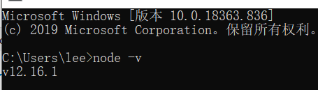

# NodeJs

## 1.NodeJs 简介 安装

### Nodejs介绍

Node.js 是一个 Javascript 运行环境(runtime)。它让 JavaScript 可以开发后端程序， 它几乎能实现其他后端语言能实现的所有功能

Nodejs 官网：https://nodejs.org/en/ 

Npm 包管理：https://www.npmjs.com/

### NodeJs 环境搭建

官网：https://nodejs.org/en/ 

下载地址：https://nodejs.org/en/download/ 

下载稳定版本、双击下一步下一步安装。 

安装完成重新打开 CMD。



## 2.Node.js创建第一个应用

如果我们使用 PHP 来编写后端的代码时，需要 Apache 或者 Nginx 的 HTTP 服务器， 来处理客户端的请求相应。不过对 Node.js 来说，概念完全不一样了。使用 Node.js 时， 我们不仅仅在实现一个应用，同时还实现了整个 HTTP 服务器。

### 1、引入 **http** **模块**

`var http = require("http");`

### 2、创建服务器

```js
const http =require('http');
const url =require('url');

/*
    req   获取客户端传过来的信息
    res  给浏览器响应信息
*/

http.createServer((req,res)=>{

    //http://127.0.0.1?name=zhangsan&age=20  想获取url传过来的name 和age

    //设置响应头
    //状态码是 200，文件类型是 html，字符集是 utf-8
    res.writeHead(200,{"Content-type":"text/html;charset='utf-8'"}); //解决乱码

    res.write("<head> <meta charset='UTF-8'></head>");  //解决乱码    

    console.log(req.url);   //获取浏览器访问的地址

    if(req.url!='/favicon.ico'){

        var userinfo=url.parse(req.url,true).query;
        
        console.log(`姓名：${userinfo.name}--年龄:${userinfo.age}`);
    }

    res.end('你好nodejs');  //结束响应

}).listen(3000);
```

