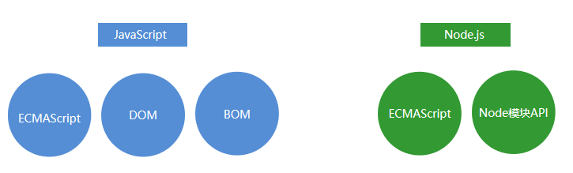

# Node.js 基础

## 1. Node开发概述
Node是一个基于Chrome V8引擎的JavaScript代码运行环境。

浏览器（软件）能够运行JavaScript代码，浏览器就是JavaScript代码的运行环境
Node（软件）能够运行JavaScript代码，Node就是JavaScript代码的运行环境

http://nodejs.cn/api/

## 2. Node.js快速入门
### 2.1 Node.js 的组成
JavaScript 由三部分组成，ECMAScript，DOM，BOM。
**Node.js**是由**ECMAScript及Node 环境**提供的一些附加API组成的，包括文件、网络、路径等等一些更加强大的 API。

### 3.2 Node.js基础语法
所有ECMAScript语法在Node环境中都可以使用。

### 3.3 Node.js全局对象global
在浏览器中全局对象是window，在Node中全局对象是**global**。
Node中全局对象下有以下方法，可以在任何地方使用，global可以省略。

* console.log()     在控制台中输出
* setTimeout()     设置超时定时器
* clearTimeout()  清除超时时定时器
* setInterval()      设置间歇定时器
* clearInterval()   清除间歇定时器

## 3.扩展

**Nodejs 最擅长高并发**：Nodejs 最擅长的就是处理高并发，在 Java、PHP 或者.net 等 服务器端语言中，会为每一个客户端连接创建一个新的线程。而每个线程需要耗费大约 2MB 内存。也就是说，理论上，一个 8GB 内存的服务器可以同时连接的最大用户数为 4000 个左 右。要让 Web 应用程序支持更多的用户，就需要增加服务器的数量，而 Web 应用程序的硬件 成本当然就上升了。Node.js 不为每个客户连接创建一个新的线程，而仅仅使用一个线程。 当有用户连接了，就触发一个内部事件，通过非阻塞 I/O、事件驱动机制，让 Node.js 程序 宏观上也是并行的。使用 Node.js，一个 8GB 内存的服务器，可以同时处理超过 4 万用户的 连接

**Nodejs 可实现的功能多：**Nodejs 不仅可以像其他后端语言一样写动态网站、写接口， 还可以应用在云计算平台、游戏开发、区块链开发、即时通讯、跨平台 App 开发、桌面应用 开发（electron）、云直播、物联网领域等

