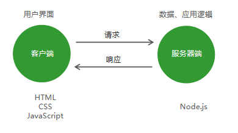
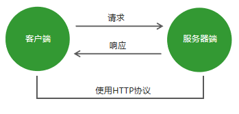
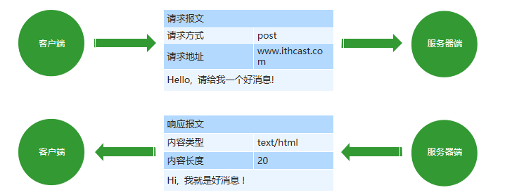
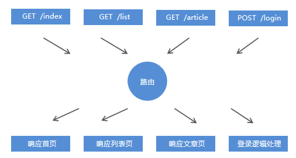

# 请求响应原理及HTTP协议

## 1.  服务器端基础概念
### 1.1 网站的组成
**客户端**：在浏览器中运行的部分，就是用户看到并与之交互的界面程序。使用HTML、CSS、JavaScript构建。
**服务器端**：在服务器中运行的部分，负责存储数据和处理应用逻辑



### 1.2 Node网站服务器 
能够提供网站访问服务的机器就是网站服务器，它能够接收客户端的请求，能够对请求做出响应


### 1.3  IP地址
互联网中设备的唯一标识。
IP是Internet Protocol Address的简写，代表互联网协议地址.

### 1.4 域名
由于IP地址难于记忆，所以产生了域名的概念，所谓域名就是平时上网所使用的网址。
http://www.itheima.com  =>  http://124.165.219.100/
虽然在地址栏中输入的是网址, 但是最终还是会将域名转换为ip才能访问到指定的网站服务器。

### 1.5 端口
端口是计算机与外界通讯交流的出口，用来区分服务器电脑中提供的不同的服务。

### 1.6 URL
统一资源定位符，又叫URL（Uniform Resource Locator），是专为标识Internet网上资源位置而设的一种编址方式，我们平时所说的网页地址指的即是URL

URL的组成
**传输协议://服务器IP或域名:端口/资源所在位置标识**
http：超文本传输协议，提供了一种发布和接收HTML页面的方法。

## 2.  创建web服务器
```js
  // 引用系统模块
 const http = require('http');
  // 创建web服务器
 const app = http.createServer();
  // 当客户端发送请求的时候
 app.on('request', (req, res) => {
        //  响应
       res.end('<h1>hi, user</h1>');
 });
  // 监听3000端口
 app.listen(3000);
 console.log('服务器已启动，监听3000端口，请访问 localhost:3000')

```
## 3.  HTTP协议
### 3.1 HTTP协议的概念
超文本传输协议（英文：HyperText Transfer Protocol，缩写：HTTP）规定了如何从网站服务器传输超文本到本地浏览器，它基于客户端服务器架构工作，是客户端（用户）和服务器端（网站）请求和应答的标准。



### 3.2 报文

在**HTTP请求和响应的过程中传递的数据块就叫报文**，包括要传送的数据和一些附加信息，并且要遵守规定好的格式。



### 3.3 请求报文
#### 1. 请求方式 （Request Method）
GET     请求数据
POST   发送数据

#### 2. 请求地址 （Request URL）
 app.on('request', (req, res) => {
     req.headers  // 获取请求报文
     req.url      // 获取请求地址
     req.method   // 获取请求方法
 });

### 3.4 响应报文
#### 1. HTTP状态码
* 200 请求成功
* 404 请求的资源没有被找到
* 500 服务器端错误
* 400 客户端请求有语法错误

#### 2. 内容类型
* text/html
* text/css
* application/javascript
* image/jpeg
* application/json
```js
// 用于创建网站服务器的模块
const http = require('http');
// 用于处理url地址
const url = require('url');
// app对象就是网站服务器对象
const app = http.createServer();
// 当客户端有请求来的时候
app.on('request', (req, res) => {
	// 获取请求方式
	// req.method
	 console.log(req.method);
	
	// 获取请求地址
	// req.url
	 console.log(req.url);
	
	// 获取请求报文信息
	// req.headers
	 console.log(req.headers['accept']);
	//文本内容，编码
	res.writeHead(200, {
		'content-type': 'text/html;charset=utf8'
	});

	console.log(req.url);
	// 1) 要解析的url地址
	// 2) 将查询参数解析成对象形式
	let { query, pathname } = url.parse(req.url, true);
	console.log(query.name)
	console.log(query.age)

	if (pathname == '/index' || pathname == '/') {
		res.end('<h2>欢迎来到首页</h2>');
	}else if (pathname == '/list') {
		res.end('welcome to listpage');
	}else {
		res.end('not found');
	}
	
	if (req.method == 'POST') {
		res.end('post')
	} else if (req.method == 'GET') {
		res.end('get')
	}

	// res.end('<h2>hello user</h2>');
});
// 监听端口
app.listen(3000);
console.log('网站服务器启动成功');
```

## 4.  HTTP请求与响应处理
### 4.1 请求参数
客户端向服务器端发送请求时，有时需要携带一些客户信息，客户信息需要通过请求参数的形式传递到服务器端，比如登录操作。

### 4.2 GET请求参数
参数被放置在**浏览器地址栏**中，例如：http://localhost:3000/?name=zhangsan&age=20
参数获取需要借助系统模块url，url模块用来处理url地址

```js
 const http = require('http');
 // 导入url系统模块 用于处理url地址
 const url = require('url');
 const app = http.createServer();
 app.on('request', (req, res) => {
     // 将url路径的各个部分解析出来并返回对象
         // true 代表将参数解析为对象格式
     let {query} = url.parse(req.url, true);
     console.log(query);
 });
 app.listen(3000);
```

### 4.3 POST请求参数
参数被放置在**请求体**中进行传输
获取POST参数需要使用**data事件和end事件**
使用**querystring系统模块将参数转换为对象格式**

```js
 // 导入系统模块querystring 用于将HTTP参数转换为对象格式
 const querystring = require('querystring');
 app.on('request', (req, res) => {
     let postData = '';
     // 监听参数传输事件
     req.on('data', (chunk) => postData += chunk;);
     // 监听参数传输完毕事件
     req.on('end', () => { 
         console.log(querystring.parse(postData)); 
     }); 
 });
```

### 4.4 路由
http://localhost:3000/index
http://localhost:3000/login
路由是指客户端请求地址与服务器端程序代码的对应关系。简单的说，就是请求什么响应什么。



```js
// 1.引入系统模块http
// 2.创建网站服务器
// 3.为网站服务器对象添加请求事件
// 4.实现路由功能
//  1.获取客户端的请求方式
//  2.获取客户端的请求地址
const http = require('http');
const url = require('url');
const app = http.createServer();
app.on('request', (req, res) => {
    // 获取请求方式
    const method = req.method.toLowerCase();
    // 获取请求地址
    const pathname = url.parse(req.url).pathname;
    res.writeHead(200, {
        'content-type': 'text/html;charset=utf8'
    });
    if (method == 'get') {
        if (pathname == '/' || pathname == '/index') {
            res.end('欢迎来到首页')
        } else if (pathname == '/list') {
            res.end('欢迎来到列表页')
        } else {
            res.end('您访问的页面不存在')
        }
    } else if (method == 'post') {
    }
});
app.listen(3000);
console.log('服务器启动成功')
```
### 4.5 静态资源
服务器端不需要处理，可以直接响应给客户端的资源就是静态资源，例如CSS、JavaScript、image文件。

```js
const http = require('http');
const url = require('url');
const path = require('path');
const fs = require('fs');
const mime = require('mime');

const app = http.createServer();

app.on('request', (req, res) => {
	// 获取用户的请求路径
	let pathname = url.parse(req.url).pathname;

	pathname = pathname == '/' ? '/default.html' : pathname;

	// 将用户的请求路径转换为实际的服务器硬盘路径
	let realPath = path.join(__dirname, 'public' + pathname);

	let type = mime.getType(realPath)

	// 读取文件
	fs.readFile(realPath, (error, result) => {
		// 如果文件读取失败
		if (error != null) {
			res.writeHead(404, {
				'content-type': 'text/html;charset=utf8'
			})
			res.end('文件读取失败');
			return;
		}

		res.writeHead(200, {
			'content-type': type
		})

		res.end(result);
	});
});

app.listen(3000);
console.log('服务器启动成功')
```
### 4.6 动态资源
相同的请求地址不同的响应资源，这种资源就是动态资源。
http://www.baidu.cn/article?id=1
http://www.baidu.cn/article?id=2


### 4.7 客户端请求途径
#### 1. GET方式
浏览器地址栏
link标签的href属性
script标签的src属性
img标签的src属性
Form表单提交

#### 2. POST方式
Form表单提交

## 5.  Node.js异步编程
### 5.1 同步API, 异步API
**同步API：只有当前API执行完成后，才能继续执行下一个API**
```js
console.log('before'); 
console.log('after');
```
**异步API：当前API的执行不会阻塞后续代码的执行**

```js
console.log('before');
setTimeout(
   () => { console.log('last');
}, 2000);
console.log('after');
```

### 5.2 同步API, 异步API的区别（ 获取返回值 )
同步API可以从**返回值中拿到API执行的结果**, 但是异步API是不可以的
```js
 // 同步
  function sum (n1, n2) { 
      return n1 + n2;
  } 
  const result = sum (10, 20);
  // 异步
  function getMsg () { 
      setTimeout(function () { 
          return { msg: 'Hello Node.js' }
      }, 2000);
  }
  const msg = getMsg ();

```
### 5.3 回调函数
自己定义函数让别人去调用。

```js
  // getData函数定义
 function getData (callback) {}
  // getData函数调用
 getData (() => {});

```
### 5.4 使用回调函数获取异步API执行结果
```js
function getMsg (callback) {
    setTimeout(function () {
        callback ({ msg: 'Hello Node.js' })
    }, 2000);
}
getMsg (function (msg) { 
    console.log(msg);
});

```
### 5.5 同步API, 异步API的区别（代码执行顺序）
**同步API**从上到下依次执行，**前面代码会阻塞后面代码的执行**

```js
for (var i = 0; i < 100000; i++) { 
    console.log(i);
}
console.log('for循环后面的代码');

```
**异步API不会等待**API执行完成后再向下执行代码
```js
console.log('代码开始执行'); 
setTimeout(() => { console.log('2秒后执行的代码')}, 2000);
setTimeout(() => { console.log('"0秒"后执行的代码')}, 0); 
console.log('代码结束执行');
```
### 5.6 代码执行顺序分析
```js
console.log('代码开始执行');
setTimeout(() => {
    console.log('2秒后执行的代码');
}, 2000); 
setTimeout(() => {
    console.log('"0秒"后执行的代码');
}, 0);
console.log('代码结束执行');

```


### 5.7 Node.js中的异步API
```js
fs.readFile('./demo.txt', (err, result) => {});
var server = http.createServer();
server.on('request', (req, res) => {});
```

### 5.8 Promise
Promise出现的目的是解决Node.js异步编程中回调地狱的问题。
```js
let promise = new Promise((resolve, reject) => {
    setTimeout(() => {
        if (true) {
            resolve({name: '张三'})
        }else {
            reject('失败了') 
        } 
    }, 2000);
});
promise.then(result => console.log(result); // {name: '张三'})
       .catch(error => console.log(error); // 失败了)

```

```js
const fs = require('fs');
//回调地狱
// fs.readFile('./1.txt', 'utf8', (err, result1) => {
// 	console.log(result1)
// 	fs.readFile('./2.txt', 'utf8', (err, result2) => {
// 		console.log(result2)
// 		fs.readFile('./3.txt', 'utf8', (err, result3) => {
// 			console.log(result3)
// 		})
// 	})
// });

function p1 () {
	return new Promise ((resolve, reject) => {
		fs.readFile('./1.txt', 'utf8', (err, result) => {
			resolve(result)
		})
	});
}
function p2 () {
	return new Promise ((resolve, reject) => {
		fs.readFile('./2.txt', 'utf8', (err, result) => {
			resolve(result)
		})
	});
}
function p3 () {
	return new Promise ((resolve, reject) => {
		fs.readFile('./3.txt', 'utf8', (err, result) => {
			resolve(result)
		})
	});
}

p1().then((r1)=> {
	console.log(r1);
	return p2();
})
.then((r2)=> {
	console.log(r2);
	return p3();
})
.then((r3) => {
	console.log(r3)
})

```
### 5.9 异步函数
`const fn = async () => {};`
`async function fn () {}`
#### async关键字
1. 普通函数定义前加async关键字 普通函数变成异步函数
2. 异步函数默认返回promise对象
3. 在异步函数内部使用return关键字进行结果返回 结果会被包裹的promise对象中 return关键字代替了resolve方法
4. 在异步函数内部使用throw关键字抛出程序异常
5. 调用异步函数再链式调用then方法获取异步函数执行结果
6. 调用异步函数再链式调用catch方法获取异步函数执行的错误信息
#### await关键字
1. await关键字只能出现在异步函数中
2. await promise await后面只能写promise对象 写其他类型的API是不不可以的
3. await关键字可是暂停异步函数向下执行 直到promise返回结果
```js
// 1.在普通函数定义的前面加上async关键字 普通函数就变成了异步函数
// 2.异步函数默认的返回值是promise对象
// 3.在异步函数内部使用throw关键字进行错误的抛出
// 
// await关键字
// 1.它只能出现在异步函数中
// 2.await promise 它可以暂停异步函数的执行 等待promise对象返回结果后再向下执行函数

 async function fn () {
	throw '发生了一些错误';
 	return 123;
 }

 // console.log(fn ())
 fn ().then(function (data) {
 	console.log(data);
 }).catch(function (err){
 	console.log(err);
 })

async function p1 () {
	return 'p1';
}

async function p2 () {
	return 'p2';
}

async function p3 () {
	return 'p3';
}

async function run () {
	let r1 = await p1()
	let r2 = await p2()
	let r3 = await p3()
	console.log(r1)
	console.log(r2)
	console.log(r3)
}

run();
```


```js
const fs = require('fs');
// 改造现有异步函数api 让其返回promise对象 从而支持异步函数语法
const promisify = require('util').promisify;
// 调用promisify方法改造现有异步API 让其返回promise对象
const readFile = promisify(fs.readFile);

async function run () {
	let r1 = await readFile('./1.txt', 'utf8')
	let r2 = await readFile('./2.txt', 'utf8')
	let r3 = await readFile('./3.txt', 'utf8')
	console.log(r1)
	console.log(r2)
	console.log(r3)
}

run();
```