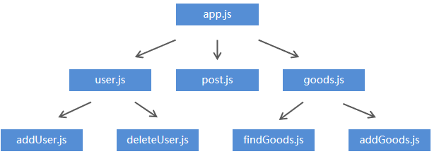
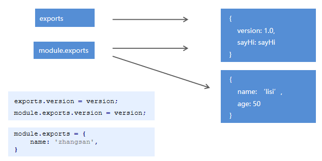
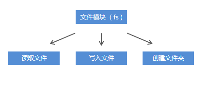

# 模块加载及第三方包

## 1.  exports对象进行成员导出

### 1.1 JavaScript开发弊端
JavaScript在使用时存在两大问题，文件依赖和命名冲突。


### 1.2 软件中的模块化开发
一个功能就是一个模块，多个模块可以组成完整应用，抽离一个模块不会影响其他功能的运行。


### 1.3 Node.js中模块化开发规范
Node.js规定一个**JavaScript文件**就是一个模块，模块**内部定义的变量和函数**默认情况下在外部无法得到
模块内部可以使用**exports对象进行成员导出**， 使用**require方法导入其他模块**。

### 1.4 模块成员导出
```js
  // a.js
  // 在模块内部定义变量
 let version = 1.0;
 // 在模块内部定义方法
 const sayHi = name => `您好, ${name}`;
 // 向模块外部导出数据 
 exports.version = version;
 exports.sayHi = sayHi;
```
### 1.5 模块成员的导入
```js
  // b.js
  // 在b.js模块中导入模块a
 let a = require('./b.js');
  // 输出b模块中的version变量
 console.log(a.version);
  // 调用b模块中的sayHi方法 并输出其返回值
 console.log(a.sayHi('黑马讲师')); 
```
### 1.6 模块成员导出的另一种方式
```js
module.exports.version = version;
module.exports.sayHi = sayHi;
```
exports是module.exports的别名(地址引用关系)，导出对象最终以module.exports为准

### 1.7 模块导出两种方式的联系与区别


## 2.  系统模块
### 2.1 什么是系统模块

Node运行环境提供的API. 因为这些API都是以模块化的方式进行开发的, 又称系统模块




### 2.2 系统模块fs 文件操作
f：file 文件 ，s：system 系统，文件操作系统。
`const fs = require('fs');`
`fs.readFile('文件路径/文件名称'[,'文件编码'], callback);`

```js
// 1.通过模块的名字fs对模块进行引用
const fs = require('fs');

// 2.通过模块内部的readFile读取文件内容
fs.readFile('./01.helloworld.js', 'utf8', (err, doc) => {
	// 如果文件读取出错err 是一个对象 包含错误信息
	// 如果文件读取正确 err是 null
	// doc 是文件读取的结果
	console.log(err);
	console.log(doc);
});
```

`fs.writeFile('文件路径/文件名称', '数据', callback);`

```js
const fs = require('fs');

fs.writeFile('./demo.txt', '即将要写入的内容', err => {
	if (err != null) {
		console.log(err);
		return;
	}
	console.log('文件内容写入成功');
})
```
### 2.3 系统模块path 路径操作
不同操作系统的路径分隔符不统一
/public/uploads/avatar
Windows 上是 \   /
Linux 上是 /

### 2.4 路径拼接语法
`path.join('路径', '路径', ...)`

```js
  // 导入path模块
 const path = require('path');
  // 路径拼接
 let finialPath = path.join('itcast', 'a', 'b', 'c.css');
  // 输出结果 itcast\a\b\c.css
 console.log(finialPath);
```


### 2.5 相对路径VS绝对路径 
>大多数情况下使用绝对路径，因为相对路径有时候相对的是命令行工具的当前工作目录
>在读取文件或者设置文件路径时都会选择绝对路径
>使用__dirname获取当前文件所在的绝对路径
```js
const fs = require('fs');
const path = require('path');
console.log(__dirname);
console.log(path.join(__dirname, 'hello.js'));
fs.readFile(path.join(__dirname, 'hello.js'), 'utf8', (err, doc) => {
    console.log(err);
    console.log(doc);
})
```
## 3.  第三方模块
### 3.1 什么是第三方模块
以js文件的形式存在，提供实现项目具体功能的API接口。
以命令行工具形式存在，辅助项目开发。


### 3.2 获取第三方模块
npmjs.com：第三方模块的存储和分发仓库

**npm** (node package manager) ： node的第三方模块管理工具
下载：npm install 模块名称
卸载：npm unintall package 模块名称

全局安装与本地安装
* 命令行工具：全局安装
*  库文件：本地安装

### 3.3 第三方模块 nodemon
使用`npm install nodemon –g` 下载它
在命令行工具中用nodemon命令替代node命令执行文件

### 3.4 第三方模块 nrm
nrm ( npm registry manager )：npm下载地址切换工具

使用`npm install nrm –g` 下载它
查询可用下载地址列表 nrm ls
切换npm下载地址 nrm use 下载地址名称


### 3.5 第三方模块 Gulp
将机械化操作编写成任务, 想要执行机械化操作时执行一个命令行命令任务就能自动执行了

#### 1. Gulp能做什么

1. 项目上线，HTML、CSS、JS文件压缩合并
2. 语法转换（es6、less ...）
3. 公共文件抽离
4. 修改文件浏览器自动刷新

#### 2. Gulp使用

1. 使用npm install gulp下载gulp库文件
2. 在项目根目录下建立gulpfile.js文件
3. 重构项目的文件夹结构 src目录放置源代码文件 dist目录放置构建后文件
4. 在gulpfile.js文件中编写任务.
5. 在命令行工具中执行gulp任务

#### 3. Gulp中提供的方法
gulp.src()：获取任务要处理的文件
gulp.dest()：输出文件
gulp.task()：建立gulp任务
gulp.watch()：监控文件的变化
#### 4. Gulp插件

* gulp-htmlmin ：html文件压缩
* gulp-csso ：压缩css
* gulp-babel ：JavaScript语法转化
* gulp-less: less语法转化
* gulp-uglify ：压缩混淆JavaScript
* gulp-file-include 公共文件包含
* browsersync 浏览器实时同步
```cmd
 npm install --save gulp-htmlmin

npm install --save-dev gulp-file-include

npm install gulp-less

npm install gulp-csso 

 npm install --save-dev gulp-babel @babel/core @babel/preset-env
 
npm install gulp-uglify
```


```js
// 引用gulp模块
const gulp = require('gulp');
const htmlmin = require('gulp-htmlmin');
const fileinclude = require('gulp-file-include');
const less = require('gulp-less');
const csso = require('gulp-csso');
const babel = require('gulp-babel');
const uglify = require('gulp-uglify');
// 使用gulp.task建立任务
// 1.任务的名称
// 2.任务的回调函数
gulp.task('first', () => {
	console.log('我们人生中的第一个gulp任务执行了');
	// 1.使用gulp.src获取要处理的文件
	gulp.src('./src/css/base.css')
		.pipe(gulp.dest('dist/css'));
});

// html任务
// 1.html文件中代码的压缩操作
// 2.抽取html文件中的公共代码
gulp.task('htmlmin', () => {
	gulp.src('./src/*.html')
		.pipe(fileinclude())
		// 压缩html文件中的代码
		.pipe(htmlmin({ collapseWhitespace: true }))
		.pipe(gulp.dest('dist'));
});

// css任务
// 1.less语法转换
// 2.css代码压缩
gulp.task('cssmin', () => {
	// 选择css目录下的所有less文件以及css文件
	gulp.src(['./src/css/*.less', './src/css/*.css'])
		// 将less语法转换为css语法
		.pipe(less())
		// 将css代码进行压缩
		.pipe(csso())
		// 将处理的结果进行输出
		.pipe(gulp.dest('dist/css'))
});

// js任务
// 1.es6代码转换
// 2.代码压缩
gulp.task('jsmin', () => {
	gulp.src('./src/js/*.js')
		.pipe(babel({
			// 它可以判断当前代码的运行环境 将代码转换为当前运行环境所支持的代码
            presets: ['@babel/env']
        }))
        .pipe(uglify())
        .pipe(gulp.dest('dist/js'))
});

// 复制文件夹
gulp.task('copy', () => {

	gulp.src('./src/images/*')
		.pipe(gulp.dest('dist/images'));

	gulp.src('./src/lib/*')
		.pipe(gulp.dest('dist/lib'))
});

// 构建任务
gulp.task('default', ['htmlmin', 'cssmin', 'jsmin', 'copy']);
```


## 4.  package.json文件
### 4.1 node_modules文件夹的问题
文件夹以及文件过多过碎，当我们将项目整体拷贝给别人的时候,，传输速度会很慢很慢. 
复杂的模块依赖关系需要被记录，确保模块的版本和当前保持一致，否则会导致当前项目运行报错

### 4.2 package.json文件的作用
项目描述文件，记录了当前项目信息，例如项目名称、版本、作者、github地址、当前项目依赖了哪些第三方模块等。
使用`npm init -y`命令生成。

### 4.3 项目依赖
在项目的开发阶段和线上运营阶段，都需要依赖的第三方包，称为项目依赖
使用npm install 包名命令下载的文件会默认被添加到 package.json 文件的 dependencies 字段中

```js
{
    "dependencies": {
        "jquery": "^3.3.1“
    }
 } 
```

 ### 4.4 开发依赖
 在项目的开发阶段需要依赖，线上运营阶段不需要依赖的第三方包，称为开发依赖
使用npm install 包名 --save-dev命令将包添加到package.json文件的devDependencies字段中

```js
  {
    "devDependencies": {
        "gulp": "^3.9.1“
    }
 } 
```

### 4.5 package-lock.json文件的作用
 锁定包的版本，确保再次下载时不会因为包版本不同而产生问题
 加快下载速度，因为该文件中已经记录了项目所依赖第三方包的树状结构和包的下载地址，重新安装时只需下载即可，不需要做额外的工作

## 5.  Node.js中模块的加载机制
### 5.1 模块查找规则-当模块拥有路径但没有后缀时
`require('./find.js');`
`require('./find');`

1. require方法根据模块路径查找模块，如果是完整路径，直接引入模块。
2. 如果模块后缀省略，先找同名JS文件再找同名JS文件夹
3. 如果找到了同名文件夹，找文件夹中的index.js
4. 如果文件夹中没有index.js就会去当前文件夹中的package.json文件中查找main选项中的入口文件
5. 如果找指定的入口文件不存在或者没有指定入口文件就会报错，模块没有被找到


### 5.2 模块查找规则-当模块没有路径且没有后缀时
`require('find');`

1. Node.js会假设它是系统模块
2. Node.js会去node_modules文件夹中
3. 首先看是否有该名字的JS文件
4. 再看是否有该名字的文件夹
5. 如果是文件夹看里面是否有index.js
6. 如果没有index.js查看该文件夹中的package.json中的main选项确定模块入口文件
7. 否则找不到报错