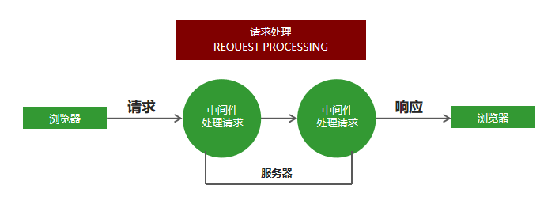

# Express框架

## 1.  Express框架简介及初体验

### 1.1 Express框架是什么
Express是一个基于Node平台的`web应用开发框架`，它提供了一系列的强大特性，帮助你创建各种Web应用。我们可以使用 `npm install express` 命令进行下载。

### 1.2 Express框架特性 

1. 提供了方便简洁的路由定义方式
2. 对获取HTTP请求参数进行了简化处理
3. 对模板引擎支持程度高，方便渲染动态HTML页面
4. 提供了中间件机制有效控制HTTP请求
5. 拥有大量第三方中间件对功能进行扩展
```js
// 引入express框架
const express = require('express');
// 创建网站服务器
const app = express();

app.get('/' , (req, res) => {
	// send()
	// 1. send方法内部会检测响应内容的类型
	// 2. send方法会自动设置http状态码
	// 3. send方法会帮我们自动设置响应的内容类型及编码
	res.send('Hello. Express');
})

app.get('/list', (req, res) => {
	res.send({name: '张三', age: 20})
})

// 监听端口
app.listen(3000);
console.log('网站服务器启动成功');
```

## 2.  Express中间件
### 2.1 什么是中间件
中间件就是一堆方法，可以接收客户端发来的请求、可以对请求做出响应，也可以将请求继续交给下一个中间件继续处理


**中间件方法**由Express提供，负责拦截请求
**请求处理函数**由开发人员提供，负责处理请求。



``app.get('请求路径', '处理函数')   // 接收并处理get请求``
` app.post('请求路径', '处理函数')  // 接收并处理post请求`
可以针对同一个请求设置多个中间件，对同一个请求进行多次处理。

可以调用next方法将请求的控制权交给下一个中间件，直到遇到结束请求的中间件
```js
// 引入express框架
const express = require('express');
// 创建网站服务器
const app = express();

app.get('/request', (req, res, next) => {
	req.name = "张三";
	next();
})

app.get('/request', (req, res) => {
	res.send(req.name)
})

// 监听端口
app.listen(3000);
console.log('网站服务器启动成功');
```

### 2.2 app.use中间件用法
app.use 匹配所有的请求方式，可以直接传入请求处理函数，代表接收所有的请求。
```js
// 引入express框架
const express = require('express');
// 创建网站服务器
const app = express();

// 接收所有请求的中间件
app.use((req, res, next) => {
	console.log('请求走了app.use中间件');
	next()
})

// 当客户端访问/request请求的时候走当前中间件
app.use('/request', (req, res, next) => {
	console.log('请求走了app.use / request中间件')
	next()
})

app.get('/list', (req, res) => {
	res.send('/list')
})

app.get('/request', (req, res, next) => {
	req.name = "张三";
	next();
})

app.get('/request', (req, res) => {
	res.send(req.name)
})

// 监听端口
app.listen(3000);
console.log('网站服务器启动成功');
```
### 2.3 中间件应用

1. 路由保护，客户端在访问需要登录的页面时，可以先使用中间件判断用户登录状态，用户如果未登录，则拦截请求，直接响应，禁止用户进入需要登录的页面。
2. 网站维护公告，在所有路由的最上面定义接收所有请求的中间件，直接为客户端做出响应，网站正在维护中。
3. 自定义404页面
```js
// 引入express框架
const express = require('express');
// 创建网站服务器
const app = express();

// 2..网站公告
app.use((req, res, next) => {
	res.send('当前网站正在维护...')
 })
 
//1. 路由保护
app.use('/admin', (req, res, next) => {
	// 用户没有登录
	let isLogin = true;
	// 如果用户登录
	if (isLogin) {
		// 让请求继续向下执行
		next()
	}else {
		// 如果用户没有登录 直接对客户端做出响应
		res.send('您还没有登录 不能访问/admin这个页面')
	}
})

app.get('/admin', (req, res) => {
	res.send('您已经登录 可以访问当前页面')
})

// 3.为客户端响应404状态码以及提示信息
app.use((req, res, next) => {
	res.status(404).send('当前访问的页面是不存在的')
})

// 监听端口
app.listen(3000);
console.log('网站服务器启动成功');
```
### 2.4 错误处理中间件
在程序执行的过程中，不可避免的会出现一些无法预料的错误，比如文件读取失败，数据库连接失败。
错误处理中间件是一个集中处理错误的地方。
```js
//1. 错误处理中间
app.use((err, req, res, next) => {
	res.status(500).send(err.message);
})
```

```js
app.get('/index', (req, res, next) => {
	// throw new Error('程序发生了未知错误')
	fs.readFile('./01.js', 'utf8', (err, result) => {
		if (err != null) {
			next(err)
		}else {
			res.send(result)
		}
	})
	// res.send('程序正常执行')
})
```
### 2.5 捕获错误
在node.js中，异步API的错误信息都是通过回调函数获取的，支持Promise对象的异步API发生错误可以通过catch方法捕获。
异步函数执行如果发生错误要如何捕获错误呢？
try catch 可以捕获异步函数以及其他同步代码在执行过程中发生的错误，但是不能其他类型的API发生的错误。
```js
// 引入express框架
const express = require('express');
const fs = require('fs');
const promisify = require('util').promisify;
const readFile = promisify(fs.readFile);
// 创建网站服务器
const app = express();

app.get('/index', async (req, res, next) => {
	try {
		await readFile('./aaa.js')
	}catch (ex) {
		next(ex);
	}
})

// 错误处理中间
app.use((err, req, res, next) => {
	res.status(500).send(err.message);
})

// 监听端口
app.listen(3000);
console.log('网站服务器启动成功');
```


## 3.  Express框架请求处理

### 3.1 构建模块化路由
```js
 // home.js
 const home = express.Router(); 
 home.get('/index', () => {
     res.send('欢迎来到博客展示页面');
 });
 module.exports = home;
```
```js
 // admin.js
 const admin = express.Router();
 admin.get('/index', () => {
     res.send('欢迎来到博客管理页面');
 });
 module.exports = admin;
```

```js
 // app.js
 const home = require('./route/home.js');
 const admin = require('./route/admin.js');
 app.use('/home', home);
 app.use('/admin', admin);
```
### 3.2  GET参数的获取
`req.query`即可获取GET参数，框架内部会将GET参数转换为对象并返回。
```js
// 引入express框架
const express = require('express');
// 创建网站服务器
const app = express();

app.get('/index', (req, res) => {
	// 获取get请求参数
	res.send(req.query)
})

// 端口监听
app.listen(3000);
```

### 3.3 POST参数的获取数的获取
接收post请求参数需要借助第三方包 `body-parser`。
```js
// 引入express框架
const express = require('express');
const bodyParser = require('body-parser');
// 创建网站服务器
const app = express();
// 拦截所有请求
// extended: false 方法内部使用querystring模块处理请求参数的格式
// extended: true 方法内部使用第三方模块qs处理请求参数的格式
app.use(bodyParser.urlencoded({extended: false}))

app.post('/add', (req, res) => {
	// 接收post请求参数
	res.send(req.body)
})

// 端口监听
app.listen(3000);
```

### 3.4Express路由参数
```js
// 引入express框架
const express = require('express');
const bodyParser = require('body-parser');
// 创建网站服务器
const app = express();

app.get('/index/:id/:name/:age', (req, res) => {
	// 接收post请求参数
	res.send(req.params)
})

// 端口监听
app.listen(3000);
```

### 3.5 静态资源的处理
通过Express内置的express.static可以方便地托管静态文件，例如img、CSS、JavaScript 文件等
```js
// 实现静态资源访问功能
app.use('/static',express.static(path.join(__dirname, 'public')))
```

## 4.  express-art-template模板引擎

### 4.1 模板引擎
为了使art-template模板引擎能够更好的和Express框架配合，模板引擎官方在原art-template模板引擎的基础上封装了`express-art-template`。
 使用`npm install art-template express-art-template`命令进行安装。
```js
const express = require('express');
const path = require('path');
const app = express();

// 1.告诉express框架使用什么模板引擎渲染什么后缀的模板文件
//  1.模板后缀
//  2.使用的模板疫情
app.engine('art', require('express-art-template'))
// 2.告诉express框架模板存放的位置是什么
app.set('views', path.join(__dirname, 'views'))
// 3.告诉express框架模板的默认后缀是什么
app.set('view engine', 'art');

app.get('/index', (req, res) => {
	// 1. 拼接模板路径
	// 2. 拼接模板后缀
	// 3. 哪一个模板和哪一个数据进行拼接
	// 4. 将拼接结果响应给了客户端
	res.render('index', {
		msg: 'message'
	})
});

app.get('/list', (req, res) => {
	res.render('list', {
		msg: 'list page'
	})
})

// 端口监听
app.listen(3000);
```
### 4.2 app.locals 对象
将变量设置到app.locals对象下面，这个数据在所有的模板中都可以获取到
```js
const express = require('express');
const path = require('path');
const app = express();
// 模板配置
app.engine('art', require('express-art-template'))
app.set('views', path.join(__dirname, 'views'))
app.set('view engine', 'art');

app.locals.users = [{
	name: 'zhangsan',
	age: 20
},{
	name: '李四',
	age: 30
}]

app.get('/index', (req, res) => {
	res.render('index', {
		msg: '首页'
	})
});

app.get('/list', (req, res) => {
	res.render('list', {
		msg: '列表页'
	});
})
// 端口监听
app.listen(3000);
```