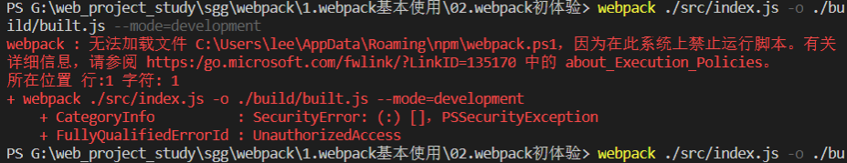

### webpack : 无法加载文件 C:\Users\lee\AppData\Roaming\npm\webpack.ps1，因为在此系统上禁止运行脚本。

解决：
一：打开路径：C:\Windows\System32\WindowsPowerShell\v1.0，以管理员身份运行powershell.exe
二：键入Set-ExecutionPolicy RemoteSigned命令
三：键入y

查看版本:webpack -v
ok!

