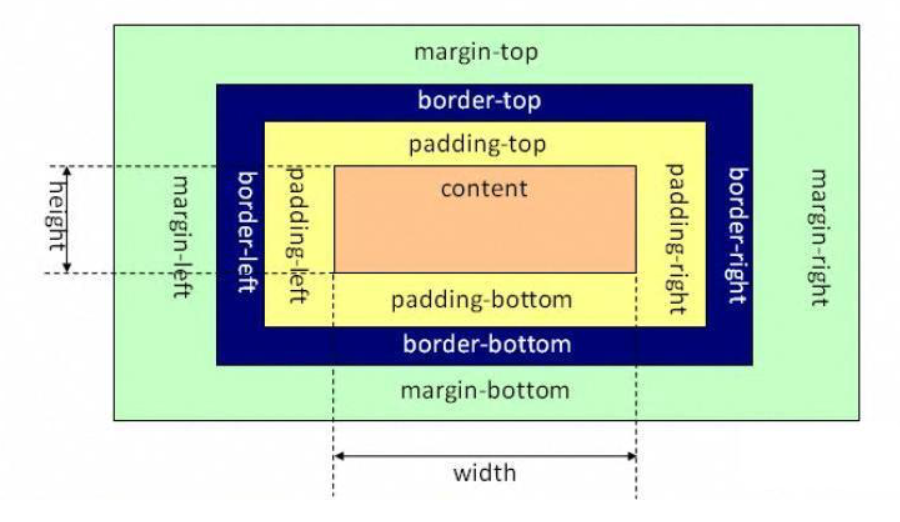
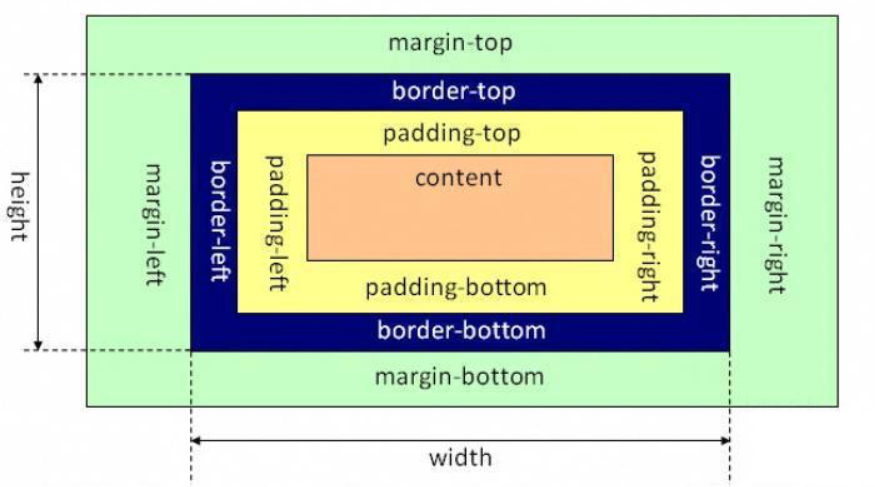
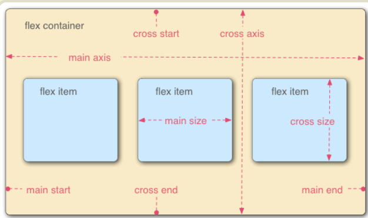

# 盒模型标准

标准盒模型（content-box）、IE怪异盒模型（border-box）、flex弹性伸缩盒模型、column多列盒模型

### 1.标准盒模型



在标准盒模型下，width和height是内容区域即content的width和height。而盒子总宽度为

**在标准模式下，一个块的总宽度= width + margin(左右) + padding(左右) + border(左右)**

### 2.IE怪异盒模型



而IE盒模型或怪异盒模型显而易见的区别就是，width和height除了content区域外，还包含padding和border。盒子的总宽度为

**一个块的总宽度= width + margin(左右)（即width已经包含了padding和border值）**

怪异盒模型的好处，固定到border控制宽高，不用重新计算padding和border

### 3.flex弹性伸缩盒模型(重点)

[Flex 布局教程：语法篇](http://www.ruanyifeng.com/blog/2015/07/flex-grammar.html)

[Flex 布局教程：实例篇](http://www.ruanyifeng.com/blog/2015/07/flex-examples.html)

```css
//容器都可以指定为 Flex 布局。
.box{
      display: flex;
    }

//行内元素也可以使用 Flex 布局。
.box{
  display: inline-flex;
}
```



###  4.多列布局 

[CSS3 多列](https://www.runoob.com/css3/css3-multiple-columns.html)

 将文本内容设计成像报纸一样的多列布局 

