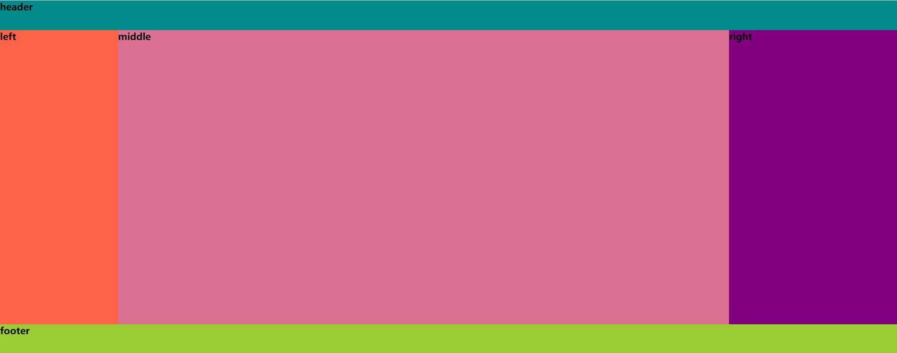
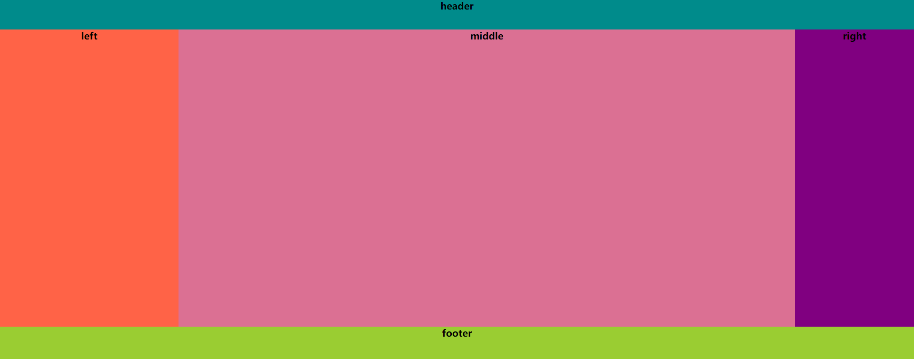

# css布局之圣杯布局和双飞翼布局

 **其实圣杯布局跟双飞翼布局的实现，目的都是左右两栏固定宽度，中间部分自适应。** 

### 1.圣杯布局

```html
<!DOCTYPE html>
<html lang="en">
<head>
    <meta charset="UTF-8">
    <meta name="viewport" content="width=device-width, initial-scale=1.0">
    <meta http-equiv="X-UA-Compatible" content="ie=edge">
    <title>Document</title>
    <style>
        * {
            padding: 0;
            margin: 0;
        }

        header {
            background-color: darkcyan;
            height: 50px;
        }

        .container {
            background-color: cyan;
            overflow: hidden;
            /*4. 因为文字会被left元素挡住，所以使用padding将内容显示出来，同时需要知道left的宽度*/
            padding-left: 200px;
            padding-right: 300px;
        }

        .middle,
        .left,
        .right {
            float: left;
            /*  1. 三者都设置为float left，且三者都有高度*/
            height: 500px;
            /*5. 此时left也会跟着回来，所以使用相对定位*/
            position: relative;

        }

        .middle {
            background-color: palevioletred;
            width: 100%;
            /* 2. middle 宽度使用100% */

        }

        .left {
            width: 200px;
            background-color: tomato;
            margin-left: -100%;
            /*3. 使用margin-left: -100% 将left元素拉回来*/
            /*5.1 对left进行设置*/
            left: -200px;
        }

        .right {
            background-color: purple;
            width: 300px;
            /*5.2 将right盒子拉回*/
            margin-left: -300px;
            right: -300px;
        }

        footer {
            background-color: yellowgreen;
            height: 60px;
        }
    </style>
</head>

<body>
    <header><h4>header</h4></header>
    <div class="container">
        <div class="middle"><h4>middle</h4></div>
        <div class="left"><h4>left</h4></div>
        <div class="right"><h4>right</h4></div>
    </div>
    <footer><h4>footer</h4></footer>
</body>
</html>
```



### 2.双飞翼布局

```html
<!DOCTYPE html>
<html lang="en">

<head>
    <meta charset="UTF-8">
    <meta name="viewport" content="width=device-width, initial-scale=1.0">
    <meta http-equiv="X-UA-Compatible" content="ie=edge">
    <title>双飞翼布局</title>
    <style>
        * {
            padding: 0;
            margin: 0;
            text-align: center;
            word-wrap: break-word;
        }

        header {
            background-color: darkcyan;
            height: 50px;
        }

        .container {

            width: 100%;
            /*2. width:100%*/

        }

        .container,
        .left,
        .right {
            float: left;
            /*1.float*/
            height: 500px;
        }

        .middle {
            background-color: palevioletred;
            margin-left: 300px;
            /*4.使用margin 将左右两边留白*/
            margin-right: 200px;
            height: 500px;
        }

        .left {
            background-color: tomato;
            width: 300px;
            margin-left: -100%;
            /*3.1 将left拉回来*/
        }

        .right {
            background-color: purple;
            width: 200px;
            margin-left: -200px;
            /*3.2 将right拉回来*/
        }

        footer {
            background-color: yellowgreen;
            height: 60px;
            clear: both;
            /*5.使底部恢复  clear 属性规定元素的哪一侧不允许其他浮动元素。*/
        }
    </style>
</head>

<body>
    <header><h4>header</h4></header>
    
    <div class="container">
        <div class="middle"><h4>middle</h4> </div>
    </div>
    <div class="left"><h4>left</h4></div>
    <div class="right"><h4>right</h4></div>

    <footer><h4>footer</h4></footer>
</body>

</html>
```



###  3.使用calc 

```css
.center{
//兼容到IE9+,性能慢
width:calc(100%-400px);
min-height：460px;
background:#ffa07a;
}
```

###  4.使用flex 

[Flex 布局教程：实例篇](http://www.ruanyifeng.com/blog/2015/07/flex-examples.html)

```css
<div class="container">
        <div class="left"><h4>left</h4></div>
        <div class="center"><h4>middle</h4></div>
        <div class="right"><h4>right</h4></div>
</div>

.left,
.right{
	flex: 0 0 200px;
	height:200px;
	background:lightblue;
}
.center{
	flex:1;
	min-height:400px;
	background:orange;
}
```

### 5.定位

```css
<div class="container">
        <div class="left"><h4>left</h4></div>
        <div class="center"><h4>middle</h4></div>
        <div class="right"><h4>right</h4></div>
</div>

.container{
    position:relative;
    right:100%;
}
.left,
.right{
    position:absolute;
    top:0;
    width:200px;
    min-height:200px;
    background:orange;
}
.left{
    left:0;
}
.right{
    right:0;
}
.center{
    margin: 0 200px;
    min-height:400px;
    background:lightblue;
}
```

