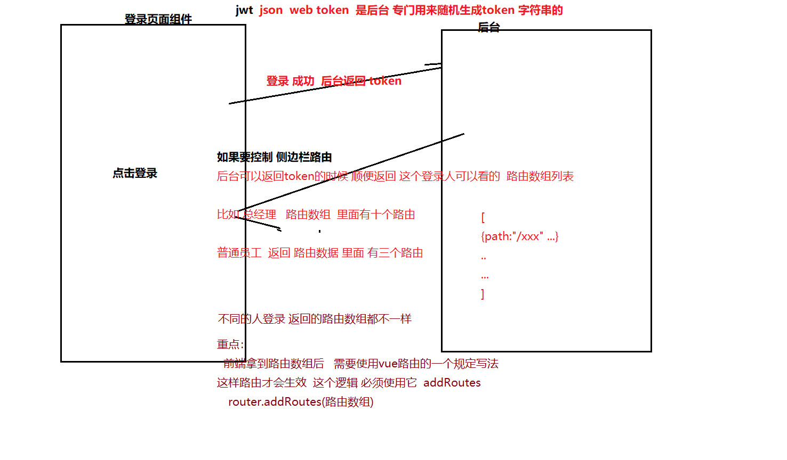

## 前端鉴权一般思路

我们可以 在axios的  请求拦截器 里面 配置 token  

**1 有些axios请求 需要token  我们 是可以 配置请求拦截器**

**2 有些页面 需要登录才能看  我们也可以用路由导航守卫 router.beforeEach  判断 token**

3 新情况？侧边栏 有很多 那么 后台侧边栏 有不同的人登录 难道我们要 每个人都可以看全部侧边栏吗？

​    比如 总经理 看的侧边栏很多 权限大 能操作很多页面

​             普通员工  就只能看两个侧边栏 因为他的权限低

**这个时候就涉及到  如果不同的人登录 权限职位不一样  应该给他展示 不同的侧边栏**

这个时候 侧边栏 一般是路由相关的页面  是需要循环生成的

不同的人 路由数组不一样  那么 循环生成的侧边栏 就不一样了

这样就可以控制侧边栏 显示

 为什么要在前端鉴权? 

因为传统项目都是在后端鉴权, 然后通过进行拦截 跳转 对应操作

因为 我们做的并不是传统的项目,而是前后分离项目,也就是前端项目和后端服务进行了**`剥离`**, 后端没有办法用session来存储你任意一个前端项目域名下的身份信息, 所以jwt 鉴权模式应运而生. 

​    也就是后端不再提供会话的身份存储,而是通过一个鉴权接口将用户的身份,登录时间,请求端口,协议头..等等信息 组装成一个加密的串 返给前端请求,  前端拿到了这个串,就可以认为自己登录成功

那么这个**`加密串`**就成了 前端用户是否登录的成功标志, 这就是我们的token , 那么在接下来的接口请求中,我们几乎都要携带这个加密串,因为它是**`唯一`**能**`证明我们身份`**的信息.

为了方便,我们会一般在请求工具 axios(举例)的拦截器中**`统一注入token`**, 减少代码的重复

token 同时具有时效性,我们也需要在此时对token过期进行处理,一旦出现过期的请求码, 就需要进行 换取新token 或者重新登录的解决方案

除此之外,我们还需要依据**`有无加密串`** 在前端对于某些页面的访问进行限制, 这个会用到我们的Vue-Router中的导航守卫.

**vue 单页项目涉及到多角色用户权限问题，不同的角色用户拥有不同的功能权限， 不同的功能权限对应的不同的页面**

一开始 有一些 默认的路由

登录后 比如你是总经理  后台会返回给前端 总经理能看见的 路由页面地址 数组 

前端在router.beforeEach 路由导航守卫里面 拿到返回的地址  使用 **router.addRouter** 动态加上 这个项目路由就好了

routes= 后台返回的 符合条件的 路由数据 类似我们自己写的那个path 等等
this.$router.addRoutes(routes)

```js
// 路由导航守卫
router.beforeEach((to, from, next) => {
  　　　　//判断user信息是否已经获取 我已经登录了
          // 登录后就 把 后台给我的路由数组 addRouter就行
          if (token) {
  　　　　　　　　//根据用户的角色类型来生成对应的新路由
              //  在这里要用 登录时候后台返回的 路由数组
              // 建议大家 把那个数组 写在 vuex里面
              // 从vuex 拿出 登录时候存的 newRouter
              // 1 你提前写好 会有所有人能看的 一些 默认的路由
              // 2 不同的 登录后  对应的路由 再追加
              // this.$store.state.newRouter
               const newRouter = [{path:"/xxx" ...} ..]
              //将新路由添加到路由中
              // router.addRoutes vue带的专门用来追加路由的
              　router.addRoutes(newRouter)
  　　　　　　　//为了正确渲染导航,将对应的新的路由添加到vuex中
               // 渲染对应的侧边栏
          }
})
```





  如果是**前端 就 先写一个  全的  所有的  路由数组**

   登录之后 后台 返回  当前的登录人的 数据 比如 路由列表或者这个人的权限 

 前端 拿到路由列表 去循环 和你那个全的 路由 对比  拿到相关的  在addRouter添加 就行

