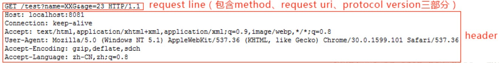
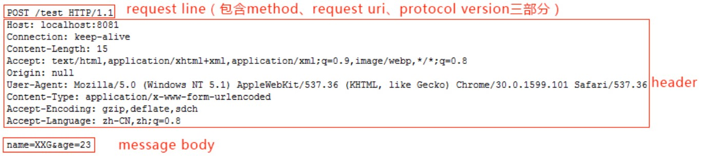

# 一次完整的HTTP服务过程

当我们在web浏览器的地址栏中输入：`www.baidu.com`，具体发生了什么？

1. 对`www.baidu.com`这个网址进行DNS域名解析，得到对应的IP地址 ip  (192.168.1.2)
2. 根据这个IP，找到对应的服务器，发起TCP的三次握手
3. 建立TCP连接后发起HTTP请求
4. 服务器响应HTTP请求，浏览器得到html代码
5. 浏览器解析html代码，并请求html代码中的资源（如js、css、图片等）（先得到html代码，才能去找这些资源）
6. 浏览器对页面进行渲染呈现给用户
7. 服务器关闭关闭TCP连接

## 1.DNS解析：将域名地址解析成ip地址

> DNS域名解析采用的是递归查询的方式:
>
> 先去找DNS缓存->缓存找不到就去找根域名服务器->根域名又会去找下一级，这样递归查找之后，找到了，给我们的web浏览器

### DNS解析过程

a.首先会搜索浏览器自身的DNS缓存（缓存时间比较短，大概只有1分钟，且只能容纳1000条缓存）

b.如果浏览器自身的缓存里面没有找到，那么浏览器会搜索系统自身的DNS缓存

c.如果还没有找到，那么尝试从 hosts文件里面去找

d.在前面三个过程都没获取到的情况下，就递归地去域名服务器去查找，具体过程如下


### DNS优化

两个方面：DNS缓存、DNS负载均衡

\- 浏览器DNS缓存

　　　　--- 系统DNS缓存

　　　　--- 路由器DNS缓存

　　　　--- 网络运营商DNS缓存

　　　　--- 若都没找到则进行递归搜索： 例：blog.baidu.com

　　　　　　　　== .com域名下查找DNS解析

　　　　　　　　== .baidu域名下查找DNS解析

　　　　　　　　== blog域名下查找DNS解析

　　　　　　　　==  出错了

## 2. TCP连接 ：TCP三次握手

### 为什么HTTP协议要基于TCP来实现？  

> TCP是一个端到端的可靠的面相连接的协议，HTTP基于传输层TCP协议不用担心数据传输的各种问题（当发生错误时，会重传）

### TCP过程

拿到域名对应的IP地址之后，User-Agent（一般指浏览器）会以一个随机端口（1024<端口<65535）向服务器的WEB程序（常用的有httpd，nginx）等的80端口。

这个连接请求（原始的http请求经过TCP/IP  4层模型的层层封包）到达服务器端后（这中间有各种路由设备，局域网内除外），进入到网卡，然后是进入到内核的TCP/IP协议栈（用于识别连接请求，解封包，一层一层的剥开），还有可能要经过Netfilter防火墙（属于内核的模块）的过滤，最终达到WEB程序，最终建立了TCP/IP的连接。

## 3.发起HTTP请求(建立连接后)

HTTP请求报文由三部分组成：请求行，请求头、空行 / 请求正文

**请求行：**用于描述客户端的请求方式（GET/POST等），请求的资源名称(URL)以及使用的HTTP协议的版本号

**请求头：**用于描述客户端请求哪台主机及其端口，以及客户端的一些环境信息等

**空行：**空行就是\r\n (POST请求时候有)

**请求正文：**当使用POST等方法时，通常需要客户端向服务器传递数据。这些数据就储存在请求正文中（GET方式是保存在url地址后面，不会放到这里）

举例：

### GET请求

下面是浏览器对 http://localhost:8081/test?name=XXG&age=23的GET 请求时发送给服务器的数据：



可以看出请求包含请求行和请求头两部分。其中请求行中包含 method（例如 GET、POST）、URI（通一资源标志符）和协议版本三部分，三个部分之间以空格分开。请求行和每个请求头各占一行，以换行符 CRLF（即 \r\n）分割。

### POST请求

下面是浏览器对 http://localhost:8081/test 的 POST 请求时发送给服务器的数据，消息体中带上参数 name=XXG&age=23



可以看出，上面的请求包含三个部分：请求行、请求头、空格/消息体，比之前的 GET 请求多了一个请求消息，其中 请求头和消息体之间用一个空行分割。POST 请求的参数不在 URL 中，而是在消息体中，请求头中多了一项 Content-Length 用于表示消息体的字节数，这样服务器才能知道请求是否发送结束。这也就是 GET 请求和 POST 请求的主要区别。

**起始行中的请求方法有哪些？**

> GET: 完整请求一个资源 （常用）
> HEAD: 仅请求响应首部
> POST：提交表单  （常用）
> PUT: (webdav) 上传文件（但是浏览器不支持该方法）
> DELETE：(webdav) 删除
> OPTIONS：返回请求的资源所支持的方法的方法
> TRACE: 追求一个资源请求中间所经过的代理（该方法不能由浏览器发出）

**什么是URL、URI、URN？**

> URI  Uniform Resource Identifier 统一资源标识符
> URL  Uniform Resource Locator 统一资源定位符
> URN  Uniform Resource Name 统一资源名称

URL和URN 都属于 URI，为了方便就把URL和URI暂时都通指一个东西

## 4.接受响应

　--- 响应报文

## 5.渲染页面

> 遇见HTML标记，浏览器调用HTML解析器解析成Token并构建成dom树
>
> 遇见style / link 标记，浏览器调用css解析器，处理css标记并构建cssom树
>
> 遇见script标记，调用JavaScript解析器处理script代码（绑定事件，修改dom树、cssom树。。。。）
>
> 将dom树和cssom树合并成一个渲染树
>
> 根据渲染树来计算布局，计算每个节点的意义（布局）
>
> 将各个节点的颜色绘制到屏幕上（渲染）

注意： 这几个步骤不一定是按照顺序执行，如果dom树被修改了就会执行多次布局和渲染，往往实际页面这些步骤都会执行多次。

边解析，边渲染
JS 单线程运行，JS有可能修改DOM结构，意味着JS执行完成前，后续所有资源的下载是没有必要的，所以JS是单线程，会阻塞后续资源下载


## 6.断开连接：TCP四次挥手

一般情况下，一旦Web服务器向浏览器发送了请求数据，它就要关闭TCP连接，然后如果浏览器或者服务器在其头信息加入了这行代码：

```shell
Connection:keep-alive 
```

TCP连接在发送后将仍然保持打开状态，于是，浏览器可以继续通过相同的连接发送请求。保持连接节省了为每个请求建立新连接所需的时间，还节约了网络带宽。

自此一次完整的HTTP事务宣告完成.

第一次挥手：由浏览器发起，发送给服务器，我东西发完了（请求报文），你准备关闭吧

第二次挥手：由服务器发起，告诉浏览器，我东西接受完了（请求报文），我准备关闭了，你也准备好

第三次挥手：有服务器发起，告诉浏览器，我东西发送完了（响应报文），你准备关吧

第四次挥手：由浏览器发起，告诉服务器，我东西接受完了，我准备关了，你也准备好吧


### 总结

1. 地址栏输入url开始， 域名到ip的过程

2. 拿到ip， 开始建立http请求

3. 拿到html之后的浏览器的渲染过程

   