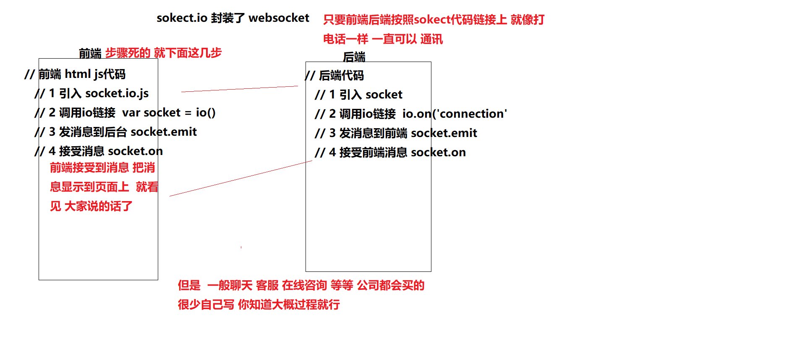

## websocket实现原理

### 即时通讯 实现原理有两种 

1 ajax 轮询    使用定时器 每隔1s时间 发送ajax到后台

2 websocket(常用) 有一个好用的封装的 socket.io
  一般 在公司就是直接买一个就行 一般 只需要引入 他的js 就可以了


### websocket

Websocket是应用层第七层上的一个应用层协议，WebSocket 的最大特点就是，服务器可以主动向客户端推送信息，客户端也可以主动向服务器发送信息，是真正的双向平等对话。

HTTP 有 1.1 和 1.0 之说，也就是所谓的 keep-alive ，把多个 HTTP 请求合并为一个，但是 Websocket 其实是一个新协议，跟 HTTP 协议基本没有关系，只是为了兼容现有浏览器，所以使用了 HTTP 。

客户端首先会向服务端发送一个 HTTP 请求，包含一个 Upgrade 请求头来告知服务端客户端想要建立一个 WebSocket 连接

```js
    var websocket;
        var i = 0;
        if (window.WebSocket) {
          // 原生js就支持的  
          // WebSocket 建立链接后 就不会在断  相当于打电话 只要不挂断就一直可以通讯
          // 1 前端必须按照步骤写上链接WebSocket 2 后台也需要对应链接上WebSocket
          // 对应我们来说 有封装了sockect.io 他就是封装 WebSocket
          // 1 new WebSocket
            websocket = new WebSocket('ws://127.0.0.1:3000');

            //2 连接建立 websocket.onopen
            websocket.onopen = function (evevt) {
                console.log("WebSocket 链接上了");
                $('.show-area').append('<p class="bg-info message"><i class="glyphicon glyphicon-info-sign"></i>Connected to WebSocket server!</p>');
            }
            //3 收到后台发来消息就会执行 websocket.onmessage 
            websocket.onmessage = function (event) {
              // 在这里就 解析判断 后台返回什么数据 对应操作
                var msg = JSON.parse(event.data); //解析收到的json消息数据

                var type = msg.type; // 消息类型
                var umsg = msg.message; //消息文本
                var uname = msg.name; //发送人
                i++;
                if (type == 'usermsg') {
                    $('.show-area').append('<p class="bg-success message"><i class="glyphicon glyphicon-user"></i><a name="' + i + '"></a><span class="label label-primary">' + uname + ' : </span>' + umsg + '</p>');
                }
                if (type == 'system') {
                    $('.show-area').append('<p class="bg-warning message"><a name="' + i + '"></a><i class="glyphicon glyphicon-info-sign"></i>' + umsg + '</p>');
                }

                $('#message').val('');
                window.location.hash = '#' + i;
            }

            //发生错误 链接出错
            websocket.onerror = function (event) {
                i++;
                console.log("Connected to WebSocket server error");
                $('.show-area').append('<p class="bg-danger message"><a name="' + i + '"></a><i class="glyphicon glyphicon-info-sign"></i>Connect to WebSocket server error.</p>');
                window.location.hash = '#' + i;
            }

            //连接关闭 关闭链接
            websocket.onclose = function (event) {
                i++;
                console.log('websocket Connection Closed. ');
                $('.show-area').append('<p class="bg-warning message"><a name="' + i + '"></a><i class="glyphicon glyphicon-info-sign"></i>websocket Connection Closed.</p>');
                window.location.hash = '#' + i;
            }
```


```js
  <script src="/socket.io/socket.io.js"></script>
  <script>
    // 前端 html js代码
    // 1 引入 socket.io.js 
    // 2 调用io链接  var socket = io() // 相当于new websocket io给我们封装了
    // 3 发消息到后台 socket.emit("自己定义的", 参数) 
    // 4 接受消息 socket.on("自己定义的", function(msg) {})
    var name   = prompt("请输入你的昵称：");
    var socket = io()
    
    //发送昵称给后端，并更改网页title
    socket.emit("join", name)
    document.title = name + "的群聊"

    socket.on("join", function (user) {
      addLine(user + " 加入了群聊")
    })

    //接收到服务器发来的message事件
    socket.on("message", function(msg) {
      addLine(msg)
    })

    //当发送按钮被点击时
    $('form').submit(function () {
      var msg = $("#m").val() //获取用户输入的信息
      socket.emit("message", msg) //将消息发送给服务器
      $("#m").val("") //置空消息框
      return false //阻止form提交
    })

    function addLine(msg) {
      $('#messages').append($('<li>').text(msg));
    }
  </script>
```



### WebSocket 特点

- 建立在 TCP 协议之上，服务器端的实现比较容易。
- 与 HTTP 协议有着良好的兼容性。默认端口也是80和443，并且握手阶段采用 HTTP 协议，因此握手时不容易屏蔽，能通过各种 HTTP 代理服务器。
- 数据格式比较轻量，性能开销小，通信高效。
- 可以发送文本，也可以发送二进制数据。
- 没有同源限制，客户端可以与任意服务器通信。
- 协议标识符是ws（如果加密，则为wss），服务器网址就是 URL。

前端需要 链接websocket   后端也需要链接  两个才可以通讯 所以这个事  必须前后端配合  

