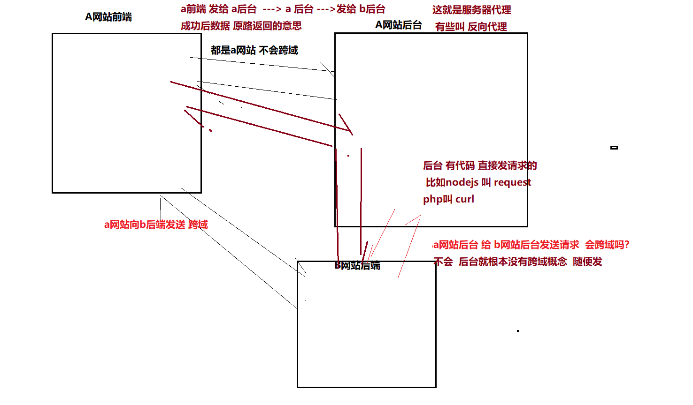

## 跨域

### 3.1 什么是跨域？

  域名 协议 ip地址 端口 任何一个不一样 就跨域



### 3.2解决跨域？

#### 1 一种是服务端设置

但这种方式依赖服务端的设置,在前后分离的场景下 ,不太方便

```php
// php所有后台设置头部 而且 代码都类似
header('Access-Control-Allow-Origin:*'); // *代表允许任何网址请求
header('Access-Control-Allow-Methods:POST,GET,OPTIONS,DELETE'); // 允许请求的类型

//java
@CrossOrigin 
```

#### 2 jsonp形式 

可以利用script标签 的特性解决同源策略带来的跨域问题,但这是这种方案对于请求的类型有限制,只能get

#### 3  服务器代理  vue 框架设置 服务器代理的  proxy

 就是通过 在本地通过nodejs 启动一个微型服务, 

然后我们先请求我们的微型服务, 微型服务是服务端, 服务端**`代我们`**去请求我们想要的跨域地址, 因为服务端是不受**`同源策略`**的限制的, 具体到开发中,打包工具webpack集成了代理的功能,可以采用配置webpack的方式进行解决, 但是这种仅限于 本地开发期间, **等项目上线时,还是需要另择代理 nginx**

以下为webpack配置代理的配置 

```js
// vue.config.js
// 配置之后重启 

// vue脚手架帮你 开启了一个隐藏的服务器 帮你转发了
module.exports = {
  // 修改的配置 配置 proxy 服务器代理
  // "/api/getok.php"
  // http://122.51.238.153/getok.php
  devServer: {
      proxy: {
        //  如果你的地址 以 /api 开头 他就会请求到 http://122.51.238.153
          '/api': {
              target: 'http://122.51.238.153',
              changeOrigin: true,
              // ws: true,
              pathRewrite: {
                '^/api': '' // 请求的时候 /api就会替换成 ''
              }
          }
      }
  }
}
```

**`target`**：接口域名；

 **`changeOrigin`**： 如果设置为`true`,那么本地会虚拟一个服务端接收你的请求并代你发送该请求；

 **`pathRewrite`**：如果接口中是没有api的，那就直接置空（如上）如果接口中有api，就需要写成{‘^/api’:‘’}

## 4.Vue中的watch如何深度监听某个对象

watch最基本的用法是 

```js
export default {
 data () {
     return {
         name: '张三'
     }
 },
 watch: {
     name (newValue, oldValue) {
         
     }
 }
}
```

上面代码中: 有个原则监听谁,写谁的名字,然后是对应的执行函数, 第一个参数为最新的改变值,第二个值为上一次改变的值, 注意: 除了监听 data,也可以监听**`计算属性`** 或者一个 函数的计算结果

那怎么深度监听对象 ,两种方式

1. 字符串嵌套方式

```js
export default {
 data () {
     return {
        a: {
            b: {
                c :'张三'
            }
        }
     }
 },
 watch: {
     "a.b.c": function (newValue, oldValue) {
         
     }
 }
}
```

2. 启用深度监听方式

```js
export default {
    data () {
        return {
           a: {
               b: {
                   c :'张三'
               }
           }
        }
    },
    watch: {
        a: {
            deep: true // deep 为true  意味着开启了深度监听 a对象里面任何数据变化都会触发handler函数,
            handler(){
               // handler是一个固定写法
            }
        }
    }
}
```

