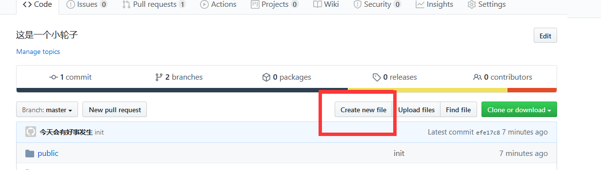
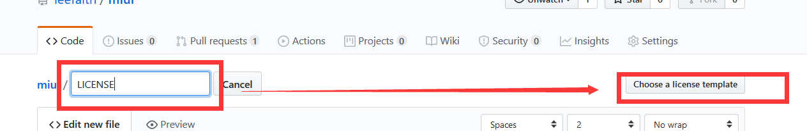
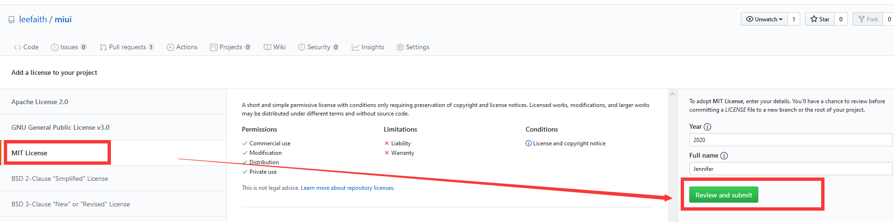
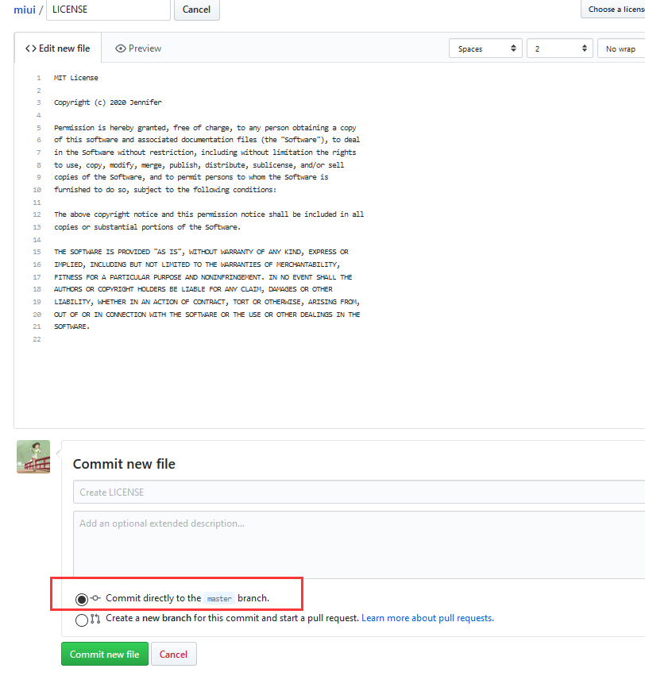
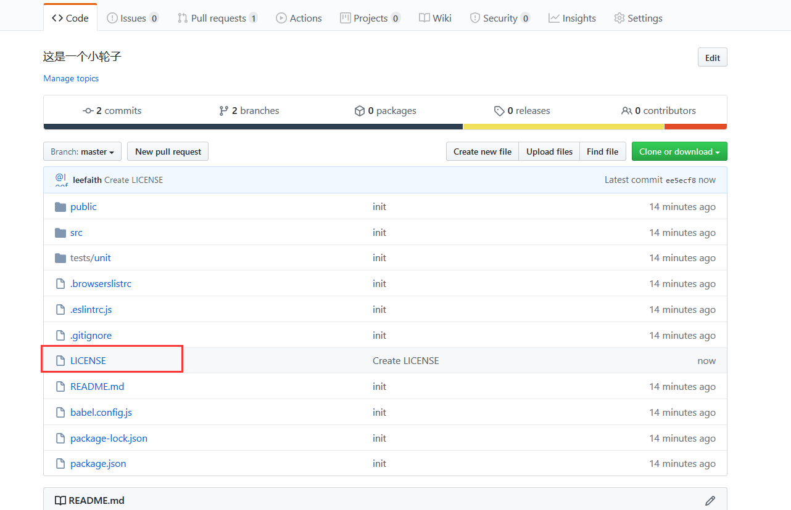

在我们将代码上传到cocoapods时需要许可说明，
 常见许可证如
 `Apache License 2.0`  
 `GNU General Public License v3.0`
 `MIT License`
 GitHub有提供最直接的创建方式,步骤例

 在输入`LICENSE`后会自动出现 `Choose a license template`选项按钮,点击 

 以`MIT License`为例，选好所需许可后点击`Review and submit` 

在页面下方会有两个选择
 选择一 `Commit directly to the master branch.`
 直接将此许可证提交到`master`分支
 选择二 `Create a new branch for this commit and start a pull request.`
 新建立一个分支

 选择 `Commit directly to the master branch.`提交到`master`后点击 `Commit new file`即可创建完成 

