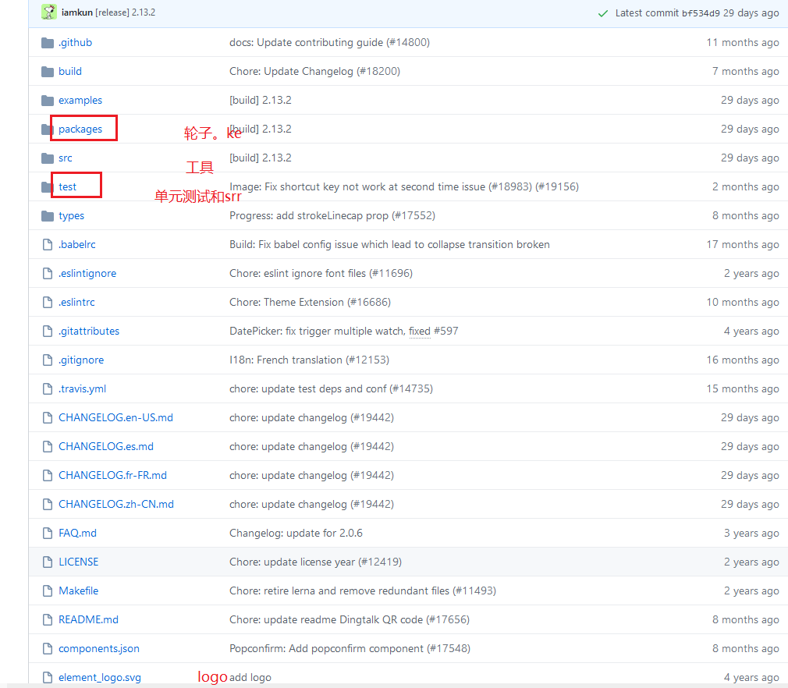

##  Element 

 [https://github.com/ElemeFE/element](https://links.jianshu.com/go?to=https%3A%2F%2Fgithub.com%2FElemeFE%2Felement) 

 基于Vue.js 2.0 UI 工具包    Star 数将近 46K   推荐网页后台用。不错。

轮子书写和单元测试代码可以参考，写的代码非常不错。

## Ant Design Vue

https://www.antdv.com/docs/vue/introduce-cn/

##  Vuetify 

https://vuetifyjs.com/zh-Hans/

 star25.9k  上手确实有一定难度,毕竟和外国人思想有点不一样 。不怎么用

## iView    

 http://iview.talkingdata.com 

star 23.3k 还不错。

## mint-ui

https://github.com/ElemeFE/mint-ui

适合移动端，虽然star16k但是2年前停止更新，样式较老。不推荐

## vant

https://youzan.github.io/vant 

适合移动端 star 14k推荐，最近有维护

## vux

 https://vux.li/ 

 Vue & WeUI         

star 17k    有些组件有点老了。还行

## VueUi 

 https://vuejs.github.io/ui/ 

star1.7k 适合做一些官方机构的UI库。每个组件都不错。但是少。最近没更新。

## cube-ui

  https://didi.github.io/cube-ui/ 

star 8.1k 滴滴出品。用过，还不错。貌似弃坑了。

## uni-app

https://uniapp.dcloud.io/

 Vue.js 开发方式的跨端开发框架