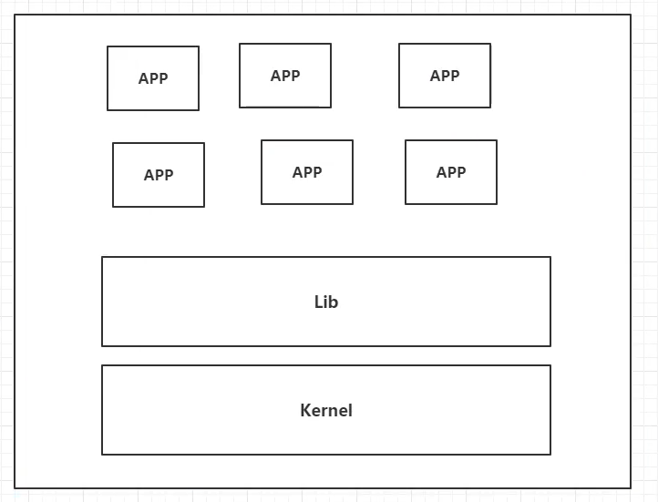
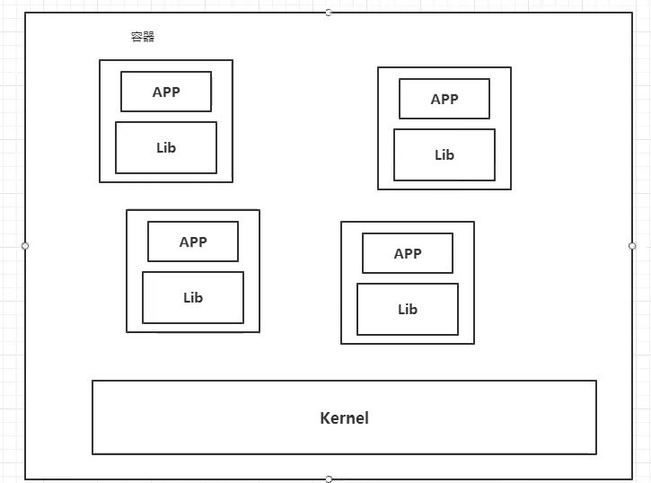
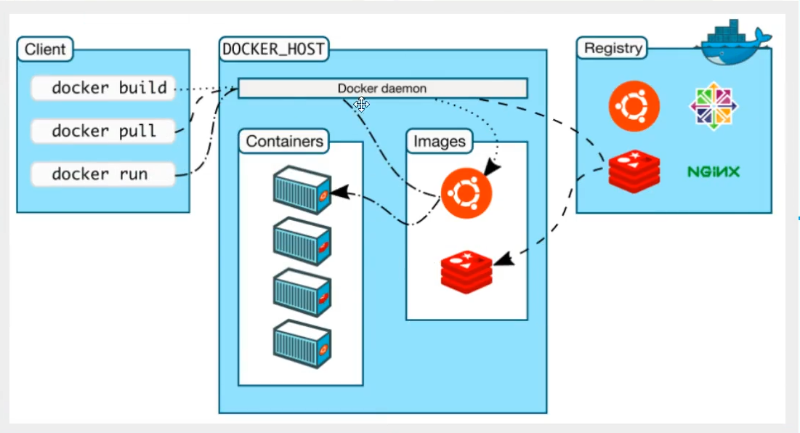

## Docker概述

### Docker为什么出现？

一款产品：开发上线，两套环境。应用环境，应用配置。

开发运维：环境配置麻烦，每个机器都要部署环境，费时费力。

发布一个项目（jar+(Redis MySQL jdk ES )）项目能不能带上环境打包

现在：开发打包部署上线，一套流程做完。

java- apk -发布（应用商店）--lisa下载即可用！

java - jar （环境）--打包上线带上环境（镜像）---放在（Docker仓库：上商店） --下载发布镜像---直接运行即可

### Docker解决问题

思想来源集装箱

JRE --多个应用（端口冲突)

隔离：Docker核心思想！打包装箱！每个箱子互相隔离

Docker通过隔离机制，可以将服务器利用到极致！

### Docker历史

 Docker 公司起初是一家名为 dotCloud 的平台即服务（Platform-as-a-Service, PaaS）提供商。 

没人注意，活不下去，:sob: 然后2013开源了。然后火了:tada:

为啥这么火？十分轻巧。:anguished:

在之前，使用虚拟机技术。

虚拟机：window装一个Vmware,虚拟多台电脑。十分笨重（想起一节课只装一个虚拟机的噩梦）:tornado:

虚拟机属于虚拟化技术，Docker容器技术也是一种虚拟化技术。:smirk:

> vm:linux centos 原生镜像（一个电脑） 隔离需要开启多个虚拟机 几个G 几分钟
>
> docker:隔离，镜像（最核心环境4m + jdk+mysql）十分小巧，运行镜像就可以。小巧 。几个M  秒级启动
>

开发人员都要会Docker

### 聊聊Docker

Docker基于Go语言开发（最近了解这个语言好厉害:thumbsup:又要学）

开源项目！

官网：https://www.docker.com/

文档：https://docs.docker.com/ 

仓库地址：https://hub.docker.com/  

### 虚拟机技术

缺点：资源占用多，冗余步骤多，启动慢

### 容器化技术

不是模拟一个完整的操作系统

不同之处：:point_down:

* 传统虚拟机，虚拟一条硬件，运行一个完整的操作系统，系统上安装和运行软件
* 容器内的应用直接运行在宿主机的内容，容器没有内核，也没有虚拟硬件，所以轻便
* 每个容器互相隔离，每个容器内有过一个属于自己的文件系统，互不影响。

DevOps(开发、运维)
**应用更快速交付，安装程序**
传统：一堆文档，
安装程序 Docker  打包镜像 ，发布测试，一键运行

**更便捷升级和扩缩容**

打包为一个镜像，扩展服务器A，服务器B

**更简单的系统运维**

开发，测试环境高度一致

**更高效的计算机资源利用**

Docker是内核虚拟化，可以在一个物理机上运行很多实例！服务器性能upupup!

## Docker安装

### Docker基本组成

#### 镜像（image）：

#### 容器（container）：

#### 仓库（repository）：

to be continued ->(我也不知道啥时候填坑)