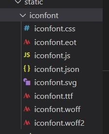
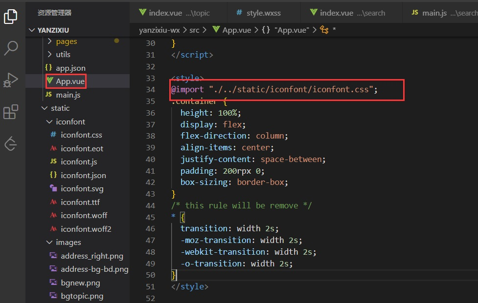
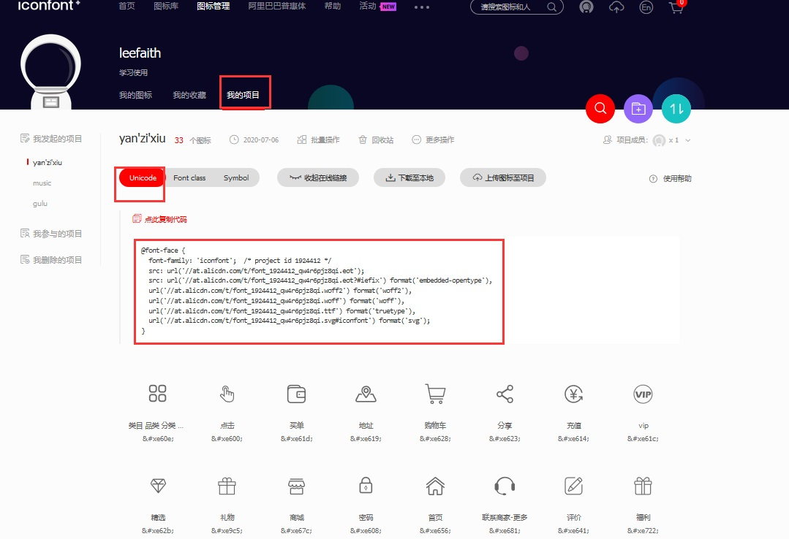
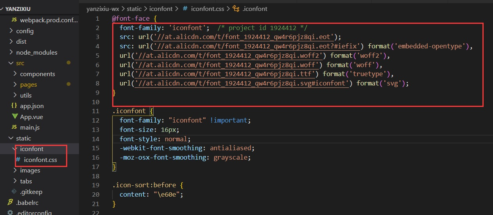
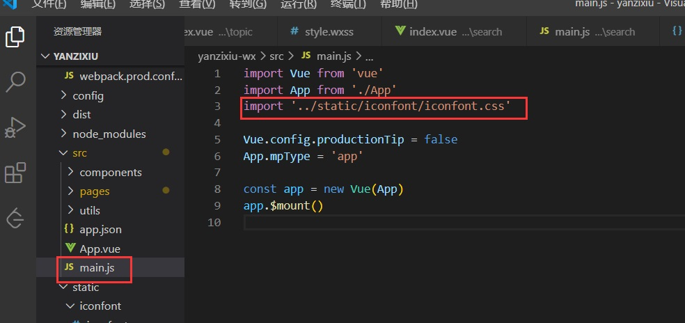

# mpvue—引入iconfont字体图标

 下载好的字体图标放在static目录下,  创建了一个iconfont目录便于区分 



### 本地引用

在App.vue中引用

```
@import "./../static/iconfont/iconfont.css";
```



```
$ npm run build
```

使用

```
<div class=" iconfont icon-search">搜索</div>
```

### 在线引用



本地的iconfont的所有文件都可删除，只留一个css的即可。

然后将复制的在线链接替换到本地即可。




引入

 在main.js中引入,其实在main.js和APP.vue中引入,并无过大的区别。 

main.js 是我们的程序入口文件，主要作用是初始化vue实例并使用需要的插件

App.vue是我们的主组件，页面入口文件 ，所有页面都是在App.vue下进行切换的。也是整个项目的关键，app.vue负责构建定义及页面组件归集。

```
import '../static/iconfont/iconfont.css'
```



```
$ npm run build
```

 使用

```
<div class=" iconfont icon-search">搜索</div>
```

