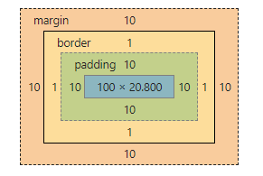
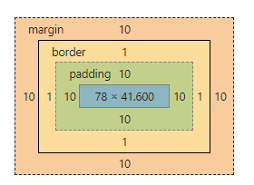
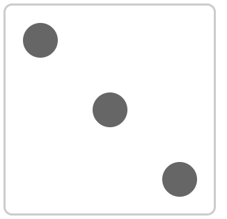

# 前端css面试小结

## 1.盒模型

```css
     #div1 {
            width: 100px;
            padding: 10px;
            border: 1px solid #ccc;
            margin: 10px;
        }

<body>
    <div id="div1">
        this is div1
    </div>

    <script>
        console.log( document.getElementById('div1').offsetWidth);  //122
    </script>
</body>
```



> 考点：offsetWidth=（内容宽度+内边距+边框），无外边距
>

```css
    #div1 {
            width: 100px;
            padding: 10px;
            border: 1px solid #ccc;
            margin: 10px;
            box-sizing: border-box;/*Width变化  offsetWidth ->100*/
        }
```



## 2.margin 纵向重叠问题

> 考点：
>
> 相邻元素的margin-top和margin-bottom会发生重叠
> 空白内容的<p></p>也会重叠

```css
   p {
            font-size: 16px;
            line-height: 1;
            margin-top: 10px;
            margin-bottom: 15px;
        }
        
    <p>AAA</p>
    <p></p>
    <p></p>
    <p></p>
    <p>BBB</p>
 
//15px
```

## 3.margin 负值问题

> 考点：
>
> margin-top和margin-left负值，元素向上、向左移动
>
> margin-right负值，右侧元素左移，**自身不受影响**
>
> margin-bottom负值，下方元素上移，**自身不受影响**

## 4.BFC 理解与应用

> 考点：
>
> Block format context，块级格式化上下文
>
> 一块独立渲染区域，内部元素的渲染不会影响边界以外的元素

形成BFC的常见条件

- float不是none
- position 是absolute 或fixed
- overflow 不是visible
- display 是flex inline-block等

```css
 		.container {
            background-color: #f1f1f1;
        }
        .left {
            float: left;
        }
        .bfc {
            overflow: hidden; /* 触发元素 BFC */
        }

    <div class="container bfc">
        
        <p class="bfc">某一段文字……</p>
    </div>
```


## 5.float 布局

圣杯布局和双飞翼布局的目的

- 三栏布局，中间一栏最先加载和渲染（内容最重要）
- 两侧内容固定，中间内容随着宽度自适应
- 一般用于PC网页

> 圣杯布局和双飞翼布局的技术总结：
>
> 使用float布局
>
> 两侧使用margin负值，以便和中间内容横向重叠
>
> 防止中间内容被两侧覆盖，一个用padding一个用margin

### 圣杯布局

```html
    <style type="text/css">
        body {
            min-width: 550px;
        }
        #header {
            text-align: center;
            background-color: #f1f1f1;
        }

        #container {
            padding-left: 200px;
            padding-right: 150px;
        }
        #container .column {
            float: left; /*浮动*/
        }

        #center {
            background-color: #ccc;
            width: 100%;
        }
        #left {
            background-color: yellow;
            width: 200px;
            position: relative; /*关键*/
            margin-left: -100%;
            right: 200px;
        }
        #right {
            background-color: red;
            width: 150px;
            margin-right: -150px;/*相当于没宽了，就浮动了*/
        }

        #footer {
            clear:both
            text-align: center;
            background-color: #f1f1f1;
        }

    </style>
</head>
<body>
    <div id="header">this is header</div>
    <div id="container" >
        <div id="center" class="column">this is center</div>
        <div id="left" class="column">this is left</div>
        <div id="right" class="column">this is right</div>
    </div>
    <div id="footer">this is footer</div>
</body>
```

### 双飞翼布局

```css
  body {
            min-width: 550px;
        }
        .col {
            float: left;
        }

        #main {
            width: 100%;
            height: 200px;
            background-color: #ccc;
        }
        #main-wrap {
            margin: 0 190px 0 190px;/* 重点*/
        }

        #left {
            width: 190px;
            height: 200px;
            background-color: #0000FF;
            margin-left: -100%; /* 重点*/
        }
        #right {
            width: 190px;
            height: 200px;
            background-color: #FF0000;
            margin-left: -190px;/* 重点*/
        }
    </style>
</head>
<body>
    <div id="main" class="col">
        <div id="main-wrap">
            this is main
        </div>
    </div>
    <div id="left" class="col">
        this is left
    </div>
    <div id="right" class="col">
        this is right
    </div>
</body>
```

## 6.手写清除浮动

```css
         .clearfix:after {
            content: '';
            display: table;
            clear: both;
        }
        .clearfix{
            *zoom : 1;/* 兼容低版本*/
        }
```

## 7.flex布局(色子)

> 考点：
>
> - flex-direction
> - flex-wrap
> - flex-flow
> - justify-content
> - align-items
> - align-content

```css
  .box {
            width: 200px;
            height: 200px;
            border: 2px solid #ccc;
            border-radius: 10px;
            padding: 20px;

            display: flex;  /* 重点*/
            justify-content: space-between;
        }
        .item {
            display: block;
            width: 40px;
            height: 40px;
            border-radius: 50%;
            background-color: #666;
        }
        .item:nth-child(2) {
            align-self: center;   /* 重点*/
        }
        .item:nth-child(3) {
            align-self: flex-end; /* 重点*/
        }

  <div class="box">
        <span class="item"></span>
        <span class="item"></span>
        <span class="item"></span>
    </div>
```



## 8.absolute 和relative 定位

relative 依据自身定位
absolute 依据最近一层的定位元索定位

定位元素

- absolute relative fixed
- body

```css
   body {
            margin: 20px;
        }
        .relative {
            position: relative; /* 重点*/
            width: 400px;
            height: 200px;
            border: 1px solid #ccc;

            top: 20px; /* 重点*/
            left: 50px;
        }
        .absolute {
            position: absolute; /* 重点*/
            width: 200px;
            height: 100px;
            border: 1px solid blue;

            top: 20px; /* 重点*/
            left: 50px;
        }

  <div class="relative">
        <div class="absolute">
            this is absolute
        </div>
    </div>
```

## 9.居中对齐的实现方式

### 水平居中

> inline 元素：text-align:center
>
> block元素：margin:auto
>
> absolute 元素：left：50%+margin-left负值

### 垂直居中

> inline 元素：line-height 的值等于height值
>
> absolute元素：top：50%+margin-top负值
>
> absolute元素：transform（-50%，-50%）
>
> absolute 元素：top，left，bottom，right = 0 + margin:auto

```css
  .container {
            border: 1px solid #ccc;
            margin: 10px;
            padding: 10px;
        }
        .item {
            background-color: #ccc;
        }

        .container-1 {
            text-align: center;
        }

        .container-2 .item {
            width: 500px;
            margin: auto;
        }

        .container-3 {
            position: relative;
            height: 100px;
        }
        .container-3 .item {
            width: 300px;
            height: 100px;
            position: absolute;
            left: 50%;
            margin-left: -150px;
        }

<div class="container container-1">
        <span>一段文字</span>
    </div>

    <div class="container container-2">
        <div class="item">
            this is block item
        </div>
    </div>

    <div class="container container-3">
        <div class="item">
            this is absolute item
        </div>
    </div>
```

```css
.container {
            border: 1px solid #ccc;
            margin: 10px;
            padding: 10px;
            height: 200px;
        }
        .item {
            background-color: #ccc;
        }

        .container-1{
            text-align: center;
            line-height: 200px;
            height: 200px;
        }

        .container-2 {
            position: relative;
        }
        .container-2 .item {
            width: 300px;
            height: 100px;
            position: absolute;
            left: 50%;
            margin-left: -150px;
            top: 50%;
            margin-top: -50px;
        }

        .container-3 {
            position: relative;
        }
        .container-3 .item {
            width: 200px;
            height: 80px;
            position: absolute;
            left: 50%;
            top: 50%;
            transform: translate(-50%, -50%)
        }

        .container-4 {
            position: relative;
        }
        .container-4 .item {
            width: 100px;
            height: 50px;
            position: absolute;
            top: 0;
            left: 0;
            bottom: 0;
            right: 0;
            margin: auto;
        }
        
        <div class="container container-1">
        <span>一段文字</span>
    </div>

    <div class="container container-2">
        <div class="item">
            this is item
        </div>
    </div>

    <div class="container container-3">
        <div class="item">
            this is item
        </div>
    </div>

    <div class="container container-4">
        <div class="item">
            this is item
        </div>
    </div>
```

## 10.CSS-图文样式

### line-height 如何继承

> 写具体数值，如30px，则继承该值（比较好理解）
>
> 写比例，如2/1.5，则继承该比例（比较好理解）
>
> 写百分比，如200%，则继承计算出来的值（考点）

```css
 body {
            font-size: 20px;
     		line-height: 30px;  /*p 30px*/
     		line-height: 2;     /*p 32px*/
            line-height: 200%; /*p 40px*/
        }
        p {
            background-color: #ccc;
            font-size: 16px;
        }

 <p>这是一行文字</p>
```

## 11.CSS-响应式

### rem 是什么

> rem是一个长度单位
>
> px，绝对长度单位，最常用
>
> em，相对长度单位，相对于父元素，不常用
>
> rem，相对长度单位，相对于**根元素**，常用于响应式布局

### 响应式布局的常用方案

> media-query，根据不同的屏幕宽度设置根元素font-size 
>
> rem，基于根元素的相对单位

```css
@media only screen and (max-width: 374px) {
            /* iphone5 或者更小的尺寸，以 iphone5 的宽度（320px）比例设置 font-size */
            html {
                font-size: 86px;
            }
 }
 @media only screen and (min-width: 375px) and (max-width: 413px) {
            /* iphone6/7/8 和 iphone x */
            html {
                font-size: 100px;
            }
 }
@media only screen and (min-width: 414px) {
            /* iphone6p 或者更大的尺寸，以 iphone6p 的宽度（414px）比例设置 font-size */
            html {
                font-size: 110px;
            }
}

body {
            font-size: 0.16rem;
        }
        #div1 {
            width: 1rem;
            background-color: #ccc;
        }
```

### vw/vh

rem的弊端：“阶梯”性(上面code所示)

```js
//网页视口尺寸
window.screen.height  //屏幕高度
window.innerHeight   //网页视口高度
document.body.clientHeight  //body 高度
```

vh网页视口高度的1/100
vw网页视口宽度的1/100

vmax取两者最大值；vmin 取两者最小值