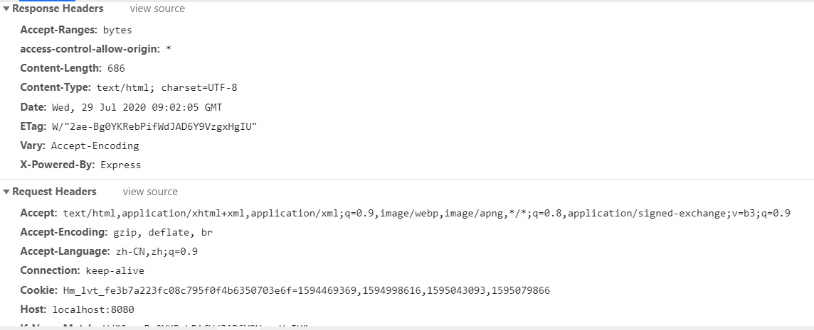
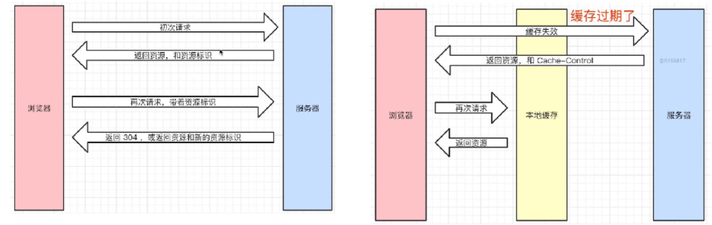
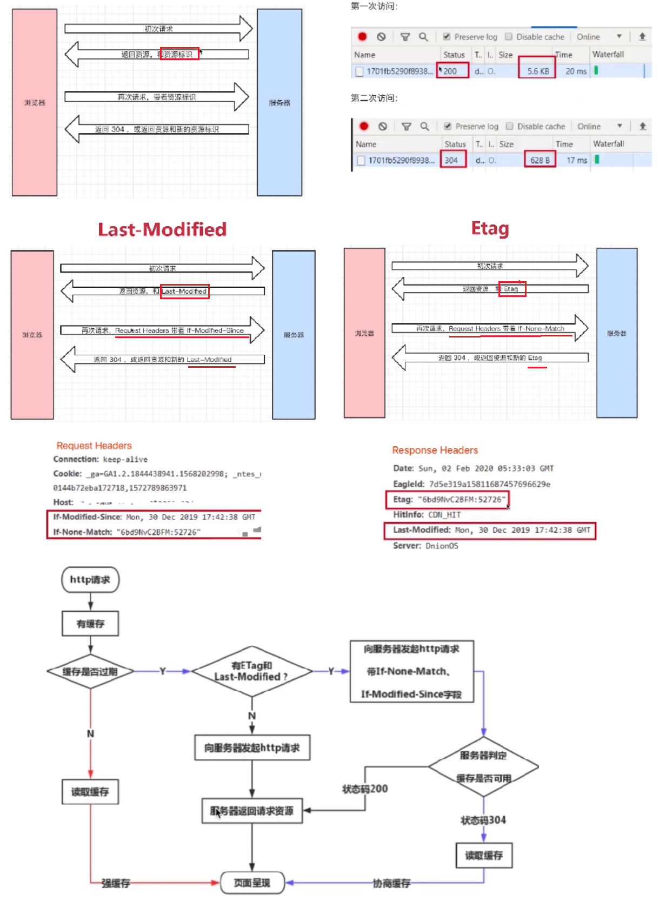

# 前端http面试小结

## 1.http状态码

> 1xx服务器收到请求
>
> 2xx请求成功，如200
>
> 3xx重定向，如302
>
> 4xx客户端错误，如404
>
> 5xx服务端错误，如500

### 常用状态码

> 200成功
>
> 301永久重定向（配合location，浏览器自动处理）
>
> 302临时重定向（配合location，浏览器自动处理）
>
> 304资源未被修改
>
> 404资源未找到
>
> 403没有权限
>
> 500服务器错误
>
> 504网关超时

## 2.http methods

### methods

#### 传统的 methods

get 获取服务器的数据、post 像服务器提交数据、简单的网页功能，就这两个操作

#### 现在的methods

get 获取数据、post 新建数据、patch/put 更新数据、delete 删除数据

### Restful API

一种新的API 设计方法（早已推广使用）

传统API设计：把每个url当做一个功能

Restful API设计：把每个url当做一个唯一的资源

## 3.http headers

### 常见的Request Headers

> Accept 浏览器可接收的数据格式
>
> Accept-Encoding浏览器可接收的压缩算法，如gzip
>
> Accept-Languange 浏览器可接收的语言，如zh-CN
>
> Connection:keep-alive一次TCP连接重复使用
>
> cookie
>
> Host
>
> User-Agent（简称UA）浏览器信息
>
> Content-type发送数据的格式，如application/json

### 常见的Response Headers

> Content-type 返回数据的格式，如application/json
>
> Content-length返回数据的大小，多少字节
>
> Content-Encoding返回数据的压缩算法，如gzip

### 缓存相关的 headers

> Cache-Control      Expires
>
> Last-Modified     If-Modified-Since
>
> Etag                       If-None-Match

## 4.http缓存

### http 缓存策略

浏览器可能会把你上一次的代码 存起来  你再次访问 就没有去拿新代码 而是 直接拿的缓存

### 强制缓存

 cache-control的值：
> max-age、no-cache、no-store、private、public

关于Expires

> 同在Response Headers中、同为控制缓存过期、已被Cache-Control代替

### 协商缓存

服务器端缓存策略：服务器判断客户端资源，是否和服务端资源一样，一致则返回304，否则返回200和最新的资源

资源标识

> 在Response Headers中，有两种：
>
> Last-Modified 资源的最后修改时间
>
> Etag 资源的唯一标识（一个字符串，类似人类的指纹）

Last-Modified 和Etag

- 会优先使用Etag
- Last-Modified 只能精确到秒级
- 如果资源被重复生成，而内容不变，则Etag 更精确

### 刷新操作方式

正常操作：地址栏输入url，跳转链接，前进后退等

手动刷新：F5，点击刷新按钮，右击菜单刷新

强制刷新：ctrl+F5

不同刷新操作，不同的缓存策略

正常操作：强制缓存有效，协商缓存有效

手动刷新：强制缓存失效，协商缓存有效

强制刷新：强制缓存失效，协商缓存失效