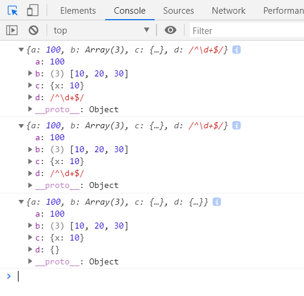
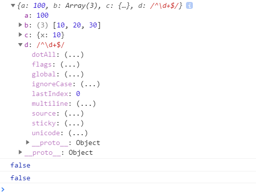

# 浅拷贝深拷贝

### 1.浅拷贝

```js
let obj={
            a:100,
            b:[10,20,30],
            c:{
                x:10
            },
            d:/^\d+$/
        };
        //方法一：
        let obj2 = {};
        for(let key in obj){
            if(!obj.hasOwnProperty(key)) break;
            obj2[key] = obj[key]
        }
        console.log(obj2);
        //方法二
        let obj3={
            ...obj
        }
        console.log(obj3);
```

### 2.深拷贝

 JSON.parse(JSON.stringify(obj))不能对函数、正则、时间对象、数字对象的时候会不好用 

```js
let obj4 = JSON.parse(JSON.stringify(obj));
console.log(obj4);
```



```js
 function deepClone(obj) {
            //过滤特殊情况
            if (obj === null) return null;
            if (typeof obj !== "object") return obj;
            if(obj instanceof RegExp){
                return new RegExp(obj)
            }
            if(obj instanceof Date){
                return new Date(obj)
            }
            //不直接创建空对象目的，克隆结果和之前保持相同的所属类
            let newObj = new obj.constructor;
            for (let key in obj) {
                if (obj.hasOwnProperty(key)) {
                    newObj[key] = deepClone(obj[key]);
                }
            }
            return newObj;
        }
        let obj5=deepClone(obj)
        console.log(obj5);
        console.log(obj5===obj);
        console.log(obj5.c===obj.c);
```

