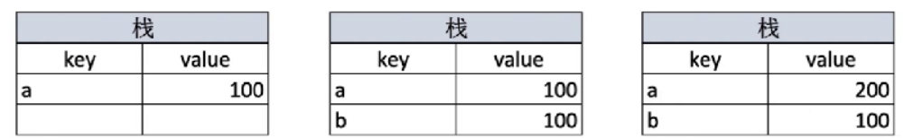
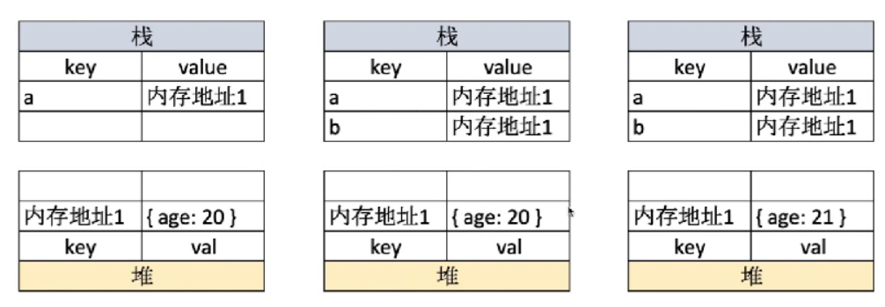
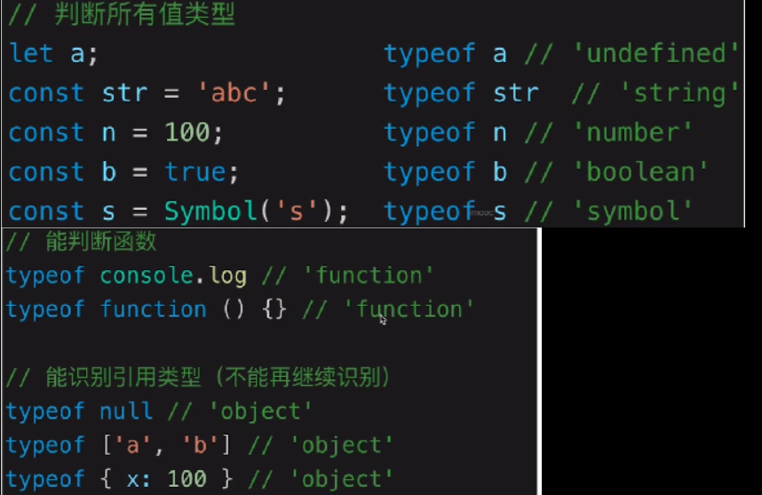
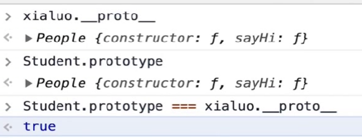
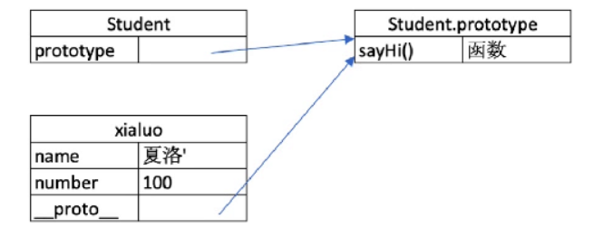
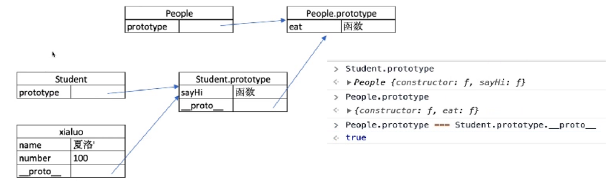
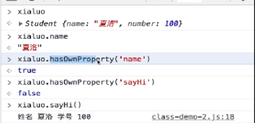
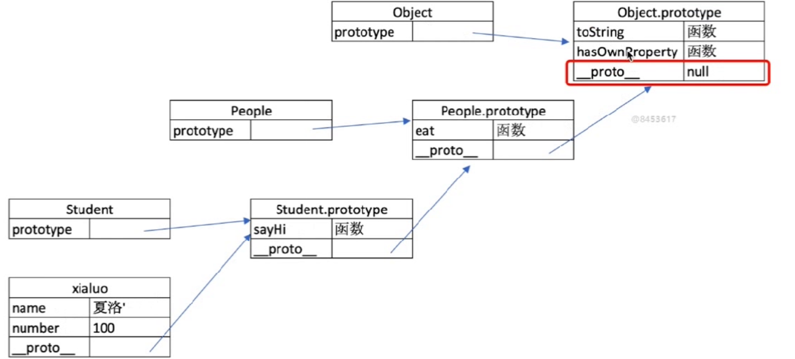
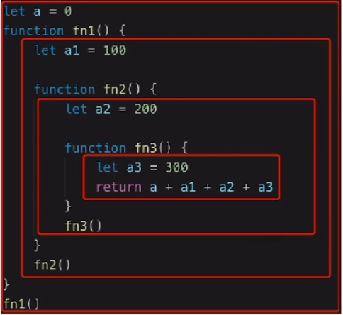

# 前端js基础面试小结

## 1.变量类型和计算

### 值类型和引用类型

```js
//值类型
let a = 100;
let b = a;
a = 200;
console.log(b); // 100 (互不影响)
//引用类型
let a = { age: 20 };
let b = a;
a.age= 21;
console.log(b.age); // 21 (b.age随a.age的改变而改变)
```

### 存储方式

值类型



 key为变量名，value为存储内容，值类型变量的值直接存储在value中，a的值改变后并不会影响b的值。 



 在栈中，引用类型存储的是内存地址，同时内存地址指向堆中的值，
 简单地讲：引用类型a -> 内存地址1 -> a的值，此时若执行`let b = a;`，则是把b的内存地址指向了a的内存地址，而这个内存地址指向同一个值，所以a的值改变的时候，b的值也随之改变。 

### 常见值类型、引用类型

```js
// 常见值类型
let a; // undefined
const n = 100; // Number
const s = '100'; // String
const b = true; // Boolean
const s = Symbol('s') // Symbol(es6)
// 常见引用类型
const obj = { value: 100 }; // Object
const arr = [ 1, 2, 3 ]; // Array
const n = null; // 特殊引用类型，指针指向空地址
function fn() {} // 特殊引用类型，但不用于存储数据，所以不考虑深拷贝浅拷贝的问题
```

## 2.typeof 运算符

> 识别所有值类型
> 识别函数
> 判断是否是引用类型（不可再细分）



## 3.变量计算-类型转换

### 字符串拼接

```js
const a = 100 + 10//110
constb = 100 + '10'//'10010'
constc = true + '10'//'true10'
```

### `==`和`===`

```js
100 == '100' // true
0 == ''  // true
0 == false  // true
false == ''  //true
null == undefined   // true

//除了==null之外，其他都一律用===
const obj = { x: 100 }
if (obj.a == null) { }
//相当于：
//if(obj.a===null || obj.a===undefined){}
```

## 4.原型和原型链

### class

```js
// 类
class Student {
    constructor(name, number) {
        this.name = name
        this.number = number
        // this.gender = 'male'
    }
    sayHi() {
        console.log(
            `姓名 ${this.name} ，学号 ${this.number}`
        )
    }
}

// 通过类  => new 对象/实例
const xialuo = new Student('夏洛', 100)
console.log(xialuo.name)
console.log(xialuo.number)
xialuo.sayHi()

const madongmei = new Student('马冬梅', 101)
console.log(madongmei.name)
console.log(madongmei.number)
madongmei.sayHi()

```

### 继承

> extends
> super
> 扩展或重写方法

```js
// 父类
class People {
    constructor(name) {
        this.name = name
    }
    eat() {
        console.log(`${this.name} eat something`)
    }
}

// 子类
class Student extends People {
    constructor(name, number) {
        super(name)
        this.number = number
    }
    sayHi() {
        console.log(`姓名 ${this.name} 学号 ${this.number}`)
    }
}

// 子类
class Teacher extends People {
    constructor(name, major) {
        super(name)
        this.major = major
    }
    teach() {
        console.log(`${this.name} 教授 ${this.major}`)
    }
}

// 实例
const xialuo = new Student('夏洛', 100)
console.log(xialuo.name)
console.log(xialuo.number)
xialuo.sayHi()
xialuo.eat()

// 实例
const wanglaoshi = new Teacher('王老师', '语文')
console.log(wanglaoshi.name)
console.log(wanglaoshi.major)
wanglaoshi.teach()
wanglaoshi.eat()
```

### 类型判断instanceof

```js
xialuo instanceof Student //true
xialuo instanceof People // true
xialuo instanceof object //true

[] instanceof Array //true
[] instanceof Object //true

{} instanceof Object //true
```

### 原型

```js
//class 实际上是函数，可见是语法糖
typeof People   //'function'
typeof Student  //'function'

//隐式原型和显示原型
console.log(xialuo._proto_) //隐式原型
console.log(Student.prototype)  //显示原型
console.log(xialuo.proto === Student.prototype)
```





> 每个class 都有显示原型 prototype
> 每个实例都有隐式原型`_proto_`
> 实例的`_proto_`指向对应 class的prototype

获取属性xialuo.name或执行方法xialuo.sayhi()时

先在自身属性和方法寻找

如果找不到则自动去`_proto_`中查找

### 原型链



### hasOwnProperty





### 再看instanceof

## 5.手写简易jQuery 

### 考虑插件和扩展性

```js
class jQuery {
    constructor(selector) {
        const result = document.querySelectorAll(selector)
        const length = result.length
        for (let i = 0; i < length; i++) {
            this[i] = result[i]
        }
        this.length = length
        this.selector = selector
    }
    get(index) {
        return this[index]
    }
    each(fn) {
        for (let i = 0; i < this.length; i++) {
            const elem = this[i]
            fn(elem)
        }
    }
    on(type, fn) {
        return this.each(elem => {
            elem.addEventListener(type, fn, false)
        })
    }
    // 扩展很多 DOM API
}

// 插件
jQuery.prototype.dialog = function (info) {
    alert(info)
}

// “造轮子”
class myJQuery extends jQuery {
    constructor(selector) {
        super(selector)
    }
    // 扩展自己的方法
    addClass(className) {

    }
    style(data) {
        
    }
}

// const $p = new jQuery('p')
// $p.get(1)
// $p.each((elem) => console.log(elem.nodeName))
// $p.on('click', () => alert('clicked'))
```
### 例题10个`<a>`标签
```js
//创建10个<a>标签，点击的时候弹出来对应的序号
let a
for (let i = 0; i < 10; i++) {
    a = document.createElement('a')
    a.innerHTML = i + '<br>'
    a.addEventListener('click', function (e) {
        e.preventDefault()
        alert(i)
    })
    document.body.appendChild(a)
}
```

## 6.作用域和闭包

### 作用域

> 全局作用域
> 函数作用域
> 块级作用域（ES6新增）



### 自由变量

> 一个变量在当前作用域没有定义，但被使用了
>
> 向上级作用域，一层一层依次寻找，直至找到为止
>
> 如果到全局作用域都没找到，则报错xx is not defined

### 闭包

> 作用域应用的特殊情况，有两种表现：
>
> 函数作为参数被传递
>
> 函数作为返回值被返回

```js
// 函数作为返回值
function create() {
    const a = 100
    return function () {
        console.log(a)
    }
}

const fn = create()
const a = 200
fn() // 100

// 函数作为参数被传递
function print(fn) {
    const a = 200
    fn()
}
const a = 100
function fn() {
    console.log(a)
}
print(fn) // 100

// 所有的自由变量的查找，是在函数定义的地方，向上级作用域查找
// 不是在执行的地方！！！
```

### this

> 作为普通函数使用
>
> call apply bind
>
> 作为对象方法被调用
>
> 在class方法中调用
>
> 箭头函数

### 手写bind

```js
// 模拟 bind
Function.prototype.bind1 = function () {
    // 将参数拆解为数组
    const args = Array.prototype.slice.call(arguments)

    // 获取 this（数组第一项）
    const t = args.shift()

    // fn1.bind(...) 中的 fn1
    const self = this

    // 返回一个函数
    return function () {
        return self.apply(t, args)
    }
}

function fn1(a, b, c) {
    console.log('this', this)
    console.log(a, b, c)
    return 'this is fn1'
}

const fn2 = fn1.bind1({x: 100}, 10, 20, 30)
const res = fn2()
console.log(res)
```

### 闭包应用

隐藏数据

```js
//如做一个简单的cache工具
// 闭包隐藏数据，只提供 API
function createCache() {
    const data = {} // 闭包中的数据，被隐藏，不被外界访问
    return {
        set: function (key, val) {
            data[key] = val
        },
        get: function (key) {
            return data[key]
        }
    }
}

const c = createCache()
c.set('a', 100)
console.log( c.get('a') )
```

