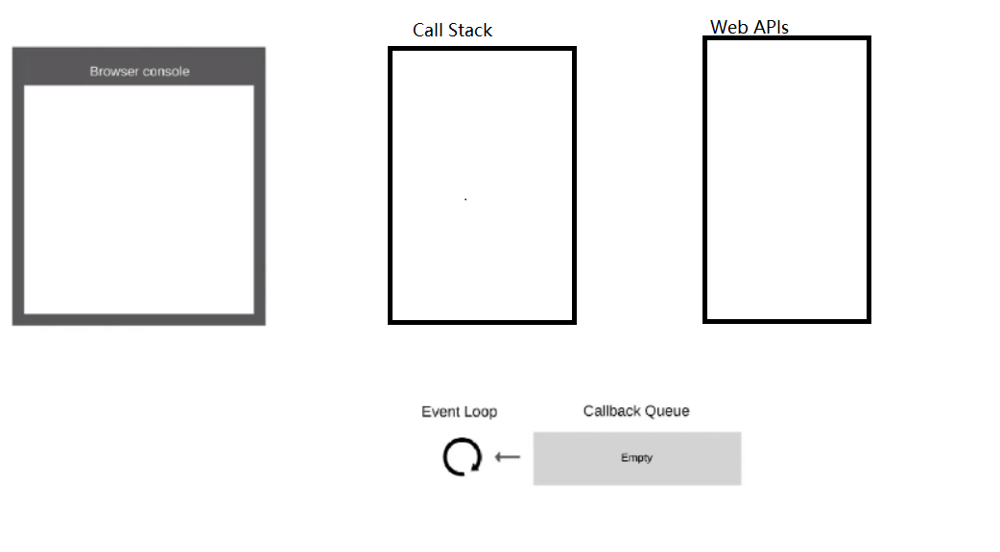
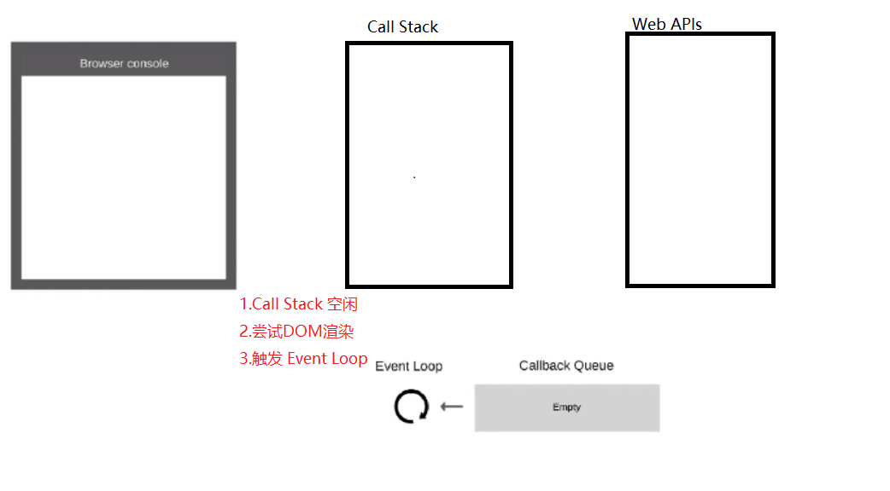
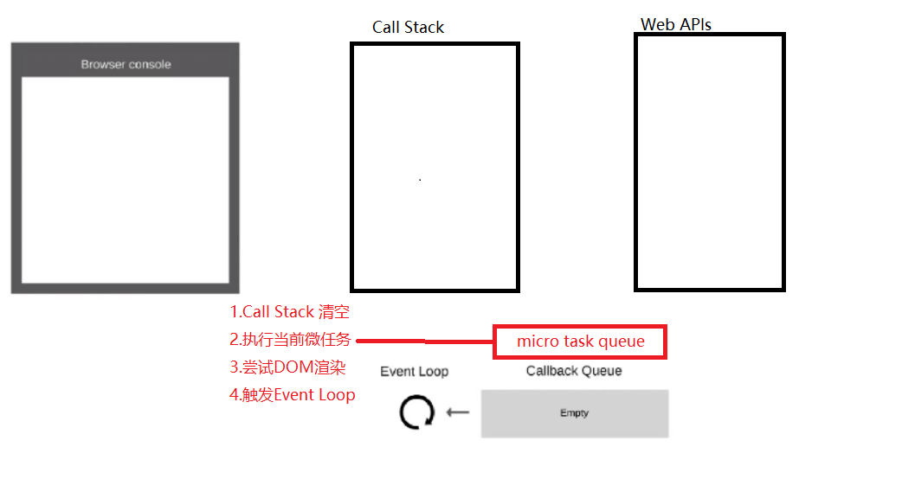
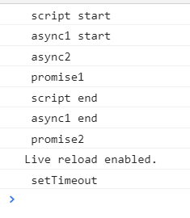
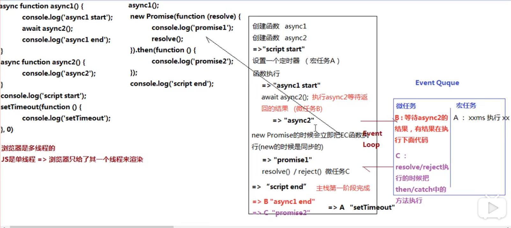

# 前端js面试异步小结

## 1.单线程和异步

> JS是单线程语言，只能同时做一件事儿
>
> 浏览器和nodejs已支持JS启动进程，如Web Worker
>
> JS和DOM渲染共用同一个线程，因为JS可修改DOM结构
>
> 遇到等待（网络请求，定时任务）不能卡住
>
> 需要异步
>
> 回调 callback 函数形式

```js
// 异步 （callback 回调函数）
console.log(100)
setTimeout(() => {
    console.log(200)
}, 1000)
console.log(300)
console.log(400)

// 同步
console.log(100)
alert(200)  //卡住
console.log(300)
// 基于JS是单线程语言，异步不会阻塞代码执行，同步会阻塞代码执行
```

### 应用场景

> 网络请求，如ajax图片加载
>
> 定时任务，如setTimeout

### 异步

event loop（事件循环/事件轮询）

> JS是单线程运行的
>
> 异步要基于回调来实现
>
> event loop就是异步回调的实现原理

 JS如何执行？
>
> 从前到后，一行一行执行
>
> 如果某一行执行报错，则停止下面代码的执行
>
> 先把同步代码执行完，再执行异步

## 2.eventloop



### 总结 event loop过程
> 同步代码，一行一行放在Call Stack执行
>
> 遇到异步，会先“记录”下，等待时机（定时、网络请求等）
>
> 时机到了，就移动到Callback Queue
>
> 如CallStack为空（即同步代码执行完）Event Loop开始工作
>
> 轮询查找Callback Queue，如有则移动到Call Stack执行
>
> 然后继续轮询查找

### DOM事件和event loop

- JS是单线程的

- 异步（setTimeout，ajax等）使用回调，基于event loop

- DOM事件也使用回调，基于event loop

## 3.Promise

### 三种状态

> pending resolved rejected
>
> pending一>resolved 或pending->rejected
>
> 变化不可逆

```js
// 刚定义时，状态默认为 pending
const p1 = new Promise((resolve, reject) => {

})

// 执行 resolve() 后，状态变成 resolved
const p2 = new Promise((resolve, reject) => {
    setTimeout(() => {
        resolve()
    })
})

// 执行 reject() 后，状态变成 rejected
const p3 = new Promise((resolve, reject) => {
    setTimeout(() => {
        reject()
    })
})


// 直接返回一个 resolved 状态
Promise.resolve(100)
// 直接返回一个 rejected 状态
Promise.reject('some error')
```

### 状态的表现**和 then catch**

> pending状态，不会触发then和catch
>
> resolved状态，会触发后续的then回调函数
>
> rejected 状态，会触发后续的catch 回调函数

then catch 会继续返回 Promise ，**此时可能会发生状态变化！！！**

```js
// then() 一般正常返回 resolved 状态的 promise
Promise.resolve().then(() => {
    return 100
})

// then() 里抛出错误，会返回 rejected 状态的 promise
Promise.resolve().then(() => {
    throw new Error('err')
})

// catch() 不抛出错误，会返回 resolved 状态的 promise
Promise.reject().catch(() => {
    console.error('catch some error')
})

// catch() 抛出错误，会返回 rejected 状态的 promise
Promise.reject().catch(() => {
    console.error('catch some error')
    throw new Error('err')
})
```

看一个综合的例子

```js
// 第一题
Promise.resolve().then(() => {
    console.log(1)   //1
}).catch(() => {
    console.log(2)
}).then(() => {
    console.log(3)   //3
})

// 第二题
Promise.resolve().then(() => { // 返回 rejected 状态的 promise
    console.log(1)    //1
    throw new Error('erro1')
}).catch(() => { // 返回 resolved 状态的 promise
    console.log(2)    //2
}).then(() => {
    console.log(3)   //3
})

// 第三题
Promise.resolve().then(() => { // 返回 rejected 状态的 promise
    console.log(1)    //1
    throw new Error('erro1')
}).catch(() => { // 返回 resolved 状态的 promise
    console.log(2)   //2
}).catch(() => {
    console.log(3)
})
```

## 4.async/await

async/await 是同步语法，彻底消灭回调函数,但本质还是异步调用。

> 执行async函数，返回的是Promise对象
>
> await 相当于Promise的then
>
> try..catch 可捕获异常，代替了Promise的catch

```js
async function async1 () {
  console.log('async1 start')  //2
  await async2()
 //关键在这一步，它相当于放在 callback 中，最后执行
  console.log('async1 end') // 5 
}

async function async2 () {
  console.log('async2')  //3
}

console.log('script start') //1
async1()
console.log('script end')  //4
```

即，只要遇到了 `await` ，后面的代码都相当于放在 callback 里。

## 5.for...of

for..…in（以及forEach for）是常规的同步遍历

for..of 常用于异步的遍历

```js
function multi(num) {
    return new Promise((resolve) => {
        setTimeout(() => {
            resolve(num * num)
        }, 1000)
    })
}

// 使用 forEach ，是 1s 之后打印出所有结果，即 3 个值是一起被计算出来的
function test1 () {
    const nums = [1, 2, 3];
    nums.forEach(async x => {
        const res = await multi(x);
        console.log(res);
    })
}
test1();

// 使用 for...of ，可以让计算挨个串行执行
async function test2 () {
    const nums = [1, 2, 3];
    for (let x of nums) {
        // 在 for...of 循环体的内部，遇到 await 会挨个串行计算
        const res = await multi(x)
        console.log(res)
    }
}
test2()
```

## 6.宏任务 macro Task 和微任务 microTask

### 宏任务和微任务

> 宏任务：setTimeout，setlnterval，Ajax，DOM事件
>
> 微任务：Promise async/await
>
> 微任务执行时机比宏任务要早(为啥呢？:astonished:)

### event-loop和DOM渲染的关系:raising_hand:



每一次 call stack 结束，都会触发 DOM 渲染（不一定非得渲染，就是给一次 DOM 渲染的机会！！！）

然后再进行 event loop

```js
const $p1 = $('<p>一段文字</p>')
const $p2 = $('<p>一段文字</p>')
const $p3 = $('<p>一段文字</p>')
$('#container')
            .append($p1)
            .append($p2)
            .append($p3)

console.log('length',  $('#container').children().length )
alert('本次 call stack 结束，DOM 结构已更新，但尚未触发渲染')
// （alert 会阻断 js 执行，也会阻断 DOM 渲染，便于查看效果）
// 到此，即本次 call stack 结束后（同步任务都执行完了），浏览器会自动触发渲染，不用代码干预

// 另外，按照 event loop 触发 DOM 渲染时机，setTimeout 时 alert ，就能看到 DOM 渲染后的结果了
setTimeout(function () {
    alert('setTimeout 是在下一次 Call Stack ，就能看到 DOM 渲染出来的结果了')
})
```

### 微任务和宏任务的区别(:star:)

宏任务：DOM 渲染后触发，如 setTimeout

微任务：DOM渲染前触发，如Promise

```js
// 修改 DOM
const $p1 = $('<p>一段文字</p>')
const $p2 = $('<p>一段文字</p>')
const $p3 = $('<p>一段文字</p>')
$('#container')
    .append($p1)
    .append($p2)
    .append($p3)

// 微任务：渲染之前执行（DOM 结构已更新）
Promise.resolve().then(() => {
    const length = $('#container').children().length
    alert(`micro task ${length}`)
})

// 宏任务：渲染之后执行（DOM 结构已更新）
setTimeout(() => {
    const length = $('#container').children().length
    alert(`macro task ${length}`)
})
```

再深入思考一下：为何两者会有以上区别，一个在渲染前，一个在渲染后？

**微任务**：ES 语法标准之内，JS 引擎来统一处理。即，不用浏览器有任何关于，即可一次性处理完，更快更及时。

**宏任务**：ES 语法没有，JS 引擎不处理，浏览器（或 nodejs）干预处理。




## 7.同步异步一道例题

```js
		async function async1() {
            console.log(' async1 start');  //2
            await async2();
   			 //作为回调内容  微任务
            console.log(' async1 end');   //6
        }
        async function async2() {
            console.log(' async2');   //3 
        }
        console.log(' script start');  //1
        setTimeout(function () {    //宏任务  //8
            console.log(' setTimeout');
        }, 0)
        async1();   
		//初始化promise 传入函数会立刻被执行
        new Promise(function (resolve) {
            console.log(' promise1');  //4
            resolve();
        }).then(function () {    //微任务
            console.log(' promise2')  //7

        });
        console.log(' script end');   //5
```



