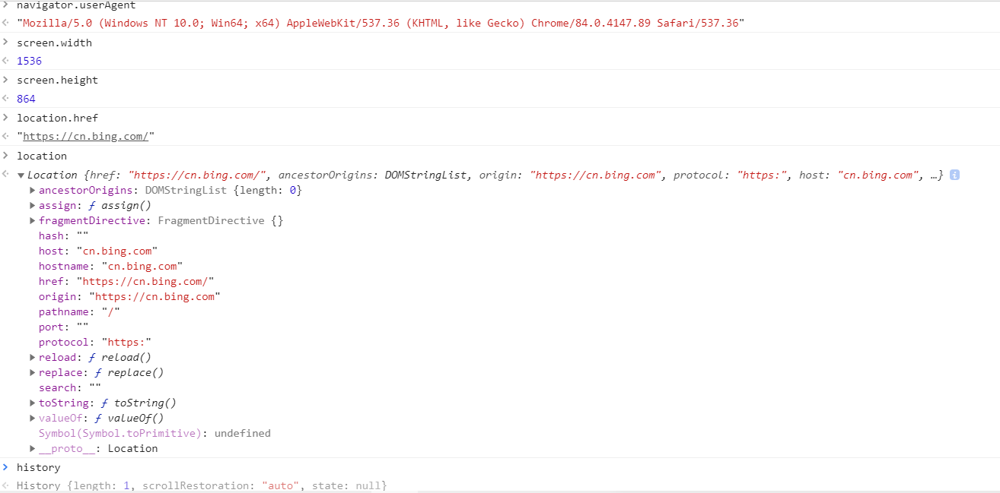

# 前端jsWeb面试小结

## 1.DOM

### DOM本质

就是从HTML解析的一棵树（DOM树）

参考《JavaScript DOM编程艺术 》

DOM，即我们所看到的网页，其在浏览器背后的文档结构（树状分支结构），涵盖了每一个节点（称之为对象） 。

### 获取DOM节点

```js
const div1 = document.getElementById('div1')
console.log('div1', div1)

const divList = document.getElementsByTagName('div') // 集合
console.log('divList.length', divList.length)
console.log('divList[1]', divList[1])

const containerList = document.getElementsByClassName('container') // 集合
console.log('containerList.length', containerList.length)
console.log('containerList[1]', containerList[1])

const pList = document.querySelectorAll('p')
console.log('pList', pList)
```

### property 和attribute

```js
const pList = document.querySelectorAll('p')
const p1 = pList[0]

// property 形式   
p1.style.width = '100px'
console.log( p1.style.width )
p1.className = 'red'
console.log( p1.className )

console.log(p1.nodeName)
console.log(p1.nodeType) // 1

// attribute    
p1.setAttribute('data-name', 'imooc')
console.log( p1.getAttribute('data-name') )
p1.setAttribute('style', 'font-size: 50px;')
console.log( p1.getAttribute('style') )
```

property：修改对象属性，不会体现到html结构中

attribute：修改html属性，会改变html结构

两者都有可能引起DOM重新渲染

### DOM 结构操作

```js
const div1 = document.getElementById('div1')
const div2 = document.getElementById('div2')

// 新建节点
const newP = document.createElement('p')
newP.innerHTML = 'this is newP'
// 插入节点
div1.appendChild(newP)

// 移动节点
const p1 = document.getElementById('p1')
div2.appendChild(p1)

// 获取父元素
console.log( p1.parentNode )

// 获取子元素列表
const div1ChildNodes = div1.childNodes
console.log( div1.childNodes )
const div1ChildNodesP = Array.prototype.slice.call(div1.childNodes).filter(child => {
    if (child.nodeType === 1) {
        return true
    }
    return false
})
console.log('div1ChildNodesP', div1ChildNodesP)

div1.removeChild( div1ChildNodesP[0] )

```

### DOM 性能

DOM操作非常“昂贵”，避免频繁的DOM操作

例如：对DOM查询做缓存，将频繁操作改为一次性操作

```js
const list = document.getElementById('list')

// 创建一个文档片段，此时还没有插入到 DOM 结构中
const frag = document.createDocumentFragment()

for (let i  = 0; i < 20; i++) {
    const li = document.createElement('li')
    li.innerHTML = `List item ${i}`

    // 先插入文档片段中
    frag.appendChild(li )
}

// 都完成之后，再统一插入到 DOM 结构中
list.appendChild(frag)

console.log(list)
```

## 2.BOM

navigator 、 screen 、 location 、 history

```js
//navigator
const ua=navigator.userAgentl
const isChrome=ua.indexof('Chrome')
console.log(isChrome0
//screen
console.log(screen.width)
console.log(screen.height)
//location 
console.1og(location.href)
console.1og(location.protocol)
console.log(location.pathname)
console.log(location.search)
console.log(location.hash)
//history
history.back()
history.forward()
```



## 3.事件

 JS 中的事件就是对用户特定的行为作出相应的响应的过程 

### 事件绑定

 在 html 元素上将触发事件的行为和事件的相应的程序关联起来的过程就是事件的绑定 

#### 1. 传统事件绑定：

```css
    <div onclick="">123</div>
    div1.onclick = function(){};
    <button onmouseover=""></button>
```

 如果给同一个元素绑定了两次或多次相同类型的事件，那么绑定会被覆盖 

```css
<div class="text" onclick="console.log(123)" onclick="console.log(234)">传统绑定</div>
```

#### 2. 符合W3C标准的事件绑定的方式`addEventListener/attachEvent`

##### `addEventListener / removeEventListener`

 兼容：firefox、chrome、IE、safari、opera；不兼容IE7、IE8 

```js
let box = document.querySelector('.box')  // 获取dom元素

function fun1(){console.log('box clicked...')} // 事件函数
box.addEventListener('click',fun1,{
	"passive":false, // false：使用stopPropagation阻止默认事件  true:不使用
	"capture":false, // 默认false;  false:冒泡， true:捕获
	"once":true      // true:只执行一次  
})

box.removeEventListener('click',fun1)   //移除事件
```

 **所有的DOM节点都包含这两个方法，并且他们都接受三个参数：** 

- 事件类型
- 事件处理方法
- 布尔参数

```js
{
	"passive":false, // false：使用stopPropagation阻止默认事件  true:不使用
    "capture":false, // 默认false;  false:冒泡， true:捕获
    "once":true      // true:只执行一次  
}
```
**注意：**

- 如果给同一个元素绑定了两次或多次相同类型的事件，绑定依次触发
- 支持DOM事件流
- 进行事件绑定不需要on前缀

##### `attachEvent / detachEvent`

 兼容：IE7、IE8；不兼容firefox、chrome、IE9、IE10、IE11、safari、opera 

```js
// IE只支持事件冒泡
let box = document.querySelector('.box')
function fun1(){console.log('box clicked...')}
box.attachEvent('onclick',fun1) // 绑定事件

box.detachEvent('onclick',fun1) // 移除事件
```

**这两个方法都接受两个相同的参数:**

- 事件处理程序名称

- 事件处理程序方法

**注意：**

- 进行事件类型传参需要带上`on`前缀
- 这种方式只支持事件冒泡，不支持事件捕获

### 事件冒泡和捕获

#### 冒泡

 由点击的`div`一层一层往上触发事件 

```js
<div id="box1">
	<div id="box2">
		<div id="box3">
			点击触发事件
		</div>
	</div>
</div>

let box1 = document.getElementById('box1');
let box2 = document.getElementById('box2');
let box3 = document.getElementById('box3');
box1.addEventListener('click',function(){
	console.log('box1');
},false);
box2.addEventListener('click',function(){
	console.log('box2');
},false);
box3.addEventListener('click',function(){
	console.log('box3');
},false);

// 事件冒泡输出：
// box3
// box2
// box1
```

#### 捕获

 与事件冒泡相反，由最外面的`div`一层一层往下触发事件 

```js
<div id="box1">
	<div id="box2">
		<div id="box3">
			点击触发事件
		</div>
	</div>
</div>

let box1 = document.getElementById('box1');
let box2 = document.getElementById('box2');
let box3 = document.getElementById('box3');
box1.addEventListener('click',function(){
	console.log('box1');
},true);
box2.addEventListener('click',function(){
	console.log('box2');
},true);
box3.addEventListener('click',function(){
	console.log('box3');
},true);

// 事件捕获输出：
// box1
// box2
// box3
```

#### 阻止事件冒泡和默认事件

- **防止冒泡和捕获**
   w3c的方法是`e.stopPropagation()`，IE则是使用`e.cancelBubble = true`
- **取消默认事件**
   w3c的方法是`e.preventDefault()`，IE则是使用`e.returnValue = false`

### 事件代理

 **利用事件冒泡的原理，让自己的所触发的事件，让他的父元素代替执行** 

- js中事件冒泡我们知道，子元素身上的事件会冒泡到父元素身上。
- 事件代理就是，本来加在子元素身上的事件，加在了其父级身上。
- 那就产生了问题：父级那么多子元素，怎么区分事件本应该是哪个子元素的？
- 答案是：`event对象`里有记录的“事件源”，它就是发生事件的子元素。
- 它存在兼容性问题，在老的IE下，事件源是 `window.event.srcElement`，其他浏览器是 `event.target`

 **好处** 

- 第一个好处是效率高，比如：不用`for循环`为子元素添加事件了
- 第二个好处是，`js`新生成的子元素也不用新为其添加事件了，程序逻辑上比较方便

```js
<ul id="ul">
	<li>1</li>
	<li>2</li>
	<li>3</li>
</ul>

var ul = document.getElementById('ul');
ul.onmouseover = function(e){
	var e = e || window.event;
	var li = e.srcElement || e.target;
	// toLowerCase() 转换为小写
	if(li.nodeName.toLowerCase() == 'li'){  // 事件源的nodeName 判断是不是li
		li.style.background = 'red';
	}

}

ul.onmouseout = function(e){
	var e = e || window.event;
	var li = e.srcElement || e.target;
	if(li.nodeName.toLowerCase() == 'li'){  // 事件源的nodeName 判断是不是li
		li.style.background = '';
	}                
}
```

## 4.Ajax

### XMLHttpRequest

```js
const xhr = new XMLHttpRequest()
xhr.open('GET', '/data/test.json', true)
xhr.onreadystatechange = function () {
    if (xhr.readyState === 4) {
        if (xhr.status === 200) {
            console.log(
                JSON.parse(xhr.responseText)
            )
        } else if (xhr.status === 404) {
            console.log('404 not found')
        }
    }
}
xhr.send(null)
```

> **xhr.readyState**
>
> 0-（未初始化）还没有调用send()方法
>
> 1-（载入）已调用send（）方法，正在发送请求
>
> 2-（载入完成）send0方法执行完成，已经接收到全部响应内容
>
> 3-（交互）正在解析响应内容
>
> 4-（完成）响应内容解析完成，可以在客户端调用

> **xhr.status**
>
> 2xx-表示成功处理请求，如200
>
> 3xx-需要重定向，浏览器直接跳转，如301302304
>
> 4xx-客户端请求错误，如404403
>
> 5xx-服务器端错误

### 跨域

#### 同源策略

ajax 请求时，浏览器要求当前网页和server必须同源（安全）

同源：协议、域名、端口，三者必须一致

```js
//加载图片css js 可无视同源策略

<link href=跨域的css地址/>
<script src=跨域的js地址></script>
可用于统计打点，可使用第三方统计服务
<link/><script>可使用CDN，CDN一般都是外域
<script>可实现JSONP
```

#### 跨域解决方案

所有的跨域，都必须经过 server 端允许和配合

未经server端允许就实现跨域，说明浏览器有漏洞，危险信号

#### JSONP

```js
<script>可绕过跨域限制
服务器可以任意动态拼接数据返回
所以，<script>就可以获得跨域的数据，只要服务端愿意返回
```

```js
<script>
     window.abc = function (data) {
         console.log(data)
      }
 </script>
 <script src="http://localhost:8002/jsonp.js?username=xxx&callback=abc"></script>
```

jQuery 实现jsonp

```js
$.ajax({
    url:'http://localhost：8882/x-origin.json',
    dataType:'jsonp',
    jsonpCalLback:'callback',
    success:function (data){
    console.log(data);
    }
})
```

CORS-服务器设置 http header

```js
response.setHeader("Access-Control-Allow-Origin", "*");
response.setHeader("Access-Control-Allow-Methods", "POST, GET, OPTIONS, DELETE");
response.setHeader("Access-Control-Allow-Headers", "x-requested-with");
```

### 例题

#### 手写ajax

```js
function ajax(url) {
    const p = new Promise((resolve, reject) => {
        const xhr = new XMLHttpRequest()
        xhr.open('GET', url, true)
        xhr.onreadystatechange = function () {
            if (xhr.readyState === 4) {
                if (xhr.status === 200) {
                    resolve(
                        JSON.parse(xhr.responseText)
                    )
                } else if (xhr.status === 404 || xhr.status === 500) {
                    reject(new Error('404 not found'))
                }
            }
        }
        xhr.send(null)
    })
    return p
}

const url = '/data/test.json'
ajax(url)
.then(res => console.log(res))
.catch(err => console.error(err))
```

## 5.存储

### cookie

> 本身用于浏览器和server 通讯
>
> 被“借用”到本地存储来
>
> 可用document.cookie=‘a=100’来修改

cookie的缺点

- 存储大小，最大4KB 
- http 请求时需要发送到服务端，增加请求数据量
- 只能用document.cookie=''来修改，太过简陋

### localStorage 和 sessionStorage

> HTML5专门为存储而设计，最大可存5M
>
> API 简单易用 setltem getitem
>
> 不会随着http请求被发送出去

localStorage数据会永久存储，除非代码或手动删除

sessionStorage 数据只存在于当前会话，浏览器关闭则清空

一般用localStorage会更多一些

