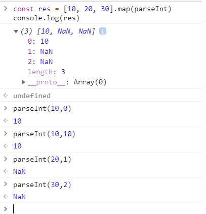
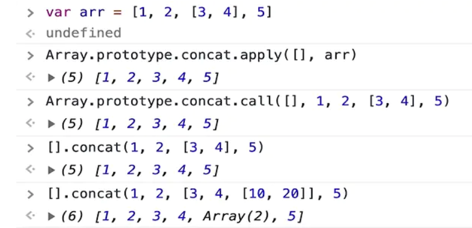

# 前端面试题目小结

## 1.var和let const的区别

var是ES5语法，let const是ES6语法；var 有变量提升

var和let是变量，可修改；const是常量，不可修改；

let const有块级作用域，var没有

## 2.typeof返回哪些类型

undefined string number boolean symbol 

object（注意，typeof nul===‘object'）

function

## 3.列举强制类型转换和隐式类型转换

强制：parselnt parseFloat toString等

隐式：if、逻辑运算、==、+拼接字符串

## 4.手写深度比较，模拟 lodash isEqual

```js
// 判断是否是对象或数组
function isObject(obj) {
    return typeof obj === 'object' && obj !== null
}
// 全相等（深度）
function isEqual(obj1, obj2) {
    if (!isObject(obj1) || !isObject(obj2)) {
        // 值类型（注意，参与 equal 的一般不会是函数）
        return obj1 === obj2
    }
    if (obj1 === obj2) {
        return true
    }
    // 两个都是对象或数组，而且不相等
    // 1. 先取出 obj1 和 obj2 的 keys ，比较个数
    const obj1Keys = Object.keys(obj1)
    const obj2Keys = Object.keys(obj2)
    if (obj1Keys.length !== obj2Keys.length) {
        return false
    }
    // 2. 以 obj1 为基准，和 obj2 一次递归比较
    for (let key in obj1) {
        // 比较当前 key 的 val —— 递归！！！
        const res = isEqual(obj1[key], obj2[key])
        if (!res) {
            return false
        }
    }
    // 3. 全相等
    return true
}

// 测试
const obj1 = {
    a: 100,
    b: {
        x: 100,
        y: 200
    }
}
const obj2 = {
    a: 100,
    b: {
        x: 100,
        y: 200
    }
}
// console.log( obj1 === obj2 )
console.log( isEqual(obj1, obj2) )

const arr1 = [1, 2, 3]
const arr2 = [1, 2, 3, 4]

```

## 5.split和join的区别

 1、split()用于分割字符串，返回一个数组

```js
var string=“hello world?name=xiaobai”;
var splitString = string.split("?");
console.log(splitString);//["hello world","name=xiaobai"]
```

split()只有一个参数时：分割的字符串或正则表达式；两个参数时，第二个参数是指返回的数组中元素的个数；

2、join()用于连接多个字符或字符串，返回值为一个字符串

```js
var arr= new Array();
arr[0]="hello";
arr[1]="xiao";
arr[2]= "bai";
arr.join("&");//"hello&xiao&bai"
join();//默认分割符为逗号；
```

## 6.数组的pop push unshift shift分别做什么

功能是什么？返回值是什么？是否会对原数组造成影响？

这两组同为对数组的操作，并且会改变数组的本身的长度及内容。

不同的是 push()、pop() 是从数组的尾部进行增减，

unshift()、shift() 是从数组的头部进行增减。

```js
const arr = [10, 20, 30, 40]

// pop
const popRes = arr.pop()
console.log(popRes, arr)   //40   [10, 20, 30]

// shift
const shiftRes = arr.shift()
console.log(shiftRes, arr)   //10   [ 20, 30 , 40]

// push
const pushRes = arr.push(50) // 返回 length
console.log(pushRes, arr)       //50  [10, 20, 30, 40,50]

// unshift
const unshiftRes = arr.unshift(5) // 返回 length
console.log(unshiftRes, arr)    //5  [5 , 10, 20, 30, 40]

```

### 【扩展】数组的API，有哪些是纯函数？

```js
// 纯函数：1. 不改变源数组（没有副作用）；2. 返回一个数组
const arr = [10, 20, 30, 40]

// concat
const arr1 = arr.concat([50, 60, 70])  //[10, 20, 30, 40,50, 60, 70]
// map
const arr2 = arr.map(num => num * 10)  //[100, 200, 300, 400]
// filter
const arr3 = arr.filter(num => num > 25) //[30, 40]
// slice
const arr4 = arr.slice()   //[10, 20, 30, 40] 深拷贝
```

非纯函数

push pop shift unshift

forEach、some、 every、reduce

## 7.数组slice和splice区别

功能区别（slice-切片，splice-剪接）、参数和返回值、是否纯函数？

```js
// slice 纯函数
const arr1 = arr.slice()   //[10, 20, 30, 40, 50]
const arr2 = arr.slice(1, 4)   //[20, 30, 40]
const arr3 = arr.slice(3)  //[ 30, 40, 50]
const arr4 = arr.slice(-3)  //[30, 40, 50]

// splice 非纯函数
const spliceRes = arr.splice(1, 2, 'a', 'b', 'c')
console.log(spliceRes, arr)  //[10, 'a', 'b', 'c', 40, 50]
```

## 8.[10,20,30].map(parselnt)

map的参数和返回值、parselnt 参数和返回值



```js
const res = [10, 20, 30].map(parseInt)
console.log(res)

// 拆解
[10, 20, 30].map((num, index) => {
    return parseInt(num, index)
})

```

## 9.ajax 请求get和post的区别

get一般用于查询操作，post一般用户提交操作

get 参数拼接在url上，post放在请求体内（数据体积可更大）

安全性：post 易于防止CSRF

## 10.函数call和apply的区别

 call与apply都属于Function.prototype的一个方法，所以每个function实例都有call、apply属性； 

#### 作用

`call（）`方法和`apply（）`方法的作用相同：**改变this指向**。

#### 区别

他们的**区别**在于接收参数的方式不同：

`call（）`：第一个参数是this值没有变化，变化的是**其余参数都直接传递给函数**。在使用`call（）`方法时，**传递给函数的参数必须逐个列举出来**。

`apply（）`：传递给函数的是**参数数组**

```js
//fn.call(this,p1,p2,p3)
//fn.apply(this,arguments)
function add(c, d){ 
    return this.a + this.b + c + d; 
} 
var o = {a:1, b:3}; 
add.call(o, 5, 7); // 1 + 3 + 5 + 7 = 16 
add.apply(o, [10, 20]); // 1 + 3 + 10 + 20 = 34 
```

## 11.事件代理（委托）是什么

 事件委托就是利用事件冒泡，只指定一个事件处理程序，就可以管理某一类型的所有事件。 

 Event对象提供了一个属性叫target，可以返回事件的目标节点，我们成为事件源，也就是说，target就可以表示为当前的事件操作的dom，但是不是真正操作dom 

```js
<ul id="parent-list">
  <li id="post-1">Item 1</li>
  <li id="post-2">Item 2</li>
  <li id="post-3">Item 3</li>
  <li id="post-4">Item 4</li>
  <li id="post-5">Item 5</li>
  <li id="post-6">Item 6</li>
</ul>

function addListeners4Li(liNode){
    liNode.onclick = function clickHandler(){...};
    liNode.onmouseover = function mouseOverHandler(){...}
}

window.onload = function(){
    var ulNode = document.getElementById("parent-list");
    var liNodes = ulNode.getElementByTagName("Li");
    for(var i=0, l = liNodes.length; i < l; i++){
        addListeners4Li(liNodes[i]);
    }   
}
                                             
 /*优化*/
// 获取父节点，并为它添加一个click事件
document.getElementById("parent-list").addEventListener("click",function(e) {
  // 检查事件源e.targe是否为Li
  if(e.target && e.target.nodeName.toUpperCase == "LI") {
    // 真正的处理过程在这里
    console.log("List item ",e.target.id.replace("post-")," was clicked!");
  }
});
```

  用事件委托 可以只用一次dom操作就能完成所有的效果 

 当用事件委托的时候，根本就不需要去遍历元素的子节点，只需要给父级元素添加事件就好了，其他的都是在js里面的执行，这样可以大大的减少dom操作，这才是事件委托的精髓所在。 

 适合用事件委托的事件：click，mousedown，mouseup，keydown，keyup，keypress。 

### 链接

[JavaScript事件代理和委托（Delegation）](https://www.cnblogs.com/owenChen/archive/2013/02/18/2915521.html)

[js中的事件委托或是事件代理详解](https://www.cnblogs.com/liugang-vip/p/5616484.html)

## 12.闭包是什么？有何特性？有何影响？

作用域和自由变量、闭包应用场景：作为参数被传入，作为返回值被返回、自由变量的查找，要在函数定义的地方（而非执行的地方）

影响：变量会常驻内存，得不到释放。闭包不要乱用

## 13.阻止事件冒泡和默认行为

event.stopPropagation()

event.preventDefault()

## 14.查找、添加、删除、移动DOM节点

（1）创建新节点

   createDocumentFragment()  //创建一个DOM片段

   createElement()  //创建一个具体的元素

   createTextNode()  //创建一个文本节点

（2）添加、移除、替换、插入

   appendChild()

   removeChild()

   replaceChild()

   insertBefore()

（3）查找

   getElementsByTagName()  //通过标签名称

   getElementsByName()  //通过元素的Name属性的值

   getElementById()  //通过元素Id，唯一性

### 优化

```js
const list = document.getElementById('list')

// 创建一个文档片段，此时还没有插入到 DOM 结构中
const frag = document.createDocumentFragment()

for (let i  = 0; i < 20; i++) {
    const li = document.createElement('li')
    li.innerHTML = `List item ${i}`

    // 先插入文档片段中
    frag.appendChild(li)
}

// 都完成之后，再统一插入到 DOM 结构中
list.appendChild(frag)

console.log(list)
```

## 15.解释jsonp原理，为何不是真正的ajax，

浏览器的同源策略（服务端没有同源策略）和跨域、

#### 跨域解决方案

所有的跨域，都必须经过 server 端允许和配合

未经server端允许就实现跨域，说明浏览器有漏洞，危险信号

#### JSONP

```js
<script>可绕过跨域限制
服务器可以任意动态拼接数据返回
所以，<script>就可以获得跨域的数据，只要服务端愿意返回
```

```js
<script>
     window.abc = function (data) {
         console.log(data)
      }
 </script>
 <script src="http://localhost:8002/jsonp.js?username=xxx&callback=abc"></script>
```

## 16.document load 和ready的区别

```js
window.addEventListener("load"，function(){
//页面的全部资源加载完才会执行，包括图片、视频等
})

document.addEventListener('DOMContentLoaded'，function(){
//DOM渲染完即可执行，此时图片、视频还可能没有加载完
})
```

## 16.函数声明和函数表达式的区别

```js
//函数声明
function fn(){.}

//函数表达式
const fn=function(){..}
```

函数声明会在代码执行前预加载，而函数表达式不会

## 17.new Object（）和Object.create0区别

{}等同于new Object()，原型Object.prototype

```js
Object.create(null)//没有原型
Object.create({..})//可指定原型
```

## 18.正则表达式

[正则表达式30分钟入门教程]( https://www.runoob.com/w3cnote/regular-expression-30-minutes-tutorial.html )

```js
// 邮政编码
/\d{6}/

// 小写英文字母
/^[a-z]+$/

// 英文字母
/^[a-zA-Z]+$/

// 日期格式 2020.12.1
/^\d{4}-\d{1,2}-\d{1,2}$/

// 用户名
/^[a-zA-Z]\w{5, 17}$/

// 简单的 IP 地址匹配
/\d+\.\d+\.\d+\.\d+/
```

### 手写字符串trim 保证浏览器兼容性

```js
String.prototype.trim=function(){
    return this.seplace(/^\s+/,'').replace(/\s+$/,'')
}//（原型、this、正则表达式）
```

### 获取多个数字中的最大值

```js
 function max() {
	const nums = Array.prototype.slice.call(arguments)//变为数组
	let max = 0
	nums.forEach(n => {
       if (n > max) {
       max = n
         }
      })
     return max
}

//es6
Math.max(10,30,20,40)
//以及Math.min
```

## 19.如何捕获JS中的异常？

```js
try{
    //todo
}catch(ex){
    console.log(ex);  //手动捕获
}finally{
    //todo
}


//自动捕获
window.onerror=function(message,source,linNum,colNum,error){
    //第一，对跨域的j5，如CDN的，不会有详细的报错信息
    //第二，对于压缩的js，还要配合sourceMap反查到未压缩代码的行、列
}
```

## 20.什么是JSON？

json 是一种数据格式，本质是一段字符串。

json格式和JS对象结构一致，对JS语言更友好

windowJSON 是一个全局对象：JSON.stringify JSON.parse

```json
{
    "name":"Lisa",
    "info":{
        "single":true,
        "age":30,
        "city":"Beijing"
    },
    "like":["music","read"]
}
```

## 21. 获取当前页面url参数 

传统方式，查找`location.search`

新`api，URLSearchParams`

```js
// 传统方式
function query(name) {
    const search = location.search.substr(1) // 类似 array.slice(1)
    // search: 'a=10&b=20&c=30'
    const reg = new RegExp(`(^|&)${name}=([^&]*)(&|$)`, 'i')
    const res = search.match(reg)
    if (res === null) {
        return null
    }
    return res[2]
}
query('d')

// URLSearchParams
function query(name) {
    const search = location.search
    const p = new URLSearchParams(search)
    return p.get(name)
}
console.log( query('b') )

```

### 将url参数解析为JS对象

```js
// 传统方式
function queryToObj(){
    const res = {}
    const search = location.search.substr(1)
    search.split('&').forEach(paramStr=>{
    const arr = paramStr.split('=')
    const key = arr[0]
    const val = arr[1]
    res[key] = val    
    })
    return res
}

// URLSearchParams
function queryToObj(){
    const res = {}
    const pList = new URLSearchParams(location.search)
    pList.forEach((val,key)=>{
        res[key]=val
    })
    return res
}
```

## 22.手写数组flatern

 

```js
function flat(arr) {
    // 验证 arr 中，还有没有深层数组 [1, 2, [3, 4]]
    const isDeep = arr.some(item => item instanceof Array)
    if (!isDeep) {
        return arr // 已经是 flatern [1, 2, 3, 4]
    }

    const res = Array.prototype.concat.apply([], arr)
    return flat(res) // 递归
}

const res = flat( [1, 2, [3, 4, [10, 20, [100, 200]]], 5] )
console.log(res)
```

## 23.数组去重 

```js
// 传统方式
function unique(arr) {
    const res = []
    arr.forEach(item => {
        if (res.indexOf(item) < 0) {
            res.push(item)
        }
    })
    return res
}

// 使用 Set （无序，不能重复）
function unique(arr) {
    const set = new Set(arr)
    return [...set]
}

const res = unique([30, 10, 20, 30, 40, 10])
console.log(res)
```

## 24.手写深拷贝 

```js
function deepClone(obj = {}) {
    if(type of obj !== 'object' || obj == null){
        return obj
    }
    let result
    if(obj instanceof Array) {
        result = []
    }else{
        result = {}
    }
    for(let key in obj){
        if(obj.hasOwnProperty(key)){
            result[key] = deepClone(obj[key])
        }
    }
    return result
}
```

 `Object.assign`不是深拷贝! 

## 25.介绍RAF requetAnimateFrame

要想动画流畅，更新频率要60帧/s，即16.67ms更新一次视图

setTimeout 要手动控制频率，而RAF 浏览器会自动控制

后台标签或隐藏 iframe中，RAF会暂停，而 setTimeout依然执行

```js
// 3s 把宽度从 100px 变为 640px ，即增加 540px
// 60帧/s ，3s 180 帧 ，每次变化 3px

const $div1 = $('#div1')
let curWidth = 100
const maxWidth = 640

// setTimeout
function animate() {
    curWidth = curWidth + 3
    $div1.css('width', curWidth)
    if (curWidth < maxWidth) {
        setTimeout(animate, 16.7) // 自己控制时间
    }
}
animate()

// RAF
function animate() {
    curWidth = curWidth + 3
    $div1.css('width', curWidth)
    if (curWidth < maxWidth) {
        window.requestAnimationFrame(animate) // 时间不用自己控制
    }
}
animate()
```

#### 性能优化

原则：多使用内存，缓存，减少计算，网络请求

加载页面，页面渲染，页面操作等多多思考问题。